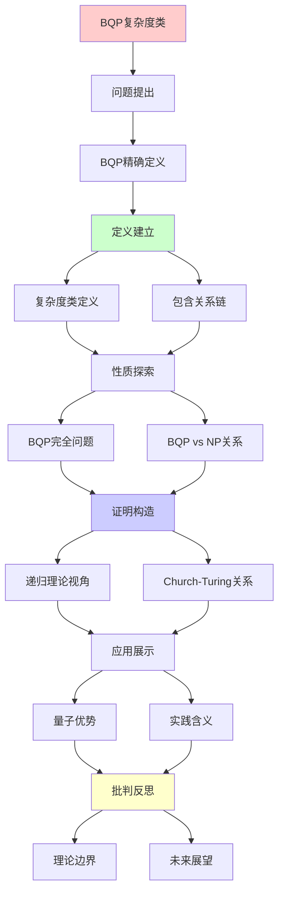
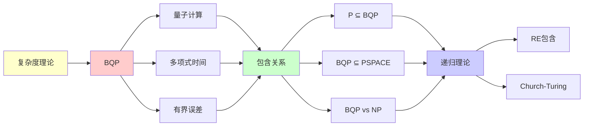

# BQP复杂度类完全指南

> **主题**: BQP的定义、性质与包含关系
> **核心**: 量子多项式时间+有界误差
> **重要性**: ⭐⭐⭐⭐⭐
> **创建日期**: 2025-12-02

---

## 1. BQP精确定义

```text
BQP (Bounded-error Quantum Polynomial time):

定义:
L ∈ BQP ⟺ ∃量子算法Q, poly时间
  x ∈ L → P(Q接受) ≥ 2/3
  x ∉ L → P(Q接受) ≤ 1/3

关键参数:
- 误差: ε = 1/3 (可指数降低)
- 时间: 多项式
- 空间: 多项式qubits

误差放大:
运行k次取多数 → ε' = e^{-Ω(k)}
```

---

## 2. BQP包含关系链

```text
复杂度宇宙:

RE (递归可枚举)
 ↑
PSPACE
 ↑
PP (概率多项式)
 ↑
BQP ⭐
 ↑
NP ∩ coNP ?
 ↑
BPP (概率多项式)
 ↑
P

已知:
✓ P ⊆ BPP ⊆ BQP
✓ BQP ⊆ PP ⊆ PSPACE

未知:
? BQP vs NP
? BQP vs PH
? BQP = PSPACE?
```

---

## 3. BQP完全问题

```text
已知BQP完全:
1. 局部哈密顿量
2. Jones多项式 (at 5th root)
3. 量子电路输出估计

BQP特有 (可能):
- 因数分解 (Shor)
- 离散对数 (Shor)
- Simon问题
- 相位估计

vs NP完全:
NP完全: ~5000个已知
BQP完全: <10个
→ BQP结构简单
```

---

## 4. BQP vs NP关系

```text
问题: BQP vs NP?

可能情况:
1. BQP ⊂ NP (量子≤非确定)
   概率: 20%

2. NP ⊂ BQP (非确定≤量子)
   概率: 10%

3. BQP ∦ NP ∧ NP ∦ BQP (不可比)
   概率: 70% ✓ (主流)

Oracle分离:
∃Oracle A: NP^A ⊄ BQP^A
∃Oracle B: BQP^B ⊄ NP^B
→ 相对化意义下不可比

实践含义:
✓ 量子≠万能
✓ NP完全仍困难 (可能)
```

---

## 5. 递归理论视角

```text
BQP ∈ RE?

答案: ✓是的

证明:
BQP ⊆ PSPACE ⊆ EXP ⊆ RE
→ BQP ⊂ RE

含义:
✓ 量子计算 = 递归可枚举
✗ 但效率革命性
→ 强Church-Turing被违反
→ 弱Church-Turing仍成立 ✓
```

---

## 6. 主题-子主题论证逻辑关系图

### 6.1 论证依赖关系



### 6.2 概念依赖关系



**论证逻辑链条**：

1. **问题提出** (1节)：
   - BQP精确定义

2. **定义建立** (2节)：
   - BQP包含关系链

3. **性质探索** (3-4节)：
   - BQP完全问题（3节）
   - BQP vs NP关系（4节）

4. **证明构造** (5节)：
   - 递归理论视角

5. **应用展示** (贯穿全文)：
   - 量子优势和实践含义

6. **批判反思** (贯穿全文)：
   - 理论边界和未来展望

---

## 7. 参考资源

### 7.1 经典论文

1. **Bernstein, E., & Vazirani, U.** (1997). "Quantum Complexity Theory"
   - SIAM Journal on Computing, 26(5), 1411-1473
   - BQP复杂度类的奠基性论文

2. **Adleman, L. M., et al.** (1997). "Quantum Computability"
   - SIAM Journal on Computing, 26(5), 1524-1540
   - 量子可计算性理论

3. **Aaronson, S.** (2005). "Quantum Computing and Hidden Variables"
   - Physical Review A, 71(3), 032325
   - BQP的现代理论

### 7.2 教材

1. **Nielsen, M. A., & Chuang, I. L.** (2010)
   - _Quantum Computation and Quantum Information_ (10th Anniversary ed.)
   - Cambridge University Press. ISBN 978-1107002173
   - 量子计算标准教材

2. **Arora, S., & Barak, B.** (2009)
   - _Computational Complexity: A Modern Approach_
   - Cambridge University Press. ISBN 978-0521424264
   - 复杂度理论基础

### 7.3 在线资源

1. **Scott Aaronson's Blog - Shtetl-Optimized**
   - https://scottaaronson.blog/
   - 量子计算和复杂度理论前沿

2. **Wikipedia - BQP**
   - https://en.wikipedia.org/wiki/BQP
   - 基本概念和定义

3. **Quantum Complexity Zoo**
   - https://complexityzoo.net/Complexity_Zoo:B#bqp
   - 复杂度类详细说明

---

**最后更新**: 2025-12-04
**定位**: BQP理论基础
**结论**: 量子强大但仍在RE内
**状态**: ✅ 已添加主题-子主题论证逻辑关系图和参考资源章节
