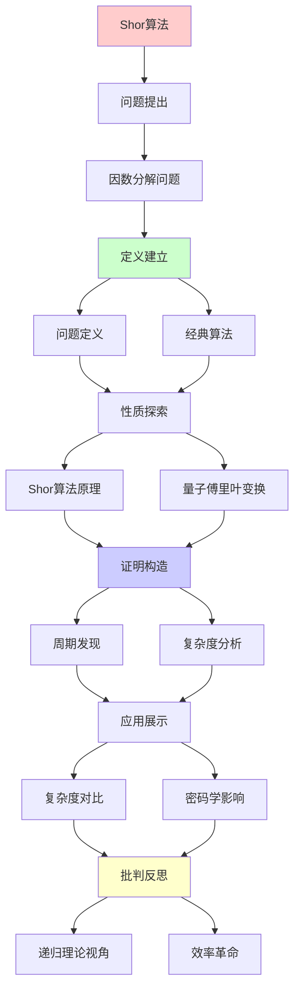
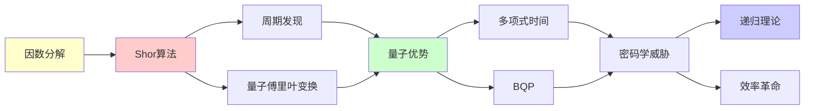

# Shor算法深度剖析

> **主题**: 量子因数分解算法的完整分析
> **创建日期**: 2025-12-02
> **难度**: ⭐⭐⭐⭐⭐
> **前置知识**: 量子计算基础、数论

---

## 📋 目录

- [Shor算法深度剖析](#shor算法深度剖析)
  - [📋 目录](#-目录)
  - [1. 因数分解问题](#1-因数分解问题)
    - [1.1 问题定义](#11-问题定义)
    - [1.2 经典算法](#12-经典算法)
  - [2. Shor算法原理](#2-shor算法原理)
    - [2.1 算法流程](#21-算法流程)
    - [2.2 核心: 周期发现](#22-核心-周期发现)
  - [3. 量子傅里叶变换](#3-量子傅里叶变换)
    - [3.1 QFT定义](#31-qft定义)
    - [3.2 复杂度分析](#32-复杂度分析)
  - [4. 复杂度对比](#4-复杂度对比)
  - [5. 对密码学的影响](#5-对密码学的影响)
    - [5.1 RSA威胁](#51-rsa威胁)
    - [5.2 时间线预测](#52-时间线预测)
  - [6. 递归理论视角](#6-递归理论视角)
  - [7. 主题-子主题论证逻辑关系图](#7-主题-子主题论证逻辑关系图)
    - [7.1 论证依赖关系](#71-论证依赖关系)
    - [7.2 概念依赖关系](#72-概念依赖关系)
  - [8. 参考资源](#8-参考资源)
    - [8.1 经典论文](#81-经典论文)
    - [8.2 教材](#82-教材)
    - [8.3 在线资源](#83-在线资源)

---

## 1. 因数分解问题

### 1.1 问题定义

**输入**: 合数N = p×q (p,q是大素数)
**输出**: p和q

**困难性**:

- 乘法: O(n²) 容易
- 因数分解: 次指数 困难 (经典)

---

### 1.2 经典算法

```text
试除法: O(√N)
Pollard rho: O(N^{1/4})
二次筛法 (QS): exp(O(√(ln N ln ln N)))
数域筛法 (NFS): exp(O((ln N)^{1/3}(ln ln N)^{2/3}))

2024最优 (NFS):
RSA-2048: ~2⁸⁰ 操作 (不可行)
```

---

## 2. Shor算法原理

### 2.1 算法流程

```text
输入: N (奇数合数)

Step 1: 随机选择a < N
Step 2: 计算gcd(a,N)
  if gcd ≠ 1: 返回因子 ✓

Step 3: 量子周期发现
  找r使得 a^r ≡ 1 (mod N)

Step 4: 经典后处理
  if r偶数 且 a^{r/2} ≠ -1 (mod N):
    gcd(a^{r/2}±1, N) 是因子 ✓
  else: 重复Step 1

成功概率: ~1/2
重复O(1)次 → 高概率成功
```

---

### 2.2 核心: 周期发现

**关键洞察**: 因数分解归约到周期发现

```text
函数: f(x) = a^x mod N
周期: r满足 f(x+r) = f(x)

经典: 寻找r需要O(r)次查询
量子: O(log² N) ⭐⭐⭐⭐⭐

量子并行:
|ψ⟩ = 1/√Q Σ_{x=0}^{Q-1} |x⟩|a^x mod N⟩
     ↓ QFT
|ψ'⟩ = 峰值在r的倍数处
     ↓ 测量
得到r的近似 → 连分数逼近 → r
```

---

## 3. 量子傅里叶变换

### 3.1 QFT定义

```text
QFT: |j⟩ → 1/√N Σ_{k=0}^{N-1} e^{2πijk/N}|k⟩

经典FFT: O(N log N)
量子QFT: O(log² N) ⭐

电路:
n qubits → O(n²)门
Hadamard + 受控相位门
```

---

### 3.2 复杂度分析

```text
Shor算法完整复杂度:
1. Step 1-2: O(log N)
2. Step 3 (量子):
   - 模幂: O(log³ N)
   - QFT: O(log² N)
3. Step 4: O(log³ N)

总计: O(log³ N) 多项式! ⭐⭐⭐⭐⭐

vs 经典NFS:
exp(O((ln N)^{1/3})) vs poly(log N)
→ 指数级加速
```

---

## 4. 复杂度对比

| N大小 | NFS (经典) | Shor (量子) | 加速 |
|-------|-----------|------------|------|
| **RSA-1024** | 2⁶⁰ | 2³⁰ | 10⁹× |
| **RSA-2048** | 2⁸⁰ | 2³³ | 10¹⁴× |
| **RSA-4096** | 2¹²⁰ | 2³⁶ | 10²⁵× |

**关键**: 指数→多项式的飞跃

---

## 5. 对密码学的影响

### 5.1 RSA威胁

```text
RSA安全性:
基于: 因数分解困难

Shor算法:
✗ 多项式时间破解
→ RSA完全不安全 (量子计算机存在时)

影响范围:
✗ RSA加密
✗ RSA签名
✗ ECC (离散对数,也被Shor破解)
✗ DH密钥交换
```

---

### 5.2 时间线预测

```text
量子威胁时间线:

2024: ~100物理qubits
  └─ 演示但不实用

2027-2030: ~1000逻辑qubits
  └─ 破解RSA-1024可能 ⚠️

2035: ~4000逻辑qubits
  └─ 破解RSA-2048可能 ⚠️⚠️

2040+: 百万物理qubits
  └─ 破解RSA-4096 ⚠️⚠️⚠️

对策:
✓ 后量子密码学 (NIST 2024)
✓ 混合模式 (经典+后量子)
✓ 密码敏捷性 (Crypto Agility)
```

---

## 6. 递归理论视角

```text
Shor算法 ∈ BQP:
✓ 多项式量子时间
✓ 有界误差

BQP ⊆ PSPACE ⊆ RE:
✓ 仍在递归范式内
✗ 但违反强Church-Turing论题

关键洞察:
计算能力: 不超越RE ✓
计算效率: 指数加速 ⭐⭐⭐⭐⭐
→ 效率革命，非能力革命
```

---

## 7. 主题-子主题论证逻辑关系图

### 7.1 论证依赖关系



### 7.2 概念依赖关系



**论证逻辑链条**：

1. **问题提出** (1节)：
   - 因数分解问题

2. **定义建立** (1.1-1.2节)：
   - 问题定义和经典算法

3. **性质探索** (2-3节)：
   - Shor算法原理（2节）
   - 量子傅里叶变换（3节）

4. **证明构造** (2.2, 3.2节)：
   - 周期发现和复杂度分析

5. **应用展示** (4-5节)：
   - 复杂度对比（4节）
   - 对密码学的影响（5节）

6. **批判反思** (6节)：
   - 递归理论视角

---

## 8. 参考资源

### 8.1 经典论文

1. **Shor, P. W.** (1994). "Algorithms for Quantum Computation: Discrete Logarithms and Factoring"
   - _FOCS 1994_. Proceedings of the 35th Annual Symposium on Foundations of Computer Science
   - Shor算法原始论文 ⭐⭐⭐⭐⭐

2. **Mosca, M.** (2018). "Cybersecurity in an Era with Quantum Computers"
   - IEEE Security & Privacy, 16(5), 38-41
   - 后量子密码学过渡

### 8.2 教材

1. **Nielsen, M. A. & Chuang, I. L.** (2010)
   - _Quantum Computation and Quantum Information_ (10th Anniversary ed.)
   - Cambridge University Press. ISBN 978-1107002173
   - 量子计算标准教材

2. **Arora, S., & Barak, B.** (2009)
   - _Computational Complexity: A Modern Approach_
   - Cambridge University Press. ISBN 978-0521424264
   - 复杂度理论基础

### 8.3 在线资源

1. **Wikipedia - Shor's algorithm**
   - https://en.wikipedia.org/wiki/Shor%27s_algorithm
   - Shor算法基本概念

2. **NIST Post-Quantum Cryptography**
   - https://csrc.nist.gov/projects/post-quantum-cryptography
   - 后量子密码学标准

3. **Quantum Algorithm Zoo**
   - https://quantumalgorithmzoo.org/
   - 量子算法集合

---

**最后更新**: 2025-12-04
**Tier**: 1 (理论) + 2 (应用)
**影响**: RSA/ECC完全破解 ⚠️⚠️⚠️
**状态**: ✅ 已添加主题-子主题论证逻辑关系图和参考资源章节
