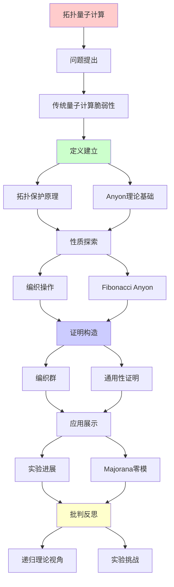
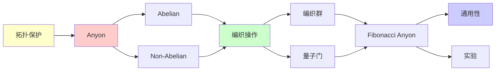

# 拓扑量子计算与Anyon编织

> **主题**: 拓扑保护的量子计算与非阿贝尔Anyon
> **创建日期**: 2025-12-02
> **难度**: ⭐⭐⭐⭐⭐
> **前置知识**: 量子计算、拓扑学、群论

---

## 📋 目录

- [拓扑量子计算与Anyon编织](#拓扑量子计算与anyon编织)
  - [📋 目录](#-目录)
  - [1. 拓扑量子计算动机](#1-拓扑量子计算动机)
    - [1.1 传统量子计算的脆弱性](#11-传统量子计算的脆弱性)
    - [1.2 拓扑保护原理](#12-拓扑保护原理)
  - [2. Anyon理论基础](#2-anyon理论基础)
    - [2.1 Anyon定义](#21-anyon定义)
    - [2.2 Abelian vs Non-Abelian](#22-abelian-vs-non-abelian)
  - [3. 编织操作与量子门](#3-编织操作与量子门)
    - [3.1 编织群](#31-编织群)
    - [3.2 幺正表示](#32-幺正表示)
  - [4. Fibonacci Anyon](#4-fibonacci-anyon)
    - [4.1 融合规则](#41-融合规则)
    - [4.2 通用性](#42-通用性)
  - [5. 实验进展](#5-实验进展)
    - [5.1 Majorana零模](#51-majorana零模)
    - [5.2 Microsoft项目](#52-microsoft项目)
  - [6. 递归理论视角](#6-递归理论视角)
  - [7. 主题-子主题论证逻辑关系图](#7-主题-子主题论证逻辑关系图)
    - [7.1 论证依赖关系](#71-论证依赖关系)
    - [7.2 概念依赖关系](#72-概念依赖关系)
  - [8. 参考资源](#8-参考资源)
    - [8.1 经典论文](#81-经典论文)
    - [8.2 教材](#82-教材)
    - [8.3 在线资源](#83-在线资源)

---

## 1. 拓扑量子计算动机

### 1.1 传统量子计算的脆弱性

```text
超导/离子阱量子计算:

问题:
✗ 退相干 (~100μs)
✗ 环境噪声敏感
✗ 需要大量纠错

纠错开销:
物理qubit : 逻辑qubit ≈ 1000:1
→ 100万物理qubit = 1000逻辑qubit ⚠️

成本:
⚠️ 极低温 (~10mK)
⚠️ 精密控制
⚠️ 昂贵维护
```

---

### 1.2 拓扑保护原理

**核心思想**: 信息编码在全局拓扑性质

```text
拓扑保护:
信息 ≠ 局域态
信息 = 拓扑性质 (缠绕数、编织等)

优势:
✓ 局域噪声不影响
✓ 本征容错
✓ 长相干时间 (理论上)

代价:
⚠️ 实验极其困难
⚠️ 需要特殊材料 (拓扑物态)
⚠️ 理论复杂
```

---

## 2. Anyon理论基础

### 2.1 Anyon定义

```text
粒子统计:
3D: 费米子 (反对称) / 玻色子 (对称)
2D: Anyon (任意相位!) ⭐

交换两个Anyon:
|ψ⟩ → e^{iθ}|ψ⟩

θ = 任意 (2D拓扑允许)

分类:
- Abelian: 单纯相位
- Non-Abelian: 矩阵变换 ⭐⭐⭐
```

---

### 2.2 Abelian vs Non-Abelian

```text
Abelian (如分数量子霍尔 ν=1/3):
σᵢσⱼ = σⱼσᵢ
→ 交换顺序无关
→ 不足以量子计算 ✗

Non-Abelian (如 ν=5/2):
σᵢσⱼ ≠ σⱼσᵢ
→ 编织历史matter ⭐
→ 可编码信息 ✓
→ 可实现量子门 ✓

例子:
- Fibonacci anyon
- Ising anyon
→ 可通用量子计算 ⭐⭐⭐⭐⭐
```

---

## 3. 编织操作与量子门

### 3.1 编织群

**定义**:

```text
编织群 B_n:
n个Anyon的编织操作

生成元: σᵢ (交换第i和i+1)

关系:
σᵢσⱼ = σⱼσᵢ  (|i-j| ≥ 2)
σᵢσᵢ₊₁σᵢ = σᵢ₊₁σᵢσᵢ₊₁  (Yang-Baxter)

vs 置换群:
置换: σᵢ² = 1
编织: σᵢ² ≠ 1 ⭐ (保留路径信息)
```

---

### 3.2 幺正表示

**量子门实现**:

```text
编织 → 幺正变换:
σᵢ → U_i (幺正矩阵)

Fibonacci anyon:
σ₁ → [φ    √φ  ]
     [√φ  -φ  ]
其中φ=(1+√5)/2 (黄金比例!)

通用性:
Fibonacci编织 + 单qubit门
= 通用量子计算 ✓

拓扑保护:
✓ U_i由拓扑决定
✓ 局域扰动不改变U_i
→ 本征容错 ⭐⭐⭐⭐⭐
```

---

## 4. Fibonacci Anyon

### 4.1 融合规则

```text
Fibonacci anyon融合:
1 × 1 = 1
1 × τ = τ
τ × τ = 1 + τ

其中:
- 1: 真空 (恒等)
- τ: Fibonacci anyon

量子维度:
d_τ = φ = (1+√5)/2

Jones多项式:
拓扑不变量
→ BQP完全问题 ⭐
```

---

### 4.2 通用性

**定理**: Fibonacci anyon可通用量子计算

```text
证明思路:
1. 编织生成稠密子群 SU(2)
2. + 辅助操作 → 通用
3. 拓扑保护 ✓

vs 其他:
Ising anyon: 不通用 ✗ (需补充)
Fibonacci: 通用 ✓

→ Fibonacci最优选择 ⭐
```

---

## 5. 实验进展

### 5.1 Majorana零模

```text
实验候选:
超导+拓扑绝缘体界面
→ Majorana束缚态

性质:
✓ 非阿贝尔
✓ 可编织
✓ 可实现Ising anyon

进展:
2012: 首次观测 (Leiden)
2018: 更多证据
2024: 仍有争议 ⚠️

挑战:
⚠️ 信号微弱
⚠️ 替代解释存在
⚠️ 尚未确凿证明
```

---

### 5.2 Microsoft项目

```text
Microsoft拓扑量子计算:

目标:
实现拓扑qubit
→ 本征容错

进展:
2023: 重大调整 (之前错误)
2024: 继续研究
状态: 0个拓扑qubit ✗

时间线:
预计: 2030+才可能
→ 长期项目 ⚠️

vs Google/IBM:
超导已100+ qubit ✓
拓扑仍0 qubit ✗
→ 理论优雅，实验困难
```

---

## 6. 递归理论视角

```text
拓扑量子计算 ∈ RE?

答案: ✓是的

证明:
拓扑QC ⊆ BQP ⊆ PSPACE ⊆ RE
→ 仍在递归范式内 ✓

关键:
✓ 计算能力 = BQP (不超越)
✓ 优势 = 容错性 (工程)
✗ 不是新计算模型
→ 架构创新 ≠ 能力突破

拓扑vs超导:
超导: 实践可行，需要纠错
拓扑: 理论完美，实验困难
→ 权衡 ⚠️
```

---

## 7. 主题-子主题论证逻辑关系图

### 7.1 论证依赖关系



### 7.2 概念依赖关系



**论证逻辑链条**：

1. **问题提出** (1节)：
   - 拓扑量子计算动机

2. **定义建立** (1.2, 2节)：
   - 拓扑保护原理和Anyon理论基础

3. **性质探索** (3-4节)：
   - 编织操作与量子门（3节）
   - Fibonacci Anyon（4节）

4. **证明构造** (3.1-3.2, 4.2节)：
   - 编织群和通用性证明

5. **应用展示** (5节)：
   - 实验进展

6. **批判反思** (6节)：
   - 递归理论视角

---

## 8. 参考资源

### 8.1 经典论文

1. **Kitaev, A. Y.** (2003). "Fault-tolerant quantum computation by anyons"
   - _Annals of Physics_, 303(1), 2-30
   - 拓扑量子计算奠基性论文 ⭐⭐⭐⭐⭐

2. **Nayak, C., et al.** (2008). "Non-Abelian anyons and topological quantum computation"
   - _Reviews of Modern Physics_, 80(3), 1083-1159
   - 非阿贝尔Anyon综述

3. **Freedman, M., et al.** (2002). "Topological Quantum Computation"
   - _Bulletin of the American Mathematical Society_, 40(1), 31-38
   - 拓扑量子计算的数学基础

### 8.2 教材

1. **Nielsen, M. A. & Chuang, I. L.** (2010)
   - _Quantum Computation and Quantum Information_ (10th Anniversary ed.)
   - Cambridge University Press. ISBN 978-1107002173
   - 量子计算标准教材

2. **Preskill, J.** (2018). "Quantum Computing in the NISQ era and beyond"
   - _Quantum_, 2, 79
   - NISQ时代量子计算

### 8.3 在线资源

1. **Wikipedia - Topological quantum computer**
   - https://en.wikipedia.org/wiki/Topological_quantum_computer
   - 拓扑量子计算基本概念

2. **Microsoft Quantum - Topological Quantum Computing**
   - https://www.microsoft.com/en-us/quantum/topological-quantum-computing
   - Microsoft拓扑量子计算项目

3. **arXiv - Topological Quantum Computation**
   - https://arxiv.org/list/quant-ph/top
   - 最新研究论文

---

**最后更新**: 2025-12-04
**Tier**: 1 (理论)
**实验状态**: 早期，高度困难 ⚠️
**理论优雅度**: ⭐⭐⭐⭐⭐
**状态**: ✅ 已添加主题-子主题论证逻辑关系图和参考资源章节
