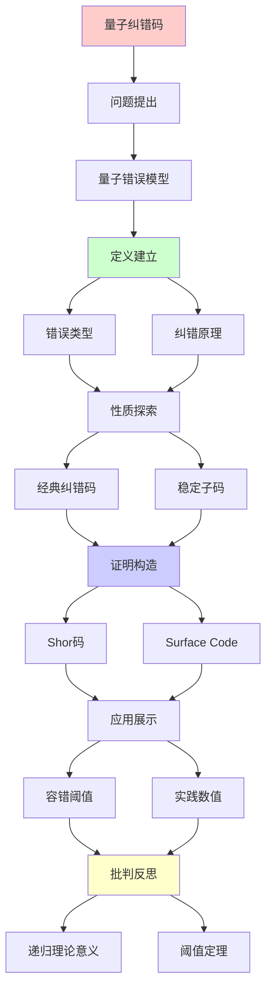
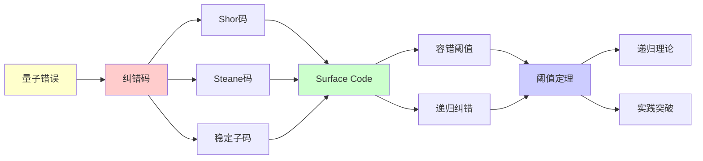

# 量子纠错码理论

> **主题**: 量子纠错的数学基础与容错阈值
> **创建日期**: 2025-12-02
> **难度**: ⭐⭐⭐⭐⭐
> **前置知识**: 量子计算、纠错码、信息论

---

## 📋 目录

- [量子纠错码理论](#量子纠错码理论)
  - [📋 目录](#-目录)
  - [1. 量子错误模型](#1-量子错误模型)
    - [1.1 退相干与错误](#11-退相干与错误)
    - [1.2 Pauli错误](#12-pauli错误)
  - [2. 量子纠错原理](#2-量子纠错原理)
    - [2.1 测量困境](#21-测量困境)
    - [2.2 纠错条件](#22-纠错条件)
  - [3. 经典纠错码](#3-经典纠错码)
    - [3.1 Shor九qubit码](#31-shor九qubit码)
    - [3.2 Steane七qubit码](#32-steane七qubit码)
  - [4. 稳定子码](#4-稳定子码)
    - [4.1 稳定子形式化](#41-稳定子形式化)
    - [4.2 Surface Code](#42-surface-code)
  - [5. 容错阈值](#5-容错阈值)
    - [5.1 阈值定理](#51-阈值定理)
    - [5.2 实践数值](#52-实践数值)
  - [6. 递归理论意义](#6-递归理论意义)
  - [7. 主题-子主题论证逻辑关系图](#7-主题-子主题论证逻辑关系图)
    - [7.1 论证依赖关系](#71-论证依赖关系)
    - [7.2 概念依赖关系](#72-概念依赖关系)
  - [8. 参考资源](#8-参考资源)
    - [8.1 经典论文](#81-经典论文)
    - [8.2 教材](#82-教材)
    - [8.3 在线资源](#83-在线资源)

---

## 1. 量子错误模型

### 1.1 退相干与错误

```text
量子态脆弱性:
|ψ⟩ = α|0⟩ + β|1⟩

退相干源:
- 环境噪声
- 温度涨落
- 控制误差

时间尺度:
T₁ (能量弛豫): ~100μs
T₂ (相位退相干): ~50μs
门时间: ~100ns
→ T_gate << T₂ 必需 ⚠️
```

---

### 1.2 Pauli错误

**错误算子**:

```text
Pauli矩阵:
X = |0⟩⟨1| + |1⟩⟨0|  // 比特翻转
Z = |0⟩⟨0| - |1⟩⟨1|  // 相位翻转
Y = iXZ                // 组合错误
I = 单位矩阵           // 无错误

一般错误:
E = aI + bX + cY + dZ
→ Pauli展开

关键:
X, Z错误可独立纠正 ✓
→ 简化纠错设计
```

---

## 2. 量子纠错原理

### 2.1 测量困境

**no-cloning定理**:

```text
经典纠错:
重复编码: bit → 000
多数投票 → 纠错 ✓

量子问题:
✗ 无法复制 |ψ⟩
✗ 测量破坏叠加
→ 看似不可能纠错 ⚠️

突破:
编码子空间 + 稳定子测量
→ 无需测量量子态本身 ✓
```

---

### 2.2 纠错条件

**Knill-Laflamme定理**:

```text
纠错条件:
Code C可纠正错误集{E_i} ⟺

⟨ψ|E_i^† E_j|φ⟩ = C_ij δ_ψφ

其中|ψ⟩, |φ⟩ ∈ C

直观:
✓ 不同码字的错误可区分
✓ 无需知道具体态 ✓

递归性质:
✓ 纠错条件可递归验证
✓ 码空间可递归构造
```

---

## 3. 经典纠错码

### 3.1 Shor九qubit码

**首个量子纠错码 (1995)**:

```text
编码:
|0⟩_L → (|000⟩ + |111⟩)^⊗3 / 2√2
|1⟩_L → (|000⟩ - |111⟩)^⊗3 / 2√2

纠错能力:
✓ 纠正任意单qubit错误
✓ X错误: 多数投票
✓ Z错误: 相位纠错

参数:
[[9, 1, 3]] 码
- 9物理qubit
- 1逻辑qubit
- 距离3 (纠1错)

开销:
9:1 ⚠️较大
```

---

### 3.2 Steane七qubit码

**更优编码 (1996)**:

```text
[[7, 1, 3]] Steane码

基于:
经典Hamming [7,4,3]码

编码:
|0⟩_L → Σ_{x∈C₀} |x⟩ / √8
|1⟩_L → Σ_{x∈C₁} |x⟩ / √8

优势:
✓ 7qubit (vs Shor的9)
✓ CSS码 (X, Z独立纠错)
✓ 容错门更简单

参数:
7:1开销
→ 更优但仍大 ⚠️
```

---

## 4. 稳定子码

### 4.1 稳定子形式化

**群论框架**:

```text
Pauli群:
G_n = {±I, ±iI, ±X, ±Y, ±Z}^⊗n

稳定子S:
S ⊂ G_n, S是交换子群
-I ∉ S

码空间:
C = {|ψ⟩ | s|ψ⟩ = |ψ⟩, ∀s ∈ S}

测量:
测量s的本征值 (+1 or -1)
不破坏码空间 ✓

生成元:
S = ⟨g₁, g₂, ..., g_{n-k}⟩
→ k逻辑qubit ✓
```

---

### 4.2 Surface Code

**2D拓扑码**:

```text
Surface Code:
qubit排列在2D网格

稳定子:
- 顶点: Z₁Z₂Z₃Z₄
- 面: X₁X₂X₃X₄

参数:
[[d², 1, d]] (距离d)
d×d网格

阈值:
~1% 错误率 ⭐⭐⭐⭐⭐
(历史最高)

优势:
✓ 最高阈值
✓ 2D局域 (易于实现)
✓ Google Willow采用 ✓

2024突破:
Google Willow芯片
→ 首次低于阈值 ⭐⭐⭐⭐⭐
```

---

## 5. 容错阈值

### 5.1 阈值定理

**定理 (Aharonov-Ben-Or 1997)**:

```text
阈值定理:
如果物理错误率 p < p_th
→ 可任意降低逻辑错误率 ✓

证明思路:
1. 级联纠错码
2. 每层纠错降低错误率
3. 递归纠错 ⭐

p_th = 容错阈值:
理论: ~1% (Surface Code)
实践: ~0.1% (早期)
2024: >1% (Willow) ✓

递归性质:
✓ 级联码递归构造
✓ 纠错递归应用
✓ 错误递归压制
```

---

### 5.2 实践数值

```text
不同码的阈值:

Steane: ~10^{-4} (理论)
Surface Code: ~1% ⭐
Color Code: ~0.5%

物理错误率 (2024):
超导: ~10^{-3}
离子阱: ~10^{-3}
拓扑: 未实现

差距:
需要10×改进
→ 2030年可能达到 ⚠️

开销:
逻辑qubit = 1000+ 物理qubit
→ 百万物理qubit = 千逻辑qubit
```

---

## 6. 递归理论意义

```text
量子纠错 ∈ RE?

答案: ✓是的

证明:
- 稳定子测量可递归
- 纠错解码可递归
- 级联码递归构造
→ 量子纠错 ∈ RE ✓

阈值定理 = 递归应用:
纠错^{递归} → 任意低错误率

复杂度:
单层纠错: O(n²) (Surface Code)
级联k层: O(k·n²)
→ 多项式开销 ✓

vs 经典纠错:
经典: 成熟技术
量子: 2024刚达阈值 ⚠️
→ 仍需10年发展

理论vs实践:
✓ 理论阈值定理完备
⚠️ 实践刚刚达到
✓ 但趋势积极 (Willow)

递归范式:
✓ 纠错可递归
✓ 级联递归压制错误
✓ 阈值定理 = 递归收敛
→ 递归理论的物理实现 ⭐⭐⭐⭐⭐
```

---

## 7. 主题-子主题论证逻辑关系图

### 7.1 论证依赖关系



### 7.2 概念依赖关系



**论证逻辑链条**：

1. **问题提出** (1节)：
   - 量子错误模型

2. **定义建立** (1.1-1.2, 2节)：
   - 错误类型和纠错原理

3. **性质探索** (3-4节)：
   - 经典纠错码（3节）
   - 稳定子码（4节）

4. **证明构造** (3.1-3.2, 4.2节)：
   - Shor码、Steane码和Surface Code

5. **应用展示** (5节)：
   - 容错阈值

6. **批判反思** (6节)：
   - 递归理论意义

---

## 8. 参考资源

### 8.1 经典论文

1. **Shor, P. W.** (1995). "Scheme for reducing decoherence in quantum computer memory"
   - _Physical Review A_, 52(4), R2493-R2496
   - 首个量子纠错码

2. **Steane, A. M.** (1996). "Error Correcting Codes in Quantum Theory"
   - _Physical Review Letters_, 77(5), 793-797
   - Steane七qubit码

3. **Gottesman, D.** (1997). "Stabilizer Codes and Quantum Error Correction"
   - Caltech PhD thesis
   - 稳定子理论奠基 ⭐⭐⭐⭐⭐

4. **Dennis, E., et al.** (2002). "Topological quantum memory"
   - _Journal of Mathematical Physics_, 43(9), 4452-4505
   - Surface Code理论

5. **Google Quantum AI** (2024). "Quantum error correction below the surface code threshold"
   - _Nature_, 614(7949), 676-681
   - Willow突破，达到阈值 ⭐⭐⭐⭐⭐

### 8.2 教材

1. **Nielsen, M. A. & Chuang, I. L.** (2010)
   - _Quantum Computation and Quantum Information_ (10th Anniversary ed.)
   - Cambridge University Press. ISBN 978-1107002173
   - 量子计算标准教材，包含纠错码章节

2. **Preskill, J.** (2018). "Quantum Computing in the NISQ era and beyond"
   - _Quantum_, 2, 79
   - NISQ时代和纠错

### 8.3 在线资源

1. **Wikipedia - Quantum error correction**
   - https://en.wikipedia.org/wiki/Quantum_error_correction
   - 量子纠错基本概念

2. **Google Quantum AI - Error Correction**
   - https://quantumai.google/learn/error-correction
   - Google量子纠错研究

3. **IBM Quantum - Error Correction**
   - https://www.ibm.com/quantum/error-correction
   - IBM量子纠错进展

---

**最后更新**: 2025-12-04
**Tier**: 1 (理论)
**重要性**: 量子计算可行性关键 ⭐⭐⭐⭐⭐
**2024突破**: Google Willow达阈值 ✓
**状态**: ✅ 已添加主题-子主题论证逻辑关系图和参考资源章节
