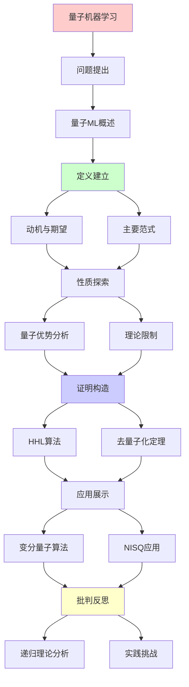
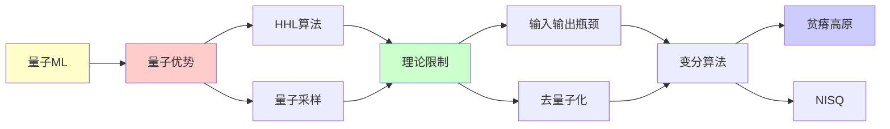

# 量子机器学习的理论边界

> **主题**: QML的优势与限制分析
> **创建日期**: 2025-12-02
> **难度**: ⭐⭐⭐⭐⭐
> **前置知识**: 量子计算、机器学习、复杂度理论

---

## 📋 目录

- [量子机器学习的理论边界](#量子机器学习的理论边界)
  - [📋 目录](#-目录)
  - [1. 量子机器学习概述](#1-量子机器学习概述)
    - [1.1 动机与期望](#11-动机与期望)
    - [1.2 主要范式](#12-主要范式)
  - [2. 量子优势分析](#2-量子优势分析)
    - [2.1 HHL算法](#21-hhl算法)
    - [2.2 量子采样优势](#22-量子采样优势)
  - [3. 理论限制](#3-理论限制)
    - [3.1 输入输出瓶颈](#31-输入输出瓶颈)
    - [3.2 去量子化定理](#32-去量子化定理)
  - [4. 变分量子算法](#4-变分量子算法)
    - [4.1 VQE/QAOA](#41-vqeqaoa)
    - [4.2 贫瘠高原问题](#42-贫瘠高原问题)
  - [5. NISQ时代应用](#5-nisq时代应用)
    - [5.1 当前能力](#51-当前能力)
    - [5.2 实践挑战](#52-实践挑战)
  - [6. 递归理论分析](#6-递归理论分析)
  - [7. 主题-子主题论证逻辑关系图](#7-主题-子主题论证逻辑关系图)
    - [7.1 论证依赖关系](#71-论证依赖关系)
    - [7.2 概念依赖关系](#72-概念依赖关系)
  - [8. 参考资源](#8-参考资源)
    - [8.1 经典论文](#81-经典论文)
    - [8.2 教材](#82-教材)
    - [8.3 在线资源](#83-在线资源)

---

## 1. 量子机器学习概述

### 1.1 动机与期望

**为什么量子ML？**

```text
经典ML瓶颈:
- 矩阵运算: O(n³) (如SVD)
- 数据量: 指数增长
- 优化: 非凸困难

量子期望:
✓ 线性代数加速 (HHL)
✓ 量子并行 (叠加态)
✓ 希尔伯特空间 (指数维度)
→ 指数加速？⭐

现实:
⚠️ 输入输出瓶颈
⚠️ 去量子化可能
⚠️ NISQ噪声
→ 复杂权衡
```

---

### 1.2 主要范式

```text
QML分类:

1. 量子数据 + 量子处理
   - 量子态分类
   - 量子系统建模

2. 经典数据 + 量子处理
   - HHL线性方程
   - 量子SVM

3. 变分量子算法
   - VQE (变分量子本征求解器)
   - QAOA (量子近似优化)

4. 量子启发经典
   - 张量网络
   - 量子退火启发
```

---

## 2. 量子优势分析

### 2.1 HHL算法

**Harrow-Hassidim-Lloyd (2009)**:

```text
问题: 求解Ax = b

经典: O(N³) (N×N矩阵)
HHL: O(log N) ⭐⭐⭐⭐⭐

但:
⚠️ A必须稀疏
⚠️ 条件数κ影响
⚠️ 只能测量||x||, ⟨x|M|x⟩
✗ 无法读出完整x向量

复杂度:
O(log N × κ² × poly(1/ε))

实际: κ ~ N → O(N²)
→ 优势消失 ⚠️

递归理论:
✓ 量子线性方程求解 ∈ BQP
✓ 指数加速 (特定情况)
✗ 输出瓶颈限制
```

---

### 2.2 量子采样优势

**Boson Sampling**:

```text
问题:
n个光子通过m模干涉仪
采样输出分布

经典: O(n! × m) 困难
量子: O(多项式) ✓

Google Sycamore (2019):
量子霸权实验
53 qubit
200秒 vs 10,000年
→ 采样优势证明 ⭐⭐⭐⭐⭐

但:
⚠️ 采样任务无实际应用
⚠️ 验证困难
? ML是否受益

递归理论:
✓ 采样 ∈ BQP
✗ 但非ML核心任务
```

---

## 3. 理论限制

### 3.1 输入输出瓶颈

**数据加载问题**:

```text
经典数据 → 量子态:
N维向量 → |ψ⟩

朴素: O(N)
QRAM: O(log N) (理论)
→ 但QRAM极难实现 ⚠️⚠️

读出问题:
量子态 → 经典数据
测量: 单个比特
完整读出: O(N)次测量 ✗

例子:
量子算法内部: O(log N)
但I/O: O(N)
→ 总体: O(N) (无加速) ⚠️

Aaronson定理:
多数量子ML无指数加速
→ I/O主导 ✗
```

---

### 3.2 去量子化定理

**Tang (2018)**:

```text
量子启发经典算法:
推荐系统 (Kerenidis-Prakash 2016)
量子: O(poly(log N))
→ Tang去量子化: 同样复杂度 ⭐

PCA (Lloyd et al. 2014):
量子: 指数加速
→ Tang: 经典也可 ✓

结论:
多数量子ML可去量子化
→ 无真正指数加速 ⚠️⚠️⚠️

例外:
? 是否存在不可去量子化的ML
→ 开放问题

递归理论:
✓ 去量子化 = 经典模拟量子
✓ BQP ⊆ PSPACE
? BQP vs P 仍未知
```

---

## 4. 变分量子算法

### 4.1 VQE/QAOA

**变分量子本征求解器**:

```text
VQE思想:
量子线路U(θ)
测量期望⟨ψ(θ)|H|ψ(θ)⟩
经典优化θ
→ 量子经典混合 ✓

QAOA (量子近似优化):
组合优化问题
MaxCut, TSP等
p层QAOA: U(β,γ)
→ 近似解

NISQ友好:
✓ 浅线路
✓ 容错要求低
⚠️ 但性能有限

复杂度:
每次测量: O(1)
优化迭代: k次
总: O(k × poly)
→ 启发式，无保证
```

---

### 4.2 贫瘠高原问题

**Barren Plateaus (McClean 2018)**:

```text
问题:
随机参数化线路
梯度 → 指数小 ⚠️⚠️⚠️

∇θ⟨H⟩ ~ exp(-n)

后果:
✗ 梯度优化失效
✗ 指数次测量才能估计梯度
→ VQE/QAOA可扩展性危机

缓解:
✓ 特殊电路结构
✓ 预训练
✓ 物理启发ansatz
⚠️ 但根本问题未解

递归理论:
✓ 梯度可递归计算
✗ 但指数小 (信噪比)
→ 实践不可行 ⚠️
```

---

## 5. NISQ时代应用

### 5.1 当前能力

**现状 (2024)**:

```text
硬件:
- IBM: ~1000 qubit (噪声)
- Google: ~100 qubit (低噪声)
- IonQ: ~30 qubit (高质量)

应用:
✓ 量子化学 (小分子)
✓ 优化 (小规模)
⚠️ 经典仍优于量子

基准测试:
Quantum Volume: ~128
实用任务: ✗ 尚未超越经典

预期:
2025-2030: NISQ改进
2030+: 容错QC
→ 真正优势尚远 ⚠️
```

---

### 5.2 实践挑战

```text
挑战清单:

1. 噪声:
   门错误率: ~0.1%
   退相干: ~100μs
   → 需要纠错 (未成熟)

2. 连接性:
   非全连接拓扑
   → SWAP开销

3. 读出:
   测量错误: ~1%
   → 多次平均

4. 校准:
   漂移
   → 频繁重校

5. 软件:
   缺乏高层工具
   → 编程困难

递归理论:
✓ NISQ ∈ BQP (理论)
✗ 实践受噪声限制
→ 理论vs实践鸿沟 ⚠️
```

---

## 6. 递归理论分析

```text
QML ∈ RE?

答案: ✓是的

证明:
- 量子线路可递归模拟
- 测量可递归处理
- 优化可递归迭代
→ QML ∈ BQP ⊆ PSPACE ⊆ RE ✓

理论优势:
HHL: O(log N) vs O(N³)
→ 指数加速 (特定任务)

实践限制:
✗ I/O瓶颈 O(N)
✗ 去量子化可能
✗ NISQ噪声
→ 实际无指数加速 ⚠️⚠️⚠️

递归范式:
✓ 量子ML ⊂ BQP ⊂ RE
✓ 不超越递归范式
✓ 但效率理论优势 (部分)

vs 经典ML:
经典: 成熟工具 ✓
量子: 理论优势 ⚠️
      实践困难 ✗
→ 2024仍是研究阶段

未来:
? 容错QC (2030+)
? 真正指数加速应用
? 或全部可去量子化
→ 开放问题 ⚠️

哲学:
量子ML = 量子并行 + ML
但:
并行 ≠ 加速 (I/O限制)
叠加 ≠ 优势 (测量塌缩)
→ 量子优势微妙 ⭐

递归理论贡献:
✓ 明确复杂度边界
✓ 理论可能性证明
✓ 限制条件识别
→ 理论指导实践 ⭐
```

---

## 7. 主题-子主题论证逻辑关系图

### 7.1 论证依赖关系



### 7.2 概念依赖关系



**论证逻辑链条**：

1. **问题提出** (1节)：
   - 量子机器学习概述

2. **定义建立** (1.1-1.2节)：
   - 动机与期望和主要范式

3. **性质探索** (2-3节)：
   - 量子优势分析（2节）
   - 理论限制（3节）

4. **证明构造** (2.1, 3.2节)：
   - HHL算法和去量子化定理

5. **应用展示** (4-5节)：
   - 变分量子算法（4节）
   - NISQ时代应用（5节）

6. **批判反思** (6节)：
   - 递归理论分析

---

## 8. 参考资源

### 8.1 经典论文

1. **Harrow, A. W., Hassidim, A., & Lloyd, S.** (2009). "Quantum Algorithm for Linear Systems of Equations"
   - _Physical Review Letters_, 103(15), 150502
   - HHL算法原始论文

2. **Tang, E.** (2018). "A Quantum-Inspired Classical Algorithm for Recommendation Systems"
   - _STOC 2019_. Proceedings of the 51st Annual ACM SIGACT Symposium on Theory of Computing
   - 去量子化定理

3. **McClean, J. R., et al.** (2018). "Barren Plateaus in Quantum Neural Network Training Landscapes"
   - _Nature Communications_, 9(1), 4812
   - 贫瘠高原问题

4. **Aaronson, S.** (2015). "Read the Fine Print"
   - _Nature Physics_, 11(4), 291-293
   - 量子ML限制分析

### 8.2 教材

1. **Nielsen, M. A. & Chuang, I. L.** (2010)
   - _Quantum Computation and Quantum Information_ (10th Anniversary ed.)
   - Cambridge University Press. ISBN 978-1107002173
   - 量子计算标准教材

2. **Goodfellow, I., Bengio, Y., & Courville, A.** (2016)
   - _Deep Learning_
   - MIT Press. ISBN 978-0262035613
   - 机器学习基础

### 8.3 在线资源

1. **Wikipedia - Quantum machine learning**
   - https://en.wikipedia.org/wiki/Quantum_machine_learning
   - 量子机器学习基本概念

2. **Pennylane - Quantum Machine Learning**
   - https://pennylane.ai/qml/
   - 量子机器学习框架

3. **arXiv - Quantum Machine Learning**
   - https://arxiv.org/list/quant-ph/top
   - 最新研究论文

---

**最后更新**: 2025-12-04
**Tier**: 1-4 (理论+实践+哲学)
**成熟度**: 研究阶段 ⚠️
**优势**: 理论存在, 实践有限 ⚠️
**状态**: ✅ 已添加主题-子主题论证逻辑关系图和参考资源章节
