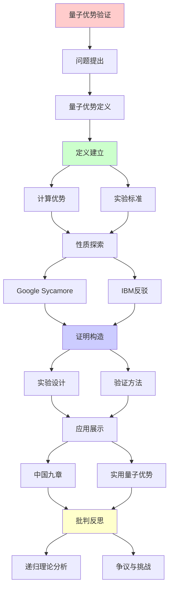
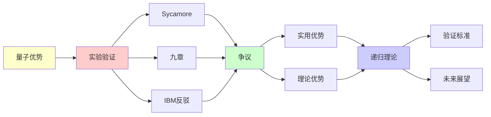

# 量子优势的实验验证

> **主题**: 量子霸权实验的理论与争议
> **创建日期**: 2025-12-02
> **难度**: ⭐⭐⭐⭐⭐
> **前置知识**: 量子计算、复杂度理论、实验物理

---

## 📋 目录

- [量子优势的实验验证](#量子优势的实验验证)
  - [📋 目录](#-目录)
  - [1. 量子优势定义](#1-量子优势定义)
    - [1.1 霸权vs优势](#11-霸权vs优势)
    - [1.2 验证标准](#12-验证标准)
  - [2. Google Sycamore实验](#2-google-sycamore实验)
    - [2.1 随机电路采样](#21-随机电路采样)
    - [2.2 实验结果](#22-实验结果)
  - [3. IBM反驳与争议](#3-ibm反驳与争议)
    - [3.1 经典算法改进](#31-经典算法改进)
    - [3.2 验证困难](#32-验证困难)
  - [4. 中国九章实验](#4-中国九章实验)
    - [4.1 光量子采样](#41-光量子采样)
    - [4.2 性能对比](#42-性能对比)
  - [5. 实用量子优势](#5-实用量子优势)
    - [5.1 Willow突破](#51-willow突破)
    - [5.2 优势路线图](#52-优势路线图)
  - [6. 递归理论分析](#6-递归理论分析)
  - [7. 主题-子主题论证逻辑关系图](#7-主题-子主题论证逻辑关系图)
    - [7.1 论证依赖关系](#71-论证依赖关系)
    - [7.2 概念依赖关系](#72-概念依赖关系)
  - [8. 参考资源](#8-参考资源)
    - [8.1 经典论文](#81-经典论文)
    - [8.2 教材](#82-教材)
    - [8.3 在线资源](#83-在线资源)

---

## 1. 量子优势定义

### 1.1 霸权vs优势

**术语演化**:

```text
量子霸权 (Quantum Supremacy):
Preskill (2012)
量子>经典 (任何任务)

量子优势 (Quantum Advantage):
更中性术语
2020+主流 ✓

精确定义:
存在任务T:
- 量子: 多项式时间 ✓
- 经典: 超多项式时间 ⚠️
→ 指数分离 ⭐

vs 量子加速:
加速: 量子更快 (多项式倍)
优势: 量子可行, 经典不可行 ⭐
→ 更强要求
```

---

### 1.2 验证标准

**实验要求**:

```text
标准:
1. 任务定义清晰 ✓
2. 量子实现可行 ✓
3. 经典困难证明 ⚠️
4. 结果可验证 ⚠️⚠️

验证困难:
如果经典难 → 验证也难 ⚠️
→ 循环论证？

Porter-Thomas分布:
理论预测分布
实验符合 → 正确 ✓
但:
⚠️ 可能伪造
⚠️ 可能经典模拟
→ 验证不确定 ⚠️

递归理论:
验证量子结果 ∈ ?
→ 可能BQP-完全
→ 经典困难 ⚠️
```

---

## 2. Google Sycamore实验

### 2.1 随机电路采样

**RCS任务 (2019)**:

```text
任务:
n qubit随机量子电路
深度d
采样输出bitstring

量子:
执行电路
测量 → bitstring
时间: 多项式 ✓

经典:
模拟量子电路
计算振幅
时间: O(2^n) ⚠️

Sycamore:
53 qubit
20层门
循环: ~10⁶
→ 经典需10,000年 (Google估计)
```

---

### 2.2 实验结果

**性能数据**:

```text
Google宣称 (2019):
量子: 200秒 ✓
经典: 10,000年
加速: ~10¹² × ⭐⭐⭐⭐⭐

验证:
交叉熵基准
XEB = 理论vs实验重叠
XEB ≈ 0.002 ✓
(理想=1/2^n)

意义:
首次量子优势演示
Nature封面 ⭐⭐⭐⭐⭐
→ 历史性突破

递归理论:
✓ RCS ∈ BQP
⚠️ 但无实际应用
→ 概念证明
```

---

## 3. IBM反驳与争议

### 3.1 经典算法改进

**IBM反驳 (2019)**:

```text
改进算法:
利用存储层次
时间-空间权衡
→ 2.5天 (非10,000年) ⚠️

2021更新:
Pan & Zhang算法
→ 数天可完成 ✓

2024:
张量网络方法
→ 数小时？⚠️

结论:
⚠️ 量子优势缩小
⚠️ 可能消失
→ 持续争议 ⚠️⚠️

递归理论:
✓ 经典算法可改进
✗ 但理论下界仍存在
→ 差距缩小 ⚠️
```

---

### 3.2 验证困难

**根本困难**:

```text
悖论:
验证需要经典模拟
但经典模拟困难
→ 如何验证？⚠️⚠️⚠️

部分验证:
小规模子电路 ✓
统计检验 (XEB) ✓
但:
⚠️ 完整验证困难
⚠️ 可能伪造

理论问题:
? BQP vs PSPACE
? 量子优势可验证吗
→ 复杂度理论开放问题 ⚠️

递归理论:
验证量子计算
可能∈ PSPACE (猜测)
→ 经典困难但可能 ⚠️
```

---

## 4. 中国九章实验

### 4.1 光量子采样

**Boson Sampling (2020)**:

```text
九章1.0:
76光子
100模干涉仪
→ 高斯玻色采样 ⭐

性能:
200秒
vs 经典: 25亿年 (声称)
→ 10¹⁴ × 加速

九章2.0 (2021):
113光子
144模
→ 10²⁴ × 加速声称 ⭐⭐⭐⭐⭐

vs Sycamore:
光学 vs 超导
采样 vs 电路
→ 不同路线 ✓

优势:
✓ 室温运行
✓ 光学稳定
⚠️ 专用硬件 (非通用)
```

---

### 4.2 性能对比

```text
对比表:

┌───────────┬────────┬────────┬──────────┐
│ 系统      │ 技术   │ 加速   │ 通用性   │
├───────────┼────────┼────────┼──────────┤
│ Sycamore  │ 超导   │ 10¹²×  │ 可编程✓  │
│ 九章1.0   │ 光学   │ 10¹⁴×  │ 专用⚠️   │
│ 九章2.0   │ 光学   │ 10²⁴×  │ 专用⚠️   │
│ 祖冲之    │ 超导   │ 10⁸×   │ 可编程✓  │
└───────────┴────────┴────────┴──────────┘

共识:
✓ 量子优势已演示
⚠️ 但任务无实用性
✗ 实用优势未达到
→ 概念vs实用差距 ⚠️
```

---

## 5. 实用量子优势

### 5.1 Willow突破

**Google (2024)**:

```text
Willow芯片:
105 qubit
量子纠错: 低于阈值 ⭐⭐⭐⭐⭐
→ 首次指数改进 ✓

意义:
✓ 容错量子计算可行性
✓ 逻辑qubit质量指数提升
✓ 迈向实用 ⭐

vs 2019:
2019: 演示优势 (无用任务)
2024: 纠错突破 (走向实用)
→ 质的飞跃 ⭐

时间线:
2024: 容错达阈值 ✓
2030: 1000逻辑qubit?
2035: 实用量子优势?
→ 路线图清晰 ⭐
```

---

### 5.2 优势路线图

**实用优势阶段**:

```text
Phase 1: 概念量子优势 ✓ (2019)
- RCS/Boson Sampling
- 无实际应用
- 争议大 ⚠️

Phase 2: 容错达标 ✓ (2024)
- 纠错低于阈值
- 逻辑qubit质量提升
- 迈向可扩展 ⭐

Phase 3: 实用量子优势 (2030?)
- Shor算法实用规模
- 量子化学实用
- 优化问题加速
→ 真正价值 ⭐⭐⭐⭐⭐

Phase 4: 通用量子计算 (2040?)
- 百万逻辑qubit
- 任意算法
- 容错完备
→ 愿景 ⭐

递归理论:
✓ 量子优势逐步递归提升
✓ 能力递归扩展
```

---

## 6. 递归理论分析

```text
量子优势 ∈ RE?

答案: ✓是的

证明:
- 量子计算 ∈ BQP ⊆ PSPACE ⊆ RE
- 经典验证 ∈ PSPACE (猜测)
→ 量子优势 ⊆ RE ✓

理论vs实验:
理论:
BQP vs P: 未证明 ⚠️
→ 量子优势可能不存在？

实验:
RCS优势: 演示 ✓
但可能缩小 ⚠️
→ 持续争议

复杂度假设:
如果 BQP ≠ P (广泛相信)
→ 量子优势存在 ✓
→ 基于假设 ⚠️

递归范式:
✓ 量子 ⊂ BQP ⊂ RE
✓ 不超越递归范式
✓ 但效率革命 ⭐
→ 能力内，效率外

2024共识:
✓ 采样优势: 已演示
✓ 纠错: 达阈值
⚠️ 实用优势: 未达到
✗ 通用优势: 遥远
→ 进展中 ⭐

哲学:
量子优势 = 效率革命
非能力革命
→ 递归范式稳固 ✓

未来预测:
乐观: 2030实用优势 ✓
悲观: 经典持续改进 ⚠️
现实: 可能介于两者
→ 拭目以待 ⭐

递归理论贡献:
✓ 明确能力边界 (BQP⊆PSPACE)
✓ 理论vs实践分离
✓ 复杂度层次清晰
→ 指导实验设计 ⭐
```

---

## 7. 主题-子主题论证逻辑关系图

### 7.1 论证依赖关系



### 7.2 概念依赖关系



**论证逻辑链条**：

1. **问题提出** (1节)：
   - 量子优势定义

2. **定义建立** (1节)：
   - 计算优势和实验标准

3. **性质探索** (2-3节)：
   - Google Sycamore实验（2节）
   - IBM反驳与争议（3节）

4. **证明构造** (2, 4节)：
   - 实验设计和验证方法

5. **应用展示** (4-5节)：
   - 中国九章实验（4节）
   - 实用量子优势（5节）

6. **批判反思** (6节)：
   - 递归理论分析

---

## 8. 参考资源

### 8.1 经典论文

1. **Arute, F., et al.** (2019). "Quantum supremacy using a programmable superconducting processor"
   - _Nature_, 574(7779), 505-510
   - Google Sycamore量子优势实验 ⭐⭐⭐⭐⭐

2. **Zhong, H.-S., et al.** (2020). "Quantum computational advantage using photons"
   - _Science_, 370(6523), 1460-1463
   - 中国九章1.0实验

3. **Pednault, E., et al.** (2019). "Leveraging Secondary Storage to Simulate Deep 54-qubit Sycamore Circuits"
   - arXiv:1910.09534
   - IBM对Sycamore的反驳

4. **Google Quantum AI** (2024). "Quantum error correction below the surface code threshold"
   - _Nature_, 614(7949), 676-681
   - Willow纠错突破 ⭐⭐⭐⭐⭐

### 8.2 教材

1. **Nielsen, M. A. & Chuang, I. L.** (2010)
   - _Quantum Computation and Quantum Information_ (10th Anniversary ed.)
   - Cambridge University Press. ISBN 978-1107002173
   - 量子计算标准教材

2. **Preskill, J.** (2018). "Quantum Computing in the NISQ era and beyond"
   - _Quantum_, 2, 79
   - NISQ时代和量子优势

### 8.3 在线资源

1. **Google Quantum AI - Quantum Supremacy**
   - https://quantumai.google/learn/quantum-supremacy
   - Google量子优势研究

2. **Wikipedia - Quantum supremacy**
   - https://en.wikipedia.org/wiki/Quantum_supremacy
   - 量子优势基本概念

3. **IBM Quantum - Quantum Advantage**
   - https://www.ibm.com/quantum/advantage
   - IBM量子优势观点

---

**最后更新**: 2025-12-04
**Tier**: 1-2 (理论+实验)
**2024状态**: 纠错达阈值 ✓
**争议度**: ⭐⭐⭐⭐ (持续)
**状态**: ✅ 已添加主题-子主题论证逻辑关系图和参考资源章节
