# 量子计算的未来路线图

> **主题**: 从NISQ到容错QC的技术路径
> **创建日期**: 2025-12-02
> **难度**: ⭐⭐⭐⭐⭐
> **前置知识**: 量子计算、技术预测、复杂度理论

---

## 📋 目录

- [量子计算的未来路线图](#量子计算的未来路线图)
  - [📋 目录](#-目录)
  - [1. 技术路线](#1-技术路线)
    - [1.1 硬件平台](#11-硬件平台)
    - [1.2 时间线](#12-时间线)
  - [2. 容错量子计算](#2-容错量子计算)
    - [2.1 逻辑qubit里程碑](#21-逻辑qubit里程碑)
    - [2.2 算法应用](#22-算法应用)
  - [3. 杀手级应用](#3-杀手级应用)
    - [3.1 密码破解](#31-密码破解)
    - [3.2 量子化学](#32-量子化学)
    - [3.3 优化问题](#33-优化问题)
  - [4. 挑战与瓶颈](#4-挑战与瓶颈)
    - [4.1 技术障碍](#41-技术障碍)
    - [4.2 商业挑战](#42-商业挑战)
  - [5. 社会影响](#5-社会影响)
    - [5.1 密码学转型](#51-密码学转型)
    - [5.2 科学革命](#52-科学革命)
  - [6. 递归理论总结](#6-递归理论总结)
  - [7. 主题-子主题论证逻辑关系图](#7-主题-子主题论证逻辑关系图)
    - [7.1 论证依赖关系](#71-论证依赖关系)
    - [7.2 概念依赖关系](#72-概念依赖关系)
  - [8. 参考资源](#8-参考资源)
    - [8.1 经典论文](#81-经典论文)
    - [8.2 教材](#82-教材)
    - [8.3 在线资源](#83-在线资源)

---

## 1. 技术路线

### 1.1 硬件平台

**多路线竞争**:

```text
超导 (IBM, Google):
✓ 成熟度最高
✓ 100+ qubit
⚠️ 极低温 (~10mK)
⚠️ 相干时间短 (~100μs)

离子阱 (IonQ, Honeywell):
✓ 高保真度 (99.9%+)
✓ 长相干 (~秒)
⚠️ 规模化难
⚠️ 速度慢

光学 (Xanadu):
✓ 室温运行
✓ 网络友好
⚠️ 测量困难
⚠️ 非通用 (目前)

拓扑 (Microsoft):
✓ 本征容错 (理论)
⚠️ 实验极难
✗ 0个qubit (2024)

中性原子 (QuEra):
✓ 可扩展性好
✓ 100+ qubit
⚠️ 新兴技术

递归:
✓ 技术递归竞争
✓ 路线递归收敛/分化
```

---

### 1.2 时间线

**乐观路线图**:

```text
2024: NISQ成熟 ✓
- 100-1000物理qubit
- Willow达纠错阈值 ⭐
- 概念量子优势

2027: 小规模容错
- 10-100逻辑qubit
- 实用量子化学
- Shor算法演示 (RSA-1024)

2030: 中等容错
- 100-1000逻辑qubit
- RSA-2048破解可能 ⚠️⚠️⚠️
- 药物设计实用

2035: 大规模容错
- 1000-10000逻辑qubit
- 通用量子计算
- RSA-4096破解

2040+: 完全容错
- 百万逻辑qubit
- 任意算法
- 量子互联网

保守估计: 各延后5-10年 ⚠️

递归:
✓ 能力递归扩展
✓ qubit递归增长
```

---

## 2. 容错量子计算

### 2.1 逻辑qubit里程碑

**关键阈值**:

```text
里程碑:

10逻辑qubit (2027?):
- 演示Shor小规模
- 量子化学有用

100逻辑qubit (2030?):
- RSA-1024破解
- 材料设计

1000逻辑qubit (2035?):
- RSA-2048破解 ⚠️⚠️⚠️
- 药物设计革命

10000+ 逻辑qubit (2040+):
- 通用量子计算
- 量子模拟

物理需求:
逻辑:物理 ~ 1:1000
1000逻辑 = 百万物理 ⚠️
→ 工程挑战巨大 ⚠️⚠️

递归理论:
✓ 纠错递归级联
✓ qubit递归编码
```

---

### 2.2 算法应用

**实用算法时间表**:

```text
Shor算法:
RSA-1024: ~2000 逻辑qubit
RSA-2048: ~4000 逻辑qubit
RSA-4096: ~8000 逻辑qubit
→ 2030-2040威胁 ⚠️⚠️⚠️

Grover搜索:
加速: √N
→ 适度优势 ⚠️
实用性有限

量子化学:
小分子: 50-100 逻辑qubit
药物: 100-1000 逻辑qubit
→ 2030实用 ⭐⭐⭐⭐⭐

优化:
QAOA/VQE
NISQ可行 ✓
但性能存疑 ⚠️

递归:
✓ 算法递归改进
✓ 应用递归扩展
```

---

## 3. 杀手级应用

### 3.1 密码破解

**安全威胁**:

```text
威胁时间线:
2027: RSA-1024 ⚠️
2030: RSA-2048 ⚠️⚠️
2035: RSA-4096 ⚠️⚠️⚠️

影响:
✗ RSA加密
✗ ECDSA签名
✗ DH密钥交换
→ 全球加密系统 ⚠️⚠️⚠️

对策:
后量子密码 (NIST 2024) ✓
混合模式
密码敏捷性
→ 现在就准备 ⚠️

递归:
✓ 威胁递归升级
✓ 防御递归部署
```

---

### 3.2 量子化学

**材料/药物设计**:

```text
问题:
分子模拟: 指数复杂
经典: ~30原子极限 ⚠️

量子:
多项式复杂度 ✓
>100原子可能 ⭐

应用:
- 催化剂设计
- 电池材料
- 药物发现
- 超导体

商业价值:
数千亿美元市场 ⭐⭐⭐⭐⭐
→ 真正杀手应用

时间线:
2025: 演示级别
2030: 实用级别 ⭐
→ 化学革命 ⭐⭐⭐⭐⭐

递归:
✓ 分子递归模拟
✓ 结构递归优化
```

---

### 3.3 优化问题

**组合优化**:

```text
问题类:
TSP, 物流, 调度
→ NP难问题 ⚠️

量子:
Grover: √N加速
QAOA: 近似优化
→ 适度优势 ⚠️

vs 经典:
经典启发式: 成熟 ✓
量子: 理论优势 ⚠️
→ 实际竞争激烈

应用:
金融投资组合
供应链优化
→ 商业价值 ⭐

挑战:
⚠️ 优势不明显
⚠️ 经典持续改进
→ 量子优势存疑 ⚠️

递归:
✓ 优化递归迭代
✓ 近似递归逼近
```

---

## 4. 挑战与瓶颈

### 4.1 技术障碍

```text
物理挑战:
1. 退相干 ⚠️⚠️⚠️
   T₂ << 算法时间

2. 错误率 ⚠️⚠️
   需要<0.01%
   当前~0.1%

3. 规模化 ⚠️⚠️
   百万物理qubit
   布线/控制/冷却

4. 连接性 ⚠️
   非全连接拓扑
   SWAP开销

预测:
每项需要5-10年突破
→ 总计2035-2040 ⚠️

递归:
✓ 挑战递归克服
✓ 技术递归积累
```

---

### 4.2 商业挑战

```text
成本:
当前量子计算机:
$1000万-$1亿 ⚠️⚠️⚠️
运维: $百万/年
→ 极昂贵

vs 经典:
GPU集群: $百万
云计算: $小时
→ 成本差1000× ⚠️

商业模式:
云量子计算 (IBM, AWS)
→ 分摊成本 ✓

人才:
量子工程师稀缺 ⚠️
→ 教育瓶颈

投资:
2024: $数十亿VC
政府: 各国战略
→ 资金充足 ✓

递归:
✓ 投资递归增长
✓ 生态递归成熟
```

---

## 5. 社会影响

### 5.1 密码学转型

**后量子时代**:

```text
威胁:
Shor算法 → RSA/ECC破解 ✗
→ 全球安全危机 ⚠️⚠️⚠️

转型:
2024-2030: 后量子部署
2030+: 量子威胁现实化
→ 10年窗口 ⚠️

影响:
- 金融系统
- 政府通信
- 区块链 (Bitcoin?)
- 物联网
→ 全社会影响 ⚠️⚠️⚠️

递归:
✓ 威胁递归逼近
✓ 防御递归升级
```

---

### 5.2 科学革命

**研究范式转移**:

```text
量子模拟:
费曼愿景 (1982) ✓
模拟量子系统
→ 理解量子物理 ⭐

应用:
- 高温超导机理
- 量子相变
- 拓扑物态
→ 物理突破 ⭐⭐⭐⭐⭐

vs 经典:
经典: 指数墙 ⚠️
量子: 天然匹配 ✓
→ 科学发现加速 ⭐

化学/生物:
蛋白质折叠
药物设计
光合作用
→ 生命科学革命 ⭐

递归:
✓ 科学发现递归加速
✓ 知识递归积累
```

---

## 6. 递归理论总结

```text
量子计算 ⊂ RE:

能力:
✓ BQP ⊆ PSPACE ⊆ RE
✓ 不超越递归范式
✓ 效率革命, 非能力革命 ⭐

时间线:
2024: NISQ + 纠错达阈值 ✓
2030: 小规模容错
2040: 大规模应用
→ 15-20年实用化 ⚠️

递归应用:
✓ 纠错码递归
✓ 算法递归优化
✓ 模拟递归精确

理论完备:
✓ 复杂度理论清晰 (BQP)
✓ 纠错理论成熟 (阈值定理)
✓ 算法库丰富 (Shor, Grover, VQE)
→ 理论准备就绪 ✓

实践挑战:
⚠️ 硬件成熟度
⚠️ 错误率降低
⚠️ 规模扩展
→ 工程瓶颈为主 ⚠️

递归范式意义:
✓ 量子仍在递归范式内
✓ 证明递归范式强大
✓ 效率 ≠ 能力
→ 范式稳固 ⭐⭐⭐⭐⭐

2050展望:
✓ 通用量子计算可能实现
✓ 特定领域革命 (化学)
⚠️ 通用优势仍存疑
→ 专用为主 ⭐

哲学:
量子 = 自然的计算方式
经典 = 人类抽象
→ 殊途同归 (RE) ⭐

终极问题:
? 量子引力计算
? 超越量子
→ 更远未来 ⚠️
```

---

## 7. 主题-子主题论证逻辑关系图

### 7.1 论证依赖关系

```mermaid
graph TD
    A[量子计算未来] --> B[问题提出]
    B --> C[技术路线]

    C --> D[定义建立]
    D --> D1[硬件平台]
    D --> D2[时间线]

    D1 --> E[性质探索]
    D2 --> E
    E --> E1[容错量子计算]
    E --> E2[杀手级应用]

    E1 --> F[证明构造]
    E2 --> F
    F --> F1[逻辑qubit]
    F --> F2[算法应用]

    F1 --> G[应用展示]
    F2 --> G
    G --> G1[挑战与瓶颈]
    G --> G2[社会影响]

    G1 --> H[批判反思]
    G2 --> H
    H --> H1[递归理论总结]
    H --> H2[未来预测]

    style A fill:#ffcccc
    style D fill:#ccffcc
    style F fill:#ccccff
    style H fill:#ffffcc
```



### 7.2 概念依赖关系

```mermaid
graph LR
    A[量子计算未来] --> B[技术路线]

    B --> C[硬件平台]
    B --> D[容错计算]

    C --> E[杀手级应用]
    D --> E

    E --> F[挑战]
    E --> G[社会影响]

    F --> H[递归理论]
    G --> H

    H --> I[时间线]
    H --> J[范式展望]

    style A fill:#ffffcc
    style B fill:#ffcccc
    style E fill:#ccffcc
    style H fill:#ccccff
```



**论证逻辑链条**：

1. **问题提出** (1节)：
   - 技术路线

2. **定义建立** (1.1-1.2节)：
   - 硬件平台和时间线

3. **性质探索** (2-3节)：
   - 容错量子计算（2节）
   - 杀手级应用（3节）

4. **证明构造** (2.1-2.2节)：
   - 逻辑qubit里程碑和算法应用

5. **应用展示** (4-5节)：
   - 挑战与瓶颈（4节）
   - 社会影响（5节）

6. **批判反思** (6节)：
   - 递归理论总结

---

## 8. 参考资源

### 8.1 经典论文

1. **Preskill, J.** (2018). "Quantum Computing in the NISQ era and beyond"
   - _Quantum_, 2, 79
   - NISQ时代定义和展望 ⭐⭐⭐⭐⭐

2. **Martinis, J.** (2021). "Quantum Computing: A 20-Year Perspective"
   - IEEE Spectrum
   - 量子计算技术路线图

3. **Arute, F., et al.** (2019). "Quantum Supremacy Using a Programmable Superconducting Processor"
   - _Nature_, 574(7779), 505-510
   - 量子优势里程碑

### 8.2 教材

1. **Nielsen, M. A. & Chuang, I. L.** (2010)
   - _Quantum Computation and Quantum Information_ (10th Anniversary ed.)
   - Cambridge University Press. ISBN 978-1107002173
   - 量子计算标准教材

2. **Preskill, J.** (2018). "Quantum Computing in the NISQ era and beyond"
   - _Quantum_, 2, 79
   - NISQ时代综述

### 8.3 在线资源

1. **Google Quantum AI - Roadmap**
   - https://quantumai.google/roadmap
   - Google量子计算路线图

2. **IBM Quantum - Roadmap**
   - https://www.ibm.com/quantum/roadmap
   - IBM量子计算路线图

3. **Wikipedia - Quantum computing**
   - https://en.wikipedia.org/wiki/Quantum_computing
   - 量子计算基本概念

---

**最后更新**: 2025-12-04
**Tier**: 1-4 (理论+展望)
**时间线**: 2025-2050
**递归范式**: 稳固 ⭐⭐⭐⭐⭐
**状态**: ✅ 已添加主题-子主题论证逻辑关系图和参考资源章节
