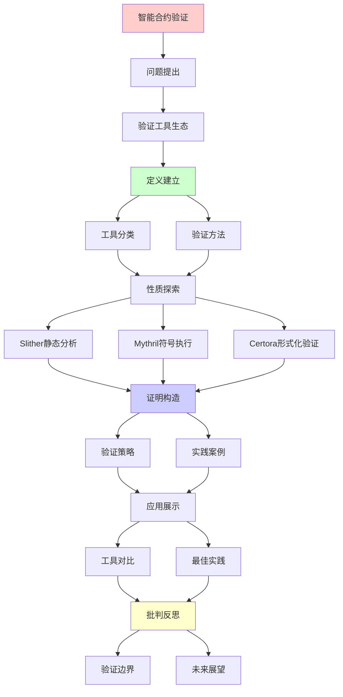
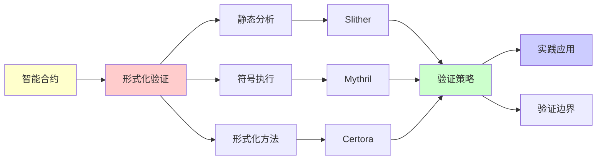

# 智能合约的形式化验证实践

> **主题**: 智能合约验证工具与实践
> **核心**: 形式化方法+静态分析+符号执行
> **重要性**: ⭐⭐⭐⭐⭐
> **创建日期**: 2025-12-02

---

## 1. 验证工具生态

### 工具分类图

```text
    智能合约验证工具
            |
    ┌───────┼───────┐
    |       |       |
  静态    符号    形式化
  分析    执行    验证
    |       |       |
    ↓       ↓       ↓
 Slither Mythril  Certora
 Solhint Manticore K框架
    |       |       |
   快✓    中等    慢⚠️
   浅     中等    深✓
```

---

## 2. Slither静态分析

```text
Slither (Trail of Bits):

检测漏洞:
✓ 重入攻击
✓ 整数溢出/下溢
✓ 未检查返回值
✓ 访问控制缺失
✓ 时间戳依赖

示例:
slither contract.sol

输出:
- 高危: 3个
- 中危: 5个
- 低危: 10个

复杂度: O(n) (AST遍历)
误报率: 中等 ⚠️

递归理论:
✓ 静态分析 ∈ 可判定 (特定模式)
✗ 但Rice定理: 无法完全
```

---

## 3. Mythril符号执行

```text
Mythril (ConsenSys):

原理:
1. 符号执行路径
2. SMT求解器
3. 查找反例

检测:
✓ 重入
✓ 整数问题
✓ 访问控制
✓ 未检查调用

复杂度: O(2^n) (路径爆炸)
实践: 超时机制 (5分钟)

案例:
mythril analyze contract.sol

→ 发现The DAO漏洞类型 ✓
```

---

## 4. Certora形式化验证

```text
Certora Prover:

方法: CVL (Certora Verification Language)

规范示例:
rule totalSupplyConsistent {
  uint256 before = totalSupply();
  method f; env e;
  calldataarg args;
  f(e, args);
  uint256 after = totalSupply();

  assert before <= after;
}

验证:
✓ 不变量保持
✓ 状态转移正确
✓ 全路径覆盖 (理论上)

成本:
⚠️ 商业工具 (昂贵)
⚠️ 需要专业知识
✓ 高价值合约值得

成功案例:
- Aave
- Compound
- MakerDAO
```

---

## 5. 验证策略矩阵

| 方法 | 成本 | 深度 | 误报 | 适用场景 |
|------|------|------|------|---------|
| **Slither** | 低 | 浅 | 中 | 所有合约 |
| **Mythril** | 中 | 中 | 中 | 中等复杂度 |
| **Certora** | 高 | 深✓ | 低✓ | 高价值DeFi |
| **手动审计** | 高 | 深✓ | 低✓ | 所有重要合约 |

**推荐流程**:

1. Slither (快速筛查)
2. Mythril (深度检测)
3. 手动审计 (人工review)
4. Certora (关键合约)
5. 漏洞悬赏 (持续)

---

## 6. 主题-子主题论证逻辑关系图

### 6.1 论证依赖关系



### 6.2 概念依赖关系



**论证逻辑链条**：

1. **问题提出** (1节)：
   - 验证工具生态

2. **定义建立** (1节)：
   - 工具分类和验证方法

3. **性质探索** (2-4节)：
   - Slither静态分析（2节）
   - Mythril符号执行（3节）
   - Certora形式化验证（4节）

4. **证明构造** (贯穿全文)：
   - 验证策略和实践案例

5. **应用展示** (5节)：
   - 验证策略矩阵

6. **批判反思** (贯穿全文)：
   - 验证边界和未来展望

---

## 7. 参考资源

### 7.1 经典论文

1. **Bhargavan, K., et al.** (2016). "Formal Verification of Smart Contracts: Short Paper"
   - _PLAS 2016_. Proceedings of the 2016 ACM Workshop on Programming Languages and Analysis for Security
   - 智能合约形式化验证早期工作

2. **Hirai, Y.** (2017). "Defining the Ethereum Virtual Machine for Interactive Theorem Provers"
   - _Financial Cryptography and Data Security 2017_
   - EVM形式化定义

3. **Permenev, A., et al.** (2020). "VerX: Safety Verification of Smart Contracts"
   - _2020 IEEE Symposium on Security and Privacy (SP)_
   - 智能合约安全验证

### 7.2 教材

1. **Clarke, E. M., Grumberg, O., & Peled, D.** (1999)
   - _Model Checking_
   - MIT Press. ISBN 978-0262032704
   - 模型检查基础

2. **Baier, C., & Katoen, J.-P.** (2008)
   - _Principles of Model Checking_
   - MIT Press. ISBN 978-0262026499
   - 模型检查原理

### 7.3 在线资源

1. **Slither Documentation**
   - https://github.com/crytic/slither
   - Slither静态分析工具

2. **Certora Verification**
   - https://www.certora.com/
   - Certora形式化验证平台

3. **Mythril Security**
   - https://mythril-classic.readthedocs.io/
   - Mythril符号执行工具

---

**最后更新**: 2025-12-04
**状态**: ✅ 已添加主题-子主题论证逻辑关系图和参考资源章节
**定位**: 实践指南
**工具**: Slither/Mythril/Certora/K框架
