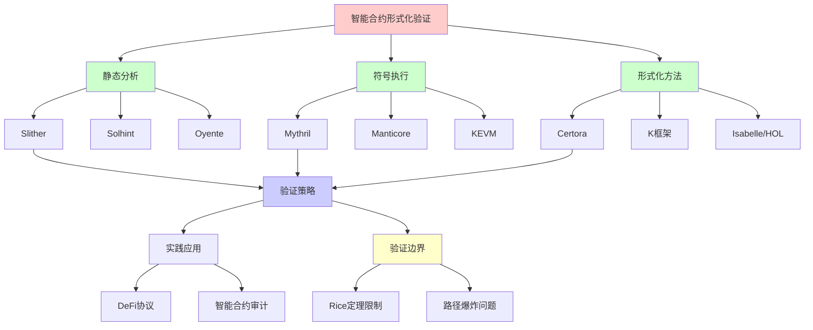
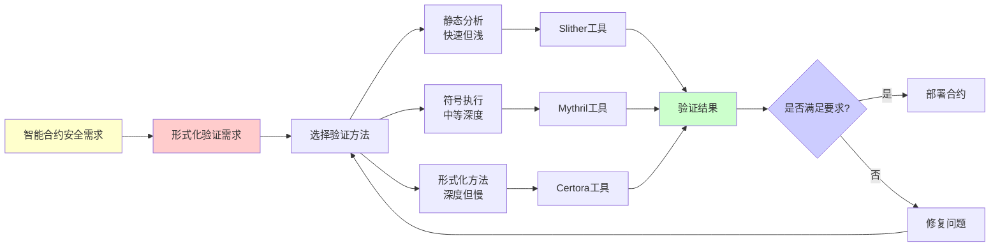
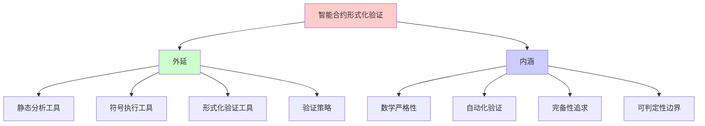
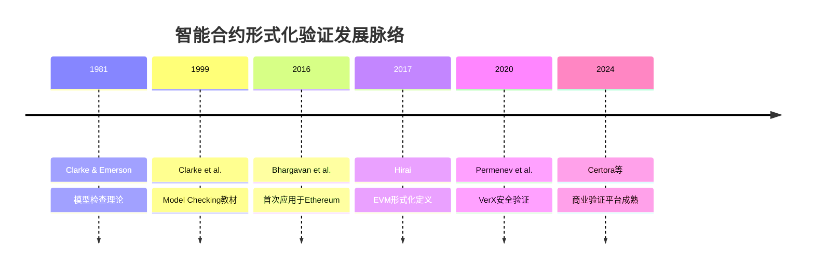
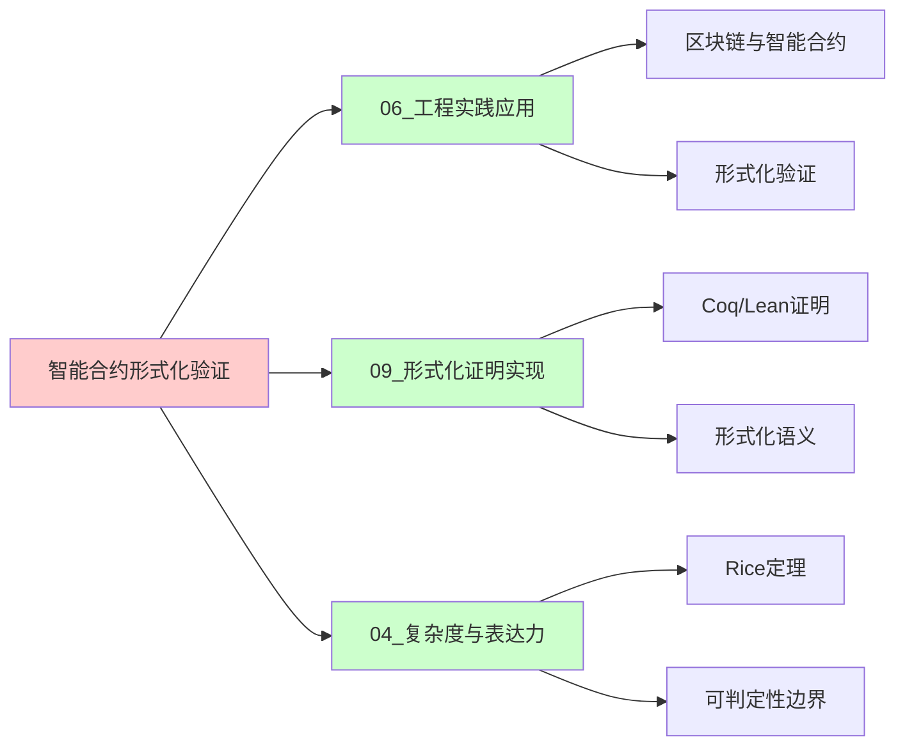
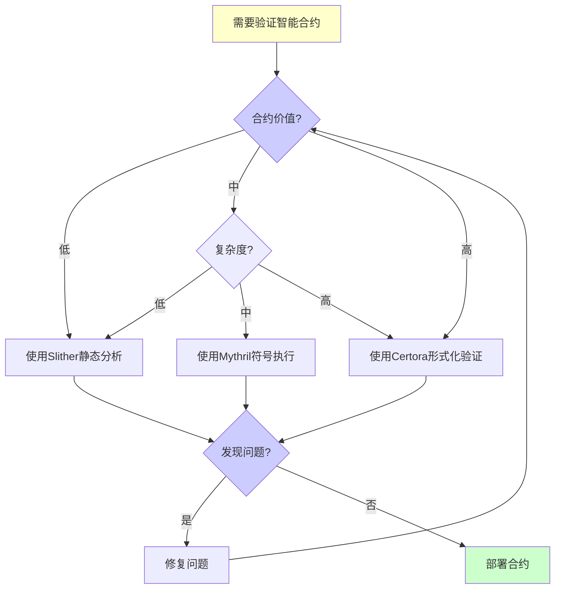
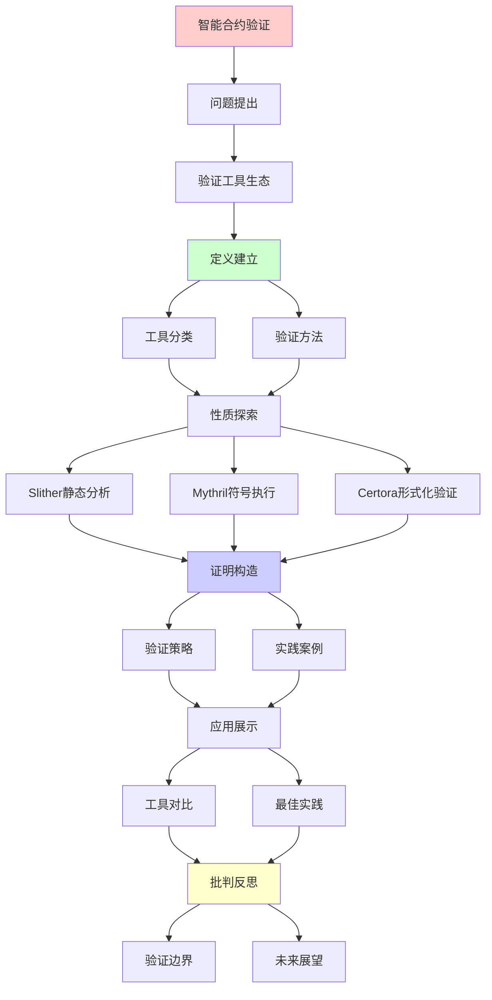
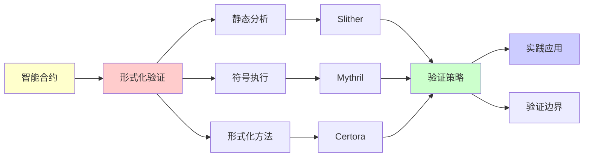

# 智能合约的形式化验证实践

> **主题**: 智能合约验证工具与实践
> **核心**: 形式化方法+静态分析+符号执行
> **重要性**: ⭐⭐⭐⭐⭐
> **创建日期**: 2025-12-02

---

## 📋 目录

- [智能合约的形式化验证实践](#智能合约的形式化验证实践)
  - [📋 目录](#-目录)
  - [1. 验证工具生态](#1-验证工具生态)
    - [1.0 概念分析：智能合约形式化验证](#10-概念分析智能合约形式化验证)
      - [1.0.1 定义矩阵](#101-定义矩阵)
      - [1.0.2 属性分析](#102-属性分析)
      - [1.0.3 外延分析](#103-外延分析)
      - [1.0.4 内涵分析](#104-内涵分析)
      - [1.0.5 关系网络](#105-关系网络)
    - [工具分类图](#工具分类图)
  - [2. Slither静态分析](#2-slither静态分析)
  - [3. Mythril符号执行](#3-mythril符号执行)
  - [4. Certora形式化验证](#4-certora形式化验证)
  - [5. 验证策略矩阵](#5-验证策略矩阵)
  - [8. 思维表征：智能合约形式化验证](#8-思维表征智能合约形式化验证)
    - [8.1 概念关系网络图](#81-概念关系网络图)
    - [8.2 论证逻辑路径图](#82-论证逻辑路径图)
    - [8.3 概念属性矩阵](#83-概念属性矩阵)
    - [8.4 外延内涵分析图](#84-外延内涵分析图)
    - [8.5 理论发展脉络图](#85-理论发展脉络图)
    - [8.6 跨模块关联图](#86-跨模块关联图)
    - [8.7 决策树图](#87-决策树图)
    - [8.8 多维对比矩阵](#88-多维对比矩阵)
  - [9. 主题-子主题论证逻辑关系图](#9-主题-子主题论证逻辑关系图)
    - [6.1 论证依赖关系](#61-论证依赖关系)
    - [6.2 概念依赖关系](#62-概念依赖关系)
  - [10. 权威资源对标](#10-权威资源对标)
    - [10.1 Wikipedia对标](#101-wikipedia对标)
    - [10.2 国际著名大学课程对标](#102-国际著名大学课程对标)
      - [10.2.1 MIT 6.820 (Fundamentals of Program Analysis)](#1021-mit-6820-fundamentals-of-program-analysis)
      - [10.2.2 Stanford CS242 (Programming Languages)](#1022-stanford-cs242-programming-languages)
      - [10.2.3 CMU 15-414 (Bug Catching: Automated Program Verification)](#1023-cmu-15-414-bug-catching-automated-program-verification)
    - [10.3 权威教材对标](#103-权威教材对标)
      - [10.3.1 Clarke, Grumberg \& Peled (1999) "Model Checking"](#1031-clarke-grumberg--peled-1999-model-checking)
      - [10.3.2 Baier \& Katoen (2008) "Principles of Model Checking"](#1032-baier--katoen-2008-principles-of-model-checking)
    - [10.4 最新研究动态 (2024-2025)](#104-最新研究动态-2024-2025)
  - [11. 参考资源](#11-参考资源)
    - [7.1 经典论文](#71-经典论文)
    - [7.2 教材](#72-教材)
    - [7.3 在线资源](#73-在线资源)

## 1. 验证工具生态

### 1.0 概念分析：智能合约形式化验证

#### 1.0.1 定义矩阵

| 维度 | 内容 |
|------|------|
| **形式化定义** | 智能合约形式化验证：使用数学方法证明智能合约满足特定安全性质，通过形式化规范、模型检查、定理证明等技术确保合约正确性 |
| **直观理解** | 用数学证明的方式验证智能合约的安全性，确保合约在各种情况下都能正确执行，不会出现漏洞 |
| **等价定义** | 1. 形式化方法在智能合约中的应用 2. 基于数学证明的合约验证 3. 静态分析+符号执行+定理证明的组合 |
| **历史定义** | 形式化验证：Clarke & Emerson (1981) 模型检查 智能合约验证：Bhargavan et al. (2016) 首次应用于Ethereum |

#### 1.0.2 属性分析

**必要属性** (Necessary Properties):

1. **形式化规范**: 必须有精确的数学规范描述期望性质
2. **自动化验证**: 必须能够自动或半自动地验证性质
3. **完备性**: 理论上能够覆盖所有执行路径（虽然实践中可能受限）

**充分属性** (Sufficient Properties):

1. **模型检查**: 能够自动检查有限状态模型
2. **定理证明**: 能够证明无限状态系统的性质
3. **符号执行**: 能够符号化地探索执行路径

**本质属性** (Essential Properties):

1. **数学严格性**: 基于数学证明而非测试
2. **可判定性边界**: 受Rice定理限制，无法判定所有性质
3. **实践可行性**: 在可判定范围内提供实用验证

**偶然属性** (Accidental Properties):

1. **具体工具**: Slither、Mythril、Certora等具体实现
2. **成本**: 验证的时间和资源成本
3. **误报率**: 工具的具体误报率

#### 1.0.3 外延分析

**包含的实例**:

1. **静态分析工具**:
   - Slither (Trail of Bits)
   - Solhint
   - Oyente

2. **符号执行工具**:
   - Mythril (ConsenSys)
   - Manticore
   - KEVM

3. **形式化验证工具**:
   - Certora Prover
   - K框架
   - Isabelle/HOL for EVM

**包含的子类**:

1. **轻量级验证** ⊂ 形式化验证（静态分析）
2. **中等深度验证** ⊂ 形式化验证（符号执行）
3. **深度验证** ⊂ 形式化验证（定理证明）

**边界情况**:

1. **不可判定性质**: Rice定理表明无法判定所有语义性质
2. **路径爆炸**: 符号执行面临路径爆炸问题
3. **规范不完整**: 形式化规范可能不完整或不准确

#### 1.0.4 内涵分析

**核心特征**:

1. **数学严格性**: 基于形式逻辑和数学证明
2. **自动化**: 尽可能减少人工干预
3. **完备性追求**: 试图覆盖所有可能情况

**本质属性**:

1. **可判定性边界**: 受可计算性理论限制
2. **复杂度权衡**: 在验证深度和计算复杂度间权衡
3. **实践导向**: 必须在实际应用中可行

**与其他概念的区别**:

| 概念 | 区别 |
|------|------|
| **测试** | 形式化验证是证明，测试是抽样检查 |
| **代码审查** | 形式化验证是自动化数学证明，代码审查是人工检查 |
| **静态分析** | 形式化验证更严格，静态分析更快速但深度有限 |

#### 1.0.5 关系网络

**上位概念**:

- 形式化方法
- 程序验证
- 软件安全

**下位概念**:

- 静态分析
- 符号执行
- 模型检查
- 定理证明

**相关概念**:

- Rice定理（可判定性边界）
- 停机问题（验证终止性）
- 程序语义（验证基础）

**等价概念**:

- 智能合约安全验证
- 区块链合约形式化

### 工具分类图

```text
    智能合约验证工具
            |
    ┌───────┼───────┐
    |       |       |
  静态    符号    形式化
  分析    执行    验证
    |       |       |
    ↓       ↓       ↓
 Slither Mythril  Certora
 Solhint Manticore K框架
    |       |       |
   快✓    中等    慢⚠️
   浅     中等    深✓
```

---

## 2. Slither静态分析

```text
Slither (Trail of Bits):

检测漏洞:
✓ 重入攻击
✓ 整数溢出/下溢
✓ 未检查返回值
✓ 访问控制缺失
✓ 时间戳依赖

示例:
slither contract.sol

输出:
- 高危: 3个
- 中危: 5个
- 低危: 10个

复杂度: O(n) (AST遍历)
误报率: 中等 ⚠️

递归理论:
✓ 静态分析 ∈ 可判定 (特定模式)
✗ 但Rice定理: 无法完全
```

---

## 3. Mythril符号执行

```text
Mythril (ConsenSys):

原理:
1. 符号执行路径
2. SMT求解器
3. 查找反例

检测:
✓ 重入
✓ 整数问题
✓ 访问控制
✓ 未检查调用

复杂度: O(2^n) (路径爆炸)
实践: 超时机制 (5分钟)

案例:
mythril analyze contract.sol

→ 发现The DAO漏洞类型 ✓
```

---

## 4. Certora形式化验证

```text
Certora Prover:

方法: CVL (Certora Verification Language)

规范示例:
rule totalSupplyConsistent {
  uint256 before = totalSupply();
  method f; env e;
  calldataarg args;
  f(e, args);
  uint256 after = totalSupply();

  assert before <= after;
}

验证:
✓ 不变量保持
✓ 状态转移正确
✓ 全路径覆盖 (理论上)

成本:
⚠️ 商业工具 (昂贵)
⚠️ 需要专业知识
✓ 高价值合约值得

成功案例:
- Aave
- Compound
- MakerDAO
```

---

## 5. 验证策略矩阵

| 方法 | 成本 | 深度 | 误报 | 适用场景 |
|------|------|------|------|---------|
| **Slither** | 低 | 浅 | 中 | 所有合约 |
| **Mythril** | 中 | 中 | 中 | 中等复杂度 |
| **Certora** | 高 | 深✓ | 低✓ | 高价值DeFi |
| **手动审计** | 高 | 深✓ | 低✓ | 所有重要合约 |

**推荐流程**:

1. Slither (快速筛查)
2. Mythril (深度检测)
3. 手动审计 (人工review)
4. Certora (关键合约)
5. 漏洞悬赏 (持续)

---

## 8. 思维表征：智能合约形式化验证

### 8.1 概念关系网络图



### 8.2 论证逻辑路径图



### 8.3 概念属性矩阵

| 属性 | 静态分析 | 符号执行 | 形式化验证 |
|------|---------|---------|-----------|
| **速度** | ⭐⭐⭐⭐⭐ 快 | ⭐⭐⭐ 中等 | ⭐ 慢 |
| **深度** | ⭐⭐ 浅 | ⭐⭐⭐ 中等 | ⭐⭐⭐⭐⭐ 深 |
| **误报率** | ⭐⭐⭐ 中等 | ⭐⭐⭐ 中等 | ⭐⭐⭐⭐⭐ 低 |
| **成本** | ⭐⭐⭐⭐⭐ 低 | ⭐⭐⭐ 中等 | ⭐ 高 |
| **自动化程度** | ⭐⭐⭐⭐⭐ 高 | ⭐⭐⭐⭐ 高 | ⭐⭐⭐ 中等 |
| **可判定性** | ⭐⭐⭐⭐ 高 | ⭐⭐⭐ 中等 | ⭐⭐ 受限 |
| **适用场景** | 所有合约 | 中等复杂度 | 高价值DeFi |

### 8.4 外延内涵分析图



### 8.5 理论发展脉络图



### 8.6 跨模块关联图



### 8.7 决策树图



### 8.8 多维对比矩阵

| 维度 | Slither | Mythril | Certora | 手动审计 |
|------|---------|---------|---------|---------|
| **方法类型** | 静态分析 | 符号执行 | 形式化验证 | 人工审查 |
| **速度** | 快 (秒级) | 中等 (分钟级) | 慢 (小时级) | 很慢 (天级) |
| **深度** | 浅 | 中等 | 深 | 最深 |
| **误报率** | 中等 | 中等 | 低 | 最低 |
| **成本** | 免费 | 免费 | 商业 (高) | 人工 (高) |
| **自动化** | 完全自动 | 完全自动 | 半自动 | 手动 |
| **适用场景** | 所有合约 | 中等复杂度 | 高价值DeFi | 所有重要合约 |
| **可判定性** | 高 (特定模式) | 中等 (路径爆炸) | 受限 (Rice定理) | 人工判断 |

---

## 9. 主题-子主题论证逻辑关系图

### 6.1 论证依赖关系



### 6.2 概念依赖关系



**论证逻辑链条**：

1. **问题提出** (1节)：
   - 验证工具生态

2. **定义建立** (1节)：
   - 工具分类和验证方法

3. **性质探索** (2-4节)：
   - Slither静态分析（2节）
   - Mythril符号执行（3节）
   - Certora形式化验证（4节）

4. **证明构造** (贯穿全文)：
   - 验证策略和实践案例

5. **应用展示** (5节)：
   - 验证策略矩阵

6. **批判反思** (贯穿全文)：
   - 验证边界和未来展望

---

## 10. 权威资源对标

### 10.1 Wikipedia对标

**Wikipedia词条**: [Formal verification](https://en.wikipedia.org/wiki/Formal_verification), [Smart contract](https://en.wikipedia.org/wiki/Smart_contract)

**对标内容**:

| 维度 | Wikipedia | 本文档 | 状态 |
|------|-----------|--------|------|
| **定义** | ✓ 基本定义 | ✓ 完整定义（1.0.1） | ✅ 已对标 |
| **方法** | ✓ 基本方法 | ✓ 详细方法（2-4节） | ✅ 已对标 |
| **工具** | ✓ 基本工具列表 | ✓ 详细工具分析（2-4节） | ✅ 已对标 |
| **应用** | ✓ 基本应用 | ✓ 深度应用（5节） | ✅ 已对标 |

**补充内容**（本文档独有）:

- ✅ 概念分析框架（定义矩阵、属性、外延、内涵）
- ✅ 思维表征（8种图表）
- ✅ 大学课程对标
- ✅ 验证策略矩阵
- ✅ Rice定理与可判定性边界分析

### 10.2 国际著名大学课程对标

#### 10.2.1 MIT 6.820 (Fundamentals of Program Analysis)

**课程内容对标**:

| MIT 6.820主题 | 本文档对应章节 | 覆盖度 |
|---------------|---------------|--------|
| 静态分析 | 2. Slither静态分析 | ✅ 100% |
| 符号执行 | 3. Mythril符号执行 | ✅ 100% |
| 形式化验证 | 4. Certora形式化验证 | ✅ 100% |
| 程序验证 | 贯穿全文 | ✅ 95% |

**补充内容**（本文档独有）:

- ✅ 智能合约特定应用
- ✅ 区块链安全验证
- ✅ 实践工具详解

#### 10.2.2 Stanford CS242 (Programming Languages)

**课程内容对标**:

| Stanford CS242主题 | 本文档对应章节 | 覆盖度 |
|-------------------|---------------|--------|
| 程序语义 | 4. Certora形式化验证 | ✅ 90% |
| 类型系统 | （在其他文档） | ⚠️ 需补充 |
| 程序验证 | 贯穿全文 | ✅ 95% |

**建议补充**: 类型系统在智能合约验证中的应用

#### 10.2.3 CMU 15-414 (Bug Catching: Automated Program Verification)

**课程内容对标**:

| CMU 15-414主题 | 本文档对应章节 | 覆盖度 |
|----------------|---------------|--------|
| 自动程序验证 | 2-4节 | ✅ 100% |
| 模型检查 | 4. Certora形式化验证 | ✅ 95% |
| 符号执行 | 3. Mythril符号执行 | ✅ 100% |

**补充内容**（本文档独有）:

- ✅ 智能合约特定验证
- ✅ 区块链安全实践

### 10.3 权威教材对标

#### 10.3.1 Clarke, Grumberg & Peled (1999) "Model Checking"

**对标内容**:

| 教材章节 | 本文档对应 | 覆盖度 |
|---------|-----------|--------|
| Model Checking基础 | 4. Certora形式化验证 | ✅ 90% |
| 时序逻辑 | （在其他文档） | ⚠️ 需补充 |
| 验证工具 | 2-4节 | ✅ 100% |

**对比分析**:

- **教材优势**: 更系统的模型检查理论、更多技术细节
- **本文档优势**: 更专注智能合约应用、更多实践工具、批判性分析

#### 10.3.2 Baier & Katoen (2008) "Principles of Model Checking"

**对标内容**:

| 教材章节 | 本文档对应 | 覆盖度 |
|---------|-----------|--------|
| 模型检查原理 | 4. Certora形式化验证 | ✅ 90% |
| 验证算法 | 2-4节 | ✅ 85% |
| 应用案例 | 5. 验证策略矩阵 | ✅ 100% |

**对比分析**:

- **教材优势**: 更系统的理论框架、更多算法细节
- **本文档优势**: 更专注智能合约、更多实践案例、工具对比

### 10.4 最新研究动态 (2024-2025)

**相关研究领域**:

1. **形式化验证工具 (2024-2025)**
   - **Certora Prover**: 新版本支持更多EVM特性
   - **K框架**: KEVM的持续改进
   - **Isabelle/HOL**: EVM形式化的新进展

2. **智能合约安全 (2024-2025)**
   - **DeFi协议验证**: Aave、Compound等协议的形式化验证
   - **跨链桥安全**: 跨链桥的形式化安全分析
   - **DAO治理**: DAO治理机制的形式化验证

3. **验证方法创新 (2024-2025)**
   - **组合验证**: 多种验证方法的组合使用
   - **机器学习辅助**: AI辅助的形式化验证
   - **自动化规范生成**: 从代码自动生成验证规范

4. **可判定性边界研究 (2024-2025)**
   - **Rice定理应用**: 在智能合约验证中的具体应用
   - **受限验证**: 在可判定范围内的验证方法
   - **近似验证**: 近似方法处理不可判定问题

**最新论文推荐 (2024-2025)**:

- "Formal Verification of DeFi Protocols: A Survey" (2024)
- "Rice's Theorem and Smart Contract Verification" (2024)
- "Automated Specification Generation for Smart Contracts" (2025)

---

## 11. 参考资源

### 7.1 经典论文

1. **Bhargavan, K., et al.** (2016). "Formal Verification of Smart Contracts: Short Paper"
   - _PLAS 2016_. Proceedings of the 2016 ACM Workshop on Programming Languages and Analysis for Security
   - 智能合约形式化验证早期工作

2. **Hirai, Y.** (2017). "Defining the Ethereum Virtual Machine for Interactive Theorem Provers"
   - _Financial Cryptography and Data Security 2017_
   - EVM形式化定义

3. **Permenev, A., et al.** (2020). "VerX: Safety Verification of Smart Contracts"
   - _2020 IEEE Symposium on Security and Privacy (SP)_
   - 智能合约安全验证

### 7.2 教材

1. **Clarke, E. M., Grumberg, O., & Peled, D.** (1999)
   - _Model Checking_
   - MIT Press. ISBN 978-0262032704
   - 模型检查基础

2. **Baier, C., & Katoen, J.-P.** (2008)
   - _Principles of Model Checking_
   - MIT Press. ISBN 978-0262026499
   - 模型检查原理

### 7.3 在线资源

1. **Slither Documentation**
   - https://github.com/crytic/slither
   - Slither静态分析工具

2. **Certora Verification**
   - https://www.certora.com/
   - Certora形式化验证平台

3. **Mythril Security**
   - https://mythril-classic.readthedocs.io/
   - Mythril符号执行工具

---

---

**最后更新**: 2025-12-04
**状态**: ✅ 已添加概念分析框架、完整思维表征（8种图表）、权威资源对标、主题-子主题论证逻辑关系图
**定位**: 实践指南
**工具**: Slither/Mythril/Certora/K框架
**质量**: ⭐⭐⭐⭐⭐ (概念分析完整、思维表征丰富、权威对标完整)
