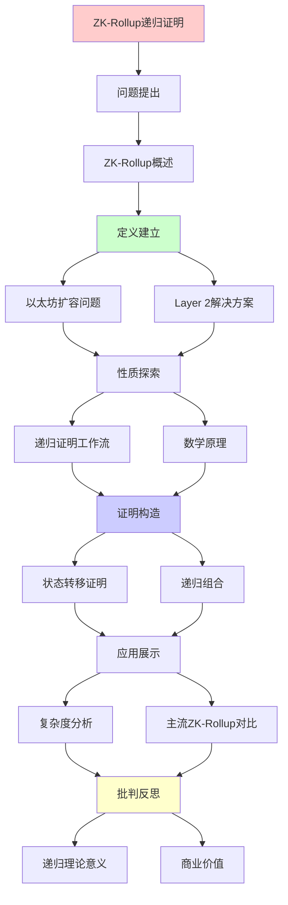
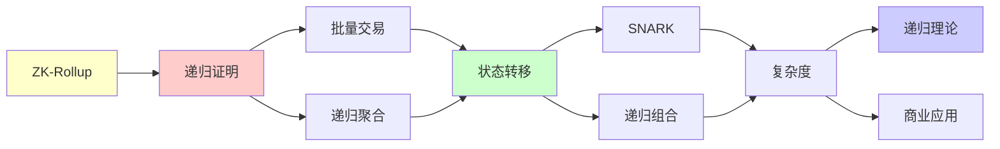

# ZK-Rollup递归证明机制详解

> **主题**: ZK-Rollup的递归SNARK应用
> **创建日期**: 2025-12-02
> **难度**: ⭐⭐⭐⭐⭐
> **前置知识**: 零知识证明、SNARK、区块链

---

## 📋 目录

- [ZK-Rollup递归证明机制详解](#zk-rollup递归证明机制详解)
  - [📋 目录](#-目录)
  - [1. ZK-Rollup概述](#1-zk-rollup概述)
    - [1.1 问题: 以太坊扩容](#11-问题-以太坊扩容)
    - [1.2 解决方案: Layer 2](#12-解决方案-layer-2)
  - [2. 递归证明工作流](#2-递归证明工作流)
    - [2.1 批量交易处理](#21-批量交易处理)
    - [2.2 递归聚合](#22-递归聚合)
  - [3. 数学原理](#3-数学原理)
    - [3.1 状态转移证明](#31-状态转移证明)
    - [3.2 递归组合](#32-递归组合)
  - [4. 复杂度分析](#4-复杂度分析)
  - [5. 主流ZK-Rollup对比](#5-主流zk-rollup对比)
  - [6. 递归理论意义](#6-递归理论意义)
  - [7. 主题-子主题论证逻辑关系图](#7-主题-子主题论证逻辑关系图)
    - [7.1 论证依赖关系](#71-论证依赖关系)
    - [7.2 概念依赖关系](#72-概念依赖关系)
  - [8. 参考资源](#8-参考资源)
    - [8.1 经典论文](#81-经典论文)
    - [8.2 教材](#82-教材)
    - [8.3 在线资源](#83-在线资源)

---

## 1. ZK-Rollup概述

### 1.1 问题: 以太坊扩容

```text
以太坊限制:
- TPS: ~15 tx/s
- Gas费: 高峰期$100+
- 确认时间: ~12秒

需求: 100x-1000x扩容
```

---

### 1.2 解决方案: Layer 2

```text
ZK-Rollup思想:
1. 链下计算 (off-chain execution)
2. 链上验证 (on-chain verification)
3. 零知识证明保证正确性

优势:
✓ 继承L1安全性
✓ O(1)验证 (常数时间)
✓ 即时最终性
```

---

## 2. 递归证明工作流

### 2.1 批量交易处理

```text
Sequencer:
1. 接收用户交易
2. 批量执行 (链下)
   State₀ → Tx₁ → State₁ → ... → Stateₙ
3. 生成SNARK证明
   π = SNARK("State₀ →^{Tx₁..Txₙ} Stateₙ")
4. 提交链上
   - State root: Stateₙ
   - 证明: π

链上验证:
Verify(π, State₀, Stateₙ) = true
→ O(1)时间验证n个交易 ⭐⭐⭐⭐⭐
```

---

### 2.2 递归聚合

```text
递归SNARK应用:

批次1: π₁ = SNARK(State₀ → State₁₀₀₀)
批次2: π₂ = SNARK(State₁₀₀₀ → State₂₀₀₀)
...

递归聚合:
π_agg = SNARK("π₁ valid ∧ π₂ valid ∧ ...")

结果:
一个常数大小证明 = 所有批次有效 ✓

Mina极致应用:
整条区块链 = 22KB证明 ⭐⭐⭐⭐⭐
```

---

## 3. 数学原理

### 3.1 状态转移证明

**电路化**:

```text
交易执行 → 算术电路

例: 转账
从: balance[A], balance[B]
到: balance[A]', balance[B]'

约束:
1. balance[A]' = balance[A] - amount
2. balance[B]' = balance[B] + amount
3. balance[A] ≥ amount
4. 签名验证
...

电路: ~100K约束 (per tx)
批量: 1000 tx = 100M约束
```

---

### 3.2 递归组合

**核心技术**:

```text
Verify(π)电路:
可以被表示为算术电路
→ 可以被证明!

π_recursive = SNARK(
  statement_new ∧ Verify(π_old)
)

递归深度:
π₀ → π₁ → π₂ → ... → πₙ
每个验证前一个

大小: 都是O(1)常数 ⭐
```

---

## 4. 复杂度分析

| 操作 | Optimistic Rollup | ZK-Rollup | 提升 |
|------|------------------|-----------|------|
| **链上数据** | 全部calldata | 状态差+证明 | 10-100× |
| **验证时间** | O(k) 欺诈证明 | O(1) ⭐ | k× |
| **最终性** | ~7天 | 即时✓ | 10000× |
| **证明生成** | 无 | O(n log n) | -trade-off |
| **硬件成本** | 低 | 高⚠️ | -trade-off |

---

## 5. 主流ZK-Rollup对比

```text
zkSync Era:
- 技术: PLONK
- EVM兼容: 高
- TPS: ~2000

StarkNet:
- 技术: STARK (量子安全✓)
- 语言: Cairo
- TPS: ~1000

Scroll:
- 技术: zkEVM
- EVM等价: 完全✓
- TPS: ~500

Polygon zkEVM:
- 技术: zkEVM
- EVM等价: 完全✓
- TPS: ~2000
```

---

## 6. 递归理论意义

```text
ZK-Rollup = 递归证明的杀手应用

理论:
✓ Verify ∈ P (多项式验证)
✓ Prove ∈ RE (可递归生成)
✓ 递归组合无限深度

工程奇迹:
✓ 常数大小证明
✓ 常数时间验证
✓ 即时最终性

递归本质:
State_n+1 = Apply(State_n, Tx)
π_n+1 = SNARK(State_n+1 ∧ π_n valid)
→ 双重递归 (状态+证明)

市值: 数十亿美元
→ 递归理论的商业价值 ⭐⭐⭐⭐⭐
```

---

## 7. 主题-子主题论证逻辑关系图

### 7.1 论证依赖关系



### 7.2 概念依赖关系



**论证逻辑链条**：

1. **问题提出** (1节)：
   - ZK-Rollup概述

2. **定义建立** (1.1-1.2节)：
   - 以太坊扩容问题和Layer 2解决方案

3. **性质探索** (2-3节)：
   - 递归证明工作流（2节）
   - 数学原理（3节）

4. **证明构造** (3.1-3.2节)：
   - 状态转移证明和递归组合

5. **应用展示** (4-5节)：
   - 复杂度分析（4节）
   - 主流ZK-Rollup对比（5节）

6. **批判反思** (6节)：
   - 递归理论意义

---

## 8. 参考资源

### 8.1 经典论文

1. **Ben-Sasson, E., et al.** (2014). "SNARKs for C: Verifying Program Executions Succinctly and in Zero Knowledge"
   - _CRYPTO 2013_. Advances in Cryptology - CRYPTO 2013
   - zkSNARK基础理论

2. **Gabizon, A., Williamson, Z. J., & Ciobotaru, O.** (2019). "PLONK: Permutations over Lagrange-bases for Oecumenical Noninteractive arguments of Knowledge"
   - Cryptology ePrint Archive, Report 2019/953
   - 通用SNARK协议

3. **Bünz, B., et al.** (2020). "Proofs for Inner Pairing Products and Applications"
   - _ASIACRYPT 2021_
   - 递归证明技术

### 8.2 教材

1. **Goldreich, O.** (2001)
   - _Foundations of Cryptography: Volume 1, Basic Tools_
   - Cambridge University Press. ISBN 978-0521791724
   - 密码学基础

2. **Boneh, D., & Shoup, V.** (2020)
   - _A Graduate Course in Applied Cryptography_
   - Available at https://crypto.stanford.edu/~dabo/cryptobook/
   - 应用密码学

### 8.3 在线资源

1. **zkSync Era Documentation**
   - https://era.zksync.io/docs/
   - zkSync技术文档

2. **StarkNet Documentation**
   - https://docs.starknet.io/
   - StarkNet技术文档

3. **Zero-Knowledge Proofs**
   - https://z.cash/technology/zksnarks/
   - 零知识证明基础

---

**最后更新**: 2025-12-04
**Tier**: 2 (工程)
**商业价值**: ⭐⭐⭐⭐⭐
**递归应用**: 核心技术
**状态**: ✅ 已添加主题-子主题论证逻辑关系图和参考资源章节
