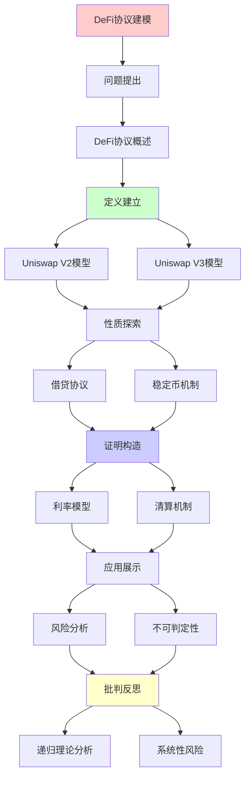
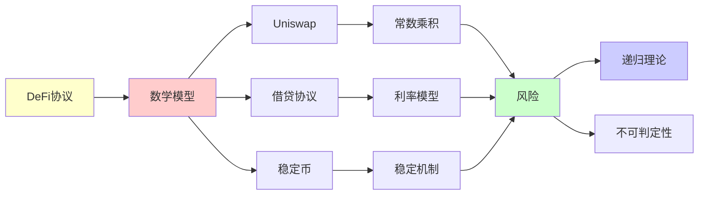

# DeFi协议的数学建模

> **主题**: DeFi协议的形式化数学模型
> **创建日期**: 2025-12-02
> **难度**: ⭐⭐⭐⭐
> **前置知识**: 区块链、经济学、博弈论

---

## 📋 目录

- [DeFi协议的数学建模](#defi协议的数学建模)
  - [📋 目录](#-目录)
  - [1. Uniswap V2 数学模型](#1-uniswap-v2-数学模型)
    - [1.1 常数乘积公式](#11-常数乘积公式)
    - [1.2 价格发现机制](#12-价格发现机制)
    - [1.3 滑点分析](#13-滑点分析)
  - [2. Uniswap V3 集中流动性](#2-uniswap-v3-集中流动性)
    - [2.1 数学模型](#21-数学模型)
    - [2.2 资本效率](#22-资本效率)
  - [3. 借贷协议 (Aave/Compound)](#3-借贷协议-aavecompound)
    - [3.1 利率模型](#31-利率模型)
    - [3.2 清算机制](#32-清算机制)
  - [4. 稳定币机制](#4-稳定币机制)
    - [4.1 抵押型 (DAI)](#41-抵押型-dai)
    - [4.2 算法型 (Terra案例)](#42-算法型-terra案例)
  - [5. 风险与不可判定性](#5-风险与不可判定性)
    - [5.1 组合性风险](#51-组合性风险)
    - [5.2 系统性风险](#52-系统性风险)
  - [6. 递归理论分析](#6-递归理论分析)
  - [7. 主题-子主题论证逻辑关系图](#7-主题-子主题论证逻辑关系图)
    - [7.1 论证依赖关系](#71-论证依赖关系)
    - [7.2 概念依赖关系](#72-概念依赖关系)
  - [8. 参考资源](#8-参考资源)
    - [8.1 经典论文](#81-经典论文)
    - [8.2 教材](#82-教材)
    - [8.3 在线资源](#83-在线资源)

---

## 1. Uniswap V2 数学模型

### 1.1 常数乘积公式

**核心不变量**:

```text
x · y = k (常数)

其中:
- x: Token X储备量
- y: Token Y储备量
- k: 常数

交易 Δx → Δy:
(x + Δx)(y - Δy) = k
→ Δy = y - k/(x+Δx)
     = y·Δx/(x+Δx)

形式化 (Coq):
Record Pool : Type := {
  reserve_x : nat;
  reserve_y : nat;
  invariant : reserve_x * reserve_y = k
}.

Definition swap (p : Pool) (dx : nat) : Pool * nat :=
  let dy := (p.reserve_y * dx) / (p.reserve_x + dx) in
  ({| reserve_x := p.reserve_x + dx;
      reserve_y := p.reserve_y - dy |}, dy).
```

---

### 1.2 价格发现机制

**边际价格**:

```text
Price = dy/dx = y/x (小额交易)

价格定理:
Theorem price_positive:
  ∀p dx, dx > 0 →
    Price_after(swap p dx) > Price_before(p).

证明:
Price = y/x
After: Price' = (y-Δy)/(x+Δx)
→ Price' = y/(x+Δx+y·Δx/x)
→ Price' > Price ✓

含义: 大额交易推高价格
→ 自动做市 ✓
```

---

### 1.3 滑点分析

**滑点公式**:

```text
理想价格: P = y/x
实际价格: P' = Δy/Δx
滑点: Slippage = (P' - P)/P

计算:
Slippage = Δx/(2x + Δx)

例子:
x=1000, Δx=100
Slippage = 100/2100 ≈ 4.76%

→ 交易量越大，滑点越高 ⚠️
```

---

## 2. Uniswap V3 集中流动性

### 2.1 数学模型

**价格区间流动性**:

```text
Position = (P_low, P_high, L)

Active_L(P) = Σ {L | P_low ≤ P ≤ P_high}

虚拟储备:
x_virtual = L/√P
y_virtual = L·√P

交易仍遵循:
x_virtual · y_virtual = L² (局部恒定)

复杂度:
状态空间: O(n) positions
计算: O(log n) (排序区间)
→ 比V2复杂 ⚠️
```

---

### 2.2 资本效率

**效率提升**:

```text
V2: 流动性分散在[0, ∞]
V3: 流动性集中在[P_low, P_high]

例子:
V2: 100万均匀分布
V3: 100万集中在[0.95, 1.05]
→ 有效流动性 ~10× ⭐

trade-off:
✓ 资本效率高
✗ 价格出界→无流动性
⚠️ LP需要主动管理
```

---

## 3. 借贷协议 (Aave/Compound)

### 3.1 利率模型

**利用率模型**:

```text
Utilization = Borrowed / (Borrowed + Available)

Borrow Rate = Base + U · Slope
            = f(U)

Supply Rate = Borrow Rate · U · (1 - Reserve%)

递归平衡:
高利率 → 还款增加 → U下降 → 利率降低
→ 动态平衡 (不动点)

不动点:
U* = Optimal_Utilization (~80%)
```

---

### 3.2 清算机制

**健康因子**:

```text
Health Factor = Collateral·LTV / Debt

HF < 1 → 可清算 ⚠️

清算:
Liquidator:
1. 偿还部分债务
2. 获得抵押品 (有折扣)

清算递归:
HF < 1 → 清算 → HF上升 → 重复
→ 直到HF > 1 或债务清零

风险:
⚠️ 预言机操纵 (闪电贷攻击)
⚠️ 级联清算 (2020年3·12)
```

---

## 4. 稳定币机制

### 4.1 抵押型 (DAI)

**MakerDAO模型**:

```text
抵押率: 150%
1 DAI需要$1.5 ETH抵押

稳定机制:
Price > $1: 铸造激励
Price < $1: 回购/清算

递归稳定:
Price ← → Supply ← → Collateral
→ 负反馈循环 ✓
```

---

### 4.2 算法型 (Terra案例)

**死亡螺旋**:

```text
Terra (2022崩溃):
UST ← → LUNA (算法稳定)

机制:
$1 UST ⟺ $1 LUNA
可互换

崩溃递归:
UST脱锚($0.9)
→ 套利者: UST→LUNA
→ LUNA抛压
→ LUNA下跌
→ 需更多LUNA稳定
→ LUNA进一步下跌
→ UST更脱锚
→ 死亡螺旋 ⚠️⚠️⚠️

递归理论:
✗ 正反馈循环
✗ 不稳定不动点
✗ 系统崩溃
→ 算法稳定币根本缺陷
```

---

## 5. 风险与不可判定性

### 5.1 组合性风险

**DeFi乐高**:

```text
协议堆叠:
Lend (Aave)
  ↓ 抵押
Swap (Uniswap)
  ↓ LP代币
Farm (Convex)
  ↓ 收益
再抵押...

递归依赖:
A依赖B, B依赖C, C依赖A
→ 循环风险 ⚠️

不可判定:
✗ 全局风险不可计算
✗ 组合效应指数复杂
→ Rice定理 ✗
```

---

### 5.2 系统性风险

**案例**: 2020年3·12

```text
ETH暴跌 → MakerDAO清算
→ 拥堵 → Gas费暴涨
→ 清算失败 → 坏账
→ DAI脱锚

递归崩溃:
风险传播图:
Price crash → Liquidation → Congestion
     → Failed liquidation → Bad debt
     → Depegging → More panic
     → Price crash (循环)

教训:
⚠️ 单点故障 (预言机)
⚠️ 拥塞脆弱性
⚠️ 递归性崩溃
```

---

## 6. 递归理论分析

```text
DeFi协议 ∈ RE?

答案: ✓是的

证明:
- AMM公式可递归计算
- 利率模型可递归
- 清算逻辑可递归
→ DeFi ∈ RE ✓

但:
✗ 组合安全性不可判定
✗ Nash均衡难计算 (PPAD-完全)
✗ 黑天鹅事件不可预测

实践:
✓ 单个协议可形式化
✗ 组合系统难验证
✓ 压力测试+审计
✗ 完全保证不可能

递归性质:
✓ 协议递归定义
✓ 不动点求解 (利率/价格)
✗ 全局稳定性不保证
→ DeFi = 复杂递归系统 ⚠️
```

---

## 7. 主题-子主题论证逻辑关系图

### 7.1 论证依赖关系



### 7.2 概念依赖关系



**论证逻辑链条**：

1. **问题提出** (1节)：
   - Uniswap V2数学模型

2. **定义建立** (1.1-1.3节)：
   - 常数乘积公式、价格发现机制、滑点分析

3. **性质探索** (2-4节)：
   - Uniswap V3集中流动性（2节）
   - 借贷协议（3节）
   - 稳定币机制（4节）

4. **证明构造** (贯穿全文)：
   - 各种数学模型的推导

5. **应用展示** (5节)：
   - 风险与不可判定性

6. **批判反思** (6节)：
   - 递归理论分析

---

## 8. 参考资源

### 8.1 经典论文

1. **Adams, H., et al.** (2021). "Uniswap v3 Core"
   - Whitepaper. https://uniswap.org/whitepaper-v3.pdf
   - Uniswap V3技术文档

2. **Gudgeon, L., et al.** (2020). "DeFi Protocols for Loanable Funds: Interest Rates, Liquidity and Market Efficiency"
   - _Financial Cryptography and Data Security 2020_
   - 借贷协议分析

3. **Klages-Mundt, A., & Minca, A.** (2021). "While Stability Lasts: A Stochastic Model of Stablecoins"
   - arXiv:2101.12332
   - 稳定币风险分析

### 8.2 教材

1. **Mas-Colell, A., Whinston, M. D., & Green, J. R.** (1995)
   - _Microeconomic Theory_
   - Oxford University Press. ISBN 978-0195073409
   - 微观经济学理论

2. **Osborne, M. J., & Rubinstein, A.** (1994)
   - _A Course in Game Theory_
   - MIT Press. ISBN 978-0262650403
   - 博弈论基础

### 8.3 在线资源

1. **Uniswap Documentation**
   - https://docs.uniswap.org/
   - Uniswap协议文档

2. **Aave Documentation**
   - https://docs.aave.com/
   - Aave借贷协议文档

3. **DeFi Pulse**
   - https://defipulse.com/
   - DeFi协议数据和分析

---

**最后更新**: 2025-12-04
**Tier**: 2-3 (科学+经济)
**风险**: ⚠️⚠️⚠️ (系统性风险)
**可验证性**: 部分 ⚠️
**状态**: ✅ 已添加主题-子主题论证逻辑关系图和参考资源章节
