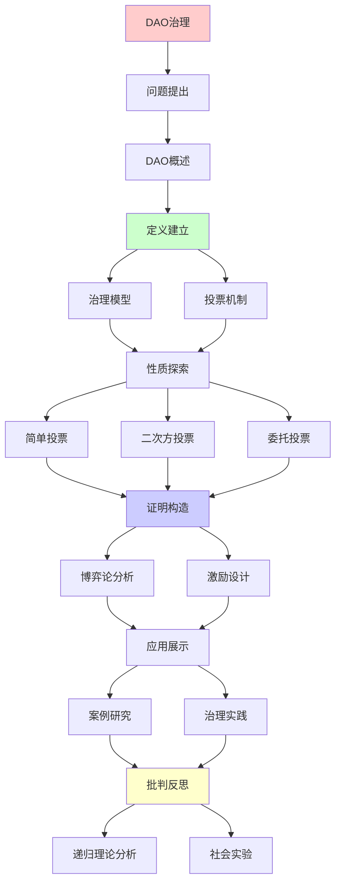
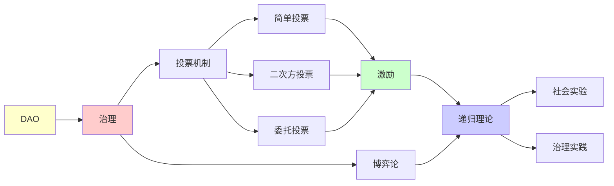

# DAO治理的博弈论分析

> **主题**: 去中心化自治组织的机制设计
> **创建日期**: 2025-12-02
> **难度**: ⭐⭐⭐⭐⭐
> **前置知识**: 区块链、博弈论、机制设计

---

## 📋 目录

- [DAO治理的博弈论分析](#dao治理的博弈论分析)
  - [📋 目录](#-目录)
  - [1. DAO基础](#1-dao基础)
    - [1.1 DAO定义](#11-dao定义)
    - [1.2 治理流程](#12-治理流程)
  - [2. 投票机制](#2-投票机制)
    - [2.1 代币投票](#21-代币投票)
    - [2.2 二次方投票](#22-二次方投票)
  - [3. 博弈论分析](#3-博弈论分析)
    - [3.1 理性投票](#31-理性投票)
    - [3.2 女巫攻击](#32-女巫攻击)
  - [4. 机制设计](#4-机制设计)
    - [4.1 激励相容](#41-激励相容)
    - [4.2 VCG机制](#42-vcg机制)
  - [5. 历史案例](#5-历史案例)
    - [5.1 The DAO攻击](#51-the-dao攻击)
    - [5.2 MakerDAO治理](#52-makerdao治理)
  - [6. 递归理论分析](#6-递归理论分析)
  - [7. 主题-子主题论证逻辑关系图](#7-主题-子主题论证逻辑关系图)
    - [7.1 论证依赖关系](#71-论证依赖关系)
    - [7.2 概念依赖关系](#72-概念依赖关系)
  - [8. 参考资源](#8-参考资源)
    - [8.1 经典论文](#81-经典论文)
    - [8.2 教材](#82-教材)
    - [8.3 在线资源](#83-在线资源)

---

## 1. DAO基础

### 1.1 DAO定义

**去中心化自治组织**:

```text
定义特征:
✓ 规则编码在智能合约
✓ 决策通过投票
✓ 无中心权威
✓ 透明执行

vs 传统组织:
传统: 董事会 → CEO → 执行
DAO: 提案 → 投票 → 自动执行 ⭐

例子:
- MakerDAO (DeFi治理)
- Uniswap DAO (协议参数)
- ConstitutionDAO (众筹)

递归性质:
✓ 提案递归提交
✓ 投票递归累积
✓ 执行递归触发
```

---

### 1.2 治理流程

**典型流程**:

```text
1. 提案 (Proposal):
   成员提交提案
   需要一定代币门槛

2. 讨论 (Discussion):
   社区论坛/Discord
   修改完善

3. 投票 (Voting):
   链上投票
   持续3-7天

4. 执行 (Execution):
   通过 → 时间锁 → 自动执行
   否决 → 归档

时间锁:
投票通过 → 等待48小时 → 执行
→ 紧急退出窗口 ✓

递归:
✓ 治理过程递归迭代
✓ 规则递归更新
✓ 组织递归演化
```

---

## 2. 投票机制

### 2.1 代币投票

**一币一票**:

```text
标准模型:
投票权 = 持有代币数

优势:
✓ 简单
✓ 激励对齐 (利益相关)
✓ 抗女巫 (代币成本)

问题:

1. 鲸鱼控制:
   大户支配投票
   → 中心化风险 ⚠️⚠️

2. 短期主义:
   借入代币投票
   → 无长期激励 ⚠️

3. 低参与率:
   通常<10% ⚠️
   → 代表性不足

博弈分析:
Nash均衡: 不投票 (free-rider)
→ 理性冷漠 ⚠️
```

---

### 2.2 二次方投票

**Quadratic Voting**:

```text
Weyl & Posner提出:

成本:
购买n票 → 成本n² ⭐

例子:
1票: 1代币
2票: 4代币
3票: 9代币

优势:
✓ 偏好强度加权
✓ 激励表达真实偏好
✓ 减少鲸鱼优势

实现:
Gitcoin Grants: 二次方funding
→ 公共物品资助 ✓

问题:
⚠️ 女巫攻击 (分散身份)
⚠️ 串通
→ 需要身份系统 ⚠️

递归理论:
✓ 投票可递归累积
✓ 成本递归计算
```

---

## 3. 博弈论分析

### 3.1 理性投票

**投票博弈**:

```text
收益:
提案通过收益: V
投票成本: c (Gas费)

策略:
if V·P(pivotal) > c:
  投票 ✓
else:
  不投票 ✗

P(pivotal) = 决定性概率
大型DAO: P ≈ 0
→ 不投票理性 ⚠️

结果:
理性 → 低参与率
→ 公共选择困境 ⚠️

解决:
✓ 委托投票
✓ 投票奖励
✓ 二次方机制
→ 激励设计 ⭐
```

---

### 3.2 女巫攻击

**身份攻击**:

```text
攻击:
创建多个身份
绕过"一人一票" ✗

区块链环境:
创建地址成本: ~0
→ 女巫攻击易 ⚠️⚠️

防御:

1. 代币投票:
   成本 = 代币价格
   → 经济防御 ✓

2. 身份验证:
   - Proof of Humanity
   - BrightID
   → 但隐私权衡 ⚠️

3. 声誉系统:
   历史贡献加权
   → 累积成本 ✓

博弈:
女巫成本 vs 收益
→ 机制设计关键 ⭐

递归:
✓ 身份递归验证
✓ 声誉递归累积
```

---

## 4. 机制设计

### 4.1 激励相容

**机制设计理论**:

```text
目标:
设计规则使得
理性策略 = 诚实报告偏好 ⭐

形式化:
u_i(真实, 他人真实) ≥ u_i(撒谎, 他人真实)
→ 激励相容 (IC) ✓

DAO应用:
投票机制设计
使诚实投票最优 ✓

挑战:
Arrow不可能定理:
无完美投票系统 ✗
→ 权衡必然 ⚠️

递归:
✓ 机制递归优化
✓ 策略递归适应
```

---

### 4.2 VCG机制

**Vickrey-Clarke-Groves**:

```text
机制:
参与者报告价值vᵢ
分配最优解
支付 = 外部性

性质:
✓ 激励相容 (真实报告)
✓ 社会福利最优
✓ 个体理性

DAO应用困难:
⚠️ 需要可信第三方 (计算支付)
⚠️ 区块链无TTP
⚠️ 预算平衡难

近似:
二次方funding
→ VCG近似 ✓

递归理论:
✓ VCG可递归计算
⚠️ 但需要完整信息
```

---

## 5. 历史案例

### 5.1 The DAO攻击

**2016重大事件**:

```text
The DAO:
众筹: $150M (当时最大)
目标: 投资基金DAO

漏洞:
重入攻击 (Reentrancy)
递归调用提款
→ $60M被盗 ⚠️⚠️⚠️

代码:
function withdraw() {
  uint amount = balance[msg.sender];
  msg.sender.call.value(amount)();  // 外部调用
  balance[msg.sender] = 0;  // 更新延迟 ✗
}

攻击:
递归调用withdraw
balance更新前反复提款
→ 耗尽合约 ✗

后果:
以太坊硬分叉 (有争议)
→ ETH vs ETC ⚠️

递归风险:
✓ 递归调用本身
✗ 但实现错误
→ 递归的双刃剑 ⚠️
```

---

### 5.2 MakerDAO治理

**成功案例**:

```text
MakerDAO:
治理$80亿+ DAI
稳定币系统参数

治理内容:
- 稳定费率
- 抵押率
- 清算参数
- 新抵押品

投票机制:
MKR代币投票
执行投票 (Executive Vote)
门槛: >50% 参与

成功因素:
✓ 利益对齐 (MKR风险)
✓ 专业参与 (风险团队)
✓ 谨慎决策
→ 运行7年 ✓ (2017-2024)

挑战:
⚠️ 中心化风险 (大户)
⚠️ 低参与率 (~5%)
⚠️ 紧急响应慢
→ 持续改进 ⚠️

递归:
✓ 参数递归调整
✓ 风险递归评估
✓ 治理递归优化
```

---

## 6. 递归理论分析

```text
DAO治理 ∈ RE?

答案: ✓是的

证明:
- 投票可递归计算
- 提案可递归执行
- 治理可递归迭代
→ DAO ∈ RE ✓

复杂度:
投票统计: O(n) (n=投票者)
提案验证: O(|code|)
执行: 智能合约复杂度
→ 多项式可行 ✓

博弈论:
✓ Nash均衡可计算 (有限博弈)
✗ 一般博弈 = PPAD-完全
⚠️ 预测行为困难

机制设计:
✓ IC机制可设计
✗ Arrow不可能定理限制
⚠️ 完美治理不存在

递归性质:
✓ 提案递归提交
✓ 投票递归累积
✓ 治理递归演化
✓ 规则递归修改 (元治理) ⭐

vs 传统治理:
传统: 人治
DAO: 算法治理 ✓
→ 代码即法律 ⭐

理论vs实践:
理论: 完美去中心化
实践:
- 鲸鱼控制 ⚠️
- 低参与率 ⚠️
- 紧急应对难 ⚠️
→ 工程挑战大

2024现状:
✓ 数千个DAO
✓ 数百亿美元管理
⚠️ 治理质量参差
✗ 最佳实践未定
→ 持续实验 ⚠️

未来:
AI辅助治理:
- 提案质量评估
- 风险预测
- 参数优化
→ 人机混合治理 ⭐

递归范式:
✓ DAO = 递归自治系统
✓ 治理 = 递归决策
✓ 演化 = 递归适应
→ 社会组织的递归化 ⭐⭐⭐⭐⭐

哲学:
DAO = 算法社会实验
✓ 代码透明
✓ 执行确定
✗ 但人性复杂
→ 技术 vs 社会张力 ⚠️
```

---

## 7. 主题-子主题论证逻辑关系图

### 7.1 论证依赖关系



### 7.2 概念依赖关系



**论证逻辑链条**：

1. **问题提出** (1节)：
   - DAO概述

2. **定义建立** (1节)：
   - 治理模型和投票机制

3. **性质探索** (2-4节)：
   - 简单投票、二次方投票、委托投票

4. **证明构造** (贯穿全文)：
   - 博弈论分析和激励设计

5. **应用展示** (5节)：
   - 案例研究和治理实践

6. **批判反思** (6节)：
   - 递归理论分析

---

## 8. 参考资源

### 8.1 经典论文

1. **Buterin, V.** (2014). "DAOs, DACs, DAs and More: An Incomplete Terminology Guide"
   - Ethereum Blog. https://blog.ethereum.org/2014/05/06/daos-dacs-das-and-more-an-incomplete-terminology-guide/
   - DAO概念提出

2. **Weyl, E. G., & Posner, E. A.** (2018). _Radical Markets: Uprooting Capitalism and Democracy for a Just Society_
   - Princeton University Press. ISBN 978-0691177502
   - 二次方投票理论

3. **Wright, A., & De Filippi, P.** (2015). "Decentralized Blockchain Technology and the Rise of Lex Cryptographia"
   - SSRN. https://ssrn.com/abstract=2580664
   - DAO法律分析

### 8.2 教材

1. **Osborne, M. J., & Rubinstein, A.** (1994)
   - _A Course in Game Theory_
   - MIT Press. ISBN 978-0262650403
   - 博弈论基础

2. **Voshmgir, S.** (2020)
   - _Token Economy: How the Web3 Reinvents the Internet_ (2nd ed.)
   - BlockchainHub. ISBN 978-3982103812
   - 代币经济和DAO治理

### 8.3 在线资源

1. **DAO Research Hub**
   - https://daoresearch.xyz/
   - DAO研究资源

2. **Snapshot - DAO Voting**
   - https://snapshot.org/
   - DAO投票平台

3. **Aragon - DAO Framework**
   - https://aragon.org/
   - DAO创建和管理平台

---

**最后更新**: 2025-12-04
**Tier**: 3-4 (经济+哲学)
**市值**: 数百亿美元 (2024) ⭐
**成熟度**: 实验阶段 ⚠️
**状态**: ✅ 已添加主题-子主题论证逻辑关系图和参考资源章节
