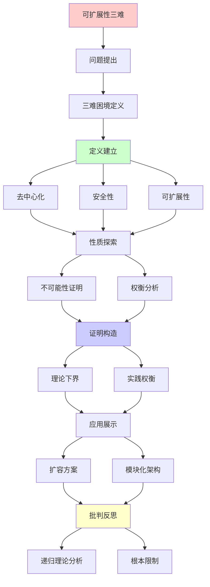
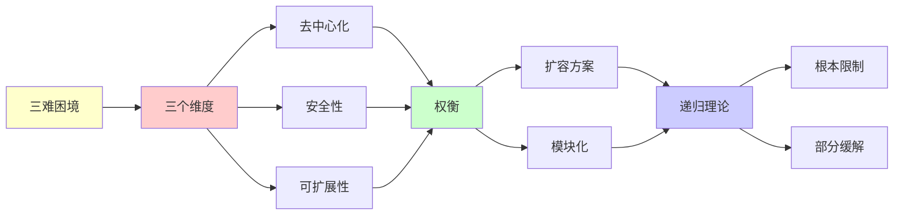

# 区块链可扩展性三难困境

> **主题**: 去中心化/安全性/可扩展性不可能三角
> **创建日期**: 2025-12-02
> **难度**: ⭐⭐⭐⭐⭐
> **前置知识**: 区块链、分布式系统、博弈论

---

## 📋 目录

- [区块链可扩展性三难困境](#区块链可扩展性三难困境)
  - [📋 目录](#-目录)
  - [1. 三难困境](#1-三难困境)
    - [1.1 Buterin提出](#11-buterin提出)
    - [1.2 三个维度](#12-三个维度)
  - [2. 理论分析](#2-理论分析)
    - [2.1 不可能性证明](#21-不可能性证明)
    - [2.2 vs CAP定理](#22-vs-cap定理)
  - [3. Layer 1扩容](#3-layer-1扩容)
    - [3.1 分片](#31-分片)
    - [3.2 DAG结构](#32-dag结构)
  - [4. Layer 2方案](#4-layer-2方案)
    - [4.1 Rollup对比](#41-rollup对比)
    - [4.2 状态通道](#42-状态通道)
  - [5. 实践权衡](#5-实践权衡)
    - [5.1 公链选择](#51-公链选择)
    - [5.2 模块化区块链](#52-模块化区块链)
  - [6. 递归理论分析](#6-递归理论分析)
  - [7. 主题-子主题论证逻辑关系图](#7-主题-子主题论证逻辑关系图)
    - [7.1 论证依赖关系](#71-论证依赖关系)
    - [7.2 概念依赖关系](#72-概念依赖关系)
  - [8. 参考资源](#8-参考资源)
    - [8.1 经典论文](#81-经典论文)
    - [8.2 教材](#82-教材)
    - [8.3 在线资源](#83-在线资源)

---

## 1. 三难困境

### 1.1 Buterin提出

**区块链三难 (2017)**:

```text
三个目标:

去中心化 (Decentralization):
无中心控制
节点广泛分布 ✓

安全性 (Security):
51%攻击难度
拜占庭容错 ✓

可扩展性 (Scalability):
高TPS (每秒交易数)
低延迟 ✓

三难困境:
最多同时满足两个 ⚠️⚠️⚠️
→ 根本权衡 ⭐
```

---

### 1.2 三个维度

**量化指标**:

```text
去中心化:
- 节点数: N
- 地理分布
- 控制分散度
指标: Nakamoto系数
(控制51%的最小实体数)

安全性:
- 攻击成本
- 容错阈值 (<1/3 or <1/2)
- 最终性时间

可扩展性:
- TPS (Transactions Per Second)
- 延迟 (Latency)
- 吞吐量 (Throughput)

权衡:
Bitcoin: 去中心✓ + 安全✓ = 可扩展✗ (7 TPS)
Solana: 可扩展✓ + 安全✓ = 去中心⚠️ (1000节点)
BSC: 可扩展✓ + 去中心✗ = 安全⚠️ (21验证者)
```

---

## 2. 理论分析

### 2.1 不可能性证明

**形式化论证**:

```text
定理猜想:
不存在区块链同时满足:
1. 去中心化 (>10000节点)
2. 安全性 (51%攻击成本>$1B)
3. 可扩展性 (>1000 TPS, <1s延迟)

论证思路:
高去中心化 → 共识慢 ⚠️
(n节点 → O(n²)消息 or O(log n)轮)

快速共识 → 节点少 ⚠️
(BFT实践<100节点)

结论:
n↑ ⟺ TPS↓
→ 根本张力 ⚠️⚠️⚠️

vs FLP:
FLP: 异步共识不可能
三难: 三目标不可兼得
→ 类似根本限制 ⭐

递归理论:
✓ 共识可递归
✗ 但n↑ → 复杂度↑
→ 可计算性 ≠ 可扩展性 ⚠️
```

---

### 2.2 vs CAP定理

**分布式系统定理对比**:

```text
CAP (Brewer 2000):
C, A, P最多选2个
→ 已证明 ✓

区块链三难:
D, S, S最多选2个
→ 猜想 (无严格证明) ⚠️

相似性:
都是分布式根本限制
都有不可能三角
→ 理论平行 ⭐

差异:
CAP: 数学证明 ✓
三难: 工程观察 ⚠️
→ 三难更宽泛

递归理论:
✓ CAP可形式化
⚠️ 三难难精确化
→ 定性vs定量 ⚠️
```

---

## 3. Layer 1扩容

### 3.1 分片

**以太坊2.0分片**:

```text
思想:
分割区块链为64分片
并行处理 ✓

信标链:
协调分片
跨片通信
→ 中心协调 ⚠️

挑战:
跨片交易复杂 ⚠️
安全性分散 ⚠️
→ 2024推迟分片 ⚠️

改为:
Rollup为主
→ 更简单 ✓

递归:
✓ 分片递归划分
✓ 状态递归分布
```

---

### 3.2 DAG结构

**非链结构**:

```text
DAG (有向无环图):
IOTA, Nano, Fantom

并发:
多个块同时产生
→ 高并发 ⭐

Tangle (IOTA):
每个交易验证2个历史交易
→ 自组织共识 ⭐

问题:
⚠️ 双花防护弱 (早期)
⚠️ 中心化coordinator
⚠️ 安全性争议
→ 权衡 ⚠️⚠️

vs 链:
链: 串行, 安全 ✓
DAG: 并行, 快速 ✓
→ 不同权衡

递归理论:
✓ DAG可递归遍历
✓ 冲突可递归检测
```

---

## 4. Layer 2方案

### 4.1 Rollup对比

```text
┌──────────────┬─────────┬─────────┐
│ 维度         │ Optimistic│ ZK     │
├──────────────┼─────────┼─────────┤
│ 安全假设     │ 1诚实    │ 数学✓   │
│ 最终性       │ ~7天⚠️   │ 即时✓   │
│ TPS          │ 4000    │ 2000    │
│ 证明成本     │ 低✓     │ 高⚠️    │
│ EVM兼容      │ 完全✓   │ 部分⚠️  │
│ 复杂度       │ 简单✓   │ 复杂⚠️  │
└──────────────┴─────────┴─────────┘

趋势:
2024: ZK-Rollup改进
硬件加速 ✓
EVM等价 ✓
→ ZK胜出？⭐

递归:
✓ 交易递归批量
✓ 证明递归聚合 (ZK)
```

---

### 4.2 状态通道

**Lightning Network**:

```text
思想:
链下交易通道
只在链上开启/关闭 ✓

优势:
✓ 即时交易
✓ 无限TPS (理论)
✓ 低手续费

限制:
⚠️ 需要锁定资金
⚠️ 在线要求
⚠️ 路由复杂
→ 用例受限 ⚠️

vs Rollup:
通道: 特定对手方
Rollup: 通用 ✓
→ Rollup更灵活 ⭐

递归:
✓ 通道递归嵌套
✓ 路由递归查找
```

---

## 5. 实践权衡

### 5.1 公链选择

**三难权衡实例**:

```text
Bitcoin:
D✓✓ (15000节点)
S✓✓ (极高安全)
S✗ (7 TPS)
→ 数字黄金 ⭐

以太坊:
D✓ (8000节点)
S✓ (高安全)
S⚠️ (15 TPS)
→ 去中心化计算 ⭐

Solana:
D⚠️ (1000节点)
S✓ (较高安全)
S✓✓ (5000 TPS)
→ 高性能链 ⭐

BSC:
D✗ (21验证者)
S⚠️ (中等安全)
S✓✓ (300 TPS)
→ 中心化DeFi ⚠️

递归理论:
✓ 不同选择 = 不同递归参数
✓ 权衡递归优化
```

---

### 5.2 模块化区块链

**Celestia范式**:

```text
传统单体:
执行 + 共识 + 数据可用性
→ 耦合 ⚠️

模块化:
分离层次 ⭐⭐⭐⭐⭐

执行层: Rollup
共识层: 以太坊
数据可用性: Celestia
→ 专业化 ✓

优势:
✓ 每层优化
✓ 可组合
✓ 灵活性强
→ 突破三难？⭐

2024:
Celestia主网 ✓
模块化趋势 ⭐
→ 范式转移可能 ⭐

递归:
✓ 层次递归分解
✓ 功能递归模块化
→ 递归架构 ⭐
```

---

## 6. 递归理论分析

```text
三难困境 ∈ 理论?

形式化困难:
⚠️ 三个维度难精确量化
⚠️ 权衡曲线非线性
⚠️ 技术持续进步
→ 工程定律, 非数学定理 ⚠️

vs 其他不可能性:
CAP: 严格证明 ✓
FLP: 严格证明 ✓
三难: 经验规律 ⚠️
→ 强度不同

但:
✓ 实践普遍验证
✓ 深刻洞察
✓ 指导设计
→ 虽非定理但有价值 ⭐

突破可能?

模块化:
分离关注 → 各层优化
→ 可能缓解三难 ⭐⭐⭐⭐⭐

ZK-Rollup:
继承L1安全 ✓
L2高扩展 ✓
→ 部分突破 ⭐

新共识:
HotStuff: O(n)消息 ✓
DAG: 并行处理 ✓
→ 改进但未根本解决 ⚠️

递归理论:
✓ 扩容方案可递归
✓ Layer递归堆叠
✓ 分片递归划分
→ 递归缓解限制 ⭐

复杂度:
n节点BFT: O(n²)或O(depth·n)
→ 去中心化有成本 ⚠️

TPS vs 延迟:
高TPS → 大块or快块
大块 → 传播慢 ⚠️
快块 → 分叉多 ⚠️
→ 物理限制 ⚠️

理论vs工程:
理论: 根本权衡存在
工程: 持续优化缓解
→ 三难减弱但不消失 ⚠️

2024共识:
✓ 三难真实存在
✓ 但可缓解 (L2, 模块化)
✗ 无银弹
→ 持续优化 ⭐

历史类比:
硬件: 功耗/性能/面积 三难
数据库: CAP三难
区块链: DsS三难
→ 普遍权衡 ⚠️

哲学:
去中心化 = 效率代价
安全 = 冗余代价
扩展 = 中心化倾向
→ 价值冲突 ⚠️

未来:
? 新技术突破三难
? 或永恒权衡
→ 开放问题 ⚠️

递归范式:
✓ 扩容可递归实现
✓ L2递归堆叠
✓ 模块递归组合
✗ 但三难限制递归效率
→ 递归受物理/博弈论约束 ⚠️

终极:
完美区块链 = 不存在
→ 根据应用选择权衡 ⭐
→ 实用主义 ✓
```

---

## 7. 主题-子主题论证逻辑关系图

### 7.1 论证依赖关系



### 7.2 概念依赖关系



**论证逻辑链条**：

1. **问题提出** (1节)：
   - 三难困境定义

2. **定义建立** (1节)：
   - 去中心化、安全性、可扩展性

3. **性质探索** (2-3节)：
   - 不可能性证明和权衡分析

4. **证明构造** (贯穿全文)：
   - 理论下界和实践权衡

5. **应用展示** (4-5节)：
   - 扩容方案和模块化架构

6. **批判反思** (6节)：
   - 递归理论分析

---

## 8. 参考资源

### 8.1 经典论文

1. **Buterin, V.** (2017). "The Meaning of Decentralization"
   - Ethereum Blog. https://blog.ethereum.org/2017/02/17/meaning-decentralization/
   - 去中心化含义和三难困境

2. **Zamani, M., Movahedi, M., & Raykova, M.** (2018). "RapidChain: Scaling Blockchain via Full Sharding"
   - _CCS 2018_. Proceedings of the 2018 ACM SIGSAC Conference on Computer and Communications Security
   - 分片扩容理论

3. **Teutsch, J., & Reitwießner, C.** (2019). "A scalable verification solution for blockchains"
   - TrueBit Whitepaper
   - TrueBit扩容方案

### 8.2 教材

1. **Narayanan, A., et al.** (2016)
   - _Bitcoin and Cryptocurrency Technologies: A Comprehensive Introduction_
   - Princeton University Press. ISBN 978-0691171692
   - 区块链技术基础

2. **Antonopoulos, A. M.** (2017)
   - _Mastering Bitcoin: Programming the Open Blockchain_ (2nd ed.)
   - O'Reilly Media. ISBN 978-1491954386
   - 比特币技术详解

### 8.3 在线资源

1. **Ethereum Scaling Solutions**
   - https://ethereum.org/en/developers/docs/scaling/
   - 以太坊扩容方案

2. **Celestia - Modular Blockchain**
   - https://celestia.org/
   - 模块化区块链架构

3. **Polygon - Layer 2 Solutions**
   - https://polygon.technology/
   - Layer 2扩容方案

---

**最后更新**: 2025-12-04
**Tier**: 1-4 (理论+哲学)
**地位**: 根本权衡 ⭐⭐⭐⭐⭐
**可突破性**: 部分缓解 ⚠️
**状态**: ✅ 已添加主题-子主题论证逻辑关系图和参考资源章节
