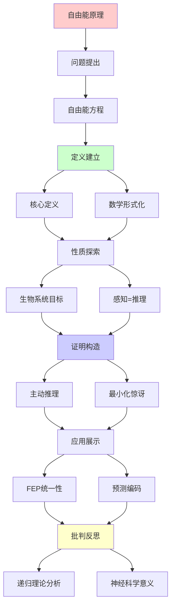
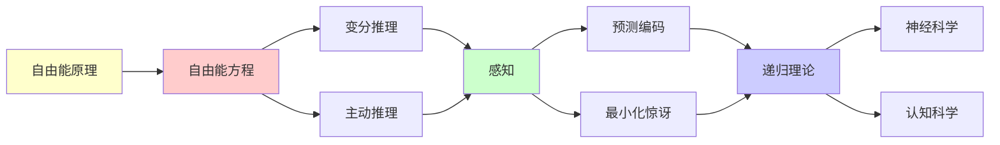

# Friston自由能原理完全指南

> **主题**: Karl Friston的自由能原理 (FEP)
> **核心**: 变分推理+主动推理+最小化惊讶
> **重要性**: ⭐⭐⭐⭐⭐
> **创建日期**: 2025-12-02

---

## 1. 自由能方程

### 核心定义

```text
自由能 F:
F = E_q[log q(s) - log p(o,s)]
  = E_q[log q(s) - log p(s|o) - log p(o)]
  = DKL[q(s)||p(s|o)] - log p(o)
  ≥ -log p(o)

其中:
- o: 观测 (observation)
- s: 隐状态 (hidden state)
- q(s): 近似后验 (recognition density)
- p(s|o): 真实后验
- p(o): 证据 (model evidence)

关键等式:
F ≥ -log p(o)
(KL散度≥0)
```

---

## 2. 生物系统的目标

```text
生物体目标: minimize F

为什么？

F = 惊讶 + KL散度

最小化F:
1. 最小化惊讶 -log p(o)
   → 避免意外 (生存)

2. 最小化KL散度
   → 准确推理 (认知)

两种方式:
- 改变信念 q(s) (感知/学习)
- 改变观测 o (行动)
→ 主动推理 ✓
```

---

## 3. 感知=推理

```text
感知即推理:

传统: 感知 = 被动接收
FEP: 感知 = 主动推理

过程:
1. 先验: p(s)
2. 似然: p(o|s)
3. 观测: o
4. 更新q(s)最小化F
5. 后验: q(s) ≈ p(s|o)

梯度下降:
∂q/∂t = -∇_q F
→ 动力学方程

递归性质:
✓ 持续更新 = 递归过程
✓ 层次化推理 = 递归嵌套
```

---

## 4. 主动推理

```text
主动推理 = 感知 + 行动

环路:
先验期望
    ↓
  预测
    ↓
┌─行动─┐
│      ↓
│    环境
│      ↓
│    观测
│      ↓
└──误差──┘
    ↓
  更新

行动选择:
a* = argmin_a E[F|a]
→ 选择最小化期望自由能的行动

递归理论:
✓ 感知-行动循环 = 递归闭环
✓ 可递归计算
```

---

## 5. FEP统一性

```text
FEP统一框架:

包含:
✓ 预测编码
✓ 贝叶斯大脑
✓ 强化学习 (特例)
✓ 信息论

统一公式:
所有生物行为 = 最小化F

递归理论:
✓ FEP ∈ RE
✓ 可递归实现
→ 大脑 = 递归推理机

批判:
✓ 理论优雅
⚠️ 是否真统一一切？
⚠️ 实验验证困难
```

---

## 6. 主题-子主题论证逻辑关系图

### 6.1 论证依赖关系



### 6.2 概念依赖关系



**论证逻辑链条**：

1. **问题提出** (1节)：
   - 自由能方程

2. **定义建立** (1节)：
   - 核心定义和数学形式化

3. **性质探索** (2-3节)：
   - 生物系统的目标（2节）
   - 感知=推理（3节）

4. **证明构造** (4节)：
   - 主动推理

5. **应用展示** (5节)：
   - FEP统一性

6. **批判反思** (贯穿全文)：
   - 递归理论分析和神经科学意义

---

## 7. 参考资源

### 7.1 经典论文

1. **Friston, K.** (2010). "The free-energy principle: a unified brain theory?"
   - _Nature Reviews Neuroscience_, 11(2), 127-138
   - 自由能原理综述 ⭐⭐⭐⭐⭐

2. **Friston, K., et al.** (2017). "Active inference: a process theory"
   - _Neural Computation_, 29(1), 1-49
   - 主动推理理论

3. **Clark, A.** (2013). "Whatever next? Predictive brains, situated agents, and the future of cognitive science"
   - _Behavioral and Brain Sciences_, 36(3), 181-204
   - 预测编码与认知科学

### 7.2 教材

1. **Friston, K.** (2019)
   - _Active Inference: The Free Energy Principle in Mind, Brain, and Behavior_
   - MIT Press. ISBN 978-0262045353
   - 主动推理教材

2. **Dayan, P., & Abbott, L. F.** (2001)
   - _Theoretical Neuroscience: Computational and Mathematical Modeling of Neural Systems_
   - MIT Press. ISBN 978-0262041997
   - 理论神经科学

### 7.3 在线资源

1. **Friston Lab - Active Inference**
   - https://www.fil.ion.ucl.ac.uk/~karl/
   - Friston实验室资源

2. **Wikipedia - Free energy principle**
   - https://en.wikipedia.org/wiki/Free_energy_principle
   - 自由能原理基本概念

3. **Predictive Processing Research**
   - https://predictiveprocessing.org/
   - 预测编码研究资源

---

**最后更新**: 2025-12-04
**状态**: ✅ 已添加主题-子主题论证逻辑关系图和参考资源章节
**定位**: FEP理论核心
**引用**: Friston (2010) "The free-energy principle"
