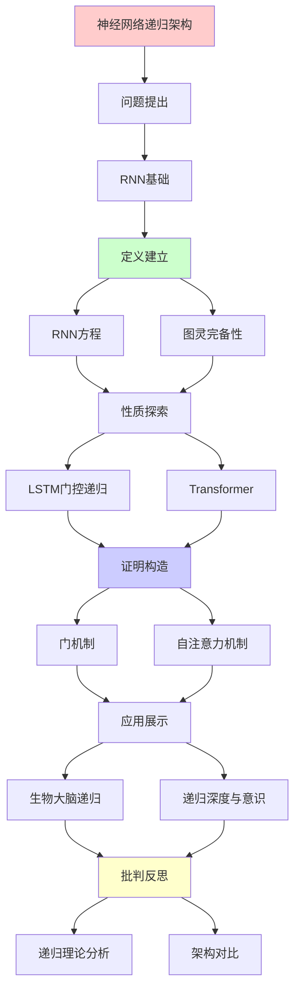
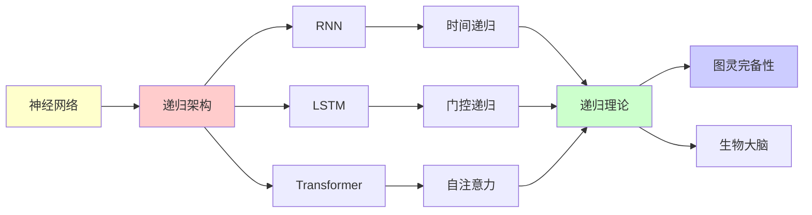

# 神经网络的递归架构分析

> **主题**: RNN/LSTM/Transformer的递归性质对比
> **创建日期**: 2025-12-02
> **难度**: ⭐⭐⭐⭐
> **前置知识**: 深度学习、递归神经网络

---

## 📋 目录

- [神经网络的递归架构分析](#神经网络的递归架构分析)
  - [📋 目录](#-目录)
  - [1. RNN基础与递归性](#1-rnn基础与递归性)
    - [1.1 RNN方程](#11-rnn方程)
    - [1.2 图灵完备性](#12-图灵完备性)
  - [2. LSTM的门控递归](#2-lstm的门控递归)
    - [2.1 门机制](#21-门机制)
    - [2.2 长期依赖问题](#22-长期依赖问题)
  - [3. Transformer: 递归的终结?](#3-transformer-递归的终结)
    - [3.1 自注意力机制](#31-自注意力机制)
    - [3.2 vs RNN对比](#32-vs-rnn对比)
  - [4. 生物大脑的递归连接](#4-生物大脑的递归连接)
    - [4.1 前馈vs反馈](#41-前馈vs反馈)
    - [4.2 递归深度与意识](#42-递归深度与意识)
  - [5. 递归理论分析](#5-递归理论分析)
  - [6. 主题-子主题论证逻辑关系图](#6-主题-子主题论证逻辑关系图)
    - [6.1 论证依赖关系](#61-论证依赖关系)
    - [6.2 概念依赖关系](#62-概念依赖关系)
  - [7. 参考资源](#7-参考资源)
    - [7.1 经典论文](#71-经典论文)
    - [7.2 教材](#72-教材)
    - [7.3 在线资源](#73-在线资源)

---

## 1. RNN基础与递归性

### 1.1 RNN方程

**标准RNN**:

```text
h_t = tanh(W_h h_{t-1} + W_x x_t + b)
y_t = W_y h_t

递归性质:
✓ h_t递归依赖h_{t-1}
✓ 展开: h_t = f(x_t, x_{t-1}, ..., x_0)
✓ 时间递归

问题:
✗ 梯度消失 (tanh饱和)
✗ 梯度爆炸
✗ 长期依赖困难
→ 实践受限 ⚠️
```

---

### 1.2 图灵完备性

**定理 (Siegelmann & Sontag 1995)**:

```text
RNN (实数权重) = 图灵完备 ✓

证明思路:
1. RNN可模拟栈
2. 栈机 = 图灵机
→ RNN = 图灵完备

但:
⚠️ 需要无限精度
⚠️ 实践中有限精度
⚠️ 训练困难

结论:
✓ 理论上图灵完备
✗ 实践受限
→ Transformer替代趋势
```

---

## 2. LSTM的门控递归

### 2.1 门机制

**LSTM方程**:

```text
遗忘门: f_t = σ(W_f·[h_{t-1}, x_t])
输入门: i_t = σ(W_i·[h_{t-1}, x_t])
输出门: o_t = σ(W_o·[h_{t-1}, x_t])

细胞状态:
C_t = f_t ⊙ C_{t-1} + i_t ⊙ tanh(W_C·[h_{t-1}, x_t])

隐状态:
h_t = o_t ⊙ tanh(C_t)

递归性质:
✓ h_t递归
✓ C_t递归 (长期记忆)
✓ 门控保护梯度
```

---

### 2.2 长期依赖问题

**梯度流动**:

```text
RNN:
∂L/∂h_0 = ∂L/∂h_T · ∏_{t=1}^T ∂h_t/∂h_{t-1}
→ 连乘 → 消失/爆炸 ✗

LSTM:
C_t = f_t ⊙ C_{t-1} + ...
→ 加法路径 (非连乘)
→ 梯度保护 ✓

效果:
RNN: ~10步
LSTM: ~100步
→ 改进但仍有限 ⚠️
```

---

## 3. Transformer: 递归的终结?

### 3.1 自注意力机制

**非递归架构**:

```text
Self-Attention:
Attention(Q,K,V) = softmax(QK^T/√d)V

特点:
✓ 全连接 (非递归)
✓ 并行计算
✓ O(n²)复杂度

vs RNN:
RNN: 串行递归 O(n)
Transformer: 并行 O(1)层
→ 速度优势 ⭐⭐⭐⭐⭐
```

---

### 3.2 vs RNN对比

| 维度 | RNN | LSTM | Transformer |
|------|-----|------|-------------|
| **架构** | 递归↻ | 递归+门控 | 注意力⇄ |
| **并行性** | ✗串行 | ✗串行 | ✓并行⭐ |
| **长期依赖** | ✗差 | ⚠️中等 | ✓优秀 |
| **训练速度** | 慢 | 慢 | 快✓ |
| **推理速度** | 快 | 快 | 中 |
| **内存** | O(T) | O(T) | O(T²) |
| **递归性** | ✓时间 | ✓时间 | ✗层次 |

**结论**:
Transformer主导 (2024)
RNN应用减少
→ 非递归架构胜出 ⚠️

---

## 4. 生物大脑的递归连接

### 4.1 前馈vs反馈

**皮层连接统计**:

```text
人脑连接:
- 前馈: ~20%
- 反馈: ~40% ⭐⭐⭐
- 侧向: ~40%

→ 大脑 ≠ 前馈网络
→ 大脑 = 高度递归系统

递归回路:
V1 ⇄ V2 ⇄ V4 ⇄ IT
 ↓     ↓     ↓     ↓
       PFC (执行控制)

vs Transformer:
Transformer: 层次化 (弱递归)
大脑: 高度递归 ⭐
→ 架构差异大
```

---

### 4.2 递归深度与意识

**假设** (Dehaene, Lau & Rosenthal):

```text
意识 = 递归处理深度

Level 0: 感知 (无递归)
  └─ 反射反应

Level 1: 注意 (浅递归)
  └─ 特征选择

Level 2: 工作记忆 (中递归)
  └─ 信息维持

Level 3: 元认知 (深递归)
  └─ 思考思考 ⭐

Level 4: 自我意识 (最深递归)
  └─ 递归自指 ⭐⭐⭐

递归深度 ∝ 意识水平 ?

批判:
⚠️ 相关性 ≠ 因果
⚠️ 递归必要但可能不充分
```

---

## 5. 递归理论分析

```text
神经网络 ∈ RE?

RNN/LSTM:
✓ 图灵完备 (理论)
✓ ∈ RE
✗ 实践受限 (有限精度)

Transformer:
✓ 图灵完备 (Pérez 2019)
✓ ∈ RE
✓ 实践强大

生物大脑:
✓ 物理系统 → 可模拟
✓ ∈ RE (理论)
✗ 实践不可行 (复杂度)

结论:
所有神经架构 ∈ RE ✓
但效率和可训练性差异巨大 ⚠️
→ 递归 vs 注意力 = 架构选择
```

---

## 6. 主题-子主题论证逻辑关系图

### 6.1 论证依赖关系



### 6.2 概念依赖关系



**论证逻辑链条**：

1. **问题提出** (1节)：
   - RNN基础与递归性

2. **定义建立** (1.1-1.2节)：
   - RNN方程和图灵完备性

3. **性质探索** (2-3节)：
   - LSTM的门控递归（2节）
   - Transformer（3节）

4. **证明构造** (2.1, 3.1节)：
   - 门机制和自注意力机制

5. **应用展示** (4节)：
   - 生物大脑的递归连接

6. **批判反思** (5节)：
   - 递归理论分析

---

## 7. 参考资源

### 7.1 经典论文

1. **Siegelmann, H. T., & Sontag, E. D.** (1995). "On the Computational Power of Neural Nets"
   - _Journal of Computer and System Sciences_, 50(1), 132-150
   - RNN图灵完备性证明

2. **Hochreiter, S., & Schmidhuber, J.** (1997). "Long Short-Term Memory"
   - _Neural Computation_, 9(8), 1735-1780
   - LSTM原始论文 ⭐⭐⭐⭐⭐

3. **Vaswani, A., et al.** (2017). "Attention Is All You Need"
   - _NeurIPS 2017_. Advances in Neural Information Processing Systems 30
   - Transformer架构 ⭐⭐⭐⭐⭐

### 7.2 教材

1. **Goodfellow, I., Bengio, Y., & Courville, A.** (2016)
   - _Deep Learning_
   - MIT Press. ISBN 978-0262035613
   - 深度学习基础

2. **Graves, A.** (2012)
   - _Supervised Sequence Labelling with Recurrent Neural Networks_
   - Springer. ISBN 978-3642247965
   - RNN序列标注

### 7.3 在线资源

1. **PyTorch - RNN Tutorial**
   - https://pytorch.org/tutorials/beginner/nlp/sequence_models_tutorial.html
   - RNN实现教程

2. **The Illustrated Transformer**
   - https://jalammar.github.io/illustrated-transformer/
   - Transformer可视化

3. **Wikipedia - Recurrent neural network**
   - https://en.wikipedia.org/wiki/Recurrent_neural_network
   - RNN基本概念

---

**最后更新**: 2025-12-04
**Tier**: 2 (科学+工程)
**趋势**: Transformer主导 ✓
**递归性**: RNN递归，Transformer层次
**状态**: ✅ 已添加主题-子主题论证逻辑关系图和参考资源章节
