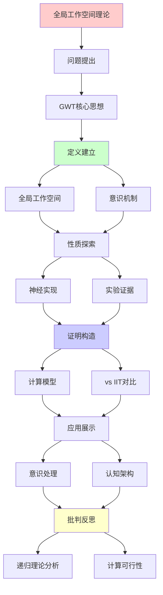
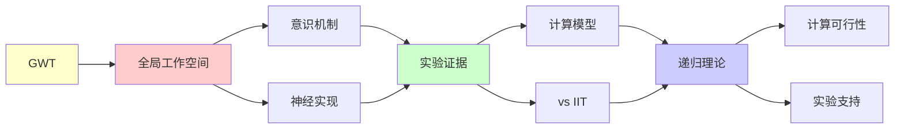

# 全局工作空间理论(GWT)

> **主题**: Dehaene-Baars意识的计算模型
> **创建日期**: 2025-12-02
> **难度**: ⭐⭐⭐⭐
> **前置知识**: 认知神经科学、意识理论

---

## 📋 目录

- [全局工作空间理论(GWT)](#全局工作空间理论gwt)
  - [📋 目录](#-目录)
  - [1. GWT核心思想](#1-gwt核心思想)
    - [1.1 剧场隐喻](#11-剧场隐喻)
    - [1.2 全局广播](#12-全局广播)
  - [2. 神经实现](#2-神经实现)
    - [2.1 全局神经工作空间](#21-全局神经工作空间)
    - [2.2 点燃现象](#22-点燃现象)
  - [3. 实验证据](#3-实验证据)
    - [3.1 掩蔽范式](#31-掩蔽范式)
    - [3.2 双稳态知觉](#32-双稳态知觉)
  - [4. 计算模型](#4-计算模型)
    - [4.1 GWT架构](#41-gwt架构)
    - [4.2 复杂度分析](#42-复杂度分析)
  - [5. vs IIT对比](#5-vs-iit对比)
  - [6. 递归理论分析](#6-递归理论分析)
  - [7. 主题-子主题论证逻辑关系图](#7-主题-子主题论证逻辑关系图)
    - [7.1 论证依赖关系](#71-论证依赖关系)
    - [7.2 概念依赖关系](#72-概念依赖关系)
  - [8. 参考资源](#8-参考资源)
    - [8.1 经典论文](#81-经典论文)
    - [8.2 教材](#82-教材)
    - [8.3 在线资源](#83-在线资源)

---

## 1. GWT核心思想

### 1.1 剧场隐喻

**Baars (1988)**:

```text
意识 = 剧场聚光灯

剧场组成:
- 舞台 (Stage): 工作空间
- 聚光灯 (Spotlight): 注意
- 演员 (Actors): 专家模块
- 观众 (Audience): 无意识处理器

意识内容:
= 聚光灯照亮的舞台内容
→ 全局可访问 ⭐

无意识:
= 后台活动
→ 局部处理，不广播
```

---

### 1.2 全局广播

**信息访问**:

```text
无意识处理:
模块M₁ → 处理 → 输出
- 局部
- 并行
- 快速

意识处理:
模块M₁ → 工作空间 → 广播 → {M₂, M₃, ..., Mₙ}
- 全局
- 串行 ⭐
- 慢速但灵活

关键:
意识 = 信息全局可访问性 ✓
→ 功能定义 (非本体)
```

---

## 2. 神经实现

### 2.1 全局神经工作空间

**Dehaene & Changeux (2011)**:

```text
神经基质:
前额叶皮层 (PFC)
+ 顶叶皮层
+ 扣带回
→ 长程连接网络 ⭐

连接模式:
局部模块 ⇄ GNW ⇄ 其他模块
       (双向连接)

递归连接:
✓ 前馈 (FF): 感觉 → PFC
✓ 反馈 (FB): PFC → 感觉
→ 递归回路 ⭐⭐⭐
```

---

### 2.2 点燃现象

**意识的神经签名**:

```text
点燃 (Ignition):
刺激超过阈值 → 全脑激活

时间进程:
0-100ms: 局部处理 (无意识)
100-300ms: 传播到PFC
300ms+: 全脑点燃 ⭐ (意识)

P3波:
ERP成分 ~300ms
= 意识访问标志 ✓

全或无:
✓ 阈下: 无点燃
✓ 阈上: 全点燃
→ 非线性转变 ⭐
```

---

## 3. 实验证据

### 3.1 掩蔽范式

**意识vs无意识对比**:

```text
掩蔽实验:
刺激 (50ms) + 掩蔽 (立即)
→ 无意识处理

无掩蔽:
刺激 (50ms) + 延迟
→ 意识处理

fMRI结果:
无意识: V1, V2局部激活
意识: V1-V4-IT-PFC全激活 ⭐
→ GWT预测符合 ✓

递归激活:
意识条件: 反馈连接激活
无意识: 仅前馈
→ 递归必要 ⭐⭐⭐
```

---

### 3.2 双稳态知觉

**Necker立方体**:

```text
现象:
同一刺激 → 两种知觉交替

GWT解释:
竞争模块 M₁ (解释1) vs M₂ (解释2)
赢家 → 工作空间 → 广播 → 意识
输家 → 抑制 → 无意识

交替机制:
适应 → M₁减弱
噪声 → M₂偶然胜出
→ 切换 ✓

递归性质:
✓ 竞争递归
✓ 注意递归分配
✓ 知觉递归切换
```

---

## 4. 计算模型

### 4.1 GWT架构

**Shanahan (2010)实现**:

```text
架构:
Input → 专家模块{E₁, E₂, ..., Eₙ}
         ↓ (竞争)
      Global Workspace (GW)
         ↓ (广播)
      所有模块 ← 全局信息

竞争机制:
Winner-Take-All (WTA)
激活最强模块 → GW

广播机制:
GW内容 → 所有模块可访问
→ 全局协调 ✓

递归:
✓ 模块 → GW → 模块 (循环)
✓ 注意递归调制
```

---

### 4.2 复杂度分析

```text
计算复杂度:

竞争: O(n) (n个模块)
广播: O(n)
总计: O(n) 线性 ✓

vs IIT:
IIT: O(2^n) 指数 ✗
GWT: O(n) 线性 ✓
→ 可计算性优势 ⭐⭐⭐⭐⭐

大脑规模:
n ~ 10⁹ 神经元
GWT: 可行 ✓
IIT: 不可行 ✗
→ 实践差异巨大
```

---

## 5. vs IIT对比

```text
┌──────────────┬─────────────┬──────────────┐
│ 维度         │ GWT         │ IIT          │
├──────────────┼─────────────┼──────────────┤
│ 核心概念     │ 全局访问    │ 整合信息Φ    │
│ 意识定义     │ 功能        │ 本体         │
│ 计算复杂度   │ O(n) ✓      │ O(2^n) ✗     │
│ 神经基质     │ PFC-顶叶    │ 后皮层？     │
│ 实验支持     │ 强✓         │ 弱⚠️         │
│ 可扩展性     │ ✓           │ ✗            │
│ 泛心论       │ ✗           │ ⚠️争议       │
│ 工程应用     │ ✓可行       │ ✗难         │
└──────────────┴─────────────┴──────────────┘

共识:
⚠️ 两者解释不同现象
⚠️ 可能互补而非矛盾
```

---

## 6. 递归理论分析

```text
GWT ∈ RE?

答案: ✓是的

证明:
- WTA竞争可递归计算
- 广播可递归传播
- 工作空间更新可递归
→ GWT ∈ P ⊂ RE ✓

复杂度:
GWT: O(n) 优秀 ⭐⭐⭐⭐⭐
→ 大脑规模可实现

递归性质:
✓ 感知-认知递归循环
✓ 注意递归调制
✓ 工作空间递归更新

vs 人脑:
GWT预测:
- 串行瓶颈 ✓ (意识)
- 全局广播 ✓ (点燃)
- 递归处理 ✓ (反馈)
→ 实验验证良好 ✓

AI应用:
✓ Transformer: 全局注意力
✓ 工作记忆: RNN/LSTM
✓ 注意机制: 类似WTA
→ GWT启发AI架构 ⭐

理论地位:
✓ 主流意识理论
✓ 可计算、可验证
✓ 工程可实现
→ 实用主义胜利 ⭐⭐⭐⭐⭐

vs IIT:
IIT: 优雅但不可计算
GWT: 实用且可计算
→ 可计算性权衡 ⚠️
```

---

## 7. 主题-子主题论证逻辑关系图

### 7.1 论证依赖关系



### 7.2 概念依赖关系



**论证逻辑链条**：

1. **问题提出** (1节)：
   - GWT核心思想

2. **定义建立** (1节)：
   - 全局工作空间和意识机制

3. **性质探索** (2-3节)：
   - 神经实现（2节）
   - 实验证据（3节）

4. **证明构造** (4-5节)：
   - 计算模型（4节）
   - vs IIT对比（5节）

5. **应用展示** (贯穿全文)：
   - 意识处理和认知架构

6. **批判反思** (6节)：
   - 递归理论分析

---

## 8. 参考资源

### 8.1 经典论文

1. **Baars, B. J.** (1988). _A Cognitive Theory of Consciousness_
   - Cambridge University Press. ISBN 978-0521427432
   - GWT奠基性著作 ⭐⭐⭐⭐⭐

2. **Dehaene, S., & Changeux, J.-P.** (2011). "Experimental and Theoretical Approaches to Conscious Processing"
   - _Neuron_, 70(2), 200-227
   - GWT神经实现

3. **Dehaene, S.** (2014). _Consciousness and the Brain: Deciphering How the Brain Codes Our Thoughts_
   - Viking. ISBN 978-0670025435
   - 意识科学科普 ⭐⭐⭐⭐⭐

4. **Shanahan, M.** (2010). "A Cognitive Architecture that Combines Internal Simulation with a Global Workspace"
   - _Consciousness and Cognition_, 19(2), 433-449
   - GWT计算模型

### 8.2 教材

1. **Baars, B. J., & Gage, N. M.** (2010)
   - _Cognition, Brain, and Consciousness: Introduction to Cognitive Neuroscience_ (2nd ed.)
   - Academic Press. ISBN 978-0123750709
   - 认知神经科学

2. **Dehaene, S.** (2020)
   - _How We Learn: Why Brains Learn Better Than Any Machine... for Now_
   - Viking. ISBN 978-0525559887
   - 学习与意识

### 8.3 在线资源

1. **Global Workspace Theory**
   - https://www.bernardbaars.com/
   - Baars的GWT资源

2. **Dehaene Lab**
   - https://www.icm-institute.org/en/team/dehaene-stanislas/
   - Dehaene实验室

3. **Wikipedia - Global workspace theory**
   - https://en.wikipedia.org/wiki/Global_workspace_theory
   - GWT基本概念

---

**最后更新**: 2025-12-04
**Tier**: 2-4 (科学+哲学)
**实验支持**: 强 ✓
**计算可行性**: O(n) 优秀 ⭐⭐⭐⭐⭐
**状态**: ✅ 已添加主题-子主题论证逻辑关系图和参考资源章节
