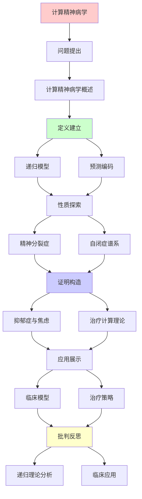
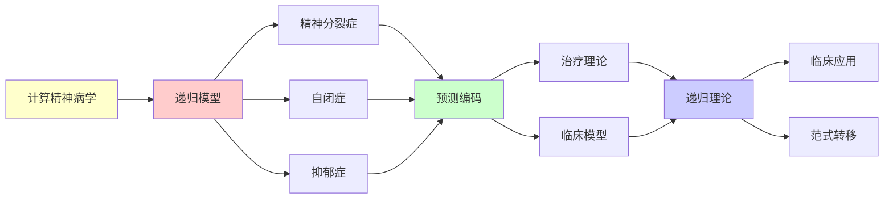

# 计算精神病学的递归模型

> **主题**: 精神疾病的预测编码理论解释
> **创建日期**: 2025-12-02
> **难度**: ⭐⭐⭐⭐⭐
> **前置知识**: 预测编码、精神病学、贝叶斯推理

---

## 📋 目录

- [计算精神病学的递归模型](#计算精神病学的递归模型)
  - [📋 目录](#-目录)
  - [1. 计算精神病学概述](#1-计算精神病学概述)
    - [1.1 范式转移](#11-范式转移)
    - [1.2 预测编码框架](#12-预测编码框架)
  - [2. 精神分裂症](#2-精神分裂症)
    - [2.1 精度加权异常](#21-精度加权异常)
    - [2.2 幻觉的预测模型](#22-幻觉的预测模型)
  - [3. 自闭症谱系](#3-自闭症谱系)
    - [3.1 预测失败假说](#31-预测失败假说)
    - [3.2 感觉过载](#32-感觉过载)
  - [4. 抑郁症与焦虑](#4-抑郁症与焦虑)
    - [4.1 负性预测偏差](#41-负性预测偏差)
    - [4.2 反刍的递归循环](#42-反刍的递归循环)
  - [5. 治疗的计算理论](#5-治疗的计算理论)
    - [5.1 认知行为疗法](#51-认知行为疗法)
    - [5.2 药物作用机制](#52-药物作用机制)
  - [6. 递归理论分析](#6-递归理论分析)
  - [7. 主题-子主题论证逻辑关系图](#7-主题-子主题论证逻辑关系图)
    - [7.1 论证依赖关系](#71-论证依赖关系)
    - [7.2 概念依赖关系](#72-概念依赖关系)
  - [8. 参考资源](#8-参考资源)
    - [8.1 经典论文](#81-经典论文)
    - [8.2 教材](#82-教材)
    - [8.3 在线资源](#83-在线资源)

---

## 1. 计算精神病学概述

### 1.1 范式转移

**传统vs计算**:

```text
传统精神病学:
症状描述 (DSM-5)
分类诊断
经验治疗
→ 描述性 ⚠️

计算精神病学:
神经计算异常
机制建模
预测治疗反应
→ 机制性 ⭐⭐⭐⭐⭐

优势:
✓ 跨诊断 (共同机制)
✓ 可预测
✓ 个性化
✓ 理论指导

递归框架:
大脑 = 预测机器
疾病 = 预测异常
→ 统一视角 ⭐
```

---

### 1.2 预测编码框架

**贝叶斯大脑**:

```text
正常认知:
先验 + 感觉 → 后验
预测 ⇄ 预测误差
→ 递归更新 ✓

精神疾病:
预测机制异常
- 先验过强/过弱
- 精度估计错误
- 更新失败
→ 症状涌现 ⚠️

形式化:
μ_posterior = (τ_prior·μ_prior + τ_likelihood·x) /
              (τ_prior + τ_likelihood)

τ: 精度 (1/方差)
异常: τ值错误 ⚠️

递归:
✓ 预测递归更新
✓ 精度递归估计
✓ 误差递归传播
```

---

## 2. 精神分裂症

### 2.1 精度加权异常

**Friston假说**:

```text
核心异常:
精度加权错误 ⚠️⚠️⚠️

正常:
预测误差精度τ适当
→ 合理更新信念 ✓

精神分裂症:
τ_error过高 (过度重视误差)
→ 随机噪声被当信号 ✗

结果:
- 幻觉: 噪声→感知 ⚠️
- 妄想: 异常模式→信念 ⚠️
- 思维障碍: 预测混乱 ⚠️

神经机制:
多巴胺异常 (DA)
DA = 精度信号
DA↑ → τ_error↑
→ 症状 ✗

形式化:
μ_psychosis = (τ_low·μ + τ_high·noise) / ...
→ 噪声主导 ⚠️
```

---

### 2.2 幻觉的预测模型

**幻听机制**:

```text
正常:
外部声音 → 感觉 → 知觉
内部语音 → 预测 → 抑制 ✓

精神分裂症:
内部语音 → 预测弱化
→ 未抑制 → 感知为"外部" ⚠️

预测编码:
自我监控失败
内部→外部归因错误
→ 幻听 ✗

实验支持:
✓ fMRI: 幻听时听觉皮层激活
✓ TMS: 抑制预测→类似幻听
→ 模型符合 ✓

治疗:
抗精神病药 (DA拮抗剂)
→ 降低精度加权
→ 减少幻觉 ✓

递归:
✓ 预测-误差递归循环异常
✓ 信念递归强化 (妄想)
```

---

## 3. 自闭症谱系

### 3.1 预测失败假说

**Friston & Pellicano**:

```text
核心异常:
预测过弱 ⚠️
(vs 精神分裂: 预测误差过强)

模型:
τ_prior低 (先验精度低)
τ_likelihood高 (感觉精度高)
→ 感觉主导 ⚠️

结果:
- 感官过载
- 社交困难 (预测他人难)
- 刻板行为 (减少不确定性)
- 细节关注 (感觉精确)

对称性:
精神分裂: 先验强, 感觉弱
自闭症: 先验弱, 感觉强 ⭐
→ 对偶疾病 ⚠️

递归理论:
✓ 预测递归失败
✓ 不确定性递归累积
```

---

### 3.2 感觉过载

**感觉处理**:

```text
正常:
感觉信号 → 预测滤波 → 重要性
→ 大多数忽略 ✓

自闭症:
预测弱 → 滤波差 → 所有重要 ⚠️
→ 信息过载 ⚠️⚠️

症状:
- 噪音敏感
- 光线敏感
- 触觉过敏
→ 感觉防御 ⚠️

应对:
刻板行为:
重复可预测活动
→ 减少不确定性 ✓
→ 自我调节 ⭐

治疗:
感觉统合训练
建立更好预测模型
→ 适应性提升 ✓

递归:
✓ 感觉递归无滤波
✓ 过载递归累积
```

---

## 4. 抑郁症与焦虑

### 4.1 负性预测偏差

**抑郁的预测模型**:

```text
核心:
负性先验过强 ⚠️

μ_prior = 消极预期
新证据难以更新
→ 习得性无助 ⚠️

例子:
事件: 朋友未回信
正常: "可能忙"
抑郁: "肯定讨厌我" ⚠️
→ 负性解释偏差

神经机制:
血清素 (5-HT) 低
5-HT = 精度调节?
→ 更新困难 ⚠️

递归强化:
负性预测 → 负性行为
→ 负性结果 → 证实预测
→ 恶性循环 ⚠️⚠️⚠️

递归理论:
✓ 负性循环递归
✓ 信念递归强化
→ 自我实现预言 ⚠️
```

---

### 4.2 反刍的递归循环

**焦虑反刍**:

```text
反刍 (Rumination):
反复思考负性事件
无解决方案
→ 困在循环 ⚠️

递归模型:
思考问题 → 预测糟糕
→ 焦虑 → 再次思考
→ 递归循环 ⚠️⚠️

元认知:
思考"思考"
递归深度↑
→ 陷入 ⚠️

vs 问题解决:
问题解决: 递归终止 (解决) ✓
反刍: 递归不终止 ✗
→ 病理递归 ⚠️

治疗:
CBT:
打破递归循环
引入终止条件 ✓

正念:
观察思维不跟随
→ 退出递归 ✓

递归理论:
✓ 反刍 = 病理递归
✗ 无终止条件
→ 停机问题类似 ⚠️
```

---

## 5. 治疗的计算理论

### 5.1 认知行为疗法

**CBT的预测编码解释**:

```text
CBT目标:
修正错误预测模型 ✓

技术:
1. 识别负性自动思维
   → 识别错误先验

2. 证据检验
   → 更新先验

3. 行为实验
   → 收集反证据

4. 认知重构
   → 建立新预测模型 ✓

计算:
Prior_old → Evidence → Prior_new
Bayesian更新 ✓
→ 重校准预测 ⭐

递归:
✓ 治疗递归迭代
✓ 信念递归更新
✓ 模型递归修正
```

---

### 5.2 药物作用机制

**神经递质调制**:

```text
SSRI (抗抑郁):
增强5-HT
→ 调节精度加权？
→ 促进信念更新 ✓

抗精神病药:
拮抗DA D2受体
→ 降低精度误差
→ 减少幻觉/妄想 ✓

抗焦虑药:
增强GABA
→ 抑制过度预测？
→ 减少焦虑循环 ✓

计算解释:
药物 = 精度参数调节
τ_prior, τ_error
→ 优化预测 ✓

递归理论:
✓ 药物递归调节
✓ 参数递归优化
```

---

## 6. 递归理论分析

```text
计算精神病学 ∈ RE?

答案: ✓是的

证明:
- 预测编码可递归模拟
- 贝叶斯更新可递归计算
- 症状可递归建模
→ 计算模型 ∈ RE ✓

复杂度:
贝叶斯更新: O(n) (线性滤波)
精度估计: O(n)
大脑模拟: O(10⁹) 不可行 ✗
→ 实践简化模型 ⚠️

递归病理:
反刍 = 递归不终止 ⚠️
妄想 = 递归强化错误信念 ⚠️
焦虑 = 递归负反馈 ⚠️
→ 病理递归模式 ⭐⭐⭐⭐⭐

vs 正常:
正常: 递归收敛 (适应) ✓
病理: 递归不收敛/错误不动点 ✗
→ 不动点异常 ⚠️

治疗 = 递归修复:
CBT: 修正先验 → 新不动点 ✓
药物: 调节参数 → 收敛优化 ✓
→ 递归重置 ⭐

预测能力:
✓ 症状严重度可量化
✓ 治疗反应可预测 (部分)
⚠️ 个体差异大
→ 精准精神病学方向 ⭐

理论vs实践:
理论: 优雅统一框架 ✓
实践:
- 模型简化
- 参数难测
- 个体异质
→ 仍需验证 ⚠️

2024现状:
✓ 理论框架成熟
✓ 实验证据增加
⚠️ 临床应用初步
✗ 尚未革命临床
→ 长期潜力 ⭐

递归范式:
✓ 精神疾病 = 递归异常
✓ 治疗 = 递归修复
✓ 康复 = 递归重构
→ 递归心理学 ⭐⭐⭐⭐⭐

哲学:
心理疾病 = 软件bug?
大脑 = 预测机器
疾病 = 参数/算法异常
→ 计算隐喻的威力 ⭐

伦理:
⚠️ 还原论危险
⚠️ 忽视社会因素
⚠️ 过度医疗化
→ 需要平衡 ⚠️

未来:
数字疗法:
APP + 算法
个性化干预
→ 计算治疗 ⭐
```

---

## 7. 主题-子主题论证逻辑关系图

### 7.1 论证依赖关系



### 7.2 概念依赖关系



**论证逻辑链条**：

1. **问题提出** (1节)：
   - 计算精神病学概述

2. **定义建立** (1节)：
   - 递归模型和预测编码

3. **性质探索** (2-4节)：
   - 精神分裂症（2节）
   - 自闭症谱系（3节）
   - 抑郁症与焦虑（4节）

4. **证明构造** (贯穿全文)：
   - 各种疾病的递归模型

5. **应用展示** (5节)：
   - 治疗的计算理论

6. **批判反思** (6节)：
   - 递归理论分析

---

## 8. 参考资源

### 8.1 经典论文

1. **Friston, K. J.** (2005). "A theory of cortical responses"
   - _Philosophical Transactions of the Royal Society B_, 360(1456), 815-836
   - 预测编码理论

2. **Fletcher, P. C., & Frith, C. D.** (2009). "Perceiving is believing: a Bayesian approach to explaining the positive symptoms of schizophrenia"
   - _Nature Reviews Neuroscience_, 10(1), 48-58
   - 精神分裂症计算模型 ⭐⭐⭐⭐⭐

3. **Pellicano, E., & Burr, D.** (2012). "When the world becomes 'too real': a Bayesian explanation of autistic perception"
   - _Trends in Cognitive Sciences_, 16(10), 504-510
   - 自闭症感知模型

4. **Clark, J. E., Watson, S., & Friston, K. J.** (2018). "What is mood? A computational perspective"
   - _Psychological Medicine_, 48(14), 2277-2284
   - 情绪计算理论

### 8.2 教材

1. **Friston, K.** (2019)
   - _Active Inference: The Free Energy Principle in Mind, Brain, and Behavior_
   - MIT Press. ISBN 978-0262045353
   - 主动推理与精神病学

2. **Huys, Q. J. M., Maia, T. V., & Frank, M. J.** (2016). "Computational psychiatry as a bridge from neuroscience to clinical applications"
   - _Nature Neuroscience_, 19(3), 404-413
   - 计算精神病学综述

### 8.3 在线资源

1. **Computational Psychiatry**
   - https://www.computationalpsychiatry.org/
   - 计算精神病学资源

2. **Friston Lab**
   - https://www.fil.ion.ucl.ac.uk/~karl/
   - Friston实验室

3. **Wikipedia - Computational psychiatry**
   - https://en.wikipedia.org/wiki/Computational_psychiatry
   - 计算精神病学基本概念

---

**最后更新**: 2025-12-04
**Tier**: 2-4 (科学+临床+哲学)
**创新度**: 范式转移 ⭐⭐⭐⭐⭐
**临床应用**: 初步但潜力大 ⭐
**状态**: ✅ 已添加主题-子主题论证逻辑关系图和参考资源章节
