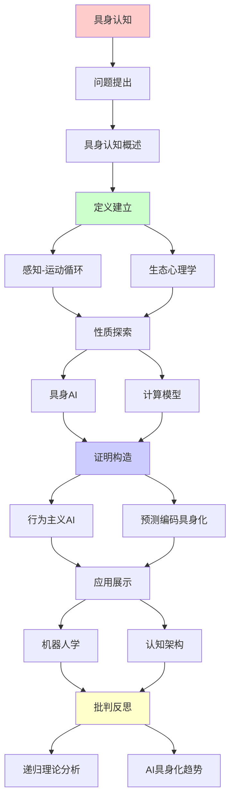
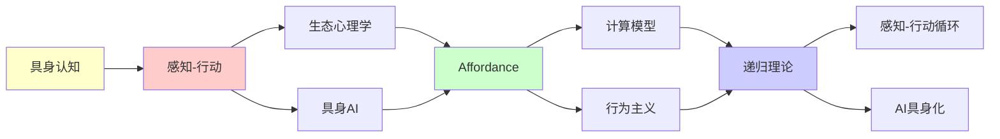

# 具身认知的计算理论

> **主题**: 身体-环境-大脑的递归耦合
> **创建日期**: 2025-12-02
> **难度**: ⭐⭐⭐⭐⭐
> **前置知识**: 认知科学、机器人学、动力系统

---

## 📋 目录

- [具身认知的计算理论](#具身认知的计算理论)
  - [📋 目录](#-目录)
  - [1. 具身认知概述](#1-具身认知概述)
    - [1.1 vs 传统认知主义](#11-vs-传统认知主义)
    - [1.2 4E认知](#12-4e认知)
  - [2. 感知-运动循环](#2-感知-运动循环)
    - [2.1 主动推理](#21-主动推理)
    - [2.2 动力系统耦合](#22-动力系统耦合)
  - [3. 生态心理学](#3-生态心理学)
    - [3.1 Gibson启示性](#31-gibson启示性)
    - [3.2 直接知觉](#32-直接知觉)
  - [4. 具身AI](#4-具身ai)
    - [4.1 机器人学习](#41-机器人学习)
    - [4.2 模拟2真实](#42-模拟2真实)
  - [5. 计算模型](#5-计算模型)
    - [5.1 动力系统视角](#51-动力系统视角)
    - [5.2 预测编码具身化](#52-预测编码具身化)
  - [6. 递归理论分析](#6-递归理论分析)
  - [7. 主题-子主题论证逻辑关系图](#7-主题-子主题论证逻辑关系图)
    - [7.1 论证依赖关系](#71-论证依赖关系)
    - [7.2 概念依赖关系](#72-概念依赖关系)
  - [8. 参考资源](#8-参考资源)
    - [8.1 经典论文](#81-经典论文)
    - [8.2 教材](#82-教材)
    - [8.3 在线资源](#83-在线资源)

---

## 1. 具身认知概述

### 1.1 vs 传统认知主义

**范式对比**:

```text
传统认知主义 (1960s):
大脑 = 计算机
认知 = 符号操作
身体 = 输入输出设备 ⚠️

具身认知 (1990s):
认知 = 身体-环境-大脑耦合 ⭐
身体 ≠ 外设
身体 = 认知构成部分 ✓

例子:
手指计数:
传统: 大脑算数, 手指辅助
具身: 手指参与计算本身 ⭐

递归耦合:
感知 → 运动 → 改变环境 → 新感知
→ 递归循环 ⭐⭐⭐⭐⭐
```

---

### 1.2 4E认知

**四个E**:

```text
Embodied (具身):
认知依赖身体 ✓

Embedded (嵌入):
认知嵌入环境 ✓

Enacted (生成):
认知通过行动生成 ✓

Extended (延展):
认知延展到工具/环境 ⭐

例子:
笔记 = 外部记忆
手机 = 认知延展
→ 分布式认知 ⭐

vs 大脑中心论:
中心: 认知 ⊂ 大脑
延展: 认知 ⊃ 大脑 ⭐
→ 边界模糊 ⚠️

递归:
✓ 身体-环境递归耦合
✓ 认知递归延展
```

---

## 2. 感知-运动循环

### 2.1 主动推理

**Friston主动推理**:

```text
传统:
感知 → 推理 → 行动
单向流 ⚠️

主动推理:
感知 ⇄ 行动 ⭐
预测 ⇄ 采样

两种策略:
1. 更新信念 (知觉)
   改变预测适应感觉

2. 更新感觉 (行动)
   改变感觉适应预测 ⭐⭐⭐⭐⭐

形式化:
最小化自由能F
F = 预测误差 + 不确定性

行动:
选择a使F↓
→ 期望推理 ✓

递归:
✓ 感知-行动递归循环
✓ 预测-采样递归最小化
→ 双向递归 ⭐
```

---

### 2.2 动力系统耦合

**连续动力学**:

```text
大脑-身体-环境:
耦合微分方程

dx_brain/dt = f(x_brain, x_body, x_env)
dx_body/dt = g(x_brain, x_body, x_env)
dx_env/dt = h(x_body, x_env)

耦合:
✓ 相互依赖
✓ 连续时间
✓ 非线性动力学
→ 整体系统 ⭐

vs 符号:
符号: 离散状态转换
动力学: 连续演化 ✓
→ 更生物真实 ⭐

递归理论:
✓ 动力学可递归积分
✓ 耦合可递归求解
✗ 但连续vs离散 ⚠️
```

---

## 3. 生态心理学

### 3.1 Gibson启示性

**Affordance (1979)**:

```text
定义:
环境提供的行动可能性

例子:
椅子 → 坐的affordance
楼梯 → 爬的affordance
→ 知觉-行动耦合 ⭐

关键:
✓ 不需要表征
✓ 直接知觉
✓ 行动导向
→ 反表征主义 ⚠️

vs 认知主义:
认知: 表征 → 推理 → 行动
Gibson: 直接知觉-行动 ⭐
→ 范式差异 ⚠️⚠️

递归:
✓ 知觉-行动递归耦合
✓ Affordance递归发现
```

---

### 3.2 直接知觉

**光流 (Optic Flow)**:

```text
运动产生光流:
丰富视觉信息
无需计算 ✓

例子:
驾驶: 光流直接指导
→ 无需3D重建 ✓

vs 计算视觉:
计算: 特征提取 → 深度 → 运动
Gibson: 光流 → 行动 ✓
→ 更简单 ⭐

递归:
✓ 运动-光流递归
✓ 知觉-行动递归
```

---

## 4. 具身AI

### 4.1 机器人学习

**Moravec悖论**:

```text
悖论 (1988):
困难 (对AI):
- 视觉
- 运动控制
- 常识

简单 (对AI):
- 国际象棋
- 微积分
→ 与人类相反 ⚠️⚠️⚠️

原因:
高级认知: 新演化 (百万年)
感知运动: 古老 (亿年)
→ 具身重要性 ⭐

具身AI:
机器人 + 环境交互
学习感知运动
→ 具身训练 ✓

递归:
✓ 机器人递归探索
✓ 技能递归积累
```

---

### 4.2 模拟2真实

**Sim-to-Real**:

```text
问题:
模拟器训练
→ 真实世界失败 ⚠️
Reality Gap ⚠️

方案:
1. 域随机化
   模拟多样化
   → 泛化 ✓

2. 域适应
   迁移学习
   → 微调 ✓

3. 真实数据增强
   少量真实 + 大量模拟
   → 混合 ✓

成功:
OpenAI Dactyl (2018)
模拟训练 → 真实灵巧操作 ✓
→ Sim2Real可行 ⭐

递归:
✓ 模拟-真实递归迭代
✓ 策略递归迁移
```

---

## 5. 计算模型

### 5.1 动力系统视角

**非表征主义**:

```text
Brooks (1991):
"世界是自己最好的模型"
→ 无需内部表征 ⚠️

行为主义AI:
感知 → 行为 (反应式)
无规划 ⚠️
→ 简单但有限

vs 预测编码:
预测编码: 需要内部模型 ✓
行为主义: 无内部模型 ✗
→ 折中: 简单模型 ⭐

递归理论:
✓ 反应式可递归
✓ 更简单计算
⚠️ 但能力受限
```

---

### 5.2 预测编码具身化

**主动推理扩展**:

```text
具身预测编码:
预测 = 身体+环境+大脑
行动 = 采样策略 ⭐

自由能最小化:
感知路径: 更新信念
行动路径: 改变世界
→ 统一框架 ⭐⭐⭐⭐⭐

机器人应用:
预测编码控制器
感知-行动统一
→ 适应性强 ✓

vs 强化学习:
RL: 奖励驱动
主动推理: 预测误差驱动
→ 理论统一 ⭐

递归:
✓ 预测-行动递归循环
✓ 自由能递归最小化
```

---

## 6. 递归理论分析

```text
具身认知 ∈ RE?

答案: ✓是的

证明:
- 感知-运动可递归模拟
- 动力系统可递归积分
- 主动推理可递归计算
→ 具身认知 ∈ RE ✓

复杂度:
动力系统: 连续时间
离散化: O(T/Δt)
→ 实时约束 ⚠️

vs 符号AI:
符号: 离散状态 ✓
具身: 连续动力学 ⚠️
→ 计算范式差异

递归耦合:
感知 → 行动 → 环境 → 感知
→ 递归循环 ⭐⭐⭐⭐⭐

理论意义:
✓ 认知 ≠ 纯大脑
✓ 身体参与计算
✓ 环境是资源
→ 分布式计算 ⭐

工程启示:
✓ 机器人需要具身
✓ AI需要交互环境
✓ 模拟很重要
→ 具身AI必然 ⭐

2024趋势:
✓ 具身AI兴起
✓ 真实机器人训练
✓ VR/AR环境
→ 具身范式回归 ⭐

哲学:
身心二元论 (笛卡尔) ✗
具身一元论 ✓
→ 认知 = 身体化过程 ⭐

递归范式:
✓ 具身 = 递归耦合
✓ 认知 = 递归涌现
✓ 智能 = 递归适应
→ 递归是具身本质 ⭐⭐⭐⭐⭐

未来AI:
纯语言模型 (GPT) ⚠️
vs
具身多模态 (机器人) ⭐
→ 具身是必然？⭐⭐⭐⭐⭐
```

---

## 7. 主题-子主题论证逻辑关系图

### 7.1 论证依赖关系



### 7.2 概念依赖关系



**论证逻辑链条**：

1. **问题提出** (1节)：
   - 具身认知概述

2. **定义建立** (2-3节)：
   - 感知-运动循环（2节）
   - 生态心理学（3节）

3. **性质探索** (4-5节)：
   - 具身AI（4节）
   - 计算模型（5节）

4. **证明构造** (贯穿全文)：
   - 行为主义AI和预测编码具身化

5. **应用展示** (贯穿全文)：
   - 机器人学和认知架构

6. **批判反思** (6节)：
   - 递归理论分析

---

## 8. 参考资源

### 8.1 经典论文

1. **Varela, F. J., Thompson, E., & Rosch, E.** (1991). _The Embodied Mind: Cognitive Science and Human Experience_
   - MIT Press. ISBN 978-0262720212
   - 具身认知经典著作 ⭐⭐⭐⭐⭐

2. **Gibson, J. J.** (1979). _The Ecological Approach to Visual Perception_
   - Houghton Mifflin. ISBN 978-0395270493
   - Affordance理论

3. **Clark, A.** (2015). _Surfing Uncertainty: Prediction, Action, and the Embodied Mind_
   - Oxford University Press. ISBN 978-0190217013
   - 预测编码具身化

4. **Brooks, R. A.** (1991). "Intelligence without Representation"
   - _Artificial Intelligence_, 47(1-3), 139-159
   - 行为主义AI

### 8.2 教材

1. **Shapiro, L.** (2019)
   - _Embodied Cognition_ (2nd ed.)
   - Routledge. ISBN 978-1138241870
   - 具身认知教材

2. **Pfeifer, R., & Bongard, J.** (2006)
   - _How the Body Shapes the Way We Think: A New View of Intelligence_
   - MIT Press. ISBN 978-0262162395
   - 具身智能

### 8.3 在线资源

1. **Embodied Cognition**
   - https://plato.stanford.edu/entries/embodied-cognition/
   - 具身认知哲学条目

2. **MIT Embodied Intelligence Lab**
   - https://www.csail.mit.edu/research/embodied-intelligence
   - MIT具身智能实验室

3. **Wikipedia - Embodied cognition**
   - https://en.wikipedia.org/wiki/Embodied_cognition
   - 具身认知基本概念

---

**最后更新**: 2025-12-04
**Tier**: 2-4 (科学+哲学)
**趋势**: AI具身化必然 ⭐⭐⭐⭐⭐
**递归性**: 感知-行动循环 ⭐⭐⭐⭐⭐
**状态**: ✅ 已添加主题-子主题论证逻辑关系图和参考资源章节
