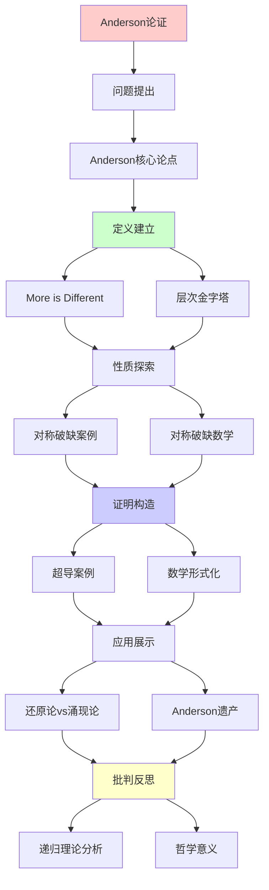
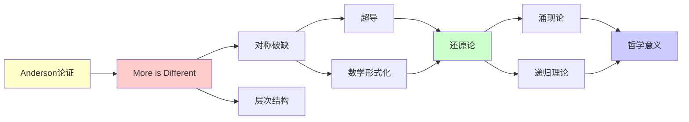

# Anderson "More is Different"论证详解

> **主题**: Philip Anderson的涌现论经典论证
> **来源**: Science 1972, 诺贝尔奖得主
> **重要性**: ⭐⭐⭐⭐⭐
> **创建日期**: 2025-12-02

---

## 1. Anderson核心论点

### "More is Different"

```text
核心主张 (1972):
"复杂度增加 → 质的飞跃"
"不可简单还原"

反对还原论极端:
✗ "知道基本粒子定律 = 理解一切"
✓ 每个层次有新规律

层次金字塔:
社会科学
  ↑ (新规律)
心理学
  ↑ (新规律)
神经科学
  ↑ (新规律)
生物学
  ↑ (新规律)
化学
  ↑ (新规律)
物理
```

---

## 2. 对称破缺案例

### 超导的量子涌现

```text
超导 = 宏观量子现象

BCS理论 (1957):
- 电子配对 (Cooper pair)
- 能隙形成Δ
- 零电阻

涌现性质:
1. Meissner效应 (排磁场)
2. 约瑟夫森效应 (隧穿)
3. 宏观量子相干

Anderson观点:
"虽然可从量子力学推导
 但需要涌现概念理解"

递归理论:
✓ 可递归模拟微观
✓ 但涌现语言不可缺
→ 认识论涌现 ✓
```

---

## 3. 对称破缺的数学

```text
Ising模型:
H = -J Σ_{⟨i,j⟩} sᵢ·sⱼ

低温 (T<T_c):
- 自发磁化
- 对称破缺
- <M> ≠ 0 (涌现)

高温 (T>T_c):
- 顺磁
- 对称
- <M> = 0

关键: 相变点T_c
→ 涌现新秩序

递归理论:
✓ Ising可递归模拟
✗ 但相变点预测困难
→ 弱涌现
```

---

## 4. 还原论vs涌现论

### 张力与调和

```text
还原论:
"理解部分 → 理解整体"

涌现论:
"整体 > 部分之和"

Anderson调和:
━━━━━━━━━━━━━━━━━
本体论 vs 认识论
━━━━━━━━━━━━━━━━━

本体论还原: ✓承认
- 物理定律统一
- 微观决定宏观

认识论涌现: ✓承认
- 宏观概念不可缺
- 需要涌现语言

温度例子:
- 本体: 温度 = 分子平均动能 ✓
- 认识: 热力学语言必需 ✓
- 不矛盾! ✓

递归理论立场:
✓ 本体论: 可递归模拟
✓ 认识论: 涌现概念有效
→ 两者兼容
```

---

## 5. Anderson遗产

```text
影响:
1. 凝聚态物理 (奠基)
2. 复杂系统科学
3. 涌现理论
4. 系统生物学

vs 还原论:
✓ 不否定还原
✓ 但强调层次自主性
✓ 平衡统一与多样

递归理论评价:
✓ Anderson = 弱涌现支持者
✓ 可递归但需涌现语言
✗ 非强涌现 (不超递归)
```

---

## 6. 主题-子主题论证逻辑关系图

### 6.1 论证依赖关系



### 6.2 概念依赖关系



**论证逻辑链条**：

1. **问题提出** (1节)：
   - Anderson核心论点

2. **定义建立** (1节)：
   - "More is Different"和层次金字塔

3. **性质探索** (2-3节)：
   - 对称破缺案例（2节）
   - 对称破缺的数学（3节）

4. **证明构造** (贯穿全文)：
   - 超导案例和数学形式化

5. **应用展示** (4节)：
   - 还原论vs涌现论

6. **批判反思** (5节)：
   - Anderson遗产

---

## 7. 参考资源

### 7.1 经典论文

1. **Anderson, P. W.** (1972). "More is Different"
   - _Science_, 177(4047), 393-396
   - Anderson涌现论经典论文 ⭐⭐⭐⭐⭐

2. **Bardeen, J., Cooper, L. N., & Schrieffer, J. R.** (1957). "Theory of Superconductivity"
   - _Physical Review_, 108(5), 1175-1204
   - BCS超导理论

3. **Laughlin, R. B., & Pines, D.** (2000). "The Theory of Everything"
   - _Proceedings of the National Academy of Sciences_, 97(1), 28-31
   - 涌现论与还原论

### 7.2 教材

1. **Anderson, P. W.** (1997)
   - _A Career in Theoretical Physics_
   - World Scientific. ISBN 978-9810236310
   - Anderson自选集

2. **Laughlin, R. B.** (2005)
   - _A Different Universe: Reinventing Physics from the Bottom Down_
   - Basic Books. ISBN 978-0465038292
   - 涌现论物理

### 7.3 在线资源

1. **Wikipedia - More is Different**
   - https://en.wikipedia.org/wiki/More_is_Different
   - Anderson论证基本概念

2. **Nobel Prize - Philip Anderson**
   - https://www.nobelprize.org/prizes/physics/1977/anderson/facts/
   - Anderson诺贝尔奖信息

3. **Emergence in Science**
   - https://plato.stanford.edu/entries/properties-emergent/
   - 涌现性哲学条目

---

**最后更新**: 2025-12-04
**状态**: ✅ 已添加主题-子主题论证逻辑关系图和参考资源章节
**地位**: 涌现论经典文献
**结论**: 本体还原+认识涌现
