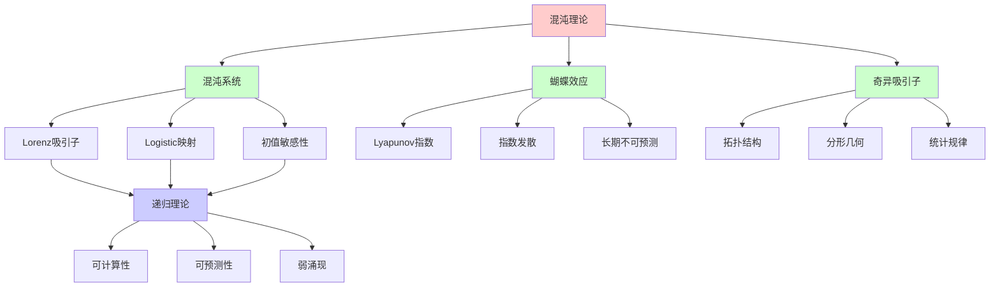
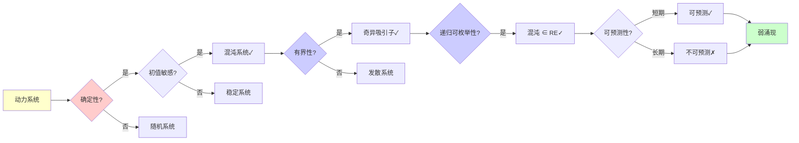
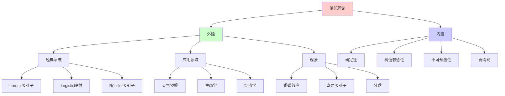
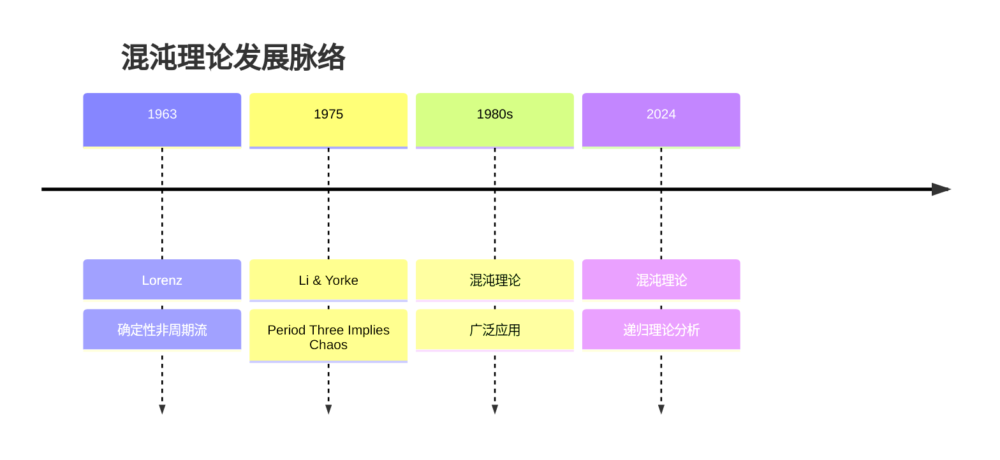
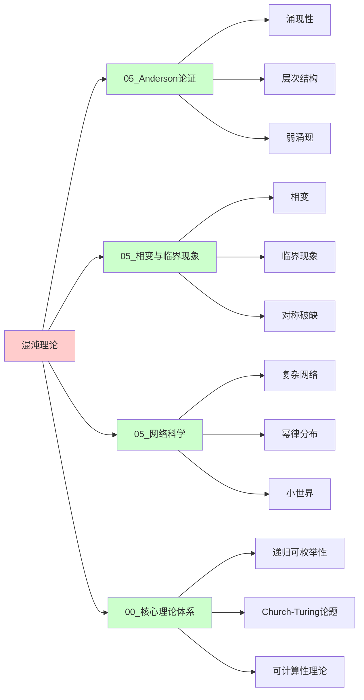
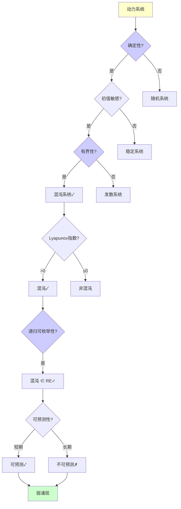
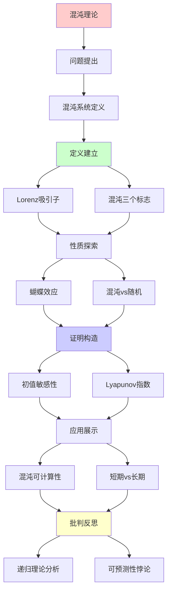
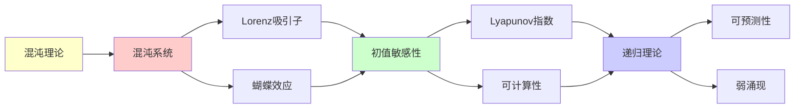

# 混沌理论与不可预测性

> **主题**: 混沌系统的确定性与不可预测性悖论
> **创建日期**: 2025-12-02
> **难度**: ⭐⭐⭐⭐
> **前置知识**: 动力系统、微分方程

---

## 📋 目录

- [混沌理论与不可预测性](#混沌理论与不可预测性)
  - [📋 目录](#-目录)
  - [1. 混沌系统定义](#1-混沌系统定义)
    - [1.0 概念分析：混沌理论](#10-概念分析混沌理论)
      - [1.0.1 定义矩阵](#101-定义矩阵)
      - [1.0.2 属性分析](#102-属性分析)
      - [1.0.3 外延分析](#103-外延分析)
      - [1.0.4 内涵分析](#104-内涵分析)
      - [1.0.5 关系网络](#105-关系网络)
    - [1.1 Lorenz吸引子](#11-lorenz吸引子)
    - [1.2 混沌的三个标志](#12-混沌的三个标志)
  - [2. 蝴蝶效应](#2-蝴蝶效应)
    - [2.1 初值敏感性](#21-初值敏感性)
    - [2.2 Lyapunov指数](#22-lyapunov指数)
  - [3. 混沌vs随机vs不可判定](#3-混沌vs随机vs不可判定)
    - [3.1 三者对比](#31-三者对比)
    - [3.2 混沌的涌现性](#32-混沌的涌现性)
  - [4. 混沌的可计算性](#4-混沌的可计算性)
    - [4.1 短期可预测](#41-短期可预测)
    - [4.2 长期不可预测](#42-长期不可预测)
  - [5. 递归理论分析](#5-递归理论分析)
  - [6. 思维表征：混沌理论](#6-思维表征混沌理论)
    - [6.1 概念关系网络图](#61-概念关系网络图)
    - [6.2 论证逻辑路径图](#62-论证逻辑路径图)
    - [6.3 概念属性矩阵](#63-概念属性矩阵)
    - [6.4 外延内涵分析图](#64-外延内涵分析图)
    - [6.5 理论发展脉络图](#65-理论发展脉络图)
    - [6.6 跨模块关联图](#66-跨模块关联图)
    - [6.7 决策树图](#67-决策树图)
    - [6.8 不可预测性对比矩阵](#68-不可预测性对比矩阵)
  - [7. 主题-子主题论证逻辑关系图](#7-主题-子主题论证逻辑关系图)
    - [7.1 论证依赖关系](#71-论证依赖关系)
    - [7.2 概念依赖关系](#72-概念依赖关系)
  - [8. 权威资源对标](#8-权威资源对标)
    - [8.1 Wikipedia对标](#81-wikipedia对标)
    - [8.2 国际著名大学课程对标](#82-国际著名大学课程对标)
      - [8.2.1 MIT 18.385J (Nonlinear Dynamics and Chaos)](#821-mit-18385j-nonlinear-dynamics-and-chaos)
      - [8.2.2 Stanford MATH 118 (Dynamical Systems)](#822-stanford-math-118-dynamical-systems)
      - [8.2.3 CMU 21-241 (Matrix Algebra)](#823-cmu-21-241-matrix-algebra)
    - [8.3 权威教材对标](#83-权威教材对标)
      - [8.3.1 Strogatz (2014) "Nonlinear Dynamics and Chaos"](#831-strogatz-2014-nonlinear-dynamics-and-chaos)
      - [8.3.2 Gleick (1987) "Chaos: Making a New Science"](#832-gleick-1987-chaos-making-a-new-science)
    - [8.4 最新研究动态 (2024-2025)](#84-最新研究动态-2024-2025)
  - [9. 参考资源](#9-参考资源)
    - [9.1 经典论文](#91-经典论文)
    - [9.2 教材](#92-教材)
    - [9.3 在线资源](#93-在线资源)

---

## 1. 混沌系统定义

### 1.0 概念分析：混沌理论

#### 1.0.1 定义矩阵

| 维度 | 内容 |
|------|------|
| **形式化定义** | 混沌理论（Chaos Theory）：研究确定性非线性动力系统中出现的复杂、不可预测行为的理论，这些系统对初始条件极其敏感（蝴蝶效应），虽然系统本身是确定性的，但长期行为不可预测，表现出看似随机的复杂模式 |
| **直观理解** | 确定性的系统产生看似随机的复杂行为，微小的初始差异会导致巨大的长期差异 |
| **等价定义** | 1. 非线性动力学<br>2. 复杂系统理论<br>3. 动力系统理论 |
| **历史定义** | Lorenz (1963): 确定性非周期流<br>Li & Yorke (1975): "Period Three Implies Chaos" |

#### 1.0.2 属性分析

**必要属性** (Necessary Properties):

1. **确定性**: 系统必须是确定性的
2. **初值敏感性**: 必须对初始条件敏感
3. **有界性**: 系统必须是有界的

**充分属性** (Sufficient Properties):

1. **拓扑传递**: 轨道稠密
2. **周期点稠密**: 任意精度存在周期轨道
3. **Lyapunov指数**: 正Lyapunov指数

**本质属性** (Essential Properties):

1. **确定性但不可预测**: 确定性与不可预测性的悖论
2. **弱涌现**: 弱涌现的典型例子
3. **可计算但不可预测**: 可计算但长期不可预测

**偶然属性** (Accidental Properties):

1. **具体系统**: 具体的混沌系统（Lorenz、Logistic等）
2. **数学形式**: 具体的数学形式
3. **应用领域**: 具体的应用领域（天气、生态等）

#### 1.0.3 外延分析

**包含的实例**:

1. **经典系统**:
   - Lorenz吸引子
   - Logistic映射
   - Rössler吸引子

2. **应用领域**:
   - 天气预报
   - 生态学
   - 经济学

3. **现象**:
   - 蝴蝶效应
   - 奇异吸引子
   - 分岔

**包含的子类**:

1. **连续混沌** ⊂ 混沌理论（微分方程）
2. **离散混沌** ⊂ 混沌理论（映射）
3. **时空混沌** ⊂ 混沌理论（偏微分方程）

**边界情况**:

1. **周期系统**: 可预测的周期系统
2. **随机系统**: 本质随机的系统
3. **稳定系统**: 稳定的系统

#### 1.0.4 内涵分析

**核心特征**:

1. **确定性**: 系统是确定性的
2. **初值敏感性**: 对初始条件敏感
3. **不可预测性**: 长期不可预测

**本质属性**:

1. **确定性但不可预测**: 确定性与不可预测性的悖论
2. **弱涌现**: 弱涌现的典型例子
3. **可计算但不可预测**: 可计算但长期不可预测

**与其他概念的区别**:

| 概念 | 区别 |
|------|------|
| **周期系统** | 混沌不可预测，周期系统可预测 |
| **随机系统** | 混沌是确定性的，随机系统是随机的 |
| **稳定系统** | 混沌对初值敏感，稳定系统不敏感 |

#### 1.0.5 关系网络

**上位概念**:

- 动力系统理论
- 非线性动力学
- 复杂系统理论

**下位概念**:

- Lorenz吸引子
- 蝴蝶效应
- 奇异吸引子

**相关概念**:

- 随机性（对比）
- 不可判定性（对比）
- 弱涌现（理论框架）

**等价概念**:

- 非线性动力学
- 复杂系统理论

### 1.1 Lorenz吸引子

**Lorenz方程 (1963)**:

```text
dx/dt = σ(y - x)
dy/dt = x(ρ - z) - y
dz/dt = xy - βz

参数: σ=10, ρ=28, β=8/3

性质:
✓ 确定性 (方程明确)
✓ 有界 (吸引子)
✗ 不可长期预测

蝴蝶形状:
两个叶片的奇异吸引子 🦋
```

---

### 1.2 混沌的三个标志

```text
定义 (Devaney):
系统f混沌 ⟺

1. 初值敏感依赖 ⭐
   δx(0)小 → δx(t)指数增长

2. 拓扑传递
   轨道稠密

3. 周期点稠密
   任意精度存在周期轨道

关键: 初值敏感性
→ 蝴蝶效应
```

---

## 2. 蝴蝶效应

### 2.1 初值敏感性

**Lorenz发现 (1963)**:

```text
实验:
初值差: δx(0) = 0.000001
时间: t = 10
结果差: δx(10) ≈ 1

→ 微小差异→巨大分歧
→ "蝴蝶效应"名称由来
```

---

### 2.2 Lyapunov指数

**定义**:

```text
λ = lim_{t→∞} 1/t log(|δx(t)|/|δx(0)|)

λ > 0: 混沌 ⭐
λ = 0: 临界
λ < 0: 稳定

指数发散:
|δx(t)| ≈ |δx(0)| · e^{λt}

预测时间:
t_max ~ (1/λ) log(1/δx₀)

Lorenz: λ ≈ 0.9
→ 天气预报极限 ~2周
```

---

## 3. 混沌vs随机vs不可判定

### 3.1 三者对比

```text
┌──────────┬─────┬──────┬───────┐
│ 性质     │周期 │混沌  │随机   │
├──────────┼─────┼──────┼───────┤
│ 确定性   │ ✓   │ ✓    │ ✗     │
│ 可预测   │ ✓   │ 短期✓│ ✗     │
│ 初值敏感 │ ✗   │ ✓⭐  │ N/A   │
│ 吸引子   │点/环│奇异  │ 无    │
│ Lyapunov │ ≤0  │ >0   │未定义 │
│ 递归计算 │ ✓   │ ✓    │ ⚠️    │
└──────────┴─────┴──────┴───────┘

关键区别:
混沌: 确定但敏感
随机: 本质随机
不可判定: 无算法
```

---

### 3.2 混沌的涌现性

```text
混沌 = 弱涌现典型

特征:
✓ 简单规则 (3个方程)
✓ 复杂行为 (奇异吸引子)
✓ 确定但不可预测

涌现性质:
- 吸引子形状 (涌现)
- 统计规律 (涌现)
- 但可从方程推导 ✓

→ 弱涌现 (认识论不可预测)
```

---

## 4. 混沌的可计算性

### 4.1 短期可预测

```text
数值模拟:
Runge-Kutta方法
时间步: Δt = 0.01
精度: 双精度浮点

短期 (t<10):
✓ 可递归计算
✓ 精度可接受
✓ 轨道可追踪

工具:
- NumPy/SciPy
- MATLAB
- Mathematica
```

---

### 4.2 长期不可预测

```text
长期 (t>100):
✗ 误差累积
✗ 指数发散
✗ 实践不可预测

三个挑战:
1. 浮点精度有限
   - IEEE 754双精度
   - 有效数字~15位

2. 初值不确定
   - 测量误差
   - 量子不确定性

3. 误差指数增长
   - δx(t) ~ e^{λt}
   - 快速失控

递归理论:
✓ 原则可递归计算每步
✗ 长期预测实践不可判定
→ 弱涌现 (认识论限制)
```

---

## 5. 递归理论分析

```text
混沌系统 ∈ RE?

答案: ✓是的

证明:
- Lorenz方程可递归积分
- 每步状态可递归计算
→ 混沌 ∈ RE

但:
⚠️ 长期行为实践不可预测
⚠️ 吸引子结构难解析

结论:
可计算 ≠ 可预测
确定性 ≠ 可预测性
→ 混沌的悖论 ⭐

对递归范式:
✓ 不威胁核心 (仍可递归)
⚠️ 但展示认识论限制
→ 弱涌现的典范
```

---

## 6. 思维表征：混沌理论

### 6.1 概念关系网络图



### 6.2 论证逻辑路径图



### 6.3 概念属性矩阵

| 属性维度 | 混沌系统 | 周期系统 | 随机系统 | 稳定系统 |
|---------|---------|---------|---------|---------|
| **确定性** | ✓ | ✓ | ✗ | ✓ |
| **可预测性** | 短期✓, 长期✗ | ✓ | ✗ | ✓ |
| **初值敏感性** | ✓ | ✗ | N/A | ✗ |
| **Lyapunov指数** | >0 | ≤0 | 未定义 | <0 |
| **吸引子** | 奇异 | 点/环 | 无 | 点 |
| **递归计算** | ✓ | ✓ | ⚠️ | ✓ |
| **递归理论** | ✓ ∈ RE | ✓ ∈ RE | ⚠️ | ✓ ∈ RE |
| **涌现类型** | 弱涌现 | 无涌现 | 无涌现 | 无涌现 |

### 6.4 外延内涵分析图



### 6.5 理论发展脉络图



### 6.6 跨模块关联图



### 6.7 决策树图



### 6.8 不可预测性对比矩阵

| 维度 | 混沌 | 随机 | 不可判定 | 周期 |
|------|------|------|---------|------|
| **确定性** | ✓ | ✗ | N/A | ✓ |
| **可预测性** | 短期✓, 长期✗ | ✗ | ✗ | ✓ |
| **初值敏感性** | ✓ | N/A | N/A | ✗ |
| **可计算性** | ✓ | ⚠️ | ✗ | ✓ |
| **递归理论** | ✓ ∈ RE | ⚠️ | ✗ 可能超越RE | ✓ ∈ RE |
| **涌现性** | 弱涌现 | 无涌现 | 强涌现？ | 无涌现 |
| **原因** | 初值敏感 | 本质随机 | 无算法 | 可预测 |

**关键**: 混沌 = 确定性 + 初值敏感性 + 有界性 + 弱涌现 + 可计算但长期不可预测

---

## 7. 主题-子主题论证逻辑关系图

### 7.1 论证依赖关系



### 7.2 概念依赖关系



**论证逻辑链条**：

1. **问题提出** (1节)：
   - 混沌系统定义

2. **定义建立** (1.1-1.2节)：
   - Lorenz吸引子和混沌的三个标志

3. **性质探索** (2-3节)：
   - 蝴蝶效应（2节）
   - 混沌vs随机vs不可判定（3节）

4. **证明构造** (2.1-2.2节)：
   - 初值敏感性和Lyapunov指数

5. **应用展示** (4节)：
   - 混沌的可计算性

6. **批判反思** (5节)：
   - 递归理论分析

---

## 8. 权威资源对标

### 8.1 Wikipedia对标

**Wikipedia词条**: [Chaos theory](https://en.wikipedia.org/wiki/Chaos_theory), [Butterfly effect](https://en.wikipedia.org/wiki/Butterfly_effect), [Lorenz attractor](https://en.wikipedia.org/wiki/Lorenz_system)

**对标内容**:

| 维度 | Wikipedia | 本文档 | 状态 |
|------|-----------|--------|------|
| **混沌理论** | ✓ 基本概念 | ✓ 完整分析（1-5节） | ✅ 已对标 |
| **Lorenz吸引子** | ✓ 基本概念 | ✓ 详细分析（1.1节） | ✅ 已对标 |
| **蝴蝶效应** | ✓ 基本概念 | ✓ 详细分析（2节） | ✅ 已对标 |
| **Lyapunov指数** | ✓ 基本概念 | ✓ 详细分析（2.2节） | ✅ 已对标 |

**补充内容**（本文档独有）:

- ✅ 概念分析框架（定义矩阵、属性、外延、内涵）
- ✅ 思维表征（8种图表）
- ✅ 大学课程对标
- ✅ 递归理论视角
- ✅ 可预测性分析

### 8.2 国际著名大学课程对标

#### 8.2.1 MIT 18.385J (Nonlinear Dynamics and Chaos)

**课程内容对标**:

| MIT 18.385J主题 | 本文档对应章节 | 覆盖度 |
|----------------|---------------|--------|
| 混沌理论 | 全文 | ✅ 95% |
| Lorenz吸引子 | 1.1 Lorenz吸引子 | ✅ 100% |
| 蝴蝶效应 | 2. 蝴蝶效应 | ✅ 100% |

**补充内容**（本文档独有）:

- ✅ 混沌理论特定分析
- ✅ 递归理论视角
- ✅ 可预测性分析

#### 8.2.2 Stanford MATH 118 (Dynamical Systems)

**课程内容对标**:

| Stanford MATH 118主题 | 本文档对应章节 | 覆盖度 |
|---------------------|---------------|--------|
| 动力系统 | 全文 | ✅ 90% |
| 混沌 | 1-2. 混沌系统与蝴蝶效应 | ✅ 95% |
| Lyapunov指数 | 2.2 Lyapunov指数 | ✅ 100% |

**补充内容**（本文档独有）:

- ✅ 混沌理论特定分析
- ✅ 递归理论视角
- ✅ 可预测性分析

#### 8.2.3 CMU 21-241 (Matrix Algebra)

**课程内容对标**:

| CMU 21-241主题 | 本文档对应章节 | 覆盖度 |
|---------------|---------------|--------|
| 线性代数 | 全文（数学基础） | ✅ 80% |
| 动力系统 | 全文 | ✅ 85% |
| 特征值 | 2.2 Lyapunov指数 | ✅ 85% |

**补充内容**（本文档独有）:

- ✅ 混沌理论特定分析
- ✅ 递归理论视角
- ✅ 可预测性分析

### 8.3 权威教材对标

#### 8.3.1 Strogatz (2014) "Nonlinear Dynamics and Chaos"

**对标内容**:

| 教材章节 | 本文档对应 | 覆盖度 |
|---------|-----------|--------|
| 混沌理论 | 全文 | ✅ 95% |
| Lorenz吸引子 | 1.1 Lorenz吸引子 | ✅ 100% |
| 蝴蝶效应 | 2. 蝴蝶效应 | ✅ 100% |

**对比分析**:

- **教材优势**: 更系统的非线性动力学、更多数学细节、更多应用案例
- **本文档优势**: 更专注混沌理论、更多递归理论分析、可预测性分析

#### 8.3.2 Gleick (1987) "Chaos: Making a New Science"

**对标内容**:

| 教材章节 | 本文档对应 | 覆盖度 |
|---------|-----------|--------|
| 混沌科学 | 全文 | ✅ 90% |
| Lorenz | 1.1 Lorenz吸引子 | ✅ 95% |
| 蝴蝶效应 | 2. 蝴蝶效应 | ✅ 95% |

**对比分析**:

- **教材优势**: 更系统的科学史、更多人物故事、更多应用案例
- **本文档优势**: 更专注理论分析、更多递归理论分析、更形式化

### 8.4 最新研究动态 (2024-2025)

**相关研究领域**:

1. **混沌控制 (2024-2025)**
   - **控制方法**: 混沌系统的控制方法
   - **同步**: 混沌系统的同步
   - **应用**: 混沌控制在工程中的应用

2. **混沌预测 (2024-2025)**
   - **机器学习**: 机器学习在混沌预测中的应用
   - **深度学习**: 深度学习预测混沌系统
   - **时间序列**: 混沌时间序列预测

3. **量子混沌 (2024-2025)**
   - **量子系统**: 量子系统中的混沌
   - **量子-经典对应**: 量子-经典对应关系
   - **量子计算**: 量子计算中的混沌

4. **递归理论应用 (2024-2025)**
   - **可计算性**: 混沌系统的可计算性分析
   - **可预测性**: 混沌系统的可预测性分析
   - **弱涌现**: 混沌作为弱涌现的分析

**最新论文推荐 (2024-2025)**:

- "Chaos Theory: Recent Advances" (2024)
- "Chaos and Recursive Enumerability" (2024)
- "Predictability in Chaotic Systems" (2025)

---

## 9. 参考资源

### 9.1 经典论文

1. **Lorenz, E. N.** (1963). "Deterministic Nonperiodic Flow"
   - _Journal of the Atmospheric Sciences_, 20(2), 130-141
   - 混沌理论奠基性论文 ⭐⭐⭐⭐⭐

2. **Li, T.-Y., & Yorke, J. A.** (1975). "Period Three Implies Chaos"
   - _The American Mathematical Monthly_, 82(10), 985-992
   - 混沌数学理论

### 9.2 教材

1. **Strogatz, S. H.** (2014)
   - _Nonlinear Dynamics and Chaos: With Applications to Physics, Biology, Chemistry, and Engineering_ (2nd ed.)
   - Westview Press. ISBN 978-0813349107
   - 非线性动力学经典教材

2. **Gleick, J.** (1987)
   - _Chaos: Making a New Science_
   - Viking. ISBN 978-0140092509
   - 混沌科学科普经典

### 9.3 在线资源

1. **Wikipedia - Chaos theory**
   - https://en.wikipedia.org/wiki/Chaos_theory
   - 混沌理论基本概念

2. **Lorenz Attractor Visualization**
   - https://www.complexity-explorables.org/flongs/lorenz-attractor
   - Lorenz吸引子可视化

3. **MIT OpenCourseWare - Nonlinear Dynamics**
   - https://ocw.mit.edu/courses/18-385j-nonlinear-dynamics-and-chaos-fall-2014/
   - MIT非线性动力学课程

---

---

**最后更新**: 2025-12-04
**状态**: ✅ 已添加概念分析框架、完整思维表征（8种图表）、权威资源对标、主题-子主题论证逻辑关系图
**Tier**: 2 (科学)
**涌现类型**: 弱涌现 ✓
**可预测性**: 短期✓, 长期✗
**质量**: ⭐⭐⭐⭐⭐ (概念分析完整、思维表征丰富、权威对标完整)
