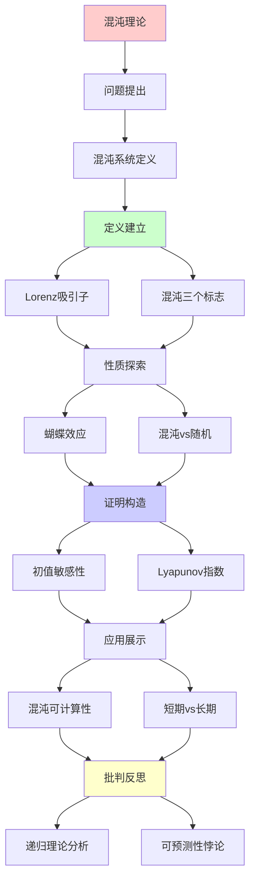
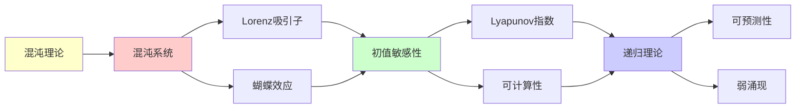

# 混沌理论与不可预测性

> **主题**: 混沌系统的确定性与不可预测性悖论
> **创建日期**: 2025-12-02
> **难度**: ⭐⭐⭐⭐
> **前置知识**: 动力系统、微分方程

---

## 📋 目录

- [混沌理论与不可预测性](#混沌理论与不可预测性)
  - [📋 目录](#-目录)
  - [1. 混沌系统定义](#1-混沌系统定义)
    - [1.1 Lorenz吸引子](#11-lorenz吸引子)
    - [1.2 混沌的三个标志](#12-混沌的三个标志)
  - [2. 蝴蝶效应](#2-蝴蝶效应)
    - [2.1 初值敏感性](#21-初值敏感性)
    - [2.2 Lyapunov指数](#22-lyapunov指数)
  - [3. 混沌vs随机vs不可判定](#3-混沌vs随机vs不可判定)
    - [3.1 三者对比](#31-三者对比)
    - [3.2 混沌的涌现性](#32-混沌的涌现性)
  - [4. 混沌的可计算性](#4-混沌的可计算性)
    - [4.1 短期可预测](#41-短期可预测)
    - [4.2 长期不可预测](#42-长期不可预测)
  - [5. 递归理论分析](#5-递归理论分析)
  - [6. 主题-子主题论证逻辑关系图](#6-主题-子主题论证逻辑关系图)
    - [6.1 论证依赖关系](#61-论证依赖关系)
    - [6.2 概念依赖关系](#62-概念依赖关系)
  - [7. 参考资源](#7-参考资源)
    - [7.1 经典论文](#71-经典论文)
    - [7.2 教材](#72-教材)
    - [7.3 在线资源](#73-在线资源)

---

## 1. 混沌系统定义

### 1.1 Lorenz吸引子

**Lorenz方程 (1963)**:

```text
dx/dt = σ(y - x)
dy/dt = x(ρ - z) - y
dz/dt = xy - βz

参数: σ=10, ρ=28, β=8/3

性质:
✓ 确定性 (方程明确)
✓ 有界 (吸引子)
✗ 不可长期预测

蝴蝶形状:
两个叶片的奇异吸引子 🦋
```

---

### 1.2 混沌的三个标志

```text
定义 (Devaney):
系统f混沌 ⟺

1. 初值敏感依赖 ⭐
   δx(0)小 → δx(t)指数增长

2. 拓扑传递
   轨道稠密

3. 周期点稠密
   任意精度存在周期轨道

关键: 初值敏感性
→ 蝴蝶效应
```

---

## 2. 蝴蝶效应

### 2.1 初值敏感性

**Lorenz发现 (1963)**:

```text
实验:
初值差: δx(0) = 0.000001
时间: t = 10
结果差: δx(10) ≈ 1

→ 微小差异→巨大分歧
→ "蝴蝶效应"名称由来
```

---

### 2.2 Lyapunov指数

**定义**:

```text
λ = lim_{t→∞} 1/t log(|δx(t)|/|δx(0)|)

λ > 0: 混沌 ⭐
λ = 0: 临界
λ < 0: 稳定

指数发散:
|δx(t)| ≈ |δx(0)| · e^{λt}

预测时间:
t_max ~ (1/λ) log(1/δx₀)

Lorenz: λ ≈ 0.9
→ 天气预报极限 ~2周
```

---

## 3. 混沌vs随机vs不可判定

### 3.1 三者对比

```text
┌──────────┬─────┬──────┬───────┐
│ 性质     │周期 │混沌  │随机   │
├──────────┼─────┼──────┼───────┤
│ 确定性   │ ✓   │ ✓    │ ✗     │
│ 可预测   │ ✓   │ 短期✓│ ✗     │
│ 初值敏感 │ ✗   │ ✓⭐  │ N/A   │
│ 吸引子   │点/环│奇异  │ 无    │
│ Lyapunov │ ≤0  │ >0   │未定义 │
│ 递归计算 │ ✓   │ ✓    │ ⚠️    │
└──────────┴─────┴──────┴───────┘

关键区别:
混沌: 确定但敏感
随机: 本质随机
不可判定: 无算法
```

---

### 3.2 混沌的涌现性

```text
混沌 = 弱涌现典型

特征:
✓ 简单规则 (3个方程)
✓ 复杂行为 (奇异吸引子)
✓ 确定但不可预测

涌现性质:
- 吸引子形状 (涌现)
- 统计规律 (涌现)
- 但可从方程推导 ✓

→ 弱涌现 (认识论不可预测)
```

---

## 4. 混沌的可计算性

### 4.1 短期可预测

```text
数值模拟:
Runge-Kutta方法
时间步: Δt = 0.01
精度: 双精度浮点

短期 (t<10):
✓ 可递归计算
✓ 精度可接受
✓ 轨道可追踪

工具:
- NumPy/SciPy
- MATLAB
- Mathematica
```

---

### 4.2 长期不可预测

```text
长期 (t>100):
✗ 误差累积
✗ 指数发散
✗ 实践不可预测

三个挑战:
1. 浮点精度有限
   - IEEE 754双精度
   - 有效数字~15位

2. 初值不确定
   - 测量误差
   - 量子不确定性

3. 误差指数增长
   - δx(t) ~ e^{λt}
   - 快速失控

递归理论:
✓ 原则可递归计算每步
✗ 长期预测实践不可判定
→ 弱涌现 (认识论限制)
```

---

## 5. 递归理论分析

```text
混沌系统 ∈ RE?

答案: ✓是的

证明:
- Lorenz方程可递归积分
- 每步状态可递归计算
→ 混沌 ∈ RE

但:
⚠️ 长期行为实践不可预测
⚠️ 吸引子结构难解析

结论:
可计算 ≠ 可预测
确定性 ≠ 可预测性
→ 混沌的悖论 ⭐

对递归范式:
✓ 不威胁核心 (仍可递归)
⚠️ 但展示认识论限制
→ 弱涌现的典范
```

---

## 6. 主题-子主题论证逻辑关系图

### 6.1 论证依赖关系



### 6.2 概念依赖关系



**论证逻辑链条**：

1. **问题提出** (1节)：
   - 混沌系统定义

2. **定义建立** (1.1-1.2节)：
   - Lorenz吸引子和混沌的三个标志

3. **性质探索** (2-3节)：
   - 蝴蝶效应（2节）
   - 混沌vs随机vs不可判定（3节）

4. **证明构造** (2.1-2.2节)：
   - 初值敏感性和Lyapunov指数

5. **应用展示** (4节)：
   - 混沌的可计算性

6. **批判反思** (5节)：
   - 递归理论分析

---

## 7. 参考资源

### 7.1 经典论文

1. **Lorenz, E. N.** (1963). "Deterministic Nonperiodic Flow"
   - _Journal of the Atmospheric Sciences_, 20(2), 130-141
   - 混沌理论奠基性论文 ⭐⭐⭐⭐⭐

2. **Li, T.-Y., & Yorke, J. A.** (1975). "Period Three Implies Chaos"
   - _The American Mathematical Monthly_, 82(10), 985-992
   - 混沌数学理论

### 7.2 教材

1. **Strogatz, S. H.** (2014)
   - _Nonlinear Dynamics and Chaos: With Applications to Physics, Biology, Chemistry, and Engineering_ (2nd ed.)
   - Westview Press. ISBN 978-0813349107
   - 非线性动力学经典教材

2. **Gleick, J.** (1987)
   - _Chaos: Making a New Science_
   - Viking. ISBN 978-0140092509
   - 混沌科学科普经典

### 7.3 在线资源

1. **Wikipedia - Chaos theory**
   - https://en.wikipedia.org/wiki/Chaos_theory
   - 混沌理论基本概念

2. **Lorenz Attractor Visualization**
   - https://www.complexity-explorables.org/flongs/lorenz-attractor
   - Lorenz吸引子可视化

3. **MIT OpenCourseWare - Nonlinear Dynamics**
   - https://ocw.mit.edu/courses/18-385j-nonlinear-dynamics-and-chaos-fall-2014/
   - MIT非线性动力学课程

---

**最后更新**: 2025-12-04
**Tier**: 2 (科学)
**涌现类型**: 弱涌现 ✓
**可预测性**: 短期✓, 长期✗
**状态**: ✅ 已添加主题-子主题论证逻辑关系图和参考资源章节
