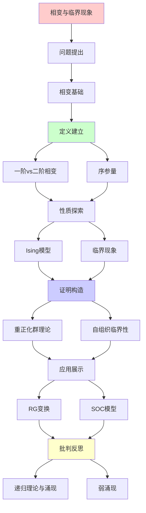
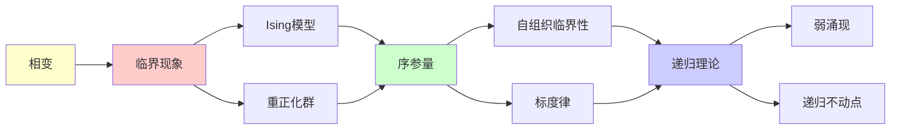

# 相变与临界现象

> **主题**: 相变的涌现性质与普适性
> **创建日期**: 2025-12-02
> **难度**: ⭐⭐⭐⭐
> **前置知识**: 统计力学、相变理论

---

## 📋 目录

- [相变与临界现象](#相变与临界现象)
  - [📋 目录](#-目录)
  - [1. 相变基础](#1-相变基础)
    - [1.1 一阶vs二阶相变](#11-一阶vs二阶相变)
    - [1.2 序参量](#12-序参量)
  - [2. Ising模型](#2-ising模型)
    - [2.1 模型定义](#21-模型定义)
    - [2.2 相变行为](#22-相变行为)
  - [3. 临界现象与标度律](#3-临界现象与标度律)
    - [3.1 临界指数](#31-临界指数)
    - [3.2 普适性类](#32-普适性类)
  - [4. 重正化群理论](#4-重正化群理论)
    - [4.1 RG变换](#41-rg变换)
    - [4.2 不动点](#42-不动点)
  - [5. 自组织临界性 (SOC)](#5-自组织临界性-soc)
    - [5.1 沙堆模型](#51-沙堆模型)
    - [5.2 幂律分布](#52-幂律分布)
  - [6. 递归理论与涌现](#6-递归理论与涌现)
  - [7. 主题-子主题论证逻辑关系图](#7-主题-子主题论证逻辑关系图)
    - [7.1 论证依赖关系](#71-论证依赖关系)
    - [7.2 概念依赖关系](#72-概念依赖关系)
  - [8. 参考资源](#8-参考资源)
    - [8.1 经典论文](#81-经典论文)
    - [8.2 教材](#82-教材)
    - [8.3 在线资源](#83-在线资源)

---

## 1. 相变基础

### 1.1 一阶vs二阶相变

**一阶相变** (不连续):

```text
例子: 水→冰 (0°C)

特征:
✓ 潜热释放/吸收
✓ 密度突变
✓ 不连续

序参量:
ρ_liquid ≠ ρ_ice (跳跃)
```

**二阶相变** (连续):

```text
例子: 铁磁→顺磁 (Tc)

特征:
✓ 无潜热
✓ 连续但导数不连续
✓ 临界涨落

序参量:
M(T) → 0 连续 (T→Tc)
但dM/dT → ∞
```

---

### 1.2 序参量

```text
序参量 η:
描述有序程度的物理量

例子:
- 磁化强度 M (铁磁)
- 密度差 Δρ (液气)
- 超流密度 ρ_s (超流)

涌现性质:
✓ η在微观不存在
✓ η是宏观涌现概念
✓ η=0: 对称相
✓ η≠0: 对称破缺 ⭐

→ 涌现秩序
```

---

## 2. Ising模型

### 2.1 模型定义

**哈密顿量**:

```text
H = -J Σ_{⟨i,j⟩} s_i·s_j - h Σ_i s_i

其中:
- s_i ∈ {+1, -1}: 自旋
- J > 0: 铁磁耦合
- h: 外磁场
- ⟨i,j⟩: 近邻

配分函数:
Z = Σ_{configs} e^{-βH}

递归理论:
✓ 配置可递归枚举
✓ Z可递归计算 (原则上)
✗ 但2^N种配置 (指数)
```

---

### 2.2 相变行为

```text
温度T vs 磁化M:

高温 (T > Tc):
- 无序 (顺磁)
- ⟨M⟩ = 0
- 对称

低温 (T < Tc):
- 有序 (铁磁)
- ⟨M⟩ ≠ 0 ⭐涌现
- 自发对称破缺

临界点 Tc:
- 关联长度 ξ → ∞
- 涨落发散
- 标度律涌现
```

---

## 3. 临界现象与标度律

### 3.1 临界指数

**幂律行为**:

```text
临界点附近:
ε = |T - Tc|/Tc → 0

标度律:
磁化: M ~ ε^β
磁化率: χ ~ ε^{-γ}
比热: C ~ ε^{-α}
关联长度: ξ ~ ε^{-ν}

临界指数:
α, β, γ, ν
→ 特征相变的普适数 ⭐
```

---

### 3.2 普适性类

**普适性 (Universality)**:

```text
不同微观系统 → 相同临界行为

例子:
- 2D Ising (铁磁)
- 液气临界点
- 超流相变
→ 相同β, γ, ν! ⭐⭐⭐⭐⭐

原因: 维度+对称性
细节无关!

涌现含义:
✓ 微观差异 → 宏观相同
✓ Anderson "More is Different"
✓ 但普适性是另一层次的"Same"
→ 辩证统一 ⭐
```

---

## 4. 重正化群理论

### 4.1 RG变换

**粗粒化**:

```text
Renormalization Group:
微观 → 粗粒化 → 宏观

操作:
1. 分块平均
2. 重新标度
3. 迭代

不动点:
临界点 = RG不动点
→ 标度不变性 ⭐

递归性质:
✓ RG = 递归粗粒化
✓ 不动点 = 递归定义
```

---

### 4.2 不动点

**RG流**:

```text
参数空间流动:
K₀ → RG(K₀) → K₁ → ...

不动点:
K* = RG(K*)
→ 临界点 ⭐

稳定性:
- 稳定不动点: 高温相
- 不稳定不动点: 临界点
- 鞍点: 分离不同相

递归理论:
✓ RG = 递归变换
✓ 不动点 = 00.4理论应用
→ 递归不动点的物理实现 ⭐⭐⭐⭐⭐
```

---

## 5. 自组织临界性 (SOC)

### 5.1 沙堆模型

**Bak-Tang-Wiesenfeld (1987)**:

```text
规则:
1. 随机位置加沙粒
2. 斜度>阈值 → 雪崩
3. 沙粒分给邻居
4. 递归雪崩

自组织:
系统自动趋向临界态
无需外部调节 ⭐

递归性质:
✓ 雪崩递归传播
✓ 自组织递归调整
```

---

### 5.2 幂律分布

```text
雪崩大小分布:
P(s) ~ s^{-τ}

无标度!
τ ≈ 1.0-1.5

实例:
- 地震 (Gutenberg-Richter)
- 森林火灾
- 物种灭绝
- 股市崩盘

递归理论:
✓ SOC可递归模拟
✗ 单个事件不可预测
✓ 统计规律可预测
→ 个体不可测，整体可测
```

---

## 6. 递归理论与涌现

```text
相变 = 弱涌现典型

可还原性:
✓ Ising可从微观推导
✓ 可递归模拟
✓ 配分函数可计算 (原则上)

但:
✗ 指数复杂度 (2^N)
✗ 临界点难精确
✗ 相变突现不可从单粒子看出

结论:
✓ 本体论: 可还原
✓ 认识论: 需涌现概念 (序参量)
→ 弱涌现 ✓

递归理论:
✓ 相变 ∈ RE
✓ 重正化群 = 递归不动点
✓ SOC = 递归自组织
→ 涌现可递归，但需涌现语言理解 ⭐
```

---

## 7. 主题-子主题论证逻辑关系图

### 7.1 论证依赖关系



### 7.2 概念依赖关系



**论证逻辑链条**：

1. **问题提出** (1节)：
   - 相变基础

2. **定义建立** (1.1-1.2节)：
   - 一阶vs二阶相变和序参量

3. **性质探索** (2-3节)：
   - Ising模型（2节）
   - 临界现象与标度律（3节）

4. **证明构造** (4-5节)：
   - 重正化群理论（4节）
   - 自组织临界性（5节）

5. **应用展示** (贯穿全文)：
   - RG变换和SOC模型

6. **批判反思** (6节)：
   - 递归理论与涌现

---

## 8. 参考资源

### 8.1 经典论文

1. **Onsager, L.** (1944). "Crystal Statistics. I. A Two-Dimensional Model with an Order-Disorder Transition"
   - _Physical Review_, 65(3-4), 117-149
   - 2D Ising模型精确解

2. **Wilson, K. G.** (1971). "Renormalization Group and Critical Phenomena. I. Renormalization Group and the Kadanoff Scaling Picture"
   - _Physical Review B_, 4(9), 3174-3183
   - 重正化群理论（诺贝尔奖） ⭐⭐⭐⭐⭐

3. **Bak, P., Tang, C., & Wiesenfeld, K.** (1987). "Self-organized criticality: An explanation of the 1/f noise"
   - _Physical Review Letters_, 59(4), 381-384
   - 自组织临界性原论文

### 8.2 教材

1. **Stanley, H. E.** (1987)
   - _Introduction to Phase Transitions and Critical Phenomena_
   - Oxford University Press. ISBN 978-0195053166
   - 相变理论教材

2. **Goldenfeld, N.** (1992)
   - _Lectures on Phase Transitions and the Renormalization Group_
   - Westview Press. ISBN 978-0201554090
   - 重正化群教材

### 8.3 在线资源

1. **Wikipedia - Phase transition**
   - https://en.wikipedia.org/wiki/Phase_transition
   - 相变基本概念

2. **Wikipedia - Renormalization group**
   - https://en.wikipedia.org/wiki/Renormalization_group
   - 重正化群理论

3. **MIT OpenCourseWare - Statistical Mechanics**
   - https://ocw.mit.edu/courses/physics/
   - MIT统计力学课程

---

**最后更新**: 2025-12-04
**Tier**: 2 (物理)
**涌现类型**: 弱涌现 ✓
**递归应用**: 重正化群=递归不动点 ⭐⭐⭐⭐⭐
**状态**: ✅ 已添加主题-子主题论证逻辑关系图和参考资源章节
