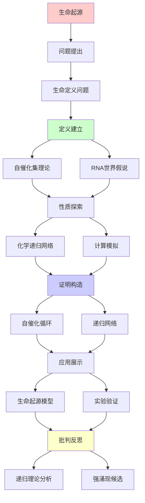
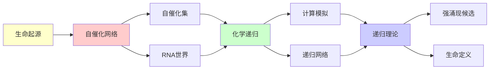

# 生命起源的自催化网络

> **主题**: 自复制与自组织的递归机制
> **创建日期**: 2025-12-02
> **难度**: ⭐⭐⭐⭐
> **前置知识**: 生物化学、复杂系统、自组织理论

---

## 📋 目录

- [生命起源的自催化网络](#生命起源的自催化网络)
  - [📋 目录](#-目录)
  - [1. 生命的定义问题](#1-生命的定义问题)
    - [1.1 生命特征](#11-生命特征)
    - [1.2 最小生命](#12-最小生命)
  - [2. 自催化集理论](#2-自催化集理论)
    - [2.1 Kauffman模型](#21-kauffman模型)
    - [2.2 递归封闭性](#22-递归封闭性)
  - [3. RNA世界假说](#3-rna世界假说)
    - [3.1 RNA双重功能](#31-rna双重功能)
    - [3.2 核酶自复制](#32-核酶自复制)
  - [4. 化学递归网络](#4-化学递归网络)
    - [4.1 双曲循环](#41-双曲循环)
    - [4.2 涌现代谢](#42-涌现代谢)
  - [5. 计算模拟](#5-计算模拟)
    - [5.1 Tierra人工生命](#51-tierra人工生命)
    - [5.2 Avida演化](#52-avida演化)
  - [6. 递归理论分析](#6-递归理论分析)
  - [7. 主题-子主题论证逻辑关系图](#7-主题-子主题论证逻辑关系图)
    - [7.1 论证依赖关系](#71-论证依赖关系)
    - [7.2 概念依赖关系](#72-概念依赖关系)
  - [8. 参考资源](#8-参考资源)
    - [8.1 经典论文](#81-经典论文)
    - [8.2 教材](#82-教材)
    - [8.3 在线资源](#83-在线资源)

---

## 1. 生命的定义问题

### 1.1 生命特征

**NASA工作定义**:

```text
生命 = 自我维持的化学系统
能够经历达尔文演化

核心特征:
1. 代谢 (Metabolism)
   - 能量/物质转换
   - 自我维持

2. 自复制 (Replication)
   - 信息传递
   - 遗传

3. 演化 (Evolution)
   - 变异
   - 选择
   - 适应

递归性质:
✓ 自我复制 = 递归生成
✓ 代谢 = 递归循环
✓ 演化 = 递归优化
```

---

### 1.2 最小生命

**最简单的生命系统**:

```text
病毒:
⚠️ 需要宿主 → 不完全自主
✗ 传统定义: 非生命

朊病毒 (Prion):
仅蛋白质
✗ 无遗传信息 → 非生命

最小细胞 (Mycoplasma):
~500基因
~500,000 bp DNA
→ 当前最小生命 ✓

理论最小:
~300基因？
开放问题: 能否更小？
```

---

## 2. 自催化集理论

### 2.1 Kauffman模型

**自催化集 (1986)**:

```text
定义:
分子集合M是自催化的 ⟺

1. 封闭性:
   M中每个分子由M中分子催化生成

2. 递归生成:
   从食物集F，M可递归生成自身

形式化:
M = {m₁, m₂, ..., mₙ}
∀mᵢ ∈ M: ∃反应 r: F∪M → mᵢ
且r由M中某mⱼ催化

递归性质:
✓ M递归定义
✓ 封闭递归
✓ 自举 (Bootstrapping) ⭐
```

---

### 2.2 递归封闭性

**理论预测**:

```text
临界复杂度:
化学多样性达到阈值
→ 自催化集自发涌现 ⭐

相变:
简单 → 复杂 (突然)
类似: 玻璃化转变

数学:
P(自催化集出现) = f(多样性)
超过阈值 → P≈1 ✓

递归:
简单 → 复杂 → 更复杂
递归增长 ⭐
→ 生命涌现必然？
```

---

## 3. RNA世界假说

### 3.1 RNA双重功能

**Crick-Orgel假说 (1968)**:

```text
RNA特性:
✓ 存储信息 (如DNA)
✓ 催化反应 (如蛋白质)
→ 双重功能 ⭐⭐⭐⭐⭐

RNA世界:
早期生命 = 纯RNA系统
DNA + 蛋白质 = 后来演化

证据:
✓ 核糖体 (蛋白质合成) = 核酶
✓ 代谢辅酶 (NAD+, FAD) = RNA衍生
✓ RNA自我剪接 (发现1982)
→ RNA可自催化 ✓
```

---

### 3.2 核酶自复制

**实验进展**:

```text
Lincoln & Joyce (2009):
核酶R1 + R2 → 互相催化合成 ⭐

R1催化: A + B → R2
R2催化: C + D → R1
→ 递归循环 ✓

问题:
⚠️ R1, R2本身需要预先存在
⚠️ 序列特异性高
✗ 完全自复制未实现

递归困境:
? 第一个核酶从何而来？
→ 鸡蛋问题 ⚠️
```

---

## 4. 化学递归网络

### 4.1 双曲循环

**自催化反应循环**:

```text
例子: 甲醛聚合
CH₂O → (CH₂O)ₙ

递归:
(CH₂O)ₙ催化(CH₂O)ₙ₊₁生成
→ 指数增长 ⭐

Breslow循环 (1959):
糖合成自催化
核糖-5-磷酸 ← 循环 → 更多糖
→ RNA前体自催化 ✓

递归性质:
✓ 产物催化自身生成
✓ 正反馈
✓ 指数增长
```

---

### 4.2 涌现代谢

**代谢优先假说**:

```text
Wächtershäuser (1988):
铁硫世界假说

流程:
矿物表面 (FeS₂)
  → 简单分子反应
  → 自催化网络涌现
  → 代谢 ✓
  → 后来加入遗传

vs RNA世界:
RNA优先: 遗传 → 代谢
代谢优先: 代谢 → 遗传

递归:
✓ 代谢网络递归增长
✓ 复杂度递归提升
✓ 自组织涌现 ⭐
```

---

## 5. 计算模拟

### 5.1 Tierra人工生命

**Ray (1991)**:

```text
数字生物:
指令序列 = 基因组
CPU时间 = 能量

自复制:
生物复制自身指令
→ 繁殖 ✓

演化观察:
✓ 寄生生物出现
✓ 免疫机制演化
✓ 共生关系
→ 达尔文动力学 ⭐

递归性质:
✓ 自复制 = 递归复制
✓ 演化 = 递归优化
→ 数字生命递归涌现 ✓
```

---

### 5.2 Avida演化

**Ofria & Adami (2004)**:

```text
Avida:
数字生物演化平台

奖励:
执行逻辑运算 → 更多CPU
→ 复杂性演化压力 ✓

发现:
✓ 复杂功能渐进演化
✓ 不可约复杂性可演化
✓ 中性漂变 + 选择
→ 演化机制验证 ⭐

递归:
✓ 生物递归繁殖
✓ 突变递归累积
✓ 适应度递归提升
```

---

## 6. 递归理论分析

```text
生命起源 ∈ RE?

自催化集:
✓ 可递归定义
✓ 封闭性可判定 (给定M)
→ 自催化集 ∈ RE ✓

但:
✗ 寻找自催化集 = NP-hard
✗ 最小自催化集 = 计算困难
⚠️ 大化学空间难搜索

RNA世界:
✓ 核酶反应可模拟
✓ 自复制可递归定义
→ RNA演化 ∈ RE ✓

实践:
⚠️ 湿实验困难
⚠️ 条件敏感
✗ 完全自复制未实现

递归本质:
生命 = 递归自我复制系统

三层递归:
1. 分子: 自催化 ✓
2. 细胞: 自复制 ✓
3. 物种: 自演化 ✓
→ 递归嵌套 ⭐⭐⭐⭐⭐

哲学问题:
? 生命起源必然还是偶然？
Kauffman: 必然 (自组织临界)
传统: 偶然 (极低概率)
→ 开放问题 ⚠️

递归范式:
✓ 生命 = 化学递归
✓ 演化 = 算法递归
✓ 复杂性 = 递归涌现
→ 递归是生命本质 ⭐⭐⭐⭐⭐
```

---

## 7. 主题-子主题论证逻辑关系图

### 7.1 论证依赖关系



### 7.2 概念依赖关系



**论证逻辑链条**：

1. **问题提出** (1节)：
   - 生命的定义问题

2. **定义建立** (2-3节)：
   - 自催化集理论（2节）
   - RNA世界假说（3节）

3. **性质探索** (4-5节)：
   - 化学递归网络（4节）
   - 计算模拟（5节）

4. **证明构造** (贯穿全文)：
   - 自催化循环和递归网络

5. **应用展示** (贯穿全文)：
   - 生命起源模型和实验验证

6. **批判反思** (6节)：
   - 递归理论分析

---

## 8. 参考资源

### 8.1 经典论文

1. **Kauffman, S. A.** (1993). _The Origins of Order: Self-Organization and Selection in Evolution_
   - Oxford University Press. ISBN 978-0195079517
   - 自催化集理论 ⭐⭐⭐⭐⭐

2. **Gilbert, W.** (1986). "The RNA World"
   - _Nature_, 319(6055), 618
   - RNA世界假说

3. **Lincoln, T. A., & Joyce, G. F.** (2009). "Self-sustained replication of an RNA enzyme"
   - _Science_, 323(5918), 1229-1232
   - 核酶自复制实验

4. **Ray, T. S.** (1991). "An Approach to the Synthesis of Life"
   - In Langton, C. G., et al. (eds.), _Artificial Life II_
   - Addison-Wesley. Tierra人工生命

### 8.2 教材

1. **Kauffman, S. A.** (2000)
   - _Investigations_
   - Oxford University Press. ISBN 978-0195121056
   - 自组织与生命

2. **Dyson, F.** (1999)
   - _Origins of Life_ (2nd ed.)
   - Cambridge University Press. ISBN 978-0521626682
   - 生命起源理论

### 8.3 在线资源

1. **Santa Fe Institute - Origins of Life**
   - https://www.santafe.edu/research/origins-of-life
   - 生命起源研究

2. **Wikipedia - Autocatalytic set**
   - https://en.wikipedia.org/wiki/Autocatalytic_set
   - 自催化集基本概念

3. **RNA World Hypothesis**
   - https://en.wikipedia.org/wiki/RNA_world
   - RNA世界假说

---

**最后更新**: 2025-12-04
**Tier**: 2-4 (科学+哲学)
**递归性质**: 核心 ⭐⭐⭐⭐⭐
**涌现类型**: 强涌现候选 ⚠️
**状态**: ✅ 已添加主题-子主题论证逻辑关系图和参考资源章节
