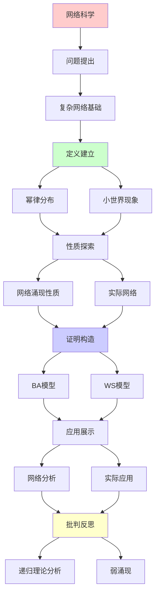
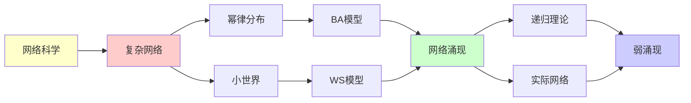

# 网络科学与幂律分布

> **主题**: 复杂网络的涌现性质与标度律
> **创建日期**: 2025-12-02
> **难度**: ⭐⭐⭐⭐
> **前置知识**: 图论、统计物理、网络科学

---

## 📋 目录

- [网络科学与幂律分布](#网络科学与幂律分布)
  - [📋 目录](#-目录)
  - [1. 复杂网络基础](#1-复杂网络基础)
    - [1.1 网络类型](#11-网络类型)
    - [1.2 度分布](#12-度分布)
  - [2. 幂律分布](#2-幂律分布)
    - [2.1 无标度网络](#21-无标度网络)
    - [2.2 BA模型](#22-ba模型)
  - [3. 小世界现象](#3-小世界现象)
    - [3.1 六度分隔](#31-六度分隔)
    - [3.2 WS模型](#32-ws模型)
  - [4. 网络涌现性质](#4-网络涌现性质)
    - [4.1 鲁棒性与脆弱性](#41-鲁棒性与脆弱性)
    - [4.2 相变现象](#42-相变现象)
  - [5. 实际网络](#5-实际网络)
    - [5.1 互联网](#51-互联网)
    - [5.2 社交网络](#52-社交网络)
  - [6. 递归理论分析](#6-递归理论分析)
  - [7. 主题-子主题论证逻辑关系图](#7-主题-子主题论证逻辑关系图)
    - [7.1 论证依赖关系](#71-论证依赖关系)
    - [7.2 概念依赖关系](#72-概念依赖关系)
  - [8. 参考资源](#8-参考资源)
    - [8.1 经典论文](#81-经典论文)
    - [8.2 教材](#82-教材)
    - [8.3 在线资源](#83-在线资源)

---

## 1. 复杂网络基础

### 1.1 网络类型

**经典网络模型**:

```text
规则网络:
所有节点度相同
例: 晶格, 环

随机网络 (ER):
Erdős-Rényi (1959)
边随机连接
P(edge) = p

小世界网络 (WS):
Watts-Strogatz (1998)
高聚类 + 短路径 ✓

无标度网络 (BA):
Barabási-Albert (1999)
度分布 ~ 幂律 ⭐

递归性质:
✓ 网络递归生成
✓ 连接递归增加
```

---

### 1.2 度分布

**节点度统计**:

```text
度 k: 节点连接数

度分布 P(k):
P(k) = 度为k的节点比例

分布类型:

1. 泊松分布 (ER):
   P(k) ~ e^{-λ} λ^k / k!
   特征: 有典型尺度 ⟨k⟩

2. 幂律分布 (BA):
   P(k) ~ k^{-γ} ⭐⭐⭐⭐⭐
   特征: 无标度 (scale-free)

对比:
ER: 多数节点度相近
BA: 少数hub, 多数小度
→ 异质性 ⭐
```

---

## 2. 幂律分布

### 2.1 无标度网络

**幂律特性**:

```text
定义:
P(k) = Ck^{-γ}

γ: 幂律指数 (通常2-3)

性质:
✓ 无特征尺度
✓ 尺度不变性
✓ 长尾分布
✓ 自相似性 ⭐

例子:
- 度k×2 → P(k)×2^{-γ}
→ 缩放对称

vs 正态分布:
正态: 指数衰减
幂律: 代数衰减 (慢)
→ 极端事件常见 ⚠️

涌现:
✓ 简单规则 (优先连接)
✓ 复杂结果 (幂律)
→ 涌现典范 ⭐
```

---

### 2.2 BA模型

**Barabási-Albert增长模型**:

```text
规则:

1. 增长 (Growth):
   每步加1个新节点

2. 优先连接 (Preferential Attachment):
   连接到节点i的概率:
   P(i) ∝ k_i / Σ_j k_j
   → 富者越富 ⭐

结果:
P(k) ~ k^{-3} (γ=3)
→ 幂律涌现 ✓

机制:
马太效应 (Matthew Effect)
"凡有的，还要加给他"
→ 正反馈 ⭐

递归性质:
✓ 网络递归增长
✓ 度递归累积
✓ 幂律递归涌现

复杂度:
每步: O(1)
n步: O(n)
→ 线性可扩展 ✓
```

---

## 3. 小世界现象

### 3.1 六度分隔

**Milgram实验 (1967)**:

```text
实验:
美国随机两人
通过熟人链连接
结果: 平均6步 ⭐⭐⭐⭐⭐

社交网络:
Facebook (2016):
平均: 3.57度
→ 更小的世界 ✓

理论:
图直径 d ~ log N
N个节点
→ 小世界 ✓

递归:
朋友的朋友指数增长
k^d ~ N
d ~ log_k N
→ 对数关系 ⭐
```

---

### 3.2 WS模型

**Watts-Strogatz (1998)**:

```text
构造:
1. 规则环: 每节点连接k个邻居
2. 重连: 概率p随机重连边

性质:
p=0: 规则网络 (高L, 高C)
p=1: 随机网络 (低L, 低C)
p~0.01: 小世界 (低L, 高C) ⭐⭐⭐⭐⭐

聚类系数C: 三角形密度
路径长度L: 平均最短路径

小世界甜点:
✓ 短路径 (like random)
✓ 高聚类 (like regular)
→ 两全其美 ⭐

涌现:
少量随机边 → 指数缩短路径
→ 相变现象 ✓
```

---

## 4. 网络涌现性质

### 4.1 鲁棒性与脆弱性

**无标度网络特性**:

```text
鲁棒性:
随机攻击 → 高鲁棒 ✓
移除随机节点
→ 网络连通性保持

原因:
多数节点度小
移除影响小 ✓

脆弱性:
定向攻击 → 高脆弱 ✗
移除hub节点
→ 网络快速瓦解 ⚠️⚠️⚠️

例子:
互联网:
随机失败: 鲁棒 ✓
针对路由器: 脆弱 ✗

vs ER网络:
ER: 随机和定向相似
BA: 巨大差异 ⭐

涌现:
✓ 异质拓扑 → 异质鲁棒性
→ 涌现脆弱性 ⚠️
```

---

### 4.2 相变现象

**渗流理论**:

```text
问题:
随机移除节点
何时网络解体？

临界点 p_c:
p < p_c: 网络解体
p > p_c: 巨分量存在
→ 相变 ⭐

ER网络:
p_c = 1/⟨k⟩

无标度网络:
p_c = 0 (理论上)
→ 极端鲁棒 ✓

但:
定向攻击: p_c > 0
→ 脆弱 ⚠️

涌现:
✓ 微观移除 → 宏观相变
✓ 连续 → 不连续转变
→ 集体涌现 ⭐
```

---

## 5. 实际网络

### 5.1 互联网

**AS级拓扑**:

```text
结构:
AS (Autonomous System) 网络
路由器级, AS级

度分布:
P(k) ~ k^{-2.2} ⭐
→ 无标度

hub:
Tier-1 ISP (Level 3, AT&T)
→ 关键节点 ⚠️

增长:
优先连接机制
新AS连接大AS
→ BA模型验证 ✓

攻击:
9/11后研究: 定向攻击脆弱 ⚠️
→ 安全重要性 ⭐
```

---

### 5.2 社交网络

**度分布**:

```text
Facebook (2012):
10亿用户
P(k) ~ k^{-γ}
γ ≈ 2.5-3 ⭐

Twitter (2010):
关注网络
P(k_out) ~ k^{-2.3} (出度)
P(k_in) ~ k^{-2.7} (入度)

特性:
✓ 无标度
✓ 小世界
✓ 高聚类
✓ 社区结构

vs 经典模型:
实际网络更复杂
- 社区结构
- 同配性 (degree correlation)
- 动态演化
→ 需要改进模型 ⚠️

递归:
✓ 用户递归加入
✓ 关系递归建立
✓ 网络递归演化
```

---

## 6. 递归理论分析

```text
网络科学 ∈ RE?

答案: ✓是的

证明:
- 网络生成可递归
- 度分布可递归计算
- 路径搜索可递归 (BFS/DFS)
→ 网络算法 ∈ RE ✓

复杂度:
度分布: O(E) (边数)
最短路径: O(V log V + E)
聚类系数: O(V·⟨k⟩²)
→ 多项式可行 ✓

幂律生成:
BA模型: O(n)
→ 线性可递归 ✓

涌现性质:
✓ 局部规则 (优先连接)
✓ 全局模式 (幂律)
✓ 不可从单节点预测
→ 弱涌现 ✓

递归生成:
✓ BA模型递归增长
✓ WS模型递归重连
✓ 网络递归演化
→ 递归是核心机制 ⭐

理论vs实际:
理论模型: BA, WS (简单)
实际网络: 复杂得多
- 时间演化
- 社区结构
- 多层网络
→ 模型vs现实差距 ⚠️

幂律普遍性:
出现在:
- 互联网
- 社交网络
- 引文网络
- 蛋白质网络
- 代谢网络
→ 普遍涌现模式 ⭐⭐⭐⭐⭐

哲学:
幂律 = 自组织临界性?
优先连接 = 富者越富
→ 社会不平等的数学？⚠️

递归范式:
✓ 网络递归生成
✓ 幂律递归涌现
✓ 相变递归触发
→ 涌现的递归机制 ⭐⭐⭐⭐⭐

未来:
时序网络 (Temporal Networks)
多层网络 (Multiplex)
超图 (Hypergraphs)
→ 更复杂的涌现 ⭐
```

---

## 7. 主题-子主题论证逻辑关系图

### 7.1 论证依赖关系



### 7.2 概念依赖关系



**论证逻辑链条**：

1. **问题提出** (1节)：
   - 复杂网络基础

2. **定义建立** (2-3节)：
   - 幂律分布（2节）
   - 小世界现象（3节）

3. **性质探索** (4-5节)：
   - 网络涌现性质（4节）
   - 实际网络（5节）

4. **证明构造** (贯穿全文)：
   - BA模型和WS模型

5. **应用展示** (贯穿全文)：
   - 网络分析和实际应用

6. **批判反思** (6节)：
   - 递归理论分析

---

## 8. 参考资源

### 8.1 经典论文

1. **Barabási, A.-L., & Albert, R.** (1999). "Emergence of Scaling in Random Networks"
   - _Science_, 286(5439), 509-512
   - BA无标度网络模型 ⭐⭐⭐⭐⭐

2. **Watts, D. J., & Strogatz, S. H.** (1998). "Collective Dynamics of 'Small-World' Networks"
   - _Nature_, 393(6684), 440-442
   - WS小世界模型 ⭐⭐⭐⭐⭐

3. **Erdős, P., & Rényi, A.** (1959). "On Random Graphs"
   - _Publicationes Mathematicae_, 6, 290-297
   - 随机图理论

### 8.2 教材

1. **Newman, M. E. J.** (2010)
   - _Networks: An Introduction_
   - Oxford University Press. ISBN 978-0199206650
   - 网络科学教材

2. **Barabási, A.-L.** (2016)
   - _Network Science_
   - Cambridge University Press. ISBN 978-1107076266
   - 网络科学综合教材

### 8.3 在线资源

1. **Barabási Lab - Network Science**
   - https://www.barabasilab.com/
   - Barabási实验室

2. **Wikipedia - Scale-free network**
   - https://en.wikipedia.org/wiki/Scale-free_network
   - 无标度网络基本概念

3. **Network Science Book**
   - http://networksciencebook.com/
   - 网络科学在线教材

---

**最后更新**: 2025-12-04
**Tier**: 2-3 (科学+社会)
**普遍性**: 幂律在多领域涌现 ⭐⭐⭐⭐⭐
**涌现类型**: 弱涌现 ✓
**状态**: ✅ 已添加主题-子主题论证逻辑关系图和参考资源章节
