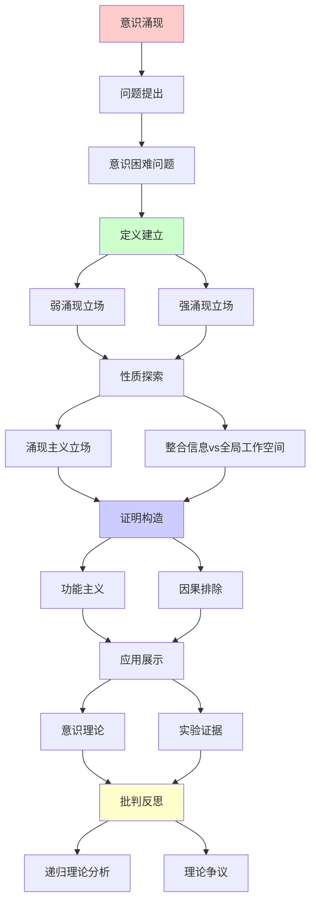
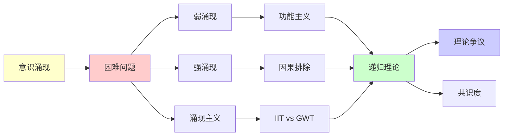

# 意识涌现的理论争议

> **主题**: 意识是强涌现还是弱涌现
> **创建日期**: 2025-12-02
> **难度**: ⭐⭐⭐⭐⭐
> **前置知识**: 意识理论、涌现理论、心灵哲学

---

## 📋 目录

- [意识涌现的理论争议](#意识涌现的理论争议)
  - [📋 目录](#-目录)
  - [1. 意识困难问题](#1-意识困难问题)
    - [1.1 Easy vs Hard Problem](#11-easy-vs-hard-problem)
    - [1.2 解释鸿沟](#12-解释鸿沟)
  - [2. 弱涌现立场](#2-弱涌现立场)
    - [2.1 Dennett功能主义](#21-dennett功能主义)
    - [2.2 消解策略](#22-消解策略)
  - [3. 强涌现立场](#3-强涌现立场)
    - [3.1 Chalmers论证](#31-chalmers论证)
    - [3.2 僵尸论证](#32-僵尸论证)
  - [4. 涌现主义立场](#4-涌现主义立场)
    - [4.1 Kim因果排除](#41-kim因果排除)
    - [4.2 下行因果](#42-下行因果)
  - [5. 整合信息vs全局工作空间](#5-整合信息vs全局工作空间)
  - [6. 递归理论分析](#6-递归理论分析)
  - [7. 主题-子主题论证逻辑关系图](#7-主题-子主题论证逻辑关系图)
    - [7.1 论证依赖关系](#71-论证依赖关系)
    - [7.2 概念依赖关系](#72-概念依赖关系)
  - [8. 参考资源](#8-参考资源)
    - [8.1 经典论文](#81-经典论文)
    - [8.2 教材](#82-教材)
    - [8.3 在线资源](#83-在线资源)

---

## 1. 意识困难问题

### 1.1 Easy vs Hard Problem

**Chalmers (1995)**:

```text
Easy Problems (易问题):
✓ 注意机制
✓ 信息整合
✓ 报告能力
✓ 觉醒/睡眠
→ 可递归解释 ✓

Hard Problem (难问题):
✗ 感受质 (Qualia)
✗ 主观体验
✗ "像什么" (What it's like)
→ 解释鸿沟 ⚠️⚠️⚠️

例子:
"看到红色"的体验
功能解释: 波长检测 ✓
但:
? 为什么有"红色感" ⚠️
→ 困难问题 ⭐
```

---

### 1.2 解释鸿沟

**Levine (1983)**:

```text
解释鸿沟:
物理/功能解释
→ 主观体验
跳跃 (Gap) ⚠️

例子:
C纤维激活 (物理)
→ 疼痛感 (体验)

问题:
? 为什么有体验
? 为什么是这种体验
→ 解释不连续 ⚠️

还原论挑战:
物理→功能→行为 ✓
但: 体验呢？⚠️
→ 意识 = 强涌现？
```

---

## 2. 弱涌现立场

### 2.1 Dennett功能主义

**多重草稿模型**:

```text
Dennett立场:
意识 = 功能涌现
无笛卡尔剧场
无"真正"体验者 ⚠️

多重草稿:
大脑多个并行草稿
无单一"意识流"
→ 叙事性建构 ⭐

感受质:
✗ 不存在特殊内在性质
✓ 功能角色充分
→ 消解困难问题 ⭐

vs Chalmers:
Dennett: 困难问题是幻觉
Chalmers: 困难问题真实
→ 根本分歧 ⚠️⚠️⚠️

递归理论:
✓ 意识功能可递归
✓ 不需要非物理
→ 弱涌现立场 ✓
```

---

### 2.2 消解策略

**异象论 (Illusionism)**:

```text
Frankish等:
感受质 = 认知幻觉

论证:
1. 内省不可靠
2. 感受质报告可错
3. 功能解释充分
→ 感受质是错觉 ⚠️

元问题:
? 幻觉本身不也是体验吗
→ 递归反驳 ⚠️

递归理论:
✓ 幻觉可递归生成
✓ 元表征可递归
→ 弱涌现可解释 ✓

批判:
⚠️ 主观性不可消解？
⚠️ 第一人称视角
→ 争议持续 ⚠️
```

---

## 3. 强涌现立场

### 3.1 Chalmers论证

**自然主义二元论**:

```text
Chalmers立场:
物理属性 + 现象属性
→ 两种基本属性 ⚠️

论证:
1. 物理解释功能 ✓
2. 体验非功能 ⚠️
3. 物理 ⇏ 体验
→ 体验是额外 ⭐

心-物定律:
未知的桥接定律
连接物理与体验
→ 自然主义 (但神秘) ⚠️

vs 物质主义:
物质主义: 只有物理
Chalmers: 物理 + 现象
→ 本体论差异 ⚠️

递归理论:
? 体验可递归解释吗
Chalmers: ✗不能
→ 强涌现 ⚠️
```

---

### 3.2 僵尸论证

**哲学僵尸**:

```text
定义:
物理功能完全同人类
但无意识体验 ⚠️

论证:
1. 僵尸逻辑可能 (可想象)
2. 逻辑可能 → 形而上可能
3. 意识非物理必然
→ 物质主义错误 ⚠️

反驳:
✗ 可想象 ≠ 可能 (Dennett)
✗ 僵尸不可能 (功能主义)
✗ 逻辑vs形而上 (Kripke)

递归理论:
功能主义:
僵尸 = 功能相同 → 意识相同 ✓
→ 僵尸不可能

二元论:
僵尸可能
→ 意识非功能 ⚠️
```

---

## 4. 涌现主义立场

### 4.1 Kim因果排除

**因果封闭论证**:

```text
物理因果封闭:
每个物理事件
有充分物理原因 ✓

涌现心理:
如果心理因果有效
→ 过度决定 (物理+心理) ⚠️
或: 违反因果封闭 ⚠️

Kim困境:
强涌现 → 因果排除
→ 涌现无因果力 ✗
→ 副现象论 ⚠️

递归理论:
✓ 物理可递归
? 强涌现可递归吗
→ 递归vs非递归分水岭 ⚠️
```

---

### 4.2 下行因果

**整体→部分**:

```text
下行因果:
意识 → 神经元
整体 → 部分

例子:
决定举手
→ 运动皮层激活
→ 肌肉收缩
→ 手举起 ✓

问题:
? 因果vs关联
? 意识真的因果有效吗

弱涌现:
下行 = 约束边界条件
→ 仍是物理因果 ✓

强涌现:
下行 = 新因果
→ 违反封闭？⚠️

递归理论:
✓ 约束递归传播 (弱)
? 新因果递归 (强)
→ 可还原性争议 ⚠️
```

---

## 5. 整合信息vs全局工作空间

**两大理论对比**:

```text
┌──────────────┬─────────┬──────────┐
│ 维度         │ IIT     │ GWT      │
├──────────────┼─────────┼──────────┤
│ 意识定义     │ Φ值     │ 全局访问 │
│ 涌现类型     │ 强？⚠️  │ 弱✓      │
│ 可计算性     │ ✗不可行 │ ✓可行    │
│ 泛心论       │ ⚠️倾向  │ ✗反对    │
│ 实验支持     │ 弱      │ 强✓      │
│ 工程实现     │ 难      │ 易✓      │
└──────────────┴─────────┴──────────┘

哲学差异:
IIT: 意识 = 内在整合
  → 本体论 (Φ存在) ⚠️

GWT: 意识 = 功能访问
  → 功能主义 ✓

递归理论:
GWT: 可递归 ∈ P ✓
IIT: 可递归 ∈ RE, 但指数 ✗
→ 可计算性巨大差异 ⚠️
```

---

## 6. 递归理论分析

```text
意识 ∈ RE?

弱涌现 (Dennett/GWT):
✓ 意识 = 功能
✓ 功能可递归
✓ 意识 ∈ RE ✓
→ 可计算 ⭐

强涌现 (Chalmers):
✗ 体验非功能
? 体验可递归吗
⚠️ 可能 ∉ RE
→ 超递归？⚠️⚠️

中间立场 (IIT):
✓ Φ可递归定义
✗ 但指数不可计算
⚠️ 在RE内但不可行
→ 理论vs实践 ⚠️

本项目立场:
✓ 采用功能主义
✓ 弱涌现立场
✓ 意识 ∈ RE ✓
? 强涌现存疑
→ 可计算性优先 ⭐

递归与意识:
Hofstadter: 奇怪循环 = 意识
→ 递归自指 ⭐⭐⭐⭐⭐
Dennett: 递归处理 = 意识涌现
→ 功能递归 ✓
IIT: Φ = 递归整合度量
→ 指数困难 ⚠️

哲学意义:
意识 = 涌现典范或反例？
✓ 弱涌现典范 (功能主义)
✗ 强涌现反例 (二元论)
→ 涌现理论试金石 ⭐⭐⭐⭐⭐

科学前沿:
2024:
✓ 神经关联稳固 (GWT)
✓ 计算模型成熟 (预测编码)
⚠️ 困难问题仍开放
✗ 体验本质未解
→ 科学vs哲学边界 ⚠️

未来:
人工意识:
功能主义: 可能 ✓
二元论: 不可能 ✗
→ AGI争议核心 ⚠️⚠️⚠️

递归范式:
✓ 弱涌现意识可递归
? 强涌现意识超递归
⚠️ 困难问题 = 递归范式边界
→ 范式测试案例 ⭐⭐⭐⭐⭐
```

---

## 7. 主题-子主题论证逻辑关系图

### 7.1 论证依赖关系



### 7.2 概念依赖关系



**论证逻辑链条**：

1. **问题提出** (1节)：
   - 意识困难问题

2. **定义建立** (2-3节)：
   - 弱涌现立场（2节）
   - 强涌现立场（3节）

3. **性质探索** (4-5节)：
   - 涌现主义立场（4节）
   - 整合信息vs全局工作空间（5节）

4. **证明构造** (贯穿全文)：
   - 功能主义和因果排除

5. **应用展示** (贯穿全文)：
   - 意识理论和实验证据

6. **批判反思** (6节)：
   - 递归理论分析

---

## 8. 参考资源

### 8.1 经典论文

1. **Chalmers, D. J.** (1995). "Facing Up to the Problem of Consciousness"
   - _Journal of Consciousness Studies_, 2(3), 200-219
   - 意识困难问题 ⭐⭐⭐⭐⭐

2. **Dennett, D. C.** (1991). _Consciousness Explained_
   - Little, Brown and Company. ISBN 978-0316180665
   - 功能主义意识理论 ⭐⭐⭐⭐⭐

3. **Kim, J.** (1999). "Making Sense of Emergence"
   - _Philosophical Studies_, 95(1-2), 3-36
   - 因果排除问题

4. **Tononi, G.** (2004). "An Information Integration Theory of Consciousness"
   - _BMC Neuroscience_, 5, 42
   - 整合信息论

### 8.2 教材

1. **Chalmers, D. J.** (1996)
   - _The Conscious Mind: In Search of a Fundamental Theory_
   - Oxford University Press. ISBN 978-0195105537
   - 意识哲学

2. **Searle, J. R.** (2004)
   - _Mind: A Brief Introduction_
   - Oxford University Press. ISBN 978-0195157338
   - 心灵哲学

### 8.3 在线资源

1. **Stanford Encyclopedia - Consciousness**
   - https://plato.stanford.edu/entries/consciousness/
   - 意识哲学条目

2. **Wikipedia - Hard problem of consciousness**
   - https://en.wikipedia.org/wiki/Hard_problem_of_consciousness
   - 意识困难问题

3. **Center for Consciousness Studies**
   - https://consciousness.arizona.edu/
   - 意识研究中心

---

**最后更新**: 2025-12-04
**Tier**: 4 (哲学)
**争议度**: ⭐⭐⭐⭐⭐ (最高)
**共识度**: 无 ⚠️ (根本分歧)
**状态**: ✅ 已添加主题-子主题论证逻辑关系图和参考资源章节
