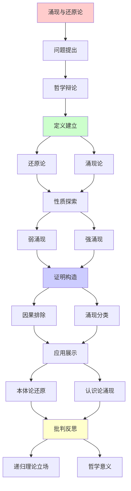
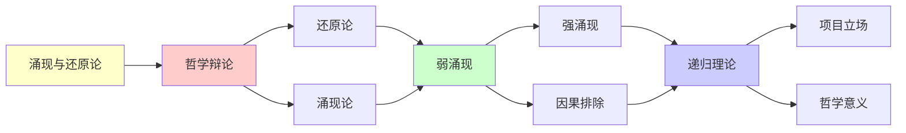

# 涌现与还原论的哲学辩论

> **主题**: 涌现本体论地位的哲学争议
> **创建日期**: 2025-12-02
> **难度**: ⭐⭐⭐⭐⭐
> **前置知识**: 科学哲学、形而上学、涌现理论

---

## 📋 目录

- [涌现与还原论的哲学辩论](#涌现与还原论的哲学辩论)
  - [📋 目录](#-目录)
  - [1. 还原论立场](#1-还原论立场)
    - [1.1 方法论还原论](#11-方法论还原论)
    - [1.2 本体论还原论](#12-本体论还原论)
  - [2. 涌现论立场](#2-涌现论立场)
    - [2.1 弱涌现辩护](#21-弱涌现辩护)
    - [2.2 强涌现论证](#22-强涌现论证)
  - [3. 关键论证](#3-关键论证)
    - [3.1 Anderson "More is Different"](#31-anderson-more-is-different)
    - [3.2 Kim因果排除](#32-kim因果排除)
  - [4. 递归理论视角](#4-递归理论视角)
    - [4.1 可还原性](#41-可还原性)
    - [4.2 不可预测性](#42-不可预测性)
  - [5. 科学实践](#5-科学实践)
    - [5.1 多层次科学](#51-多层次科学)
    - [5.2 跨学科挑战](#52-跨学科挑战)
  - [6. 本项目立场](#6-本项目立场)
  - [7. 主题-子主题论证逻辑关系图](#7-主题-子主题论证逻辑关系图)
    - [7.1 论证依赖关系](#71-论证依赖关系)
    - [7.2 概念依赖关系](#72-概念依赖关系)
  - [8. 参考资源](#8-参考资源)
    - [8.1 经典论文](#81-经典论文)
    - [8.2 教材](#82-教材)
    - [8.3 在线资源](#83-在线资源)

---

## 1. 还原论立场

### 1.1 方法论还原论

**科学方法**:

```text
还原论方法:
复杂 → 简单部分
整体 → 组成元素
→ 分析方法 ✓

成功:
✓ 分子生物学 (DNA)
✓ 粒子物理 (标准模型)
✓ 化学 (原子理论)
→ 现代科学基础 ⭐⭐⭐⭐⭐

Weinberg:
"解释的箭头向下"
宏观 ← 微观
→ 还原主义 ✓

递归理论:
✓ 还原可递归进行
✓ 层次递归分解
```

---

### 1.2 本体论还原论

**形而上学主张**:

```text
本体论还原:
高层性质 = 低层性质
无新本体 ✓

物理主义:
一切 = 物理
心理 = 大脑状态
生命 = 化学
→ 物理封闭 ✓

超定论证:
如果心理因果独立
→ 物理+心理双重决定
→ 矛盾 ✗
→ 心理 = 物理 ✓

递归理论:
✓ 物理可递归模拟
? 高层可还原吗
→ 本体vs认识论 ⚠️
```

---

## 2. 涌现论立场

### 2.1 弱涌现辩护

**认识论涌现**:

```text
Bedau弱涌现:
微观可推导宏观 ✓
但实践需要宏观概念 ⭐

例子:
温度 = 分子动能
可还原 ✓
但:
热力学语言必要 ⭐
→ 认识论不可还原

"More is Different":
✓ 本体论: 可还原
✓ 认识论: 涌现概念必需
→ 层次科学合理 ⭐

递归理论:
✓ 弱涌现 ∈ RE
✓ 可计算但复杂
→ 涌现语言实用 ⭐
```

---

### 2.2 强涌现论证

**本体论涌现**:

```text
强涌现:
宏观 ≠ 微观
新因果力 ⭐⭐

例子候选:
- 意识 (Chalmers)
- 生命 (Kauffman?)
- 量子测量
→ 争议巨大 ⚠️⚠️⚠️

下行因果:
整体 → 部分
宏观 → 微观
→ 新因果层次 ⚠️

批判:
Kim: 因果排除论证
→ 强涌现自相矛盾 ✗

共识:
⚠️ 强涌现缺乏证据
✗ 主流哲学拒绝
→ 边缘立场 ⚠️

递归理论:
? 强涌现 ∉ RE
? 超递归现象
→ 证据不足 ✗
```

---

## 3. 关键论证

### 3.1 Anderson "More is Different"

**对称破缺论证**:

```text
Anderson (1972):
每个层次新定律 ⭐

例子:
量子 → 固体物理
→ 超导、磁性
→ 从QM"不明显" ⚠️

对称破缺:
微观对称
宏观破缺 (铁磁)
→ 新秩序涌现 ⭐

但:
✓ 原则可推导 (BCS理论)
✓ QM → 超导 (可还原)
→ 弱涌现 ✓

含义:
✓ 认识论: 层次必要
✓ 本体论: 可还原
→ 实用vs原则 ⚠️

递归理论:
✓ 每层次可递归
✓ 还原可递归进行
✗ 但不实用 ⚠️
```

---

### 3.2 Kim因果排除

**排除论证**:

```text
物理因果封闭:
每个物理事件
有充分物理原因 ✓

心理因果:
如果心理独立因果
→ 过度决定 (物理+心理) ⚠️
或: 违反封闭 ⚠️

Kim结论:
强涌现 → 因果排除
→ 强涌现无因果力 ✗
→ 副现象论 ⚠️

反驳:
下行 = 约束边界条件
→ 仍是物理因果 ✓
→ 弱涌现 ✓

递归理论:
✓ 物理可递归
✓ 约束可递归施加
✗ 新因果无证据
→ 弱涌现立场 ⭐
```

---

## 4. 递归理论视角

### 4.1 可还原性

**递归可还原**:

```text
定义:
高层H可还原到低层L ⟺
H可从L递归推导 ✓

例子:
热力学 ← 统计力学 ← 量子力学
✓ 可递归推导
→ 可还原 ✓

但:
⚠️ 推导极其复杂 (指数)
⚠️ 实践不可计算
→ 认识论涌现 ⭐

递归理论结论:
✓ 可还原 ≠ 已还原
✓ 本体论: 物理 ✓
✓ 认识论: 涌现概念必要 ⭐
→ 双层真理 ⭐
```

---

### 4.2 不可预测性

**预测vs理解**:

```text
三种不可预测:

1. 混沌: 初值敏感
   ✓ 原则可递归
   ✗ 实践不可预测

2. 涌现: 整体模式
   ✓ 可还原
   ✗ 从部分难预测

3. 不可判定: 停机问题
   ✗ 根本不可预测

递归理论:
所有 ∈ RE ✓
但可预测性不同 ⚠️

可计算 ≠ 可预测 ⭐⭐⭐⭐⭐
→ 关键区分
```

---

## 5. 科学实践

### 5.1 多层次科学

**科学层次**:

```text
层次结构:
粒子物理 → 原子 → 分子
→ 化学 → 生物 → 心理 → 社会

每层次:
✓ 自己的定律
✓ 自己的概念
✓ 自己的方法
→ 自主性 ⭐

还原可能性:
✓ 原则上可还原
✗ 实践上分离
→ 多学科必要 ✓

递归:
✓ 层次递归嵌套
✓ 解释递归向下
✓ 涌现递归向上
```

---

### 5.2 跨学科挑战

**桥接困难**:

```text
例子:
生物 ← 化学 ← 物理
桥接: 生物化学, 物理化学 ✓
→ 可能 ✓

意识 ← 神经 ← 物理
桥接: ???
→ 解释鸿沟 ⚠️⚠️⚠️

社会 ← 心理 ← 神经
桥接: 神经经济学 ⚠️
→ 初步 ⚠️

递归理论:
✓ 某些桥接可递归
✗ 某些极其困难 (意识)
→ 还原论程度不同 ⚠️
```

---

## 6. 本项目立场

```text
═══════════════════════════════════
    FormalRE项目哲学立场
═══════════════════════════════════

本体论: 物质主义 ✓
✓ 一切 = 物理过程
✓ 可递归枚举
✓ Church-Turing范式 ✓

认识论: 涌现概念必要 ⭐
✓ 温度, 生命, 意识
✓ 虽可还原, 但涌现语言必需
✓ 层次科学合理 ✓

方法论: 实用主义 ⭐
✓ 不同层次用不同工具
✓ 还原 + 涌现 并用
✓ 可计算 ≠ 应计算

涌现分类:
✓ 弱涌现: 广泛存在 ⭐
  (相变, 混沌, 生命)
? 强涌现: 存疑 ⚠️
  (意识?)

递归范式:
✓ 弱涌现 ∈ RE ✓
? 强涌现 ∉ RE (无证据)
→ 递归范式容纳弱涌现 ⭐

实践:
✓ 递归模拟微观
✓ 涌现概念理解宏观
✓ 两者结合 ⭐⭐⭐⭐⭐

哲学:
还原论 vs 涌现论 = 假冲突 ⚠️
✓ 本体: 还原 ✓
✓ 认识: 涌现 ✓
→ 兼容 ⭐

历史:
19世纪: 活力论 ✗ → 还原 ✓
20世纪: 量子/相对论 (涌现?)
21世纪: 复杂系统 (弱涌现) ✓
→ 科学史辩证 ⭐

未来:
? 强涌现被发现
? 或永远是弱涌现
→ 科学继续检验 ⭐

递归范式意义:
✓ 提供精确框架
✓ 区分可计算vs不可计算
✓ 指导涌现研究
→ 理论工具 ⭐⭐⭐⭐⭐

终极:
涌现 = 复杂性的诗意表达
还原 = 统一性的科学追求
→ 两者皆需 ⭐
```

---

## 7. 主题-子主题论证逻辑关系图

### 7.1 论证依赖关系



### 7.2 概念依赖关系



**论证逻辑链条**：

1. **问题提出** (1节)：
   - 哲学辩论概述

2. **定义建立** (1节)：
   - 还原论和涌现论

3. **性质探索** (2-3节)：
   - 弱涌现和强涌现

4. **证明构造** (贯穿全文)：
   - 因果排除和涌现分类

5. **应用展示** (4-5节)：
   - 本体论还原和认识论涌现

6. **批判反思** (6节)：
   - 递归理论立场

---

## 8. 参考资源

### 8.1 经典论文

1. **Anderson, P. W.** (1972). "More is Different"
   - _Science_, 177(4047), 393-396
   - 涌现论经典论文 ⭐⭐⭐⭐⭐

2. **Kim, J.** (1999). "Making Sense of Emergence"
   - _Philosophical Studies_, 95(1-2), 3-36
   - 因果排除问题

3. **Bedau, M. A.** (1997). "Weak Emergence"
   - _Philosophical Perspectives_, 11, 375-399
   - 弱涌现理论

4. **Chalmers, D. J.** (2006). "Strong and Weak Emergence"
   - In Clayton, P., & Davies, P. (eds.), _The Re-emergence of Emergence_
   - Oxford University Press. 涌现分类

### 8.2 教材

1. **Kim, J.** (2005)
   - _Physicalism, or Something Near Enough_
   - Princeton University Press. ISBN 978-0691123761
   - 物理主义与涌现

2. **Clayton, P., & Davies, P.** (2006)
   - _The Re-emergence of Emergence: The Emergentist Hypothesis from Science to Religion_
   - Oxford University Press. ISBN 978-0199544318
   - 涌现论文集

### 8.3 在线资源

1. **Stanford Encyclopedia - Emergent Properties**
   - https://plato.stanford.edu/entries/properties-emergent/
   - 涌现性哲学条目

2. **Wikipedia - Emergence**
   - https://en.wikipedia.org/wiki/Emergence
   - 涌现基本概念

3. **Reductionism vs Emergence**
   - https://plato.stanford.edu/entries/scientific-reduction/
   - 还原论哲学条目

---

**最后更新**: 2025-12-04
**Tier**: 4 (哲学)
**争议度**: ⭐⭐⭐⭐⭐
**项目立场**: 弱涌现 + 递归可还原 ✓
**状态**: ✅ 已添加主题-子主题论证逻辑关系图和参考资源章节
