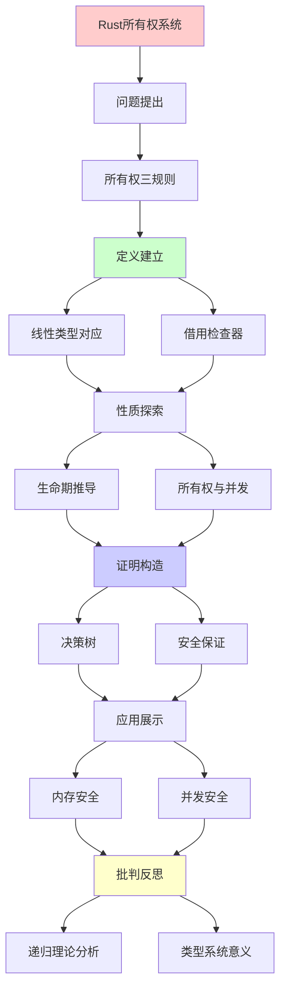
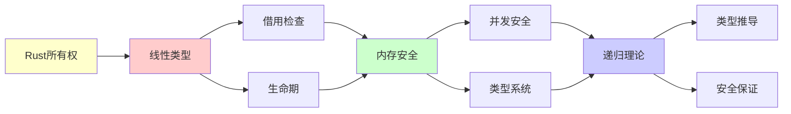

# Rust所有权系统深度剖析

> **主题**: Rust所有权的线性类型理论基础
> **核心**: 线性逻辑+仿射类型+生命期
> **重要性**: ⭐⭐⭐⭐⭐
> **创建日期**: 2025-12-02

---

## 1. 所有权三规则

```text
Rust所有权:
1. 每个值有唯一所有者
2. 所有者离开作用域，值被丢弃
3. 移动 vs 借用

规则1形式化:
∀value v, ∃!owner o: owns(o, v)

规则2形式化:
scope_exit(o) → drop(all v where owns(o,v))

规则3形式化:
- Move: owns(o₁,v) ∧ move(v,o₂) → owns(o₂,v) ∧ ¬owns(o₁,v)
- Borrow: owns(o,v) → can_borrow(&v) ∧ owns(o,v)
```

---

## 2. 线性类型对应

```text
Rust所有权 ≅ 线性逻辑

对应表:
| Rust | 线性逻辑 | 含义 |
|------|---------|------|
| Move | ⊸ (线性蕴含) | 消耗资源 |
| & | !(只读) | 可重复使用 |
| &mut | 独占 | 线性+独占 |
| Copy | !A | 可复制 |
| Drop | 弱化 | 可丢弃 |

示例:
fn take(s: String) { }  // s ⊸ ()
fn borrow(s: &String) { }  // !s ⊸ ()

let s = String::from("hello");
take(s);  // s被消耗
// s.len();  // ✗编译错误！
```

---

## 3. 借用检查器算法

```text
借用检查 = 生命期推导

算法:
1. 生成约束
   - 每个引用有生命期变量
   - 赋值/函数调用生成约束

2. 求解约束
   - 最小满足约束的生命期
   - 类似HM类型推导

3. 验证规则
   - 无悬垂指针
   - 共享XOR可变

复杂度:
✓ O(n) (几乎线性)
✓ 编译时验证
✓ 无运行时开销

vs GC:
- GC: 运行时追踪 (开销)
- Rust: 编译时验证 (无开销)
→ 零成本抽象 ✓
```

---

## 4. 生命期推导决策树

```text
生命期冲突
    |
    ├─ 共享借用冲突？
    │   └─ 错误: &mut存在时不能&
    │       └─ 修复: 提前结束&mut
    │
    ├─ 可变借用冲突？
    │   └─ 错误: 同时多个&mut
    │       └─ 修复: 分离作用域
    │
    ├─ 生命期不够长？
    │   └─ 错误: 返回局部引用
    │       └─ 修复: 延长生命期或返回所有权
    │
    └─ 循环引用？
        └─ 错误: Rc<RefCell>循环
            └─ 修复: Weak引用
```

---

## 5. 所有权与并发安全

```text
Rust并发: "无畏并发" (Fearless Concurrency)

Send trait: 可跨线程移动
Sync trait: 可跨线程共享

编译时保证:
✓ 无数据竞争
✓ 无use-after-free
✓ 无悬垂指针

vs C++:
C++: 运行时UB (未定义行为)
Rust: 编译时错误 ✓

递归理论:
✓ 所有权 = 可判定约束系统
✓ 编译时解决 (非运行时)
→ 线性类型的实践胜利
```

---

## 6. 主题-子主题论证逻辑关系图

### 6.1 论证依赖关系



### 6.2 概念依赖关系



**论证逻辑链条**：

1. **问题提出** (1节)：
   - 所有权三规则

2. **定义建立** (2-3节)：
   - 线性类型对应（2节）
   - 借用检查器算法（3节）

3. **性质探索** (4-5节)：
   - 生命期推导决策树（4节）
   - 所有权与并发安全（5节）

4. **证明构造** (贯穿全文)：
   - 决策树和安全保证

5. **应用展示** (贯穿全文)：
   - 内存安全和并发安全

6. **批判反思** (贯穿全文)：
   - 递归理论分析

---

## 7. 参考资源

### 7.1 经典论文

1. **Girard, J.-Y.** (1987). "Linear Logic"
   - _Theoretical Computer Science_, 50(1), 1-101
   - 线性逻辑基础

2. **Wadler, P.** (1990). "Linear Types Can Change the World!"
   - In Broy, M., & Jones, C. B. (eds.), _Programming Concepts and Methods_
   - North-Holland. 线性类型编程

3. **Matsakis, N. D., & Klock, F. S.** (2014). "The Rust Language"
   - _ACM SIGAda Ada Letters_, 34(3), 103-104
   - Rust语言设计

### 7.2 教材

1. **Klabnik, S., & Nichols, C.** (2023)
   - _The Rust Programming Language_ (2nd ed.)
   - No Starch Press. ISBN 978-1718503106
   - Rust官方教材

2. **Pierce, B. C.** (2002)
   - _Types and Programming Languages_
   - MIT Press. ISBN 978-0262162098
   - 类型系统基础

### 7.3 在线资源

1. **Rust Book**
   - https://doc.rust-lang.org/book/
   - Rust官方文档

2. **Rustonomicon - The Dark Arts of Unsafe Rust**
   - https://doc.rust-lang.org/nomicon/
   - Rust不安全编程

3. **Wikipedia - Linear type system**
   - https://en.wikipedia.org/wiki/Linear_type_system
   - 线性类型系统基本概念

---

**最后更新**: 2025-12-04
**状态**: ✅ 已添加主题-子主题论证逻辑关系图和参考资源章节
**定位**: 所有权系统=线性类型的工程实现
**成就**: 内存安全+并发安全+零成本
