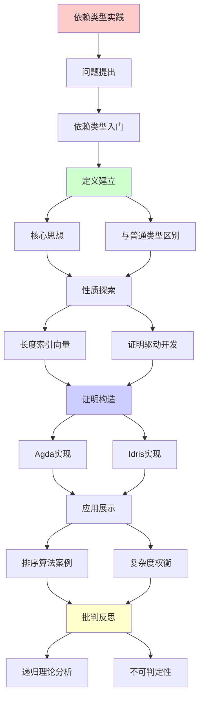
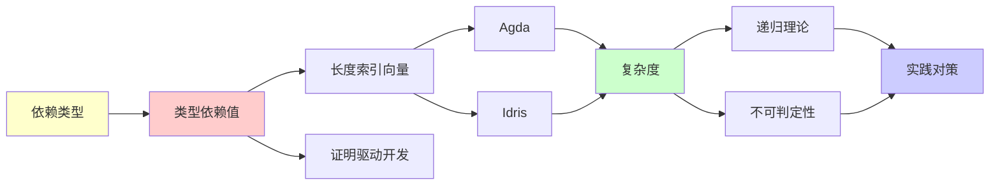

# 依赖类型实践指南

> **主题**: 依赖类型语言的实践应用
> **创建日期**: 2025-12-02
> **难度**: ⭐⭐⭐⭐⭐
> **前置知识**: 函数式编程、类型理论

---

## 📋 目录

- [依赖类型实践指南](#依赖类型实践指南)
  - [📋 目录](#-目录)
  - [1. 依赖类型入门](#1-依赖类型入门)
    - [1.1 核心思想](#11-核心思想)
    - [1.2 与普通类型的区别](#12-与普通类型的区别)
  - [2. 长度索引向量](#2-长度索引向量)
    - [2.1 Agda实现](#21-agda实现)
    - [2.2 Idris实现](#22-idris实现)
  - [3. 证明驱动开发](#3-证明驱动开发)
    - [3.1 工作流](#31-工作流)
    - [3.2 排序算法案例](#32-排序算法案例)
  - [4. 复杂度权衡](#4-复杂度权衡)
  - [5. 主题-子主题论证逻辑关系图](#5-主题-子主题论证逻辑关系图)
    - [5.1 论证依赖关系](#51-论证依赖关系)
    - [5.2 概念依赖关系](#52-概念依赖关系)
  - [6. 参考资源](#6-参考资源)
    - [6.1 经典论文](#61-经典论文)
    - [6.2 教材](#62-教材)
    - [6.3 在线资源](#63-在线资源)

---

## 1. 依赖类型入门

### 1.1 核心思想

```text
依赖类型 = 类型依赖于值

普通类型:
List : Type → Type
List Int

依赖类型:
Vec : Type → Nat → Type
Vec Int 5  // 长度为5的整数向量

关键:
类型中包含值信息 ⭐
```

---

### 1.2 与普通类型的区别

```text
普通类型:
head : List a -> a
-- 运行时可能错误 (空列表) ⚠️

依赖类型:
head : Vec a (S n) -> a
-- 类型保证非空! ✓

编译器: "Vec a 0无法匹配Vec a (S n)"
→ 编译时拒绝head([]) ✓
```

---

## 2. 长度索引向量

### 2.1 Agda实现

```agda
data Vec (A : Set) : ℕ → Set where
  []  : Vec A 0
  _∷_ : {n : ℕ} → A → Vec A n → Vec A (suc n)

head : {A : Set} {n : ℕ} → Vec A (suc n) → A
head (x ∷ xs) = x

append : {A : Set} {m n : ℕ} →
         Vec A m → Vec A n → Vec A (m + n)
append [] ys = ys
append (x ∷ xs) ys = x ∷ append xs ys

-- 类型级算术!
-- m + n在类型中计算
```

---

### 2.2 Idris实现

```idris
data Vect : Nat -> Type -> Type where
  Nil  : Vect Z a
  (::) : a -> Vect k a -> Vect (S k) a

head : Vect (S n) a -> a
head (x :: xs) = x

safeDiv : (x : Int) -> (y : Int) -> {auto p : Not (y = 0)} -> Int
-- 依赖类型保证y≠0!
```

---

## 3. 证明驱动开发

### 3.1 工作流

```text
1. 指定精确类型 (= 规范)
   sort : (l : List a) →
          (l' : List a **
           (Sorted l', Permutation l l'))

2. 实现函数 (= 证明构造)
   sort l = (mergeSort l, (sortedProof, permProof))

3. 类型检查 (= 证明验证)
   类型检查通过 = 证明正确 ✓

4. 运行
   保证: sorted ✓, permutation ✓
```

---

### 3.2 排序算法案例

```text
类型签名 = 完整规范:

sort : (l : List Nat) →
       Σ (l' : List Nat),
         Sorted l' × Permutation l l'

其中:
- Sorted : List → Type
- Permutation : List → List → Type

实现必须构造:
1. 排序后的列表l'
2. l'有序的证明
3. l'是l的排列的证明

→ 类型即规范 ⭐⭐⭐⭐⭐
```

---

## 4. 复杂度权衡

| 操作 | STLC | System F | 依赖类型 |
|------|------|----------|---------|
| **类型检查** | O(n)✓ | O(n)✓ | 不可判定✗ |
| **类型推导** | O(n)✓ | 不可判定✗ | 不可判定✗ |
| **表达力** | 低 | 高 | 极高⭐ |
| **证明能力** | 无 | 无 | 完整⭐ |

**不可判定原因**:

- 类型检查 = 程序执行
- 类型 = 命题
- 检查 = 证明搜索
→ 停机问题 ✗

**实践对策**:

- 终止性检查器
- 结构递归要求
- 用户标注辅助

---

## 5. 主题-子主题论证逻辑关系图

### 5.1 论证依赖关系



### 5.2 概念依赖关系



**论证逻辑链条**：

1. **问题提出** (1节)：
   - 依赖类型入门

2. **定义建立** (1.1-1.2节)：
   - 核心思想和与普通类型的区别

3. **性质探索** (2-3节)：
   - 长度索引向量（2节）
   - 证明驱动开发（3节）

4. **证明构造** (2.1-2.2, 3.2节)：
   - Agda实现、Idris实现和排序算法案例

5. **应用展示** (贯穿全文)：
   - 证明驱动开发实践

6. **批判反思** (4节)：
   - 复杂度权衡

---

## 6. 参考资源

### 6.1 经典论文

1. **Martin-Löf, P.** (1984). "Intuitionistic Type Theory"
   - Bibliopolis. ISBN 978-8870881059
   - 依赖类型理论基础

2. **Norell, U.** (2007). "Towards a Practical Programming Language Based on Dependent Type Theory"
   - PhD thesis, Chalmers University of Technology
   - Agda语言设计

3. **Brady, E.** (2013). "Idris - A General Purpose Dependently Typed Programming Language: Design and Implementation"
   - _Journal of Functional Programming_, 23(5), 552-593
   - Idris语言设计

### 6.2 教材

1. **Pierce, B. C.** (2002)
   - _Types and Programming Languages_
   - MIT Press. ISBN 978-0262162098
   - 类型系统基础

2. **Norell, U.** (2009)
   - "Dependently Typed Programming in Agda"
   - AFP Summer School
   - Agda实践教程

### 6.3 在线资源

1. **Agda Documentation**
   - https://agda.readthedocs.io/
   - Agda官方文档

2. **Idris Documentation**
   - https://www.idris-lang.org/docs/
   - Idris官方文档

3. **Wikipedia - Dependent type**
   - https://en.wikipedia.org/wiki/Dependent_type
   - 依赖类型基本概念

---

**最后更新**: 2025-12-04
**状态**: ✅ 已添加主题-子主题论证逻辑关系图和参考资源章节
