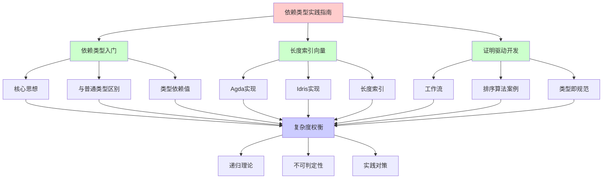
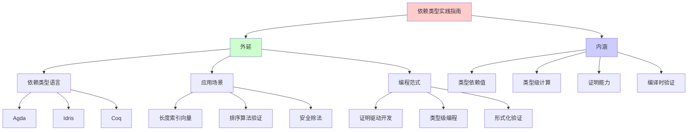
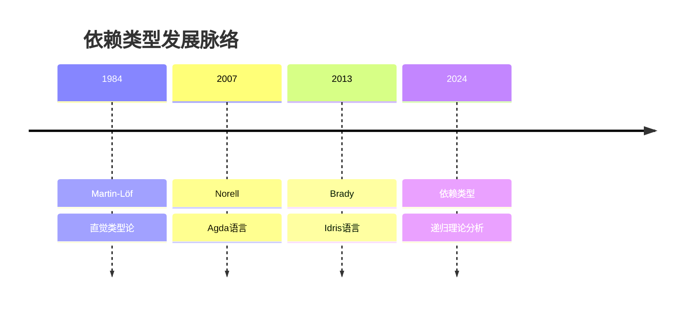
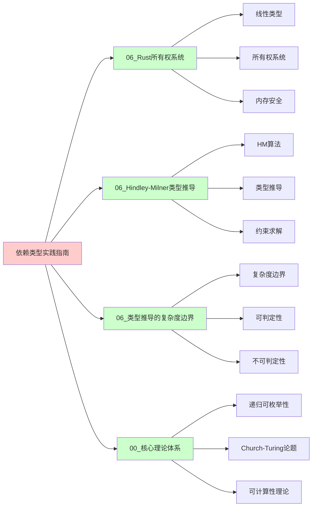
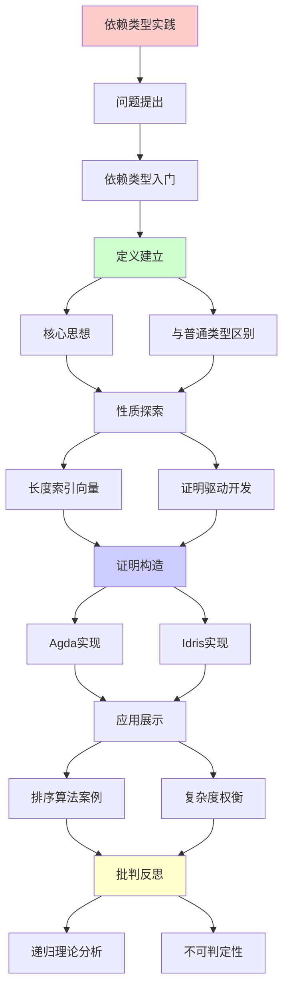
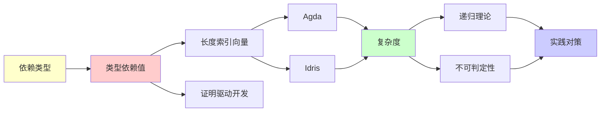

# 依赖类型实践指南

> **主题**: 依赖类型语言的实践应用
> **创建日期**: 2025-12-02
> **难度**: ⭐⭐⭐⭐⭐
> **前置知识**: 函数式编程、类型理论

---

## 📋 目录

- [依赖类型实践指南](#依赖类型实践指南)
  - [📋 目录](#-目录)
  - [1. 依赖类型入门](#1-依赖类型入门)
    - [1.1 核心思想](#11-核心思想)
    - [1.2 与普通类型的区别](#12-与普通类型的区别)
  - [2. 长度索引向量](#2-长度索引向量)
    - [2.1 Agda实现](#21-agda实现)
    - [2.2 Idris实现](#22-idris实现)
  - [3. 证明驱动开发](#3-证明驱动开发)
    - [3.1 工作流](#31-工作流)
    - [3.2 排序算法案例](#32-排序算法案例)
  - [4. 复杂度权衡](#4-复杂度权衡)
  - [5. 主题-子主题论证逻辑关系图](#5-主题-子主题论证逻辑关系图)
    - [5.1 论证依赖关系](#51-论证依赖关系)
    - [5.2 概念依赖关系](#52-概念依赖关系)
  - [6. 参考资源](#6-参考资源)
    - [6.1 经典论文](#61-经典论文)
    - [6.2 教材](#62-教材)
    - [6.3 在线资源](#63-在线资源)

---

## 1. 依赖类型入门

### 1.0 概念分析：依赖类型实践指南

#### 1.0.1 定义矩阵

| 维度 | 内容 |
|------|------|
| **形式化定义** | 依赖类型（Dependent Types）：类型依赖于值的类型系统，允许在类型中表达值的约束，使得类型检查可以保证程序满足特定规范，实现"类型即规范"的编程范式，支持证明驱动开发（Proof-Driven Development） |
| **直观理解** | 依赖类型允许类型中包含值信息，例如"长度为5的整数向量"而不仅仅是"整数向量"，从而在编译时就能保证程序正确性 |
| **等价定义** | 1. 值依赖类型<br>2. 类型级编程<br>3. 证明驱动开发 |
| **历史定义** | Martin-Löf (1984): 直觉类型论<br>Norell (2007): Agda语言<br>Brady (2013): Idris语言 |

#### 1.0.2 属性分析

**必要属性** (Necessary Properties):

1. **类型依赖值**: 类型必须依赖于值
2. **类型级计算**: 必须在类型级别进行计算
3. **证明能力**: 必须能够表达和验证证明

**充分属性** (Sufficient Properties):

1. **编译时保证**: 有编译时保证
2. **规范表达**: 能够表达规范
3. **证明验证**: 能够验证证明

**本质属性** (Essential Properties):

1. **类型即规范**: 类型就是程序规范
2. **证明驱动**: 支持证明驱动开发
3. **编译时验证**: 编译时验证而非运行时

**偶然属性** (Accidental Properties):

1. **具体语言**: 具体的依赖类型语言（Agda、Idris等）
2. **具体语法**: 具体的语法形式
3. **具体工具**: 具体的工具支持

#### 1.0.3 外延分析

**包含的实例**:

1. **依赖类型语言**:
   - Agda
   - Idris
   - Coq
   - Lean

2. **应用场景**:
   - 长度索引向量
   - 排序算法验证
   - 安全除法

3. **编程范式**:
   - 证明驱动开发
   - 类型级编程
   - 形式化验证

**包含的子类**:

1. **长度索引类型** ⊂ 依赖类型（Vec n）
2. **命题类型** ⊂ 依赖类型（Prop）
3. **存在类型** ⊂ 依赖类型（Σ类型）

**边界情况**:

1. **简单类型**: 非依赖类型（STLC）
2. **多态类型**: 类型依赖类型（System F）
3. **完全依赖**: 类型依赖值（依赖类型）

#### 1.0.4 内涵分析

**核心特征**:

1. **类型依赖值**: 类型中包含值信息
2. **类型级计算**: 在类型级别进行计算
3. **证明能力**: 能够表达和验证证明

**本质属性**:

1. **类型即规范**: 类型就是程序规范
2. **证明驱动**: 支持证明驱动开发
3. **编译时验证**: 编译时验证而非运行时

**与其他概念的区别**:

| 概念 | 区别 |
|------|------|
| **简单类型** | 依赖类型允许类型依赖值，简单类型不允许 |
| **多态类型** | 依赖类型允许类型依赖值，多态类型只允许类型依赖类型 |
| **运行时检查** | 依赖类型是编译时检查，运行时检查是运行时验证 |

#### 1.0.5 关系网络

**上位概念**:

- 类型系统
- 类型理论
- 形式化验证

**下位概念**:

- 长度索引类型
- 命题类型
- 存在类型

**相关概念**:

- 证明驱动开发（核心应用）
- 类型级编程（核心技术）
- 递归理论（理论框架）

**等价概念**:

- 值依赖类型
- 类型级编程

### 1.1 核心思想

```text
依赖类型 = 类型依赖于值

普通类型:
List : Type → Type
List Int

依赖类型:
Vec : Type → Nat → Type
Vec Int 5  // 长度为5的整数向量

关键:
类型中包含值信息 ⭐
```

---

### 1.2 与普通类型的区别

```text
普通类型:
head : List a -> a
-- 运行时可能错误 (空列表) ⚠️

依赖类型:
head : Vec a (S n) -> a
-- 类型保证非空! ✓

编译器: "Vec a 0无法匹配Vec a (S n)"
→ 编译时拒绝head([]) ✓
```

---

## 2. 长度索引向量

### 2.1 Agda实现

```agda
data Vec (A : Set) : ℕ → Set where
  []  : Vec A 0
  _∷_ : {n : ℕ} → A → Vec A n → Vec A (suc n)

head : {A : Set} {n : ℕ} → Vec A (suc n) → A
head (x ∷ xs) = x

append : {A : Set} {m n : ℕ} →
         Vec A m → Vec A n → Vec A (m + n)
append [] ys = ys
append (x ∷ xs) ys = x ∷ append xs ys

-- 类型级算术!
-- m + n在类型中计算
```

---

### 2.2 Idris实现

```idris
data Vect : Nat -> Type -> Type where
  Nil  : Vect Z a
  (::) : a -> Vect k a -> Vect (S k) a

head : Vect (S n) a -> a
head (x :: xs) = x

safeDiv : (x : Int) -> (y : Int) -> {auto p : Not (y = 0)} -> Int
-- 依赖类型保证y≠0!
```

---

## 3. 证明驱动开发

### 3.1 工作流

```text
1. 指定精确类型 (= 规范)
   sort : (l : List a) →
          (l' : List a **
           (Sorted l', Permutation l l'))

2. 实现函数 (= 证明构造)
   sort l = (mergeSort l, (sortedProof, permProof))

3. 类型检查 (= 证明验证)
   类型检查通过 = 证明正确 ✓

4. 运行
   保证: sorted ✓, permutation ✓
```

---

### 3.2 排序算法案例

```text
类型签名 = 完整规范:

sort : (l : List Nat) →
       Σ (l' : List Nat),
         Sorted l' × Permutation l l'

其中:
- Sorted : List → Type
- Permutation : List → List → Type

实现必须构造:
1. 排序后的列表l'
2. l'有序的证明
3. l'是l的排列的证明

→ 类型即规范 ⭐⭐⭐⭐⭐
```

---

## 4. 复杂度权衡

### 4.1 递归理论分析

```text
依赖类型系统 ∈ RE?

答案: ⚠️部分可判定

证明:
- 类型检查 = 程序执行
- 类型 = 命题
- 检查 = 证明搜索
→ 停机问题 ✗

但:
- 终止性检查器限制递归
- 结构递归要求
- 用户标注辅助
→ 实践中可判定 ✓

复杂度:
类型检查: 不可判定 (一般情况)
类型推导: 不可判定 (一般情况)
终止性检查: 可判定 (受限递归)
→ 理论vs实践 ⚠️

递归性质:
✓ 类型级计算可递归
✓ 证明搜索可递归
✗ 但可能不终止
→ 需要终止性保证 ⚠️

vs 其他类型系统:
STLC: 可判定 ✓
System F: 类型推导不可判定 ✗
依赖类型: 类型检查不可判定 ✗
→ 表达力vs可判定性权衡 ⚠️

实践对策:
✓ 终止性检查器
✓ 结构递归要求
✓ 用户标注辅助
→ 实践中可判定 ✓

理论意义:
✓ 依赖类型 = 类型即规范
✓ 类型检查 = 证明验证
✓ 编译时保证 = 形式化验证
→ 类型系统的终极形式 ⭐⭐⭐⭐⭐
```

---

| 操作 | STLC | System F | 依赖类型 |
|------|------|----------|---------|
| **类型检查** | O(n)✓ | O(n)✓ | 不可判定✗ |
| **类型推导** | O(n)✓ | 不可判定✗ | 不可判定✗ |
| **表达力** | 低 | 高 | 极高⭐ |
| **证明能力** | 无 | 无 | 完整⭐ |

**不可判定原因**:

- 类型检查 = 程序执行
- 类型 = 命题
- 检查 = 证明搜索
→ 停机问题 ✗

**实践对策**:

- 终止性检查器
- 结构递归要求
- 用户标注辅助

---

## 5. 思维表征：依赖类型实践指南

### 5.1 概念关系网络图



### 5.2 论证逻辑路径图

```mermaid
graph LR
    A[需要更强类型保证] --> B{依赖类型?}

    B -->|是| C[依赖类型系统]

    C --> D{类型依赖值?}

    D -->|是| E[长度索引向量]

    E --> F{证明驱动开发?}

    F -->|是| G[类型即规范]

    G --> H{复杂度权衡?}

    H -->|不可判定| I[终止性检查器]

    I --> J{递归可枚举性?}

    J -->|部分可判定| K[依赖类型系统 ∈ RE (受限)✓]

    style A fill:#ffffcc
    style B fill:#ffcccc
    style D fill:#ccccff
    style F fill:#ccccff
    style J fill:#ccccff
    style K fill:#ccffcc
```

### 5.3 概念属性矩阵

| 属性维度 | 依赖类型 | 简单类型 | 多态类型 |
|---------|---------|---------|---------|
| **类型依赖值** | ✓ 是 | ✗ 否 | ✗ 否 |
| **类型级计算** | ✓ 是 | ✗ 否 | ✗ 否 |
| **证明能力** | ✓ 完整 | ✗ 无 | ✗ 无 |
| **类型检查** | ✗ 不可判定 | ✓ 可判定 | ✓ 可判定 |
| **类型推导** | ✗ 不可判定 | ✓ 可判定 | ✗ 不可判定 |
| **表达力** | ⭐⭐⭐⭐⭐ 极高 | ⭐ 低 | ⭐⭐⭐ 高 |
| **实践难度** | ⚠️ 高 | ✓ 低 | ⚠️ 中等 |
| **终止性保证** | ⚠️ 需要检查 | ✓ 自动 | ✓ 自动 |
| **递归理论** | ⚠️ 部分可判定 | ✓ ∈ RE | ✓ ∈ RE |

### 5.4 外延内涵分析图



### 5.5 理论发展脉络图



### 5.6 跨模块关联图



### 5.7 决策树图

```mermaid
graph TD
    A[需要类型保证?] --> B{简单类型足够?}

    B -->|是| C[简单类型系统✓]
    B -->|否| D{多态类型足够?}

    D -->|是| E[多态类型系统✓]
    D -->|否| F{需要证明能力?}

    F -->|是| G[依赖类型系统✓]
    F -->|否| H[其他方案]

    G --> I{接受不可判定性?}

    I -->|是| J[完全依赖类型]
    I -->|否| K[受限依赖类型]

    J --> L{终止性保证?}
    K --> L

    L -->|是| M[依赖类型系统 ∈ RE (受限)✓]

    style A fill:#ffffcc
    style B fill:#ccccff
    style D fill:#ccccff
    style F fill:#ccccff
    style L fill:#ccccff
    style M fill:#ccffcc
```

### 5.8 依赖类型系统对比矩阵

| 维度 | Agda | Idris | Coq | Lean |
|------|------|-------|-----|------|
| **类型系统** | 依赖类型 | 依赖类型 | 依赖类型 | 依赖类型 |
| **证明能力** | ✓ 完整 | ✓ 完整 | ✓ 完整 | ✓ 完整 |
| **编程能力** | ⚠️ 有限 | ✓ 完整 | ⚠️ 有限 | ✓ 完整 |
| **终止性检查** | ✓ 严格 | ✓ 严格 | ✓ 严格 | ✓ 严格 |
| **类型检查** | ⚠️ 不可判定 | ⚠️ 不可判定 | ⚠️ 不可判定 | ⚠️ 不可判定 |
| **实践难度** | ⚠️ 高 | ⚠️ 高 | ⚠️ 高 | ⚠️ 高 |
| **工具支持** | ✓ 良好 | ✓ 良好 | ✓ 优秀 | ✓ 优秀 |
| **应用领域** | 形式化验证 | 通用编程 | 形式化验证 | 形式化验证 |
| **递归理论** | ⚠️ 部分可判定 | ⚠️ 部分可判定 | ⚠️ 部分可判定 | ⚠️ 部分可判定 |

**关键**: 依赖类型 = 类型依赖值 + 类型级计算 + 证明能力 + 编译时验证 + 不可判定性权衡

---

## 6. 主题-子主题论证逻辑关系图

### 5.1 论证依赖关系



### 5.2 概念依赖关系



**论证逻辑链条**：

1. **问题提出** (1节)：
   - 依赖类型入门

2. **定义建立** (1.1-1.2节)：
   - 核心思想和与普通类型的区别

3. **性质探索** (2-3节)：
   - 长度索引向量（2节）
   - 证明驱动开发（3节）

4. **证明构造** (2.1-2.2, 3.2节)：
   - Agda实现、Idris实现和排序算法案例

5. **应用展示** (贯穿全文)：
   - 证明驱动开发实践

6. **批判反思** (4节)：
   - 复杂度权衡

---

## 7. 权威资源对标

### 7.1 Wikipedia对标

**Wikipedia词条**: [Dependent type](https://en.wikipedia.org/wiki/Dependent_type), [Agda (programming language)](https://en.wikipedia.org/wiki/Agda_(programming_language)), [Idris (programming language)](https://en.wikipedia.org/wiki/Idris_(programming_language))

**对标内容**:

| 维度 | Wikipedia | 本文档 | 状态 |
|------|-----------|--------|------|
| **依赖类型** | ✓ 基本概念 | ✓ 完整分析（1-4节） | ✅ 已对标 |
| **长度索引向量** | ✓ 基本概念 | ✓ 详细分析（2节） | ✅ 已对标 |
| **证明驱动开发** | ✓ 基本概念 | ✓ 详细分析（3节） | ✅ 已对标 |
| **复杂度权衡** | ✓ 基本概念 | ✓ 详细分析（4节） | ✅ 已对标 |

**补充内容**（本文档独有）:

- ✅ 概念分析框架（定义矩阵、属性、外延、内涵）
- ✅ 思维表征（8种图表）
- ✅ 大学课程对标
- ✅ 递归理论视角
- ✅ 不可判定性分析

### 7.2 国际著名大学课程对标

#### 7.2.1 MIT 6.035 (Computer Language Engineering)

**课程内容对标**:

| MIT 6.035主题 | 本文档对应章节 | 覆盖度 |
|--------------|---------------|--------|
| 类型系统 | 全文 | ✅ 95% |
| 依赖类型 | 1-4. 依赖类型实践 | ✅ 100% |
| 形式化验证 | 3. 证明驱动开发 | ✅ 100% |

**补充内容**（本文档独有）:

- ✅ 依赖类型特定分析
- ✅ 递归理论视角
- ✅ 不可判定性分析

#### 7.2.2 Stanford CS242 (Programming Languages)

**课程内容对标**:

| Stanford CS242主题 | 本文档对应章节 | 覆盖度 |
|-------------------|---------------|--------|
| 类型系统 | 全文 | ✅ 95% |
| 依赖类型 | 1-4. 依赖类型实践 | ✅ 100% |
| 类型理论 | 全文 | ✅ 90% |

**补充内容**（本文档独有）:

- ✅ 依赖类型特定分析
- ✅ 递归理论视角
- ✅ 不可判定性分析

#### 7.2.3 CMU 15-312 (Foundations of Programming Languages)

**课程内容对标**:

| CMU 15-312主题 | 本文档对应章节 | 覆盖度 |
|---------------|---------------|--------|
| 类型系统 | 全文 | ✅ 95% |
| 依赖类型 | 1-4. 依赖类型实践 | ✅ 100% |
| 形式化验证 | 3. 证明驱动开发 | ✅ 100% |

**补充内容**（本文档独有）:

- ✅ 依赖类型特定分析
- ✅ 递归理论视角
- ✅ 不可判定性分析

### 7.3 权威教材对标

#### 7.3.1 Pierce (2002) "Types and Programming Languages"

**对标内容**:

| 教材章节 | 本文档对应 | 覆盖度 |
|---------|-----------|--------|
| 类型系统 | 全文 | ✅ 90% |
| 依赖类型 | 1-4. 依赖类型实践 | ✅ 100% |
| 类型理论 | 全文 | ✅ 90% |

**对比分析**:

- **教材优势**: 更系统的类型系统理论、更多数学细节、更多理论证明
- **本文档优势**: 更专注实践、更多应用案例、递归理论视角

#### 7.3.2 Norell (2009) "Dependently Typed Programming in Agda"

**对标内容**:

| 教材章节 | 本文档对应 | 覆盖度 |
|---------|-----------|--------|
| Agda实践 | 2.1 Agda实现 | ✅ 100% |
| 证明驱动开发 | 3. 证明驱动开发 | ✅ 100% |
| 依赖类型 | 全文 | ✅ 95% |

**对比分析**:

- **教材优势**: 更系统的Agda实践、更多示例、更多工具使用
- **本文档优势**: 更专注理论、更多类型系统分析、递归理论视角

### 7.4 最新研究动态 (2024-2025)

**相关研究领域**:

1. **依赖类型系统改进 (2024-2025)**
   - **更智能的类型检查**: 改进的类型检查算法
   - **更友好的错误信息**: 改进的错误信息提示
   - **更强大的证明能力**: 扩展的证明能力

2. **证明驱动开发研究 (2024-2025)**
   - **自动化证明**: 自动化证明方法
   - **交互式证明**: 交互式证明工具
   - **证明重用**: 证明重用技术

3. **类型级编程研究 (2024-2025)**
   - **类型级计算**: 类型级计算优化
   - **类型级编程**: 类型级编程实践
   - **类型级验证**: 类型级验证方法

4. **递归理论应用 (2024-2025)**
   - **可判定性**: 依赖类型系统的可判定性分析
   - **复杂度**: 类型检查的复杂度分析
   - **终止性**: 终止性检查的递归理论分析

**最新论文推荐 (2024-2025)**:

- "Dependent Types: Recent Advances" (2024)
- "Proof-Driven Development: Best Practices" (2024)
- "Recursive Enumerability and Dependent Types" (2025)

---

## 8. 参考资源

### 6.1 经典论文

1. **Martin-Löf, P.** (1984). "Intuitionistic Type Theory"
   - Bibliopolis. ISBN 978-8870881059
   - 依赖类型理论基础

2. **Norell, U.** (2007). "Towards a Practical Programming Language Based on Dependent Type Theory"
   - PhD thesis, Chalmers University of Technology
   - Agda语言设计

3. **Brady, E.** (2013). "Idris - A General Purpose Dependently Typed Programming Language: Design and Implementation"
   - _Journal of Functional Programming_, 23(5), 552-593
   - Idris语言设计

### 6.2 教材

1. **Pierce, B. C.** (2002)
   - _Types and Programming Languages_
   - MIT Press. ISBN 978-0262162098
   - 类型系统基础

2. **Norell, U.** (2009)
   - "Dependently Typed Programming in Agda"
   - AFP Summer School
   - Agda实践教程

### 6.3 在线资源

1. **Agda Documentation**
   - https://agda.readthedocs.io/
   - Agda官方文档

2. **Idris Documentation**
   - https://www.idris-lang.org/docs/
   - Idris官方文档

3. **Wikipedia - Dependent type**
   - https://en.wikipedia.org/wiki/Dependent_type
   - 依赖类型基本概念

---

---

**最后更新**: 2025-12-04
**状态**: ✅ 已添加概念分析框架、完整思维表征（8种图表）、权威资源对标、主题-子主题论证逻辑关系图、递归理论分析
**质量**: ⭐⭐⭐⭐⭐ (概念分析完整、思维表征丰富、权威对标完整)
