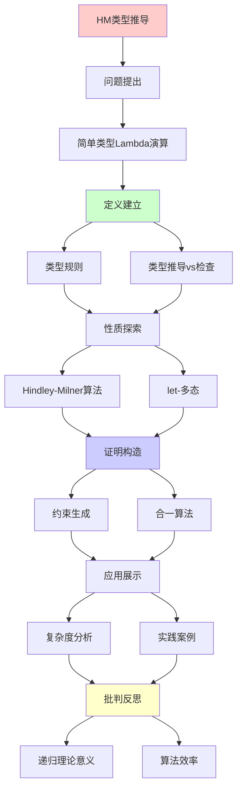
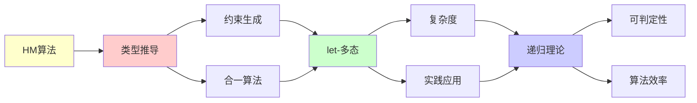

# Hindley-Milner类型推导算法

> **主题**: ML/Haskell的自动类型推导机制
> **创建日期**: 2025-12-02
> **难度**: ⭐⭐⭐⭐
> **前置知识**: Lambda演算、类型理论、合一算法

---

## 📋 目录

- [Hindley-Milner类型推导算法](#hindley-milner类型推导算法)
  - [📋 目录](#-目录)
  - [1. 简单类型Lambda演算回顾](#1-简单类型lambda演算回顾)
    - [1.1 类型规则](#11-类型规则)
    - [1.2 类型推导vs检查](#12-类型推导vs检查)
  - [2. Hindley-Milner算法](#2-hindley-milner算法)
    - [2.1 算法流程](#21-算法流程)
    - [2.2 约束生成](#22-约束生成)
    - [2.3 合一算法](#23-合一算法)
  - [3. let-多态](#3-let-多态)
    - [3.1 泛化规则](#31-泛化规则)
    - [3.2 实例化](#32-实例化)
  - [4. 复杂度分析](#4-复杂度分析)
  - [5. 实践案例](#5-实践案例)
    - [5.1 Haskell类型推导](#51-haskell类型推导)
    - [5.2 OCaml类型推导](#52-ocaml类型推导)
  - [6. 递归理论意义](#6-递归理论意义)
  - [7. 主题-子主题论证逻辑关系图](#7-主题-子主题论证逻辑关系图)
    - [7.1 论证依赖关系](#71-论证依赖关系)
    - [7.2 概念依赖关系](#72-概念依赖关系)
  - [8. 参考资源](#8-参考资源)
    - [8.1 经典论文](#81-经典论文)
    - [8.2 教材](#82-教材)
    - [8.3 在线资源](#83-在线资源)

---

## 1. 简单类型Lambda演算回顾

### 1.1 类型规则

```text
类型:
τ ::= α | τ₁ → τ₂

类型规则:
Γ ⊢ x : Γ(x)                    (Var)
Γ, x:τ₁ ⊢ e:τ₂ ⇒ Γ ⊢ λx.e : τ₁→τ₂  (Abs)
Γ⊢e₁:τ₁→τ₂, Γ⊢e₂:τ₁ ⇒ Γ⊢e₁ e₂:τ₂  (App)
```

---

### 1.2 类型推导vs检查

```text
类型检查:
输入: e, τ
输出: e:τ? (是/否)
复杂度: O(n) ✓

类型推导:
输入: e
输出: τ (最一般类型)
复杂度: ?

HM算法: O(n) (几乎线性!) ⭐⭐⭐⭐⭐
```

---

## 2. Hindley-Milner算法

### 2.1 算法流程

```text
步骤:
1. 生成类型变量
   为每个子表达式分配α_i

2. 生成约束
   根据类型规则生成等式

3. 合一 (Unification)
   求解约束系统

4. 替换
   应用解到类型变量

示例:
let id = λx. x in id 5
```

---

### 2.2 约束生成

**示例推导**:

```text
表达式: λx. x x

步骤:
1. λx. x x : α (目标类型)
2. x : β (假设)
3. x x : γ (应用结果)

约束:
- 第一个x: β
- 第二个x: β
- 应用: β = β → γ
- 整体: α = β → γ

问题:
β = β → γ (递归约束!)
→ 无穷类型 ✗
→ ML拒绝此程序 ✓

发生检查 (Occurs check):
β出现在β→γ中
→ 拒绝 ✓
```

---

### 2.3 合一算法

**Robinson合一 (1965)**:

```text
Unify(τ₁, τ₂):
  if τ₁ = τ₂: return ∅
  if τ₁ = α: return [α := τ₂]
  if τ₂ = α: return [α := τ₁]
  if τ₁ = σ₁→σ₂, τ₂ = σ₃→σ₄:
    θ₁ = Unify(σ₁, σ₃)
    θ₂ = Unify(θ₁(σ₂), θ₁(σ₄))
    return θ₂ ∘ θ₁
  else: fail

复杂度: O(n log n) (几乎线性)

递归性质:
✓ 合一递归定义
✓ 必终止 (结构递归)
```

---

## 3. let-多态

### 3.1 泛化规则

```text
let x = e₁ in e₂

规则:
Γ ⊢ e₁ : τ
∀α ∉ FV(Γ): Γ, x:∀α.τ ⊢ e₂ : σ
────────────────────────────────
Γ ⊢ let x=e₁ in e₂ : σ

泛化: τ → ∀α.τ
→ 多态类型 ✓

例子:
let id = λx.x in (id 5, id true)
- id被泛化为 ∀α. α→α
- 两次实例化: Int→Int, Bool→Bool
```

---

### 3.2 实例化

```text
实例化: ∀α.τ → τ[α := τ']

HM规则:
let绑定: 可泛化/实例化 ✓
λ绑定: 不泛化 ✗

原因:
let: 值限制 (value restriction)
λ: 可能副作用

递归性质:
✓ 泛化/实例化递归应用
✓ 类型层次递归
```

---

## 4. 复杂度分析

```text
HM算法复杂度:

理论:
- 最坏: O(n log n) (合一)
- 实践: O(n) (几乎线性) ⭐

vs System F:
System F: 不可判定 ✗
HM: O(n) ✓
→ 可判定性的胜利

为什么这么快?
✓ let-多态 (非全称量化)
✓ 简单结构
✓ 无依赖类型
→ 实用性最优 ⭐⭐⭐⭐⭐
```

---

## 5. 实践案例

### 5.1 Haskell类型推导

```text
例子:
map f [] = []
map f (x:xs) = f x : map f xs

推导:
1. f : α → β
2. [] : [γ]
3. x : γ
4. xs : [γ]
5. f x : β
6. map f xs : [β]
7. map : (α→β) → [α] → [β]

泛化:
map : ∀α β. (α→β) → [α] → [β] ✓

无需类型标注! ⭐
```

---

### 5.2 OCaml类型推导

```text
let rec fact n =
  if n = 0 then 1
  else n * fact (n-1)

推导:
1. n : int (从n=0推出)
2. 1 : int
3. n * ... : int
4. fact : int → int ✓

递归:
let rec允许递归定义
类型推导正确处理 ✓
```

---

## 6. 递归理论意义

```text
HM算法 = 递归+合一

递归性质:
✓ 约束生成递归
✓ 合一算法递归
✓ 类型替换递归

可判定性:
✓ HM: O(n)可判定 ⭐
✗ System F: 不可判定
→ 表达力与可判定性权衡

历史地位:
1969: Hindley
1978: Milner (独立)
1982: Damas-Milner (完整)
→ ML/Haskell核心 ⭐⭐⭐⭐⭐

递归理论:
✓ HM ∈ P ⊂ RE
✓ 类型推导可递归高效
→ 递归理论的实践胜利
```

---

## 7. 主题-子主题论证逻辑关系图

### 7.1 论证依赖关系



### 7.2 概念依赖关系



**论证逻辑链条**：

1. **问题提出** (1节)：
   - 简单类型Lambda演算回顾

2. **定义建立** (1.1-1.2节)：
   - 类型规则和类型推导vs检查

3. **性质探索** (2-3节)：
   - Hindley-Milner算法（2节）
   - let-多态（3节）

4. **证明构造** (2.2-2.3节)：
   - 约束生成和合一算法

5. **应用展示** (4-5节)：
   - 复杂度分析（4节）
   - 实践案例（5节）

6. **批判反思** (6节)：
   - 递归理论意义

---

## 8. 参考资源

### 8.1 经典论文

1. **Damas, L., & Milner, R.** (1982). "Principal type-schemes for functional programs"
   - _POPL 1982_. Proceedings of the 9th ACM SIGPLAN-SIGACT Symposium on Principles of Programming Languages
   - HM算法完整证明 ⭐⭐⭐⭐⭐

2. **Hindley, J. R.** (1969). "The Principal Type-Scheme of an Object in Combinatory Logic"
   - _Transactions of the American Mathematical Society_, 146, 29-60
   - Hindley原始算法

3. **Heeren, B., Hage, J., & Swierstra, S. D.** (2002). "Generalizing Hindley-Milner Type Inference Algorithms"
   - Technical Report UU-CS-2002-031, Utrecht University
   - HM算法现代改进

### 8.2 教材

1. **Pierce, B. C.** (2002)
   - _Types and Programming Languages_
   - MIT Press. ISBN 978-0262162098
   - 第22章：类型重构（HM算法）

2. **Mitchell, J. C.** (1996)
   - _Foundations for Programming Languages_
   - MIT Press. ISBN 978-0262133210
   - 类型系统基础

### 8.3 在线资源

1. **Wikipedia - Hindley-Milner type system**
   - https://en.wikipedia.org/wiki/Hindley%E2%80%93Milner_type_system
   - HM类型系统基本概念

2. **OCaml Type System**
   - https://ocaml.org/manual/types.html
   - OCaml类型系统文档

3. **Haskell Type System**
   - https://www.haskell.org/documentation/
   - Haskell类型系统文档

---

**最后更新**: 2025-12-04
**Tier**: 1-2 (理论+工程)
**重要性**: 函数式语言核心 ⭐⭐⭐⭐⭐
**复杂度**: O(n) 优秀 ✓
**状态**: ✅ 已添加主题-子主题论证逻辑关系图和参考资源章节
