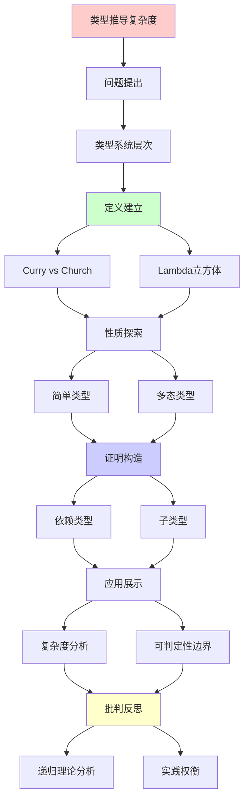

# 类型推导的复杂度边界

> **主题**: 类型系统可判定性与复杂度分析
> **创建日期**: 2025-12-02
> **难度**: ⭐⭐⭐⭐⭐
> **前置知识**: 类型理论、复杂度理论、递归理论

---

## 📋 目录

- [类型推导的复杂度边界](#类型推导的复杂度边界)
  - [📋 目录](#-目录)
  - [1. 类型系统层次](#1-类型系统层次)
    - [1.1 Curry风格vs Church风格](#11-curry风格vs-church风格)
    - [1.2 Lambda立方体](#12-lambda立方体)
  - [2. 简单类型](#2-简单类型)
    - [2.1 STLC类型推导](#21-stlc类型推导)
    - [2.2 线性复杂度](#22-线性复杂度)
  - [3. 多态类型](#3-多态类型)
    - [3.1 HM算法](#31-hm算法)
    - [3.2 System F不可判定](#32-system-f不可判定)
  - [4. 依赖类型](#4-依赖类型)
    - [4.1 类型检查vs推导](#41-类型检查vs推导)
    - [4.2 不可判定性](#42-不可判定性)
  - [5. 子类型](#5-子类型)
    - [5.1 子类型关系](#51-子类型关系)
    - [5.2 复杂度爆炸](#52-复杂度爆炸)
  - [6. 递归理论分析](#6-递归理论分析)
  - [7. 主题-子主题论证逻辑关系图](#7-主题-子主题论证逻辑关系图)
    - [7.1 论证依赖关系](#71-论证依赖关系)
    - [7.2 概念依赖关系](#72-概念依赖关系)
  - [8. 参考资源](#8-参考资源)
    - [8.1 经典论文](#81-经典论文)
    - [8.2 教材](#82-教材)
    - [8.3 在线资源](#83-在线资源)

---

## 1. 类型系统层次

### 1.1 Curry风格vs Church风格

**两种类型标注方式**:

```text
Church风格 (显式):
λx:Int. x + 1
→ 类型标注在项中 ✓
→ 类型检查简单 O(n)

Curry风格 (隐式):
λx. x + 1
→ 无类型标注
→ 需要类型推导 ⚠️

权衡:
显式: 冗长但快速
隐式: 简洁但复杂
→ 不同语言选择不同

递归理论:
✓ 检查 ∈ P (两种)
? 推导 ∈ ? (取决于系统)
```

---

### 1.2 Lambda立方体

**类型系统层次**:

```text
Lambda立方体 (Barendregt):

λ→ (STLC)
  ├→ λ2 (System F)
  ├→ λP (LF)
  └→ λω
      └→ λC (CoC)

三个维度:
1. 项依赖项 (函数)
2. 项依赖类型 (多态)
3. 类型依赖类型 (高阶)

复杂度:
λ→: O(n) 推导 ✓
λ2: 不可判定推导 ✗
λP: 不可判定检查 ✗
→ 表达力↑ = 可判定性↓ ⚠️
```

---

## 2. 简单类型

### 2.1 STLC类型推导

**简单类型Lambda演算**:

```text
类型规则:
Γ, x:A ⊢ x : A
Γ ⊢ e₁ : A→B, Γ ⊢ e₂ : A
────────────────────────────
Γ ⊢ e₁ e₂ : B

推导算法:
1. 生成约束
2. 合一 (Unification)
3. 替换

例子:
λx. λy. x
→ α → (β → α) ✓

定理: STLC类型推导可判定
```

---

### 2.2 线性复杂度

**复杂度分析**:

```text
算法W (Damas-Milner):
O(n) 时间 ⭐⭐⭐⭐⭐
O(n) 空间

关键:
合一算法: O(n·α(n))
α(n): Ackermann逆 (几乎常数)
→ 准线性 ✓

实践:
STLC推导极快
TypeScript基础推导 ✓
→ 实用级别 ⭐

递归理论:
✓ STLC推导 ∈ DTIME(n)
✓ 最优复杂度
```

---

## 3. 多态类型

### 3.1 HM算法

**Hindley-Milner**:

```text
let-多态:
let x = e₁ in e₂
→ x可泛化 ✓

复杂度:
最坏: O(n log n)
实践: ~O(n) ⭐

关键:
✓ 限制多态 (let-bound)
✗ 禁止高阶多态
→ 可判定性保证 ✓

ML/Haskell:
基于HM算法
几乎无需类型标注
→ 最佳实用平衡 ⭐⭐⭐⭐⭐

递归理论:
✓ HM ∈ DTIME(n log n)
✓ 可判定 + 高效
```

---

### 3.2 System F不可判定

**全称多态**:

```text
System F (λ2):
∀α. α → α

类型推导:
Wells (1999): 不可判定 ✗

证明思路:
归约半字问题 (Semi-Unification)
→ 不可判定 ✗

实践影响:
Haskell/ML: 限制为HM ✓
需要类型标注: ✓
forall显式标注 ✓

vs HM:
HM: let-多态 → 可判定 ✓
F: 全称多态 → 不可判定 ✗
→ 微妙差异，巨大影响 ⚠️

递归理论:
✗ System F推导 ∉ 可判定
✓ 但检查 ∈ P
→ 标注必需 ⚠️
```

---

## 4. 依赖类型

### 4.1 类型检查vs推导

**依赖类型系统**:

```text
依赖类型:
Π(x:A). B(x)
类型依赖于值 ⭐

类型检查:
给定 e, τ
判定 e:τ?

类型推导:
给定 e
求 τ

复杂度:
检查: 不可判定 ✗
推导: 更不可判定 ✗✗

原因:
类型计算 = 项计算
→ 停机问题 ✗
```

---

### 4.2 不可判定性

**理论限制**:

```text
定理: 依赖类型检查不可判定

证明:
类型中可编码任意计算
→ 停机问题等价 ✗

例子:
type Even(n:Nat) = ...
判定: f : Π(n:Nat). Even(n)
→ 需要证明f总返回偶数
→ Rice定理 ✗

实践对策:
Coq/Agda:
✓ 终止性检查器
✓ 结构递归要求
✓ 用户辅助证明
→ 半自动化 ⚠️

递归理论:
✗ 依赖类型检查 ∉ 可判定
✓ 但可递归枚举
→ 半判定 ⚠️
```

---

## 5. 子类型

### 5.1 子类型关系

**类型层次**:

```text
子类型 <:
Int <: Real
{x:Int, y:Int} <: {x:Int}

判定:
Γ ⊢ A <: B?

规则:
- 自反性: A <: A
- 传递性: A<:B, B<:C → A<:C
- 记录宽度: {x,y} <: {x}
- 记录深度: {x:A} <: {x:B} if A<:B

复杂度:
最坏: O(n³) ⚠️
```

---

### 5.2 复杂度爆炸

**交叉类型问题**:

```text
交叉类型 (A ∧ B):
f : A ∧ B → f:A 且 f:B

类型检查:
PSPACE-完全 ⚠️⚠️⚠️

Pierce (1989):
子类型 + 交叉 = 不可判定 ✗

实践:
Java/C#:
✓ 限制子类型
✓ 无交叉类型
→ 保持可判定 ✓

Scala:
✓ 交叉类型
⚠️ 编译慢
→ 实践权衡 ⚠️

递归理论:
✓ 子类型 ∈ PSPACE
✗ 交叉类型 ∉ 可判定
```

---

## 6. 递归理论分析

```text
类型系统复杂度层次:

可判定 + 高效:
✓ STLC: O(n)
✓ HM: O(n log n)
→ 实用最优 ⭐⭐⭐⭐⭐

可判定 + 昂贵:
✓ 子类型: O(n³)
✓ 记录: PSPACE
→ 实践可行 ⚠️

不可判定 + 半判定:
✗ System F推导
✗ 依赖类型检查
✓ 但可半判定
→ 需要辅助 ⚠️⚠️

不可判定 + 不可枚举:
✗ 某些高阶系统
→ 理论限制 ✗

权衡谱系:
表达力 ↑ ⟺ 可判定性 ↓
HM: 甜点 ⭐⭐⭐⭐⭐
- 实用多态 ✓
- 可判定高效 ✓
- 几乎无标注 ✓
→ 最佳平衡

实践策略:

1. 限制系统:
   ML/Haskell → HM
   → 保证可判定 ✓

2. 显式标注:
   System F + 标注
   → 检查可判定 ✓

3. 半自动化:
   Coq/Agda + 证明
   → 交互式验证 ⚠️

递归理论贡献:
✓ 明确可判定边界
✓ 证明不可判定性
✓ 指导实践设计
→ 理论指导工程 ⭐

历史演化:
1969: Hindley算法
1978: Milner重新发现
1982: Damas-Milner完整性
1999: Wells证明F不可判定
→ 50年理论发展 ⭐

哲学:
类型推导 = 逻辑推理
可判定性 = 推理自动化
不可判定 = 需要人类洞察
→ 人机协作 ⭐

未来:
机器学习辅助:
? 学习类型标注
? 预测推导困难
→ AI + 类型系统 ⭐

递归范式:
✓ 类型推导 ⊆ 递归可枚举
✓ 可判定性分层清晰
✓ 复杂度层次完整
→ 递归理论完美应用 ⭐⭐⭐⭐⭐
```

---

## 7. 主题-子主题论证逻辑关系图

### 7.1 论证依赖关系



### 7.2 概念依赖关系

```mermaid
graph LR
    A[类型推导] --> B[复杂度]

    B --> C[简单类型]
    B --> D[多态类型]
    B --> E[依赖类型]

    C --> F[O(n)]
    D --> G[O(n log n)]
    E --> H[不可判定]

    F --> I[递归理论]
    G --> I
    H --> I

    I --> J[可判定性]
    I --> K[实践权衡]

    style A fill:#ffffcc
    style B fill:#ffcccc
    style I fill:#ccffcc
    style J fill:#ccccff
```

**论证逻辑链条**：

1. **问题提出** (1节)：
   - 类型系统层次

2. **定义建立** (1.1-1.2节)：
   - Curry风格vs Church风格和Lambda立方体

3. **性质探索** (2-5节)：
   - 简单类型（2节）
   - 多态类型（3节）
   - 依赖类型（4节）
   - 子类型（5节）

4. **证明构造** (贯穿全文)：
   - 各种类型系统的复杂度分析

5. **应用展示** (贯穿全文)：
   - 复杂度分析和可判定性边界

6. **批判反思** (6节)：
   - 递归理论分析

---

## 8. 参考资源

### 8.1 经典论文

1. **Damas, L., & Milner, R.** (1982). "Principal type-schemes for functional programs"
   - _POPL 1982_. Proceedings of the 9th ACM SIGPLAN-SIGACT Symposium on Principles of Programming Languages
   - HM算法 ⭐⭐⭐⭐⭐

2. **Wells, J. B.** (1999). "Typability and Type Checking in System F are Equivalent and Undecidable"
   - _Annals of Pure and Applied Logic_, 98(1-3), 111-156
   - System F不可判定性

3. **Pierce, B. C.** (1989). "A Decision Procedure for the Subtype Relation on Intersection Types"
   - Technical Report, Carnegie Mellon University
   - 子类型复杂度

4. **Barendregt, H.** (1991). "Introduction to Generalized Type Systems"
   - _Journal of Functional Programming_, 1(2), 125-154
   - Lambda立方体

### 8.2 教材

1. **Pierce, B. C.** (2002)
   - _Types and Programming Languages_
   - MIT Press. ISBN 978-0262162098
   - 类型系统经典教材

2. **Mitchell, J. C.** (1996)
   - _Foundations for Programming Languages_
   - MIT Press. ISBN 978-0262133210
   - 编程语言基础

### 8.3 在线资源

1. **Lambda Cube**
   - https://en.wikipedia.org/wiki/Lambda_cube
   - Lambda立方体基本概念

2. **Type System Complexity**
   - https://www.cs.cmu.edu/~rwh/courses/refinements/papers/Wells99.pdf
   - 类型系统复杂度研究

3. **Wikipedia - Type inference**
   - https://en.wikipedia.org/wiki/Type_inference
   - 类型推导基本概念

---

**最后更新**: 2025-12-04
**Tier**: 1 (理论)
**重要性**: 语言设计核心 ⭐⭐⭐⭐⭐
**HM地位**: 实用最优平衡 ✓
**状态**: ✅ 已添加主题-子主题论证逻辑关系图和参考资源章节
