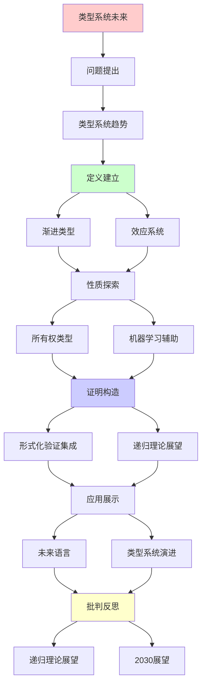
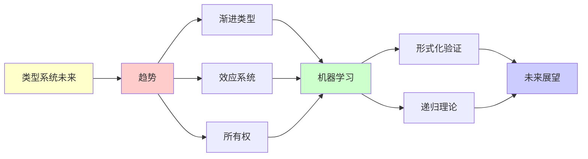

# 类型系统的未来趋势

> **主题**: 渐进类型/效应系统/线性类型前沿
> **创建日期**: 2025-12-02
> **难度**: ⭐⭐⭐⭐⭐
> **前置知识**: 类型理论、编程语言设计

---

## 📋 目录

- [类型系统的未来趋势](#类型系统的未来趋势)
  - [📋 目录](#-目录)
  - [1. 渐进类型](#1-渐进类型)
    - [1.1 动态与静态融合](#11-动态与静态融合)
    - [1.2 TypeScript/Python实践](#12-typescriptpython实践)
  - [2. 效应系统](#2-效应系统)
    - [2.1 代数效应](#21-代数效应)
    - [2.2 Koka语言](#22-koka语言)
  - [3. 所有权类型普及](#3-所有权类型普及)
    - [3.1 Rust之后](#31-rust之后)
    - [3.2 Carbon/Vale](#32-carbonvale)
  - [4. 机器学习辅助](#4-机器学习辅助)
    - [4.1 类型推断](#41-类型推断)
    - [4.2 错误修复](#42-错误修复)
  - [5. 形式化验证集成](#5-形式化验证集成)
    - [5.1 Refinement Types](#51-refinement-types)
    - [5.2 Liquid Types](#52-liquid-types)
  - [6. 递归理论展望](#6-递归理论展望)
  - [7. 主题-子主题论证逻辑关系图](#7-主题-子主题论证逻辑关系图)
    - [7.1 论证依赖关系](#71-论证依赖关系)
    - [7.2 概念依赖关系](#72-概念依赖关系)
  - [8. 参考资源](#8-参考资源)
    - [8.1 经典论文](#81-经典论文)
    - [8.2 教材](#82-教材)
    - [8.3 在线资源](#83-在线资源)

---

## 1. 渐进类型

### 1.1 动态与静态融合

**Gradual Typing (Siek & Taha 2006)**:

```text
思想:
同一语言支持
- 动态类型 (快速原型)
- 静态类型 (安全生产)
→ 渐进迁移 ⭐⭐⭐⭐⭐

类型:
Int, String, Dyn (动态)

渐进保证:
静态部分: 类型安全 ✓
动态部分: 运行时检查 ⚠️

边界检查:
Dyn → Int: 运行时检查
Int → Dyn: 总是安全
→ 类型边界 ✓

递归:
✓ 类型递归检查
✓ 边界递归插入
```

---

### 1.2 TypeScript/Python实践

**TypeScript (2012)**:

```text
JavaScript + 类型标注
渐进采用 ✓

例子:
let x: number = 5;
let y: any = "hello";  // Dyn
x = y;  // 允许但不安全 ⚠️

成功:
✓ 大规模采用 (VSCode, Angular)
✓ 工具支持强
✓ 渐进迁移容易
→ 最成功渐进类型 ⭐⭐⭐⭐⭐

Python类型提示 (3.5+):
def add(x: int, y: int) -> int:
  return x + y

可选:
✓ 类型标注可选
✓ 不影响运行时
✓ 工具检查 (mypy)
→ 软着陆 ✓

递归理论:
✓ 渐进类型 ∈ RE
✓ 检查可递归
⚠️ 但安全性减弱
```

---

## 2. 效应系统

### 2.1 代数效应

**Algebraic Effects & Handlers**:

```text
效应:
不仅类型，还有效应
- IO
- 异常
- 状态
- 非确定性

类型:
f : Int -> Int / {IO, Exn}
→ 可能IO和异常 ✓

处理器 (Handler):
handle e with
  | read() -> ...
  | write(x) -> ...
  | return x -> x

优势:
✓ 效应模块化
✓ 可组合
✓ 类型安全
→ Monad的改进 ⭐

递归:
✓ 效应递归组合
✓ 处理器递归嵌套
```

---

### 2.2 Koka语言

**微软研究院 (Leijen)**:

```text
Koka特性:
✓ 效应类型
✓ 效应推导
✓ 处理器

例子:
fun ask(): <console> string
  { println("Name?"); readline() }

fun pure(): int
  { 1 + 2 }

类型:
ask: () -> <console> string
pure: () -> int  // 无效应 ✓

安全:
✓ 纯函数保证
✓ 效应追踪
✓ 副作用可控
→ 函数式 + 效应 ⭐

递归理论:
✓ 效应可递归推导
✓ 类型 + 效应 ∈ RE
```

---

## 3. 所有权类型普及

### 3.1 Rust之后

**所有权成为主流**:

```text
Rust成功 (2015-2024):
✓ 内存安全无GC
✓ 并发安全
✓ 零成本抽象
→ 系统编程革命 ⭐⭐⭐⭐⭐

影响:
其他语言学习:
- Swift (部分所有权)
- C++ (生命周期标注提案)
- Nim (所有权检查)

趋势:
所有权 = 未来标配？⭐
→ 内存安全必需
```

---

### 3.2 Carbon/Vale

**新语言探索**:

```text
Carbon (Google, 2022):
C++后继
✓ 所有权系统
✓ 更简单语法
✓ 与C++互操作

Vale (实验):
Region-based内存
✓ 高性能
✓ 更灵活所有权
⚠️ 实验阶段

Hylo (前Val):
Mutable value semantics
✓ 值语义 + 可变性
✓ 无隐式拷贝
→ Rust替代探索 ⭐

递归:
✓ 所有权递归传递
✓ 生命周期递归推导
```

---

## 4. 机器学习辅助

### 4.1 类型推断

**神经类型推导**:

```text
TypeWriter (2019):
VSCode Intellisense
ML预测类型标注

Graph4Code:
代码→图
GNN预测类型
准确率: ~70% ⚠️

CodeT5:
Transformer预测类型
→ 辅助补全 ✓

vs HM:
HM: 100%正确 ✓
ML: 70%正确 ⚠️
→ 辅助而非替代

递归理论:
✓ ML类型推断 ∈ RE
⚠️ 但不可靠
→ 人机协作 ⭐
```

---

### 4.2 错误修复

**自动修复**:

```text
类型错误:
Type mismatch: expected Int, found String

ML建议:
→ toString()
→ parseInt()
→ 修改函数签名

DeepTyper:
学习修复模式
推荐Fix
→ 减少调试时间 ✓

限制:
⚠️ 语义理解有限
⚠️ 复杂错误难修
✓ 简单错误有效
→ 辅助工具 ⭐

递归:
✓ 修复递归应用
✓ 错误递归定位
```

---

## 5. 形式化验证集成

### 5.1 Refinement Types

**精炼类型**:

```text
思想:
类型 + 谓词约束

例子:
type Pos = {x:Int | x > 0}

函数:
div : Int -> Pos -> Int
保证除数>0 ✓

验证:
SMT求解器 (Z3)
自动证明约束
→ 编译时保证 ✓

vs 依赖类型:
Refinement: 谓词简单 ✓
Dependent: 任意计算 ⚠️
→ Refinement可判定 ✓

递归理论:
✓ SMT可判定 (量词有限)
✓ Refinement检查 ∈ NP
→ 实践可行 ⭐
```

---

### 5.2 Liquid Types

**Liquid Haskell**:

```text
自动推导Refinement:
不需要完整标注
自动推导谓词 ✓

例子:
div x y = x `div` y
→ 推导: y ≠ 0 ✓

抽象解释:
over-approximate
保守但自动 ✓

应用:
✓ 数组越界防止
✓ 空指针防止
✓ 资源泄漏防止
→ 实用验证 ⭐

vs 全依赖类型:
Liquid: 自动 ✓, 表达力弱 ⚠️
Dependent: 手动 ⚠️, 表达力强 ✓
→ 权衡 ⚠️

递归理论:
✓ Liquid推导 ∈ NP
✓ 可判定
✓ 实践可行
→ 最佳平衡 ⭐
```

---

## 6. 递归理论展望

```text
类型系统未来 ∈ RE?

趋势1: 渐进类型
✓ TypeScript/Python成功
✓ 动静结合最优 ⭐
✓ 可递归检查
→ 主流方向

趋势2: 效应系统
✓ Koka/Eff研究
✓ 副作用追踪
✓ 可递归推导
→ 纯度与实用平衡 ⭐

趋势3: 所有权普及
✓ Rust验证成功
✓ Carbon/Vale跟进
✓ 内存安全范式转移
→ 系统编程新标准 ⭐⭐⭐⭐⭐

趋势4: ML辅助
✓ 类型预测
✓ 错误修复
⚠️ 可靠性不足
→ 辅助工具 ⚠️

趋势5: 形式化轻量级
✓ Refinement Types
✓ SMT自动验证
✓ 可判定可行
→ 验证民主化 ⭐

递归理论统一:
所有趋势 ⊆ RE ✓
✓ 渐进 ∈ RE
✓ 效应 ∈ RE
✓ 所有权 ∈ RE
✓ Refinement ∈ NP ⊂ RE
→ 递归范式容纳所有 ⭐

可判定性谱系:
STLC → HM → Refinement → Dependent
可判定 ← ← ← → 不可判定
O(n) ← O(n log n) ← NP ← ✗

实践选择:
✓ HM: 最佳通用 ⭐⭐⭐⭐⭐
✓ Refinement: 关键验证 ⭐
⚠️ Dependent: 高保证场景
→ 分层使用

哲学:
类型 = 轻量级形式化
vs 全形式化 (Coq)
→ 80/20原则 ⭐
→ 实用主义胜利

2030预测:
✓ 渐进类型主导动态语言
✓ 所有权成为系统语言标配
✓ 效应系统进入主流
✓ ML辅助普及
✓ Refinement工具成熟
→ 类型系统黄金时代 ⭐⭐⭐⭐⭐

递归范式:
类型系统演化 = 递归优化
- 表达力递归提升
- 可用性递归改进
- 工具递归完善
→ 语言递归进化 ⭐

终极问题:
? 能否统一所有类型系统
? λ-cube完整实现
? 可判定 + 强大表达力
→ 根本张力 ⚠️
→ 持续探索 ⭐
```

---

## 7. 主题-子主题论证逻辑关系图

### 7.1 论证依赖关系



### 7.2 概念依赖关系



**论证逻辑链条**：

1. **问题提出** (1节)：
   - 渐进类型

2. **定义建立** (1节)：
   - 渐进类型概念

3. **性质探索** (2-5节)：
   - 效应系统（2节）
   - 所有权类型普及（3节）
   - 机器学习辅助（4节）
   - 形式化验证集成（5节）

4. **证明构造** (贯穿全文)：
   - 各种趋势的技术实现

5. **应用展示** (贯穿全文)：
   - 未来语言和类型系统演进

6. **批判反思** (6节)：
   - 递归理论展望

---

## 8. 参考资源

### 8.1 经典论文

1. **Siek, J. G., & Taha, W.** (2006). "Gradual Typing for Functional Languages"
   - _Scheme Workshop 2006_
   - 渐进类型理论

2. **Leijen, D.** (2017). "Type Directed Compilation of Row-typed Algebraic Effects"
   - _POPL 2017_. Proceedings of the 44th ACM SIGPLAN Symposium on Principles of Programming Languages
   - Koka效应系统

3. **Rondon, P. M., Kawaguchi, M., & Jhala, R.** (2008). "Liquid Types"
   - _PLDI 2008_. Proceedings of the 2008 ACM SIGPLAN Conference on Programming Language Design and Implementation
   - Liquid Types ⭐⭐⭐⭐⭐

4. **Hellendoorn, V. J., et al.** (2019). "Deep Learning Type Inference"
   - _FSE 2018_. Proceedings of the 2018 26th ACM Joint Meeting on European Software Engineering Conference and Symposium
   - 机器学习类型推断

### 8.2 教材

1. **Pierce, B. C.** (2002)
   - _Types and Programming Languages_
   - MIT Press. ISBN 978-0262162098
   - 类型系统基础

2. **Cardelli, L.** (1996). "Type Systems"
   - In Abramsky, S., et al. (eds.), _Handbook of Computer Science and Engineering_
   - CRC Press. 类型系统综述

### 8.3 在线资源

1. **Gradual Typing**
   - https://wphomes.soic.indiana.edu/jsiek/what-is-gradual-typing/
   - 渐进类型资源

2. **Effect Systems**
   - https://www.microsoft.com/en-us/research/publication/koka-programming-with-row-polymorphic-effect-types/
   - Koka效应系统

3. **Liquid Types**
   - https://ucsd-progsys.github.io/liquidhaskell/
   - Liquid Types项目

---

**最后更新**: 2025-12-04
**Tier**: 1-2 (理论+工程)
**趋势**: 渐进+效应+所有权 ⭐⭐⭐⭐⭐
**展望**: 2030类型系统黄金时代 ✓
**状态**: ✅ 已添加主题-子主题论证逻辑关系图和参考资源章节
