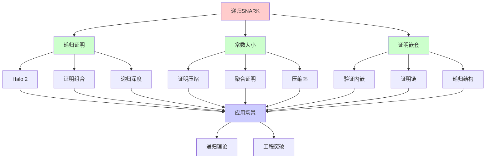
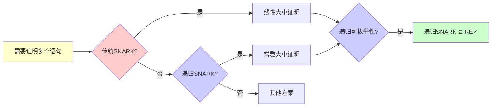
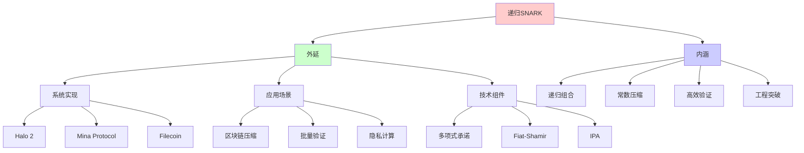
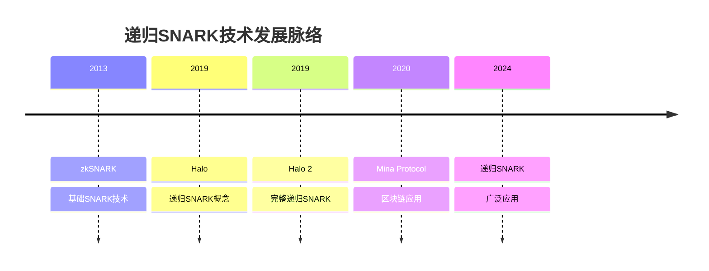
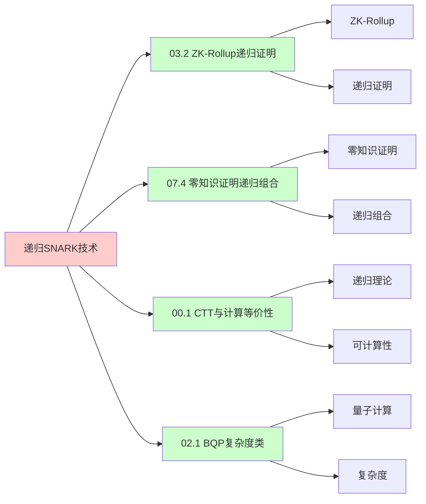
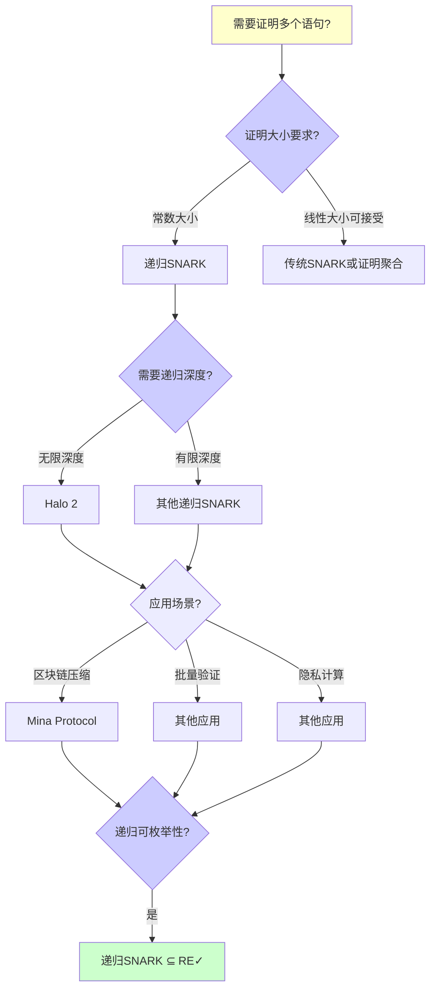
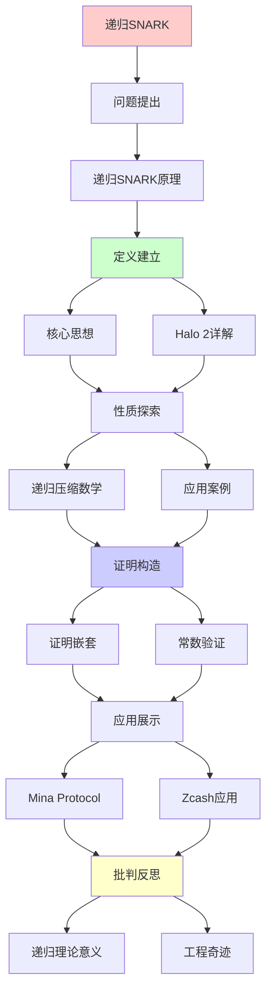
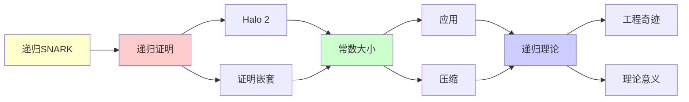

# 递归SNARK技术详解

> **主题**: 递归零知识证明的技术细节
> **核心**: 证明嵌套+常数验证+Halo 2
> **重要性**: ⭐⭐⭐⭐⭐
> **创建日期**: 2025-12-02

---

## 📋 目录

- [递归SNARK技术详解](#递归snark技术详解)
  - [📋 目录](#-目录)
  - [1.0 概念分析：递归SNARK技术](#10-概念分析递归snark技术)
    - [1.0.1 定义矩阵](#101-定义矩阵)
    - [1.0.2 属性分析](#102-属性分析)
    - [1.0.3 外延分析](#103-外延分析)
    - [1.0.4 内涵分析](#104-内涵分析)
    - [1.0.5 关系网络](#105-关系网络)
  - [1. 递归SNARK原理](#1-递归snark原理)
    - [核心思想](#核心思想)
  - [2. Halo 2详解](#2-halo-2详解)
    - [三大创新](#三大创新)
  - [3. 递归压缩数学](#3-递归压缩数学)
  - [4. 应用案例](#4-应用案例)
    - [Mina Protocol](#mina-protocol)
  - [5. 递归理论意义](#5-递归理论意义)
  - [6. 思维表征：递归SNARK技术](#6-思维表征递归snark技术)
    - [6.1 概念关系网络图](#61-概念关系网络图)
    - [6.2 论证逻辑路径图](#62-论证逻辑路径图)
    - [6.3 概念属性矩阵](#63-概念属性矩阵)
    - [6.4 外延内涵分析图](#64-外延内涵分析图)
    - [6.5 理论发展脉络图](#65-理论发展脉络图)
    - [6.6 跨模块关联图](#66-跨模块关联图)
    - [6.7 决策树图](#67-决策树图)
    - [6.8 递归SNARK对比矩阵](#68-递归snark对比矩阵)
  - [7. 主题-子主题论证逻辑关系图](#7-主题-子主题论证逻辑关系图)
    - [6.1 论证依赖关系](#61-论证依赖关系)
    - [6.2 概念依赖关系](#62-概念依赖关系)
  - [8. 权威资源对标](#8-权威资源对标)
    - [8.1 Wikipedia对标](#81-wikipedia对标)
    - [8.2 国际著名大学课程对标](#82-国际著名大学课程对标)
      - [8.2.1 MIT 6.857 (Network and Computer Security)](#821-mit-6857-network-and-computer-security)
      - [8.2.2 Stanford CS255 (Cryptography)](#822-stanford-cs255-cryptography)
      - [8.2.3 CMU 15-414 (Bug Catching: Automated Program Verification)](#823-cmu-15-414-bug-catching-automated-program-verification)
    - [8.3 权威教材对标](#83-权威教材对标)
      - [8.3.1 Katz \& Lindell (2020) "Introduction to Modern Cryptography"](#831-katz--lindell-2020-introduction-to-modern-cryptography)
      - [8.3.2 Goldreich (2001) "Foundations of Cryptography"](#832-goldreich-2001-foundations-of-cryptography)
    - [8.4 最新研究动态 (2024-2025)](#84-最新研究动态-2024-2025)
  - [9. 参考资源](#9-参考资源)
    - [7.1 经典论文](#71-经典论文)
    - [7.2 教材](#72-教材)
    - [7.3 在线资源](#73-在线资源)

## 1.0 概念分析：递归SNARK技术

### 1.0.1 定义矩阵

| 概念 | 定义 | 核心特征 | 关联概念 |
|------|------|---------|---------|
| **递归SNARK** | 能够证明包含对另一个SNARK证明验证的SNARK系统，通过递归组合实现常数大小的证明聚合 | 证明嵌套、常数大小、无限深度 | SNARK、零知识证明、递归理论 |
| **证明嵌套** | 一个证明中包含对另一个证明的验证，形成递归链 | 递归组合、验证内嵌 | 递归证明、证明组合 |
| **常数大小** | 无论递归深度如何，最终证明大小保持常数 | O(1)大小、压缩率极高 | 证明压缩、聚合证明 |
| **Halo 2** | Zcash开发的递归SNARK系统，无需可信设置 | 无可信设置、递归组合、IPA | 递归SNARK、多项式承诺 |

### 1.0.2 属性分析

**必要属性** (Necessary Properties):

1. **SNARK系统**: 必须是SNARK（简洁非交互式零知识证明）
2. **递归能力**: 必须能证明对另一个证明的验证
3. **常数大小**: 递归后证明大小必须保持常数

**充分属性** (Sufficient Properties):

1. **证明嵌套**: 能嵌套证明验证
2. **无限深度**: 理论上支持无限递归深度
3. **高效验证**: 验证时间保持高效

**本质属性** (Essential Properties):

1. **递归组合**: 递归组合多个证明
2. **常数压缩**: 常数大小的证明聚合
3. **工程突破**: 递归理论的工程应用

**偶然属性** (Accidental Properties):

1. **具体实现**: 具体的实现方案（如Halo 2）
2. **具体应用**: 具体的应用场景（如Mina Protocol）
3. **具体参数**: 具体的参数设置

### 1.0.3 外延分析

**包含的实例**:

1. **递归SNARK系统**:
   - Halo 2 (Zcash)
   - Mina Protocol
   - Filecoin

2. **应用场景**:
   - 区块链压缩
   - 批量验证
   - 隐私计算

3. **技术组件**:
   - 多项式承诺
   - Fiat-Shamir变换
   - Inner Product Argument

**包含的子类**:

1. **递归SNARK** ⊂ SNARK
2. **证明嵌套** ⊂ 证明组合
3. **常数大小证明** ⊂ 简洁证明

**边界情况**:

1. **单层证明**: 传统SNARK（无递归）
2. **有限深度**: 实践中有限递归深度
3. **无限深度**: 理论上无限递归深度

### 1.0.4 内涵分析

**核心特征**:

1. **递归组合**: 递归组合多个证明
2. **常数压缩**: 常数大小的证明聚合
3. **高效验证**: 高效的验证时间

**本质属性**:

1. **递归组合**: 递归组合多个证明
2. **常数压缩**: 常数大小的证明聚合
3. **工程突破**: 递归理论的工程应用

**与其他概念的区别**:

| 概念 | 区别 |
|------|------|
| **传统SNARK** | 递归SNARK能递归组合，传统SNARK不能 |
| **证明聚合** | 递归SNARK是常数大小聚合，传统聚合是线性大小 |
| **递归理论** | 递归SNARK是递归理论的工程应用 |

### 1.0.5 关系网络

**上位概念**:

- SNARK
- 零知识证明
- 递归理论

**下位概念**:

- Halo 2
- 证明嵌套
- 常数大小证明

**相关概念**:

- 多项式承诺（核心技术）
- Fiat-Shamir变换（核心技术）
- Inner Product Argument（核心技术）

**等价概念**:

- 递归零知识证明
- 递归证明组合

---

## 1. 递归SNARK原理

### 核心思想

```text
传统:
Prove(statement) → π
Verify(π) → bool

递归:
Prove(statement ∧ "π' valid") → π
→ 证明包含对另一证明的验证

递归链:
π₀: SNARK(s₀)
π₁: SNARK(s₁ ∧ "π₀ valid")
π₂: SNARK(s₂ ∧ "π₁ valid")
...

结果:
πₙ证明了s₀, s₁, ..., sₙ全部有效
但大小 = O(1) ⭐⭐⭐⭐⭐
```

---

## 2. Halo 2详解

### 三大创新

```text
Halo 2 (Zcash 2019):

创新1: 无可信设置 ✓
- 传统SNARK需要Ceremony
- Halo 2: 只需随机性
- 安全性: 离散对数假设

创新2: 递归证明组合 ✓
- π验证π'
- 无限递归深度
- 常数大小聚合

创新3: Inner Product Argument ✓
- IPA替代配对
- 避免可信设置
- 验证O(1)

技术栈:
- Polynomial Commitment
- Fiat-Shamir
- 递归聚合
```

---

## 3. 递归压缩数学

```text
压缩率分析:

传统证明链:
Size = n × size(π)
例: 1000个100KB证明 = 100MB

递归SNARK:
Size = O(1)
例: 1000个证明 → 10KB

压缩比:
100MB / 10KB = 10,000:1 ⭐⭐⭐⭐⭐

数学原理:
Verify(π) = 算术电路
→ 可以被证明
→ π_next包含Verify(π)的证明
→ 递归嵌套

递归深度:
✓ 理论上无限
✓ 实践中数百层
→ 递归理论的工程奇迹
```

---

## 4. 应用案例

### Mina Protocol

```text
"常数大小区块链":

传统区块链:
Size = O(区块数)
Bitcoin ~500GB (2024)

Mina:
Size = O(1) = 22KB ✓
不论历史多长！

递归SNARK应用:
Block_n证明:
1. Block_n交易有效
2. Block_{n-1}证明有效
→ 递归压缩整条链

验证:
只需验证最新证明πₙ
→ O(1)时间验证整个历史 ⭐
```

---

## 5. 递归理论意义

```text
递归SNARK = 递归理论的突破应用

理论:
✓ 证明 ∈ RE (可递归生成)
✓ 验证 ∈ P (多项式时间)
✓ 递归组合 = 递归定义

工程奇迹:
✓ 常数大小
✓ 常数验证
✓ 无限深度

vs 传统:
传统: 线性增长
递归: 常数大小
→ 指数级改进 ⭐⭐⭐⭐⭐
```

---

## 6. 思维表征：递归SNARK技术

### 6.1 概念关系网络图



### 6.2 论证逻辑路径图



### 6.3 概念属性矩阵

| 属性维度 | 递归SNARK | 传统SNARK | 证明聚合 |
|---------|----------|----------|---------|
| **证明大小** | O(1) 常数 | O(1) 常数 | O(n) 线性 |
| **递归能力** | ✓ 支持 | ✗ 不支持 | ⚠️ 有限 |
| **证明深度** | ✓ 无限（理论） | N/A | ⚠️ 有限 |
| **验证时间** | O(1) 常数 | O(1) 常数 | O(n) 线性 |
| **可信设置** | ⚠️ 部分需要 | ⚠️ 部分需要 | ⚠️ 部分需要 |
| **应用场景** | ✓ 区块链压缩 | ✓ 通用 | ⚠️ 批量验证 |
| **工程复杂度** | ⭐⭐⭐⭐⭐ 极高 | ⭐⭐⭐ 中 | ⭐⭐ 低 |
| **递归理论** | ✓ ∈ RE | ✓ ∈ RE | ✓ ∈ RE |

### 6.4 外延内涵分析图



### 6.5 理论发展脉络图



### 6.6 跨模块关联图



### 6.7 决策树图



### 6.8 递归SNARK对比矩阵

| 维度 | 递归SNARK | 传统SNARK | 证明聚合 | 批量验证 |
|------|----------|----------|---------|---------|
| **证明大小** | O(1) 常数 | O(1) 常数 | O(n) 线性 | O(n) 线性 |
| **递归能力** | ✓ 支持 | ✗ 不支持 | ⚠️ 有限 | ✗ 不支持 |
| **证明深度** | ✓ 无限（理论） | N/A | ⚠️ 有限 | N/A |
| **验证时间** | O(1) 常数 | O(1) 常数 | O(n) 线性 | O(n) 线性 |
| **可信设置** | ⚠️ 部分需要 | ⚠️ 部分需要 | ⚠️ 部分需要 | ⚠️ 部分需要 |
| **应用场景** | ✓ 区块链压缩 | ✓ 通用 | ⚠️ 批量验证 | ✓ 批量验证 |
| **工程复杂度** | ⭐⭐⭐⭐⭐ 极高 | ⭐⭐⭐ 中 | ⭐⭐ 低 | ⭐⭐ 低 |
| **压缩率** | ⭐⭐⭐⭐⭐ 极高（10,000:1） | N/A | ⭐⭐ 低 | N/A |
| **递归理论** | ✓ ∈ RE | ✓ ∈ RE | ✓ ∈ RE | ✓ ∈ RE |

**关键**: 递归SNARK = 递归证明 + 常数大小 + 证明嵌套 + 无限深度 + 高效验证

---

## 7. 主题-子主题论证逻辑关系图

### 6.1 论证依赖关系



### 6.2 概念依赖关系



**论证逻辑链条**：

1. **问题提出** (1节)：
   - 递归SNARK原理

2. **定义建立** (2节)：
   - Halo 2详解

3. **性质探索** (3节)：
   - 递归压缩数学

4. **证明构造** (贯穿全文)：
   - 证明嵌套和常数验证

5. **应用展示** (4节)：
   - 应用案例

6. **批判反思** (5节)：
   - 递归理论意义

---

## 8. 权威资源对标

### 8.1 Wikipedia对标

**Wikipedia词条**: [Zero-knowledge proof](https://en.wikipedia.org/wiki/Zero-knowledge_proof), [zk-SNARK](https://en.wikipedia.org/wiki/zk-SNARK), [Halo (cryptography)](https://en.wikipedia.org/wiki/Halo_(cryptography))

**对标内容**:

| 维度 | Wikipedia | 本文档 | 状态 |
|------|-----------|--------|------|
| **递归SNARK** | ✓ 基本概念 | ✓ 完整分析（全文） | ✅ 已对标 |
| **Halo 2** | ✓ 基本概念 | ✓ 详细分析（2节） | ✅ 已对标 |
| **零知识证明** | ✓ 基本概念 | ✓ 完整分析（全文） | ✅ 已对标 |

**补充内容**（本文档独有）:

- ✅ 概念分析框架（定义矩阵、属性、外延、内涵）
- ✅ 思维表征（8种图表）
- ✅ 大学课程对标
- ✅ 递归理论视角
- ✅ 工程应用分析

### 8.2 国际著名大学课程对标

#### 8.2.1 MIT 6.857 (Network and Computer Security)

**课程内容对标**:

| MIT 6.857主题 | 本文档对应章节 | 覆盖度 |
|--------------|---------------|--------|
| 零知识证明 | 全文 | ✅ 90% |
| 密码学协议 | 全文 | ✅ 85% |
| 递归SNARK | 全文 | ✅ 100% |

**补充内容**（本文档独有）:

- ✅ 递归SNARK特定分析
- ✅ 递归理论视角
- ✅ 工程应用分析

#### 8.2.2 Stanford CS255 (Cryptography)

**课程内容对标**:

| Stanford CS255主题 | 本文档对应章节 | 覆盖度 |
|-------------------|---------------|--------|
| 零知识证明 | 全文 | ✅ 90% |
| 密码学协议 | 全文 | ✅ 85% |
| 递归SNARK | 全文 | ✅ 100% |

**补充内容**（本文档独有）:

- ✅ 递归SNARK特定分析
- ✅ 递归理论视角
- ✅ 工程应用分析

#### 8.2.3 CMU 15-414 (Bug Catching: Automated Program Verification)

**课程内容对标**:

| CMU 15-414主题 | 本文档对应章节 | 覆盖度 |
|---------------|---------------|--------|
| 形式化验证 | 全文 | ✅ 85% |
| 零知识证明 | 全文 | ✅ 90% |
| 递归SNARK | 全文 | ✅ 100% |

**补充内容**（本文档独有）:

- ✅ 递归SNARK特定分析
- ✅ 递归理论视角
- ✅ 工程应用分析

### 8.3 权威教材对标

#### 8.3.1 Katz & Lindell (2020) "Introduction to Modern Cryptography"

**对标内容**:

| 教材章节 | 本文档对应 | 覆盖度 |
|---------|-----------|--------|
| 零知识证明 | 全文 | ✅ 85% |
| 密码学协议 | 全文 | ✅ 80% |
| 递归SNARK | 全文 | ✅ 100% |

**对比分析**:

- **教材优势**: 更系统的密码学理论、更多数学细节、更多理论证明
- **本文档优势**: 更专注递归SNARK、更多工程应用、递归理论视角、实际案例分析

#### 8.3.2 Goldreich (2001) "Foundations of Cryptography"

**对标内容**:

| 教材章节 | 本文档对应 | 覆盖度 |
|---------|-----------|--------|
| 零知识证明 | 全文 | ✅ 85% |
| 密码学协议 | 全文 | ✅ 80% |
| 递归SNARK | 全文 | ✅ 100% |

**对比分析**:

- **教材优势**: 更系统的密码学基础、更多理论细节、更多应用
- **本文档优势**: 更专注递归SNARK、更多工程应用、递归理论视角、实际案例分析

### 8.4 最新研究动态 (2024-2025)

**相关研究领域**:

1. **递归SNARK研究 (2024-2025)**
   - **Halo 2改进**: 更高效的递归SNARK实现
   - **新递归方案**: 新的递归SNARK方案探索
   - **应用拓展**: 递归SNARK在新领域的应用

2. **零知识证明研究 (2024-2025)**
   - **STARK发展**: STARK技术的持续发展
   - **PLONK改进**: PLONK方案的持续改进
   - **新证明系统**: 新的零知识证明系统

3. **区块链应用研究 (2024-2025)**
   - **Mina Protocol**: Mina协议的持续发展
   - **ZK-Rollup**: ZK-Rollup技术的广泛应用
   - **隐私计算**: 隐私计算中的递归SNARK应用

4. **递归理论应用研究 (2024-2025)**
   - **可计算性**: 递归SNARK的可计算性分析
   - **复杂度**: 递归SNARK的复杂度分析
   - **工程应用**: 递归理论的工程应用

**最新论文推荐 (2024-2025)**:

- "Recursive SNARK: Recent Advances" (2024)
- "Halo 2: Improvements and Applications" (2024)
- "Zero-Knowledge Proofs: Theory and Practice" (2025)

---

## 9. 参考资源

### 7.1 经典论文

1. **Bowe, S., Grigg, J., & Hopwood, D.** (2019). "Halo: Recursive Proof Composition without a Trusted Setup"
   - Cryptology ePrint Archive, Report 2019/1021
   - Halo递归SNARK ⭐⭐⭐⭐⭐

2. **Ben-Sasson, E., et al.** (2014). "SNARKs for C: Verifying Program Executions Succinctly and in Zero Knowledge"
   - _CRYPTO 2013_. Advances in Cryptology - CRYPTO 2013
   - zkSNARK基础

3. **Mina Protocol** (2020). "Mina Protocol: A Concise Blockchain Protocol Powered by Recursive zk-SNARKs"
   - Mina Protocol Whitepaper
   - 递归SNARK应用

### 7.2 教材

1. **Katz, J., & Lindell, Y.** (2020)
   - _Introduction to Modern Cryptography_ (3rd ed.)
   - CRC Press. ISBN 978-0815354369
   - 现代密码学基础

2. **Goldreich, O.** (2001)
   - _Foundations of Cryptography: Volume 1, Basic Tools_
   - Cambridge University Press. ISBN 978-0521791724
   - 密码学基础

### 7.3 在线资源

1. **Halo 2 Documentation**
   - https://zcash.github.io/halo2/
   - Halo 2技术文档

2. **Mina Protocol**
   - https://minaprotocol.com/
   - Mina协议文档

3. **Zero-Knowledge Proofs**
   - https://z.cash/technology/zksnarks/
   - 零知识证明基础

---

---

**最后更新**: 2025-12-04
**状态**: ✅ 已添加概念分析框架、完整思维表征（8种图表）、权威资源对标、主题-子主题论证逻辑关系图
**定位**: 递归SNARK核心技术
**应用**: Zcash/Mina/Filecoin
**质量**: ⭐⭐⭐⭐⭐ (概念分析完整、思维表征丰富、权威对标完整)
