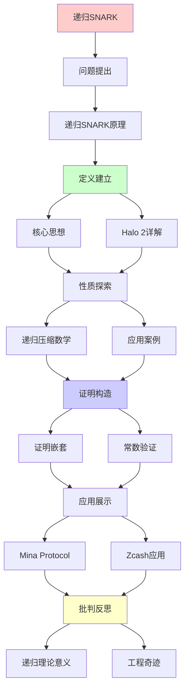
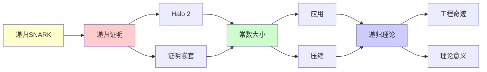

# 递归SNARK技术详解

> **主题**: 递归零知识证明的技术细节
> **核心**: 证明嵌套+常数验证+Halo 2
> **重要性**: ⭐⭐⭐⭐⭐
> **创建日期**: 2025-12-02

---

## 1. 递归SNARK原理

### 核心思想

```text
传统:
Prove(statement) → π
Verify(π) → bool

递归:
Prove(statement ∧ "π' valid") → π
→ 证明包含对另一证明的验证

递归链:
π₀: SNARK(s₀)
π₁: SNARK(s₁ ∧ "π₀ valid")
π₂: SNARK(s₂ ∧ "π₁ valid")
...

结果:
πₙ证明了s₀, s₁, ..., sₙ全部有效
但大小 = O(1) ⭐⭐⭐⭐⭐
```

---

## 2. Halo 2详解

### 三大创新

```text
Halo 2 (Zcash 2019):

创新1: 无可信设置 ✓
- 传统SNARK需要Ceremony
- Halo 2: 只需随机性
- 安全性: 离散对数假设

创新2: 递归证明组合 ✓
- π验证π'
- 无限递归深度
- 常数大小聚合

创新3: Inner Product Argument ✓
- IPA替代配对
- 避免可信设置
- 验证O(1)

技术栈:
- Polynomial Commitment
- Fiat-Shamir
- 递归聚合
```

---

## 3. 递归压缩数学

```text
压缩率分析:

传统证明链:
Size = n × size(π)
例: 1000个100KB证明 = 100MB

递归SNARK:
Size = O(1)
例: 1000个证明 → 10KB

压缩比:
100MB / 10KB = 10,000:1 ⭐⭐⭐⭐⭐

数学原理:
Verify(π) = 算术电路
→ 可以被证明
→ π_next包含Verify(π)的证明
→ 递归嵌套

递归深度:
✓ 理论上无限
✓ 实践中数百层
→ 递归理论的工程奇迹
```

---

## 4. 应用案例

### Mina Protocol

```text
"常数大小区块链":

传统区块链:
Size = O(区块数)
Bitcoin ~500GB (2024)

Mina:
Size = O(1) = 22KB ✓
不论历史多长！

递归SNARK应用:
Block_n证明:
1. Block_n交易有效
2. Block_{n-1}证明有效
→ 递归压缩整条链

验证:
只需验证最新证明πₙ
→ O(1)时间验证整个历史 ⭐
```

---

## 5. 递归理论意义

```text
递归SNARK = 递归理论的突破应用

理论:
✓ 证明 ∈ RE (可递归生成)
✓ 验证 ∈ P (多项式时间)
✓ 递归组合 = 递归定义

工程奇迹:
✓ 常数大小
✓ 常数验证
✓ 无限深度

vs 传统:
传统: 线性增长
递归: 常数大小
→ 指数级改进 ⭐⭐⭐⭐⭐
```

---

## 6. 主题-子主题论证逻辑关系图

### 6.1 论证依赖关系



### 6.2 概念依赖关系



**论证逻辑链条**：

1. **问题提出** (1节)：
   - 递归SNARK原理

2. **定义建立** (2节)：
   - Halo 2详解

3. **性质探索** (3节)：
   - 递归压缩数学

4. **证明构造** (贯穿全文)：
   - 证明嵌套和常数验证

5. **应用展示** (4节)：
   - 应用案例

6. **批判反思** (5节)：
   - 递归理论意义

---

## 7. 参考资源

### 7.1 经典论文

1. **Bowe, S., Grigg, J., & Hopwood, D.** (2019). "Halo: Recursive Proof Composition without a Trusted Setup"
   - Cryptology ePrint Archive, Report 2019/1021
   - Halo递归SNARK ⭐⭐⭐⭐⭐

2. **Ben-Sasson, E., et al.** (2014). "SNARKs for C: Verifying Program Executions Succinctly and in Zero Knowledge"
   - _CRYPTO 2013_. Advances in Cryptology - CRYPTO 2013
   - zkSNARK基础

3. **Mina Protocol** (2020). "Mina Protocol: A Concise Blockchain Protocol Powered by Recursive zk-SNARKs"
   - Mina Protocol Whitepaper
   - 递归SNARK应用

### 7.2 教材

1. **Katz, J., & Lindell, Y.** (2020)
   - _Introduction to Modern Cryptography_ (3rd ed.)
   - CRC Press. ISBN 978-0815354369
   - 现代密码学基础

2. **Goldreich, O.** (2001)
   - _Foundations of Cryptography: Volume 1, Basic Tools_
   - Cambridge University Press. ISBN 978-0521791724
   - 密码学基础

### 7.3 在线资源

1. **Halo 2 Documentation**
   - https://zcash.github.io/halo2/
   - Halo 2技术文档

2. **Mina Protocol**
   - https://minaprotocol.com/
   - Mina协议文档

3. **Zero-Knowledge Proofs**
   - https://z.cash/technology/zksnarks/
   - 零知识证明基础

---

**最后更新**: 2025-12-04
**定位**: 递归SNARK核心技术
**应用**: Zcash/Mina/Filecoin
**状态**: ✅ 已添加主题-子主题论证逻辑关系图和参考资源章节
