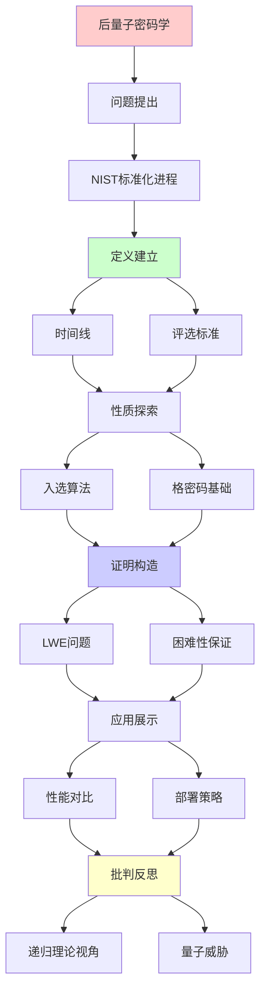
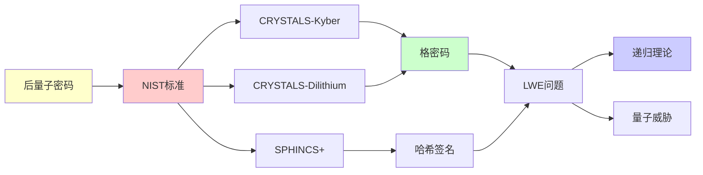

# 后量子密码学标准

> **主题**: NIST后量子密码标准化
> **创建日期**: 2025-12-02
> **难度**: ⭐⭐⭐⭐
> **前置知识**: 密码学基础、格理论

---

## 📋 目录

- [后量子密码学标准](#后量子密码学标准)
  - [📋 目录](#-目录)
  - [1. NIST标准化进程](#1-nist标准化进程)
    - [1.1 时间线](#11-时间线)
    - [1.2 评选标准](#12-评选标准)
  - [2. 入选算法](#2-入选算法)
    - [2.1 密钥交换: CRYSTALS-Kyber](#21-密钥交换-crystals-kyber)
    - [2.2 签名: CRYSTALS-Dilithium](#22-签名-crystals-dilithium)
    - [2.3 签名: SPHINCS+](#23-签名-sphincs)
  - [3. 格密码基础](#3-格密码基础)
    - [3.1 LWE问题](#31-lwe问题)
    - [3.2 困难性保证](#32-困难性保证)
  - [4. 性能对比](#4-性能对比)
  - [5. 部署策略](#5-部署策略)
    - [5.1 混合模式](#51-混合模式)
    - [5.2 密码敏捷性](#52-密码敏捷性)
  - [6. 递归理论视角](#6-递归理论视角)
  - [7. 主题-子主题论证逻辑关系图](#7-主题-子主题论证逻辑关系图)
    - [7.1 论证依赖关系](#71-论证依赖关系)
    - [7.2 概念依赖关系](#72-概念依赖关系)
  - [8. 参考资源](#8-参考资源)
    - [8.1 经典论文](#81-经典论文)
    - [8.2 教材](#82-教材)
    - [8.3 在线资源](#83-在线资源)

---

## 1. NIST标准化进程

### 1.1 时间线

```text
2016: 征集提案 (82个)
2019: 第2轮候选 (26个)
2020: 第3轮 (7个)
2022: 初选公布 (4个)
2024: 标准发布 ⭐

入选:
- CRYSTALS-Kyber (KEX)
- CRYSTALS-Dilithium (签名)
- SPHINCS+ (签名)
- Falcon (签名,备选)

时间紧迫:
量子威胁: ~2030
部署周期: 5-10年
→ 现在就要开始 ⚠️
```

---

### 1.2 评选标准

```text
NIST评估维度:

1. 安全性 ⭐⭐⭐⭐⭐
   - 最坏情况归约
   - 量子抗性
   - 分析深度

2. 性能
   - 密钥/签名大小
   - 计算速度

3. 实现
   - 易于实现
   - 侧信道抵抗

4. 通用性
   - 适用场景广

权衡:
无完美方案
选择平衡 ✓
```

---

## 2. 入选算法

### 2.1 密钥交换: CRYSTALS-Kyber

```text
基于: Module-LWE

参数 (Kyber-768):
- 安全级别: ≈AES-192
- 公钥: 1184 bytes
- 密文: 1088 bytes
- 速度: 极快 ✓

优势:
✓ 性能优异
✓ 简单实现
✓ 侧信道抵抗好

应用:
- TLS后量子
- VPN
- 信号加密
```

---

### 2.2 签名: CRYSTALS-Dilithium

```text
基于: Module-LWE (与Kyber相同)

参数 (Dilithium3):
- 安全级别: ≈AES-192
- 公钥: 1952 bytes
- 签名: 3293 bytes ⚠️
- 速度: 快 ✓

vs RSA-2048:
- 密钥: 1952B vs 256B (7.6×)
- 签名: 3293B vs 256B (12.9×)
- 速度: 可比 ✓

trade-off: 大小 vs 量子安全
```

---

### 2.3 签名: SPHINCS+

```text
基于: Hash函数 (保守选择)

参数 (SPHINCS+-128f):
- 安全级别: 128-bit
- 公钥: 32 bytes ✓小
- 签名: 8080 bytes ⚠️⚠️大
- 速度: 慢 ⚠️

优势:
✓ 基于Hash (最保守)
✓ 无结构假设
✓ 理解最深入

劣势:
✗ 签名超大
✗ 速度慢

定位: 长期安全备选
```

---

## 3. 格密码基础

### 3.1 LWE问题

```text
Learning With Errors:

给定: (A, b = As + e mod q)
求: s

其中:
- A: m×n矩阵 (公开随机)
- s: n维秘密向量
- e: 小噪声
- q: 模数

困难性:
✓ 平均情况困难
✓ 基于最坏情况归约
✓ 量子抗性 ✓
```

---

### 3.2 困难性保证

```text
LWE归约链:
最坏情况格问题 (如SVP)
  ↓ 量子归约 (Regev 2005)
LWE平均情况
  ↓ 经典归约
Kyber/Dilithium安全

关键:
✓ 最坏→平均归约
✓ 少数具有的性质
→ 理论保证强 ⭐⭐⭐⭐⭐

vs RSA:
RSA: 平均情况困难 (假设)
LWE: 最坏情况归约 (证明)
→ LWE理论基础更坚实
```

---

## 4. 性能对比

| 操作 | RSA-2048 | ECC-256 | Kyber-768 | Dilithium3 |
|------|----------|---------|-----------|------------|
| **密钥生成** | 慢 | 快 | 极快✓ | 快 |
| **加密/封装** | 快 | 快 | 极快✓ | N/A |
| **解密/解封** | 慢 | 快 | 极快✓ | N/A |
| **签名** | N/A | 快 | N/A | 快 |
| **验证** | N/A | 快 | N/A | 极快✓ |
| **公钥大小** | 256B | 32B | 1184B | 1952B |
| **密文/签名** | 256B | 64B | 1088B | 3293B |

**结论**: 速度可比，大小更大

---

## 5. 部署策略

### 5.1 混合模式

```text
过渡期策略:
经典 + 后量子双重保护

TLS混合:
ClientHello:
  - ECDHE (经典)
  - Kyber (后量子)

密钥: KDF(ECDHE_key || Kyber_key)

安全性:
✓ 经典威胁: ECDHE保护
✓ 量子威胁: Kyber保护
→ 双重保险 ✓
```

---

### 5.2 密码敏捷性

```text
Crypto Agility:
系统能快速切换算法

设计:
1. 算法ID协商
2. 抽象接口
3. 配置驱动
4. 版本管理

重要性:
⚠️ Shor威胁随时可能
⚠️ 需要快速响应
✓ 密码敏捷性必需

递归理论:
✓ 算法切换 = 递归模块化
✓ 可判定接口
```

---

## 6. 递归理论视角

```text
后量子密码 ∈ RE?

答案: ✓是的

证明:
- LWE ∈ NP (可验证)
- 加密/签名 ∈ P (多项式)
- 破解 ∉ BQP (预计)
→ 后量子 ⊂ RE

关键性质:
✓ 正向可递归 (快速)
✗ 逆向不可高效递归 (量子也不行)
→ 单向函数 (量子安全版)

密码学本质:
= 递归理论 + 复杂度理论
+ 量子计算挑战
```

---

## 7. 主题-子主题论证逻辑关系图

### 7.1 论证依赖关系



### 7.2 概念依赖关系



**论证逻辑链条**：

1. **问题提出** (1节)：
   - NIST标准化进程

2. **定义建立** (1.1-1.2节)：
   - 时间线和评选标准

3. **性质探索** (2-3节)：
   - 入选算法（2节）
   - 格密码基础（3节）

4. **证明构造** (3.1-3.2节)：
   - LWE问题和困难性保证

5. **应用展示** (4-5节)：
   - 性能对比（4节）
   - 部署策略（5节）

6. **批判反思** (6节)：
   - 递归理论视角

---

## 8. 参考资源

### 8.1 经典论文

1. **NIST** (2024). "Post-Quantum Cryptography Standardization"
   - https://csrc.nist.gov/projects/post-quantum-cryptography
   - NIST后量子密码标准 ⭐⭐⭐⭐⭐

2. **Avanzi, R., et al.** (2020). "CRYSTALS-Kyber: A CCA-Secure Module-Lattice-Based KEM"
   - NIST Round 3 Submission
   - CRYSTALS-Kyber算法

3. **Ducas, L., et al.** (2020). "CRYSTALS-Dilithium: A Lattice-Based Digital Signature Scheme"
   - NIST Round 3 Submission
   - CRYSTALS-Dilithium算法

### 8.2 教材

1. **Katz, J., & Lindell, Y.** (2020)
   - _Introduction to Modern Cryptography_ (3rd ed.)
   - CRC Press. ISBN 978-0815354369
   - 现代密码学基础

2. **Micciancio, D., & Regev, O.** (2009). "Lattice-based Cryptography"
   - In Bernstein, D. J., et al. (eds.), _Post-Quantum Cryptography_
   - Springer. ISBN 978-3540887010
   - 格密码基础

### 8.3 在线资源

1. **NIST Post-Quantum Cryptography**
   - https://csrc.nist.gov/projects/post-quantum-cryptography
   - NIST后量子密码项目

2. **CRYSTALS-Kyber**
   - https://pq-crystals.org/kyber/
   - CRYSTALS-Kyber项目

3. **Wikipedia - Post-quantum cryptography**
   - https://en.wikipedia.org/wiki/Post-quantum_cryptography
   - 后量子密码学基本概念

---

**最后更新**: 2025-12-04
**Tier**: 1-2 (理论+工程)
**紧迫性**: ⭐⭐⭐⭐⭐ (2030威胁)
**标准状态**: 2024已发布 ✓
**状态**: ✅ 已添加主题-子主题论证逻辑关系图和参考资源章节
