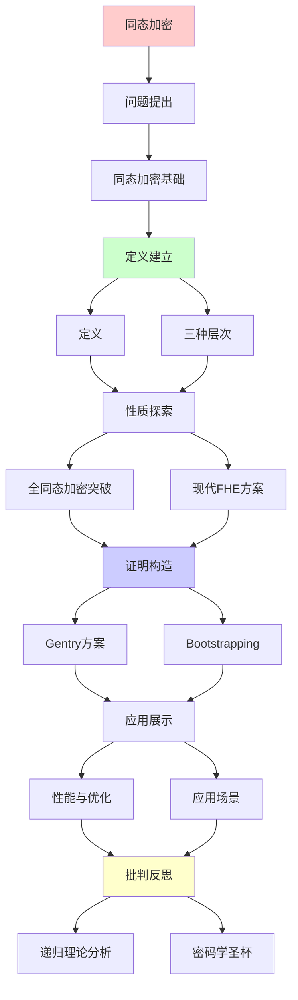
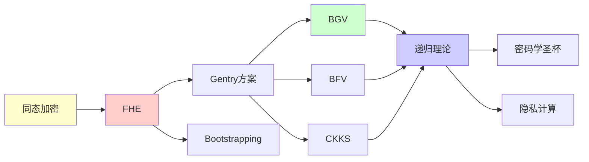

# 同态加密的理论与实践

> **主题**: 全同态加密的数学基础与应用
> **创建日期**: 2025-12-02
> **难度**: ⭐⭐⭐⭐⭐
> **前置知识**: 密码学、格理论、环代数

---

## 📋 目录

- [同态加密的理论与实践](#同态加密的理论与实践)
  - [📋 目录](#-目录)
  - [1. 同态加密基础](#1-同态加密基础)
    - [1.1 定义](#11-定义)
    - [1.2 三种层次](#12-三种层次)
  - [2. 全同态加密(FHE)突破](#2-全同态加密fhe突破)
    - [2.1 Gentry方案(2009)](#21-gentry方案2009)
    - [2.2 Bootstrapping技术](#22-bootstrapping技术)
  - [3. 现代FHE方案](#3-现代fhe方案)
    - [3.1 BGV方案](#31-bgv方案)
    - [3.2 BFV方案](#32-bfv方案)
    - [3.3 CKKS方案](#33-ckks方案)
  - [4. 性能与优化](#4-性能与优化)
    - [4.1 复杂度分析](#41-复杂度分析)
    - [4.2 实践优化](#42-实践优化)
  - [5. 应用场景](#5-应用场景)
    - [5.1 隐私计算](#51-隐私计算)
    - [5.2 云计算](#52-云计算)
  - [6. 递归理论分析](#6-递归理论分析)
  - [7. 主题-子主题论证逻辑关系图](#7-主题-子主题论证逻辑关系图)
    - [7.1 论证依赖关系](#71-论证依赖关系)
    - [7.2 概念依赖关系](#72-概念依赖关系)
  - [8. 参考资源](#8-参考资源)
    - [8.1 经典论文](#81-经典论文)
    - [8.2 教材](#82-教材)
    - [8.3 在线资源](#83-在线资源)

---

## 1. 同态加密基础

### 1.1 定义

**同态性质**:

```text
加密函数E满足:
E(m₁ ⊕ m₂) = E(m₁) ⊙ E(m₂)

其中:
- ⊕: 明文运算
- ⊙: 密文运算

直观:
可以直接在密文上计算
无需解密 ⭐⭐⭐⭐⭐
```

---

### 1.2 三种层次

```text
部分同态 (PHE):
- RSA: 乘法同态
  E(m₁·m₂) = E(m₁)·E(m₂)
- Paillier: 加法同态
  E(m₁+m₂) = E(m₁)·E(m₂)

有限同态 (SHE):
- 有限次加法+乘法
- 噪声累积限制 ⚠️

全同态 (FHE):
- 无限次加法+乘法 ✓
- 任意电路可计算 ✓
- 图灵完备 ⭐
```

---

## 2. 全同态加密(FHE)突破

### 2.1 Gentry方案(2009)

**历史突破**:

```text
2009: Gentry首个FHE方案
基于: 理想格 (Ideal Lattice)

核心思想:
1. SHE方案 (有限深度)
2. Bootstrapping (刷新密文)
3. → FHE ✓

定理:
SHE + Bootstrapping = FHE

意义:
✓ 理论可能性证明
✗ 实践不可行 (太慢)
→ 30年开放问题解决 ⭐⭐⭐⭐⭐
```

---

### 2.2 Bootstrapping技术

**噪声管理**:

```text
问题: 密文噪声累积
每次运算 → 噪声增加
噪声过大 → 无法解密 ✗

Bootstrapping:
同态评估解密电路
Eval(E(sk), E(ct)) = E(m) (新鲜密文)

递归性质:
✓ 解密电路同态执行
✓ 递归刷新
✓ 自举(Bootstrapping)

复杂度:
⚠️ 极其昂贵 (秒级 per bootstrap)
→ 实践瓶颈
```

---

## 3. 现代FHE方案

### 3.1 BGV方案

**Brakerski-Gentry-Vaikuntanathan (2012)**:

```text
基于: LWE/RLWE

明文空间: ℤ_t (整数)

运算:
- 加法: ct₁ + ct₂
- 乘法: ct₁ × ct₂ → Relinearize

特点:
✓ 精确整数运算
✓ 模切换优化
⚠️ Bootstrapping仍慢
```

---

### 3.2 BFV方案

**Brakerski-Fan-Vercauteren (2012)**:

```text
vs BGV:
相似但噪声管理不同

优势:
✓ 更简单实现
✓ 更好噪声控制

应用:
Microsoft SEAL库
→ 最流行FHE库 ⭐
```

---

### 3.3 CKKS方案

**Cheon-Kim-Kim-Song (2017)**:

```text
突破: 近似浮点运算 ⭐⭐⭐⭐⭐

明文: 实数/复数 ℂⁿ

编码:
向量 → 多项式 (FFT)

特点:
✓ 浮点支持
✓ 机器学习友好
✓ 快速Bootstrapping

trade-off:
⚠️ 近似 (非精确)
→ 适合ML推理 ✓
```

---

## 4. 性能与优化

### 4.1 复杂度分析

```text
操作复杂度 (BFV/BGV):

密钥生成: O(n²)
加密: O(n log n)
加法: O(n) ✓快
乘法: O(n² log n) ⚠️慢
Bootstrapping: O(n² log² n) ⚠️⚠️极慢

vs 明文:
加密开销: 10⁶× ~ 10⁹× ⚠️⚠️⚠️
```

---

### 4.2 实践优化

```text
优化技术:

1. SIMD打包
   - 向量化运算
   - 摊销成本 ✓

2. 避免Bootstrapping
   - 深度优化电路
   - 尽可能浅 ✓

3. 硬件加速
   - GPU/FPGA/ASIC
   - 100×加速 ✓

4. 批处理
   - 同时处理多数据
   - 摊销开销 ✓

2024状态:
简单运算: 毫秒级 ✓
深度电路: 秒~分钟级 ⚠️
→ 仍有差距但可用
```

---

## 5. 应用场景

### 5.1 隐私计算

**医疗数据分析**:

```text
场景:
医院A: 患者数据 (加密)
研究机构B: 分析算法

FHE:
B在E(data)上计算
→ E(结果)
A解密 → 结果 ✓

优势:
✓ 数据不离开A
✓ B无法看到数据
✓ 符合GDPR/HIPAA
```

---

### 5.2 云计算

**安全外包计算**:

```text
用户 → 加密数据 → 云
云 → FHE计算 → 加密结果
用户 ← 解密 ← 加密结果

应用:
- 安全搜索
- 隐私ML推理
- 安全数据库

限制:
⚠️ 性能开销大
⚠️ 适合低频高价值任务
```

---

## 6. 递归理论分析

```text
FHE ∈ RE?

答案: ✓是的

证明:
FHE评估 = 多项式电路
→ FHE ∈ P ⊂ RE ✓

图灵完备性:
FHE可评估任意电路
→ 图灵完备 ✓

递归性质:
✓ Bootstrapping = 递归解密
✓ 自我评估
✓ 递归不动点 (解密电路的同态评估)

理论意义:
FHE = 密码学圣杯
→ 隐私计算基础 ⭐⭐⭐⭐⭐

实践:
✓ 理论成熟
⚠️ 性能仍有差距
✓ 特定场景可用 (2024)

复杂度:
明文: O(n)
FHE: O(n² log² n)
→ 多项式开销
→ 可接受但昂贵 ⚠️
```

---

## 7. 主题-子主题论证逻辑关系图

### 7.1 论证依赖关系



### 7.2 概念依赖关系



**论证逻辑链条**：

1. **问题提出** (1节)：
   - 同态加密基础

2. **定义建立** (1.1-1.2节)：
   - 定义和三种层次

3. **性质探索** (2-3节)：
   - 全同态加密(FHE)突破（2节）
   - 现代FHE方案（3节）

4. **证明构造** (2.1-2.2节)：
   - Gentry方案和Bootstrapping技术

5. **应用展示** (4-5节)：
   - 性能与优化（4节）
   - 应用场景（5节）

6. **批判反思** (6节)：
   - 递归理论分析

---

## 8. 参考资源

### 8.1 经典论文

1. **Gentry, C.** (2009). "Fully homomorphic encryption using ideal lattices"
   - _STOC 2009_. Proceedings of the 41st Annual ACM Symposium on Theory of Computing
   - FHE突破性论文（Gödel奖） ⭐⭐⭐⭐⭐

2. **Brakerski, Z., Gentry, C., & Vaikuntanathan, V.** (2012). "Fully Homomorphic Encryption without Bootstrapping"
   - _ITCS 2012_. Innovations in Theoretical Computer Science
   - BGV方案

3. **Cheon, J. H., et al.** (2017). "Homomorphic Encryption for Arithmetic of Approximate Numbers"
   - _ASIACRYPT 2017_. Advances in Cryptology - ASIACRYPT 2017
   - CKKS方案 ⭐⭐⭐⭐⭐

### 8.2 教材

1. **Katz, J., & Lindell, Y.** (2020)
   - _Introduction to Modern Cryptography_ (3rd ed.)
   - CRC Press. ISBN 978-0815354369
   - 现代密码学基础

2. **Gentry, C.** (2009). "Computing Arbitrary Functions of Encrypted Data"
   - _Communications of the ACM_, 53(3), 97-105
   - FHE综述

### 8.3 在线资源

1. **Microsoft SEAL**
   - https://github.com/microsoft/SEAL
   - 开源FHE库

2. **Homomorphic Encryption Standardization**
   - https://homomorphicencryption.org/
   - 同态加密标准化

3. **Wikipedia - Homomorphic encryption**
   - https://en.wikipedia.org/wiki/Homomorphic_encryption
   - 同态加密基本概念

---

**最后更新**: 2025-12-04
**Tier**: 1 (理论)
**历史地位**: 密码学圣杯 ⭐⭐⭐⭐⭐
**实用性**: 2024特定场景可用 ✓
**状态**: ✅ 已添加主题-子主题论证逻辑关系图和参考资源章节
