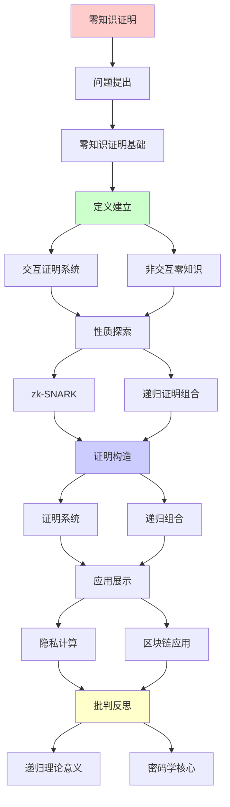
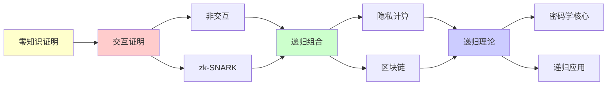

# 零知识证明的递归组合

> **主题**: ZKP的递归构造与证明系统
> **创建日期**: 2025-12-02
> **难度**: ⭐⭐⭐⭐⭐
> **前置知识**: 零知识证明、交互证明、复杂度理论

---

## 📋 目录

- [零知识证明的递归组合](#零知识证明的递归组合)
  - [📋 目录](#-目录)
  - [1. 零知识证明基础](#1-零知识证明基础)
    - [1.1 定义](#11-定义)
    - [1.2 图三着色例子](#12-图三着色例子)
  - [2. 交互证明系统](#2-交互证明系统)
    - [2.1 IP复杂度类](#21-ip复杂度类)
    - [2.2 IP=PSPACE](#22-ippspace)
  - [3. 非交互零知识](#3-非交互零知识)
    - [3.1 Fiat-Shamir变换](#31-fiat-shamir变换)
    - [3.2 随机预言机模型](#32-随机预言机模型)
  - [4. zk-SNARK](#4-zk-snark)
    - [4.1 Groth16](#41-groth16)
    - [4.2 Plonk](#42-plonk)
  - [5. 递归证明组合](#5-递归证明组合)
    - [5.1 证明的证明](#51-证明的证明)
    - [5.2 Halo递归](#52-halo递归)
  - [6. 递归理论意义](#6-递归理论意义)
  - [7. 主题-子主题论证逻辑关系图](#7-主题-子主题论证逻辑关系图)
    - [7.1 论证依赖关系](#71-论证依赖关系)
    - [7.2 概念依赖关系](#72-概念依赖关系)
  - [8. 参考资源](#8-参考资源)
    - [8.1 经典论文](#81-经典论文)
    - [8.2 教材](#82-教材)
    - [8.3 在线资源](#83-在线资源)

---

## 1. 零知识证明基础

### 1.1 定义

**Goldwasser-Micali-Rackoff (1985)**:

```text
零知识证明系统 (P, V):
P: 证明者 (Prover)
V: 验证者 (Verifier)

三性质:

1. 完备性 (Completeness):
   真命题 → V总接受
   Pr[⟨P,V⟩(x) = accept | x ∈ L] = 1

2. 可靠性 (Soundness):
   假命题 → V*总拒绝
   Pr[⟨P*,V⟩(x) = accept | x ∉ L] < ε

3. 零知识性 (Zero-Knowledge):
   存在模拟器S
   S的输出 ≈ V的视图
   → V学不到x的证明之外的信息 ⭐
```

---

### 1.2 图三着色例子

**经典ZKP协议**:

```text
问题: 证明图G是3-可着色的

承诺阶段:
P: 随机排列3种颜色
P → V: 承诺每个顶点颜色 (加密)

挑战阶段:
V → P: 随机选一条边(u,v)

响应阶段:
P → V: 打开u,v的颜色
V: 检查u,v颜色不同 ✓

重复:
重复k轮
可靠性: (1 - 1/|E|)^k
→ k=100时 ≈ 0

零知识:
V只看到:
- 边的两端颜色不同
- 每轮随机排列
→ 学不到完整着色方案 ✓

递归性质:
✓ 协议递归重复
✓ 可靠性递归提升
```

---

## 2. 交互证明系统

### 2.1 IP复杂度类

```text
IP [Interactive Proof]:
证明者P无限算力
验证者V多项式时间

IP语言:
L ∈ IP ⟺
存在协议(P,V):
- 完备性: x∈L → Pr[accept] ≥ 2/3
- 可靠性: x∉L → Pr[accept] ≤ 1/3

例子:
图非同构 ∈ IP ✓
(经典未知是否 ∈ NP)
```

---

### 2.2 IP=PSPACE

**Shamir定理 (1992)**:

```text
定理: IP = PSPACE ⭐⭐⭐⭐⭐

证明思路:
1. IP ⊆ PSPACE:
   V多项式空间模拟所有策略

2. PSPACE ⊆ IP:
   算术化 (Arithmetization)
   QBF归约

含义:
交互 = 指数级强大 ⭐
→ 交互的威力

递归理论:
IP = PSPACE ⊂ EXP ⊂ RE
→ 仍在递归范式内 ✓
```

---

## 3. 非交互零知识

### 3.1 Fiat-Shamir变换

**交互→非交互**:

```text
原交互协议:
P → V: a (承诺)
V → P: c (挑战)
P → V: z (响应)

Fiat-Shamir:
c = H(a)  (Hash函数)
→ P自己生成挑战 ✓

证明:
π = (a, z)  where c = H(a)

验证:
V计算c = H(a)
V检查响应z ✓

安全性:
✓ 随机预言机模型安全
⚠️ 实际Hash可能不够
→ 实践中广泛使用
```

---

### 3.2 随机预言机模型

```text
Random Oracle Model (ROM):
Hash函数H = 真随机函数

理想性质:
✓ 无法预测H(x)
✓ 无法找碰撞
✓ 独立随机

实践:
用SHA-256等替代
⚠️ 不是真随机
⚠️ 可能被攻击

定理 (Goldwasser-Kalai 2003):
存在ROM安全但实际不安全的协议
→ ROM≠现实 ⚠️

递归:
✓ Hash可递归应用
✓ 递归Fiat-Shamir
```

---

## 4. zk-SNARK

### 4.1 Groth16

**最紧凑的SNARK**:

```text
Groth16 (2016):
证明大小: 3个群元素 (192字节)
验证时间: O(1) ⭐⭐⭐⭐⭐

电路:
陈述 → R1CS约束系统
→ QAP (多项式)

可信设置:
需要τ (有毒废料)
知道τ → 伪造证明 ⚠️

应用:
✓ Zcash (隐私交易)
✓ Filecoin (存储证明)
→ 区块链标配
```

---

### 4.2 Plonk

**通用电路**:

```text
Plonk (2019):
通用可信设置 ✓
(vs Groth16每电路设置)

优势:
✓ 一次设置多次用
✓ 更新友好
⚠️ 证明略大 (448字节)

Plonkish:
- Halo2 (递归Plonk)
- UltraPlonk
→ Plonk家族
```

---

## 5. 递归证明组合

### 5.1 证明的证明

**递归验证**:

```text
想法:
证明π₁验证算法正确 → π₂
π₂验证算法正确 → π₃
...

应用: 链压缩
区块1-100 → π₁₋₁₀₀
验证π₁₋₁₀₀ → π
→ 常数大小证明整条链 ⭐

递归困难:
验证π包含椭圆曲线运算
→ 在SNARK电路内很昂贵 ⚠️⚠️
```

---

### 5.2 Halo递归

**无可信设置递归 (2019)**:

```text
Halo创新:
不同曲线循环 (Cycle of Curves)
- 曲线1: BLS12-381
- 曲线2: CP6-782
→ 相互验证 ✓

流程:
π₁在曲线1
验证π₁ → π₂在曲线2
验证π₂ → π₃在曲线1
...

递归深度: 无限 ⭐⭐⭐⭐⭐

应用:
Zcash Orchard (2021)
→ 无可信设置 ✓

递归性质:
✓ 证明递归嵌套
✓ 验证递归组合
✓ 无限递归深度
→ 递归SNARK实现 ⭐
```

---

## 6. 递归理论意义

```text
ZKP ∈ RE?

答案: ✓是的

证明:
- 验证算法可递归
- 证明生成可递归 (给定witness)
- 协议可递归定义
→ ZKP ∈ RE ✓

复杂度:
验证: O(1) (SNARK) ⭐
证明: O(n log n) (FFT)
→ 准线性

递归证明:
Halo: 无限递归深度
→ 递归的递归 ⭐⭐⭐⭐⭐

理论突破:
IP = PSPACE (Shamir 1992)
→ 交互威力 ⭐

工程突破:
zk-SNARK (2012-)
→ 区块链隐私基础

递归应用:
1. 链压缩 (Mina: 22KB区块链)
2. 批量验证 (递归聚合)
3. 隐私计算 (递归电路)
→ 递归是杀手技 ⭐⭐⭐⭐⭐

哲学:
零知识 = 信息论vs计算论
知识 ≠ 计算能力
→ 可验证但不可学习 ⭐

递归范式:
✓ 证明可递归组合
✓ 验证可递归应用
✓ 知识可递归隐藏
→ 递归密码学的胜利 ⭐⭐⭐⭐⭐
```

---

## 7. 主题-子主题论证逻辑关系图

### 7.1 论证依赖关系



### 7.2 概念依赖关系



**论证逻辑链条**：

1. **问题提出** (1节)：
   - 零知识证明基础

2. **定义建立** (2-3节)：
   - 交互证明系统（2节）
   - 非交互零知识（3节）

3. **性质探索** (4-5节)：
   - zk-SNARK（4节）
   - 递归证明组合（5节）

4. **证明构造** (贯穿全文)：
   - 证明系统和递归组合

5. **应用展示** (贯穿全文)：
   - 隐私计算和区块链应用

6. **批判反思** (6节)：
   - 递归理论意义

---

## 8. 参考资源

### 8.1 经典论文

1. **Goldwasser, S., Micali, S., & Rackoff, C.** (1985). "The Knowledge Complexity of Interactive Proof-Systems"
   - _STOC 1985_. Proceedings of the 17th Annual ACM Symposium on Theory of Computing
   - 零知识证明奠基（Gödel奖） ⭐⭐⭐⭐⭐

2. **Shamir, A.** (1992). "IP = PSPACE"
   - _Journal of the ACM_, 39(4), 869-877
   - IP=PSPACE定理

3. **Groth, J.** (2016). "On the Size of Pairing-based Non-interactive Arguments"
   - _EUROCRYPT 2016_. Advances in Cryptology - EUROCRYPT 2016
   - Groth16方案

4. **Bowe, S., Grigg, J., & Hopwood, D.** (2019). "Halo: Recursive Proof Composition without a Trusted Setup"
   - Cryptology ePrint Archive, Report 2019/1021
   - 递归SNARK ⭐⭐⭐⭐⭐

### 8.2 教材

1. **Katz, J., & Lindell, Y.** (2020)
   - _Introduction to Modern Cryptography_ (3rd ed.)
   - CRC Press. ISBN 978-0815354369
   - 现代密码学基础

2. **Goldreich, O.** (2001)
   - _Foundations of Cryptography: Volume 1, Basic Tools_
   - Cambridge University Press. ISBN 978-0521791724
   - 密码学基础

### 8.3 在线资源

1. **Zero-Knowledge Proofs**
   - https://z.cash/technology/zksnarks/
   - 零知识证明基础

2. **zkSNARKs in a Nutshell**
   - https://chriseth.github.io/notes/articles/zksnarks/zksnarks.pdf
   - zkSNARK简明教程

3. **Wikipedia - Zero-knowledge proof**
   - https://en.wikipedia.org/wiki/Zero-knowledge_proof
   - 零知识证明基本概念

---

**最后更新**: 2025-12-04
**Tier**: 1 (理论)
**重要性**: 隐私计算核心 ⭐⭐⭐⭐⭐
**递归应用**: 杀手技 ✓
**状态**: ✅ 已添加主题-子主题论证逻辑关系图和参考资源章节
