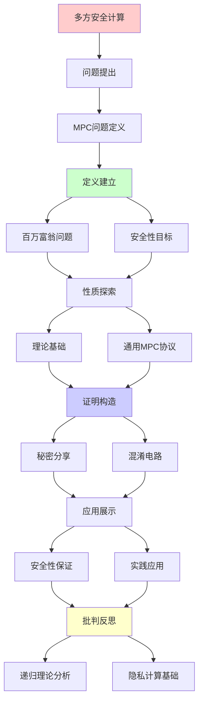
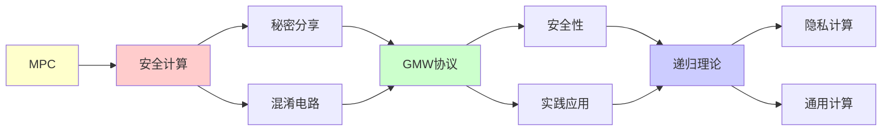

# 多方安全计算MPC

> **主题**: 多方计算的理论基础与应用
> **创建日期**: 2025-12-02
> **难度**: ⭐⭐⭐⭐⭐
> **前置知识**: 密码学、复杂度理论、博弈论

---

## 📋 目录

- [多方安全计算MPC](#多方安全计算mpc)
  - [📋 目录](#-目录)
  - [1. MPC问题定义](#1-mpc问题定义)
    - [1.1 百万富翁问题](#11-百万富翁问题)
    - [1.2 安全性目标](#12-安全性目标)
  - [2. 理论基础](#2-理论基础)
    - [2.1 秘密分享](#21-秘密分享)
    - [2.2 混淆电路](#22-混淆电路)
  - [3. 通用MPC协议](#3-通用mpc协议)
    - [3.1 GMW协议](#31-gmw协议)
    - [3.2 BGW协议](#32-bgw协议)
  - [4. 安全性保证](#4-安全性保证)
    - [4.1 半诚实vs恶意](#41-半诚实vs恶意)
    - [4.2 模拟范式](#42-模拟范式)
  - [5. 实践应用](#5-实践应用)
    - [5.1 隐私保护ML](#51-隐私保护ml)
    - [5.2 门限签名](#52-门限签名)
  - [6. 递归理论分析](#6-递归理论分析)
  - [7. 主题-子主题论证逻辑关系图](#7-主题-子主题论证逻辑关系图)
    - [7.1 论证依赖关系](#71-论证依赖关系)
    - [7.2 概念依赖关系](#72-概念依赖关系)
  - [8. 参考资源](#8-参考资源)
    - [8.1 经典论文](#81-经典论文)
    - [8.2 教材](#82-教材)
    - [8.3 在线资源](#83-在线资源)

---

## 1. MPC问题定义

### 1.1 百万富翁问题

**Yao (1982)**:

```text
问题:
Alice和Bob想知道谁更富
但都不想透露实际财富

解决:
MPC协议
输入: a (Alice), b (Bob)
输出: a > b? (双方得知)
隐私: 不透露a, b具体值 ✓

推广:
n方联合计算f(x₁,...,xₙ)
每方只知道自己输入xᵢ
所有方得到输出f(...)
→ 通用安全计算 ⭐
```

---

### 1.2 安全性目标

**隐私与正确性**:

```text
隐私 (Privacy):
参与方只学到:
✓ 自己输入
✓ 函数输出
✗ 他人输入

正确性 (Correctness):
输出 = f(x₁,...,xₙ)
诚实方保证正确 ✓

公平性 (Fairness):
所有方同时得到输出
或都不得到 ✓

鲁棒性 (Robustness):
容忍t方故障/恶意
仍能完成计算 ✓

递归性质:
✓ 协议递归迭代
✓ 秘密递归组合
```

---

## 2. 理论基础

### 2.1 秘密分享

**Shamir秘密分享 (1979)**:

```text
(t,n)-门限方案:
秘密s分成n份
任意t份可重构s
少于t份无信息 ⭐

数学:
多项式插值
f(x) = s + a₁x + ... + a_{t-1}x^{t-1}
份额: sᵢ = f(i)

重构:
Lagrange插值
s = f(0) = Σᵢ sᵢ·λᵢ

性质:
✓ 信息论安全 (t-1份无信息)
✓ 线性运算同态
✓ 加法: [s+s'] = [s]+[s']
✓ 常数乘: [c·s] = c·[s]

递归应用:
✓ 份额递归组合
✓ 秘密递归计算
```

---

### 2.2 混淆电路

**Yao混淆电路 (1986)**:

```text
思想:
电路C → 混淆电路C̃
评估C̃ 不泄露输入 ✓

构造:
每个门真值表加密
输入: 随机标签
输出: 对应密文

评估:
顺序解密门
获得输出标签
→ 输出值 ✓

安全性:
评估者只看到:
✓ 一条真值表路径
✗ 其他路径隐藏
→ 模拟器可构造 ✓

复杂度:
电路大小: |C|
通信: O(|C|)
轮次: O(1) (非交互) ⭐

应用:
2-party计算 ✓
→ Yao's GC协议
```

---

## 3. 通用MPC协议

### 3.1 GMW协议

**Goldreich-Micali-Wigderson (1987)**:

```text
n方计算任意函数:
基于秘密分享 + OT

流程:
1. 输入秘密分享
2. 逐门计算:
   - AND门: OT协议
   - XOR门: 本地计算
3. 输出重构

安全性:
✓ 半诚实: 信息论安全
✓ 恶意: 计算安全

复杂度:
通信: O(n² × |C|)
轮次: O(depth(C))
→ 深度依赖 ⚠️

GMW定理:
任何可计算函数
→ 可安全多方计算 ⭐⭐⭐⭐⭐
```

---

### 3.2 BGW协议

**Ben-Or-Goldwasser-Wigderson (1988)**:

```text
信息论安全MPC:
基于Shamir秘密分享

假设:
✓ 安全通道
✓ 最多t < n/3恶意

流程:
1. 输入(t,n)-分享
2. 算术电路计算:
   - 加法: 本地
   - 乘法: 交互
3. 输出重构 + 验证

关键:
乘法门协议:
[a] × [b] = [c]
需要交互 + 零知识证明
→ 防止恶意 ✓

安全性:
✓ 信息论安全 ⭐
✓ 无计算假设
✓ t < n/3恶意

复杂度:
通信: O(n² × |C|)
轮次: O(depth(C))
```

---

## 4. 安全性保证

### 4.1 半诚实vs恶意

**敌手模型**:

```text
半诚实 (Semi-honest):
遵循协议
但记录所有信息
→ 被动攻击

恶意 (Malicious):
任意偏离协议
发送错误消息
→ 主动攻击 ⚠️⚠️

安全性:
半诚实: 容易保证 ✓
恶意: 需要ZKP验证 ⚠️

实践:
半诚实: 高效
恶意: 开销大 (10-100×)
→ 权衡 ⚠️

递归理论:
✓ 半诚实MPC ∈ 多项式
⚠️ 恶意MPC开销大
```

---

### 4.2 模拟范式

**安全性定义**:

```text
理想世界:
可信第三方T
各方 → T → 输入
T计算f → 输出
→ 完美安全 ✓

现实世界:
协议π
各方交互计算
→ 可能泄露信息 ⚠️

安全定义:
∀敌手A (现实世界)
∃模拟器S (理想世界)
视图不可区分:
View_A(π) ≈ View_S(ideal)

含义:
现实协议 ≈ 理想功能
→ 组合安全 ⭐⭐⭐⭐⭐

递归:
✓ 模拟递归构造
✓ 安全性递归证明
```

---

## 5. 实践应用

### 5.1 隐私保护ML

**联邦学习 + MPC**:

```text
场景:
医院A, B, C
联合训练模型
不共享原始数据 ✓

MPC方案:
梯度秘密分享
联合计算聚合梯度
→ 隐私保护 ✓

性能:
开销: 10-100× vs 明文
→ 实践瓶颈 ⚠️

优化:
混合协议:
- 安全通道 (TLS)
- 差分隐私
- MPC关键步骤
→ 平衡安全与效率 ✓

应用:
✓ 医疗AI
✓ 金融风控
✓ 隐私广告
```

---

### 5.2 门限签名

**分布式密钥**:

```text
(t,n)-门限签名:
n方持有密钥份额
任意t方联合签名 ✓

MPC协议:
ECDSA门限签名
输入: 私钥份额
输出: 有效签名
隐私: 不重构完整私钥 ⭐

应用:
多重签名钱包:
- Fireblocks
- Coinbase Custody
- BitGo
→ 数十亿美元保护 ⭐⭐⭐⭐⭐

安全:
✓ t-1方无法伪造
✓ 无单点故障
✓ 密钥永不出现
→ 高安全 ⭐

递归性质:
✓ 签名递归组合
✓ 份额递归交互
```

---

## 6. 递归理论分析

```text
MPC ∈ RE?

答案: ✓是的

证明:
- 协议步骤可递归执行
- 秘密分享可递归计算
- 电路评估可递归
→ MPC ∈ RE ✓

复杂度:
半诚实: O(n² × |C|) 多项式 ✓
恶意: O(n² × |C| × λ) 安全参数λ
→ 仍多项式 ✓

通用性:
GMW定理:
任何f ∈ RE → 可安全计算 ⭐⭐⭐⭐⭐
→ MPC = RE安全版

vs FHE:
FHE: 单方可计算
MPC: 多方协作 ✓
→ 不同信任模型

递归性质:
✓ 协议递归迭代
✓ 秘密递归分享/重构
✓ 电路递归评估
✓ 安全性递归组合
→ 多层递归 ⭐

理论vs实践:
理论: 任何函数可计算 ✓
实践: 性能开销大 ⚠️
- 通信: O(n²|C|)
- 轮次: O(depth(C))
→ 大规模困难 ⚠️

优化方向:
预处理: 离线生成随机性
→ 在线快速 ✓

混合协议: 结合GC + SS
→ 取长补短 ✓

硬件加速: GPU/FPGA
→ 100×加速 ⭐

2024现状:
✓ 理论完备
✓ 框架成熟 (MP-SPDZ)
⚠️ 性能仍有差距
✓ 特定应用可用 (门限签名)
→ 实用化进行中 ⭐

未来:
量子MPC:
? 量子通信 + MPC
? 后量子安全MPC
→ 量子时代适配 ⚠️

递归范式:
✓ MPC = 递归可枚举的安全版
✓ 通用计算 = 通用安全计算
✓ 组合安全 = 递归安全
→ 递归理论的密码学实现 ⭐⭐⭐⭐⭐

哲学:
MPC = 信任分散化
不信任任何单方
→ 数学保证安全 ✓
vs 传统: 信任TTP
→ 密码学革命 ⭐
```

---

## 7. 主题-子主题论证逻辑关系图

### 7.1 论证依赖关系



### 7.2 概念依赖关系



**论证逻辑链条**：

1. **问题提出** (1节)：
   - MPC问题定义

2. **定义建立** (1.1-1.2节)：
   - 百万富翁问题和安全性目标

3. **性质探索** (2-3节)：
   - 理论基础（2节）
   - 通用MPC协议（3节）

4. **证明构造** (2.1-2.2节)：
   - 秘密分享和混淆电路

5. **应用展示** (4-5节)：
   - 安全性保证（4节）
   - 实践应用（5节）

6. **批判反思** (6节)：
   - 递归理论分析

---

## 8. 参考资源

### 8.1 经典论文

1. **Yao, A. C.** (1982). "Protocols for Secure Computations"
   - _FOCS 1982_. 23rd Annual Symposium on Foundations of Computer Science
   - MPC奠基性论文 ⭐⭐⭐⭐⭐

2. **Goldreich, O., Micali, S., & Wigderson, A.** (1987). "How to Play Any Mental Game"
   - _STOC 1987_. Proceedings of the 19th Annual ACM Symposium on Theory of Computing
   - GMW协议

3. **Ben-Or, M., Goldwasser, S., & Wigderson, A.** (1988). "Completeness Theorems for Non-Cryptographic Fault-Tolerant Distributed Computation"
   - _STOC 1988_. Proceedings of the 20th Annual ACM Symposium on Theory of Computing
   - BGW协议

4. **Cramer, R., Damgård, I., & Nielsen, J. B.** (2015). _Secure Multiparty Computation and Secret Sharing: An Information Theoretic Approach_
   - Cambridge University Press. ISBN 978-1107043053
   - MPC教材

### 8.2 教材

1. **Cramer, R., Damgård, I., & Nielsen, J. B.** (2015)
   - _Secure Multiparty Computation and Secret Sharing: An Information Theoretic Approach_
   - Cambridge University Press. ISBN 978-1107043053
   - MPC完整教材

2. **Evans, D., Kolesnikov, V., & Rosulek, M.** (2018)
   - _A Pragmatic Introduction to Secure Multi-Party Computation_
   - Now Publishers. ISBN 978-1680835256
   - MPC实践指南

### 8.3 在线资源

1. **MP-SPDZ Framework**
   - https://github.com/data61/MP-SPDZ
   - MPC实现框架

2. **Wikipedia - Secure multi-party computation**
   - https://en.wikipedia.org/wiki/Secure_multi-party_computation
   - MPC基本概念

3. **MPC Research**
   - https://www.mpcalliance.org/
   - MPC研究联盟

---

**最后更新**: 2025-12-04
**Tier**: 1-2 (理论+工程)
**重要性**: 隐私计算基础 ⭐⭐⭐⭐⭐
**成熟度**: 理论完备，工程化进行中 ⚠️
**状态**: ✅ 已添加主题-子主题论证逻辑关系图和参考资源章节
