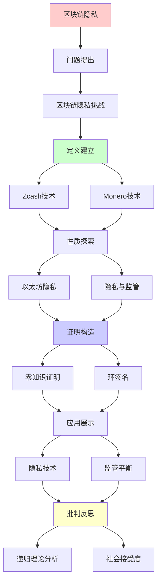
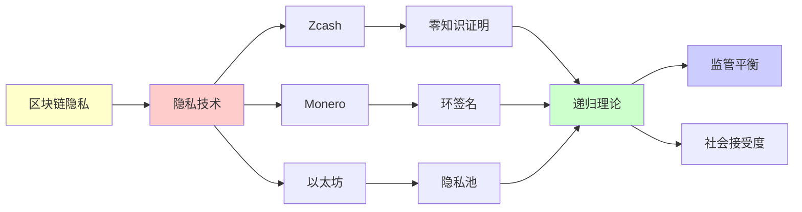

# 区块链隐私技术前沿

> **主题**: zk-SNARK/环签名/隐私币技术
> **创建日期**: 2025-12-02
> **难度**: ⭐⭐⭐⭐⭐
> **前置知识**: 零知识证明、区块链、密码学协议

---

## 📋 目录

- [区块链隐私技术前沿](#区块链隐私技术前沿)
  - [📋 目录](#-目录)
  - [1. 区块链隐私挑战](#1-区块链隐私挑战)
    - [1.1 透明性vs隐私](#11-透明性vs隐私)
    - [1.2 隐私维度](#12-隐私维度)
  - [2. Zcash技术](#2-zcash技术)
    - [2.1 zk-SNARK应用](#21-zk-snark应用)
    - [2.2 Orchard升级](#22-orchard升级)
  - [3. Monero技术](#3-monero技术)
    - [3.1 环签名](#31-环签名)
    - [3.2 隐秘地址](#32-隐秘地址)
  - [4. 以太坊隐私](#4-以太坊隐私)
    - [4.1 Tornado Cash](#41-tornado-cash)
    - [4.2 隐私池](#42-隐私池)
  - [5. 隐私与监管](#5-隐私与监管)
    - [5.1 合规挑战](#51-合规挑战)
    - [5.2 可审计隐私](#52-可审计隐私)
  - [6. 递归理论分析](#6-递归理论分析)
  - [7. 主题-子主题论证逻辑关系图](#7-主题-子主题论证逻辑关系图)
    - [7.1 论证依赖关系](#71-论证依赖关系)
    - [7.2 概念依赖关系](#72-概念依赖关系)
  - [8. 参考资源](#8-参考资源)
    - [8.1 经典论文](#81-经典论文)
    - [8.2 教材](#82-教材)
    - [8.3 在线资源](#83-在线资源)

---

## 1. 区块链隐私挑战

### 1.1 透明性vs隐私

**根本矛盾**:

```text
区块链特性:
✓ 透明 (所有交易可见)
✓ 可追溯 (历史不可变)
→ 公开账本 ⭐

隐私需求:
✗ 交易金额隐私
✗ 交易对方隐私
✗ 余额隐私
→ 金融隐私权 ⚠️

Bitcoin:
地址假匿名
但链上分析可去匿名 ⚠️
→ 隐私弱 ⚠️

Chainalysis:
商业去匿名服务
追踪非法资金
→ 隐私脆弱 ⚠️⚠️

递归追踪:
交易图递归分析
地址聚类
→ 身份暴露 ⚠️
```

---

### 1.2 隐私维度

**三大隐私**:

```text
1. 发送者匿名:
   ? 谁发送
   技术: 环签名, zk-SNARK

2. 接收者匿名:
   ? 谁接收
   技术: 隐秘地址

3. 金额隐私:
   ? 发送多少
   技术: Pedersen承诺, zk-SNARK

理想:
三者都隐藏 ✓
Zcash/Monero目标 ⭐

递归理论:
✓ 隐私技术可递归组合
✓ 多层隐私递归保护
```

---

## 2. Zcash技术

### 2.1 zk-SNARK应用

**屏蔽交易**:

```text
Zcash (2016):
透明地址 (t-addr): 如Bitcoin
屏蔽地址 (z-addr): 隐私 ⭐

屏蔽交易:
证明:
"我有x ZEC 且 未双花"
零知识: 不透露x, 来源, 去向 ✓

承诺:
Note = (value, recipient, ρ, rcm)
Commitment = Hash(Note)
→ 隐藏内容 ✓

空化器 (Nullifier):
防止双花
nf = Hash(Note, sk)
公开但不关联Note ✓

递归:
✓ Note递归承诺
✓ Nullifier递归检查
```

---

### 2.2 Orchard升级

**Halo 2 (2021)**:

```text
改进:
✓ 无可信设置 ⭐⭐⭐⭐⭐
✓ 递归证明
✓ 更快验证

vs Sapling:
Sapling: Groth16 (可信设置)
Orchard: Halo 2 (无) ✓
→ 安全性提升 ⭐

性能:
证明生成: ~5秒
验证: ~10ms
大小: ~2KB
→ 实用级别 ✓

采用:
2022+ 默认屏蔽
→ 隐私优先 ⭐

递归理论:
✓ Halo递归无限深度
✓ 证明递归组合
→ 递归SNARK核心应用 ⭐⭐⭐⭐⭐
```

---

## 3. Monero技术

### 3.1 环签名

**Ring Signatures**:

```text
思想:
签名来自环中某人
但不知道具体谁 ⭐

环大小:
n=11 (Monero默认)
1/11 匿名集

MLSAG:
多层可链接自发匿名群签名

优势:
✓ 无可信设置
✓ 简单
⚠️ 签名大 (~2KB)

vs zk-SNARK:
环签名: 简单, 大
zk-SNARK: 复杂, 小
→ 权衡 ⚠️

递归:
✓ 环递归组合
✓ 签名递归验证
```

---

### 3.2 隐秘地址

**Stealth Addresses**:

```text
问题:
重复使用地址
→ 关联交易 ⚠️

解决:
每次交易生成新地址
但接收者可识别 ✓

机制:
接收者公钥: (A, B)
发送者生成:
R = rG (临时公钥)
P = H(rA)G + B (一次性地址)

接收者扫描:
检查: P - H(aR)G == B
→ 识别自己的交易 ✓

隐私:
✓ 每次新地址
✓ 不可关联
✓ 接收者隐私 ⭐

vs 比特币:
Bitcoin: 地址重用 ⚠️
Monero: 强制隐秘地址 ✓
→ 协议级隐私 ⭐

递归:
✓ 地址递归生成
✓ 扫描递归检查
```

---

## 4. 以太坊隐私

### 4.1 Tornado Cash

**混币协议 (2019)**:

```text
思想:
资金池混合
打断交易图 ⭐

流程:
1. 存入: 1 ETH → 生成note
2. 等待: 其他人也存入
3. 提取: 证明"我存过" (zk-SNARK)
   → 提取到新地址 ✓

隐私:
✓ 存入↔提取不关联
✓ 金额固定池 (1, 10, 100 ETH)
✓ 零知识证明

使用:
2019-2022: ~$7B 总量
合法 + 非法用途

2022:
美国OFAC制裁 ⚠️⚠️⚠️
开发者被捕
→ 隐私vs监管 ⚠️

递归:
✓ 承诺递归累积
✓ 证明递归验证
```

---

### 4.2 隐私池

**合规隐私 (2023)**:

```text
隐私池:
分离合法/非法用户
可选披露来源 ✓

机制:
证明:
"我的资金来自白名单集合"
零知识: 不透露具体地址 ✓

优势:
✓ 隐私 (对公众)
✓ 合规 (对监管)
→ 平衡方案 ⭐

挑战:
? 谁管理白名单
? 强制还是自愿
→ 治理问题 ⚠️

递归理论:
✓ 集合成员证明可递归
✓ 白名单递归维护
```

---

## 5. 隐私与监管

### 5.1 合规挑战

**监管要求**:

```text
FATF旅行规则:
>$1000转账需要KYC
→ 发送/接收者信息 ⚠️

vs 隐私币:
完全匿名
→ 违反监管 ✗

后果:
交易所下架 (Monero, Zcash)
→ 流动性降低 ⚠️

矛盾:
技术: 隐私可行 ✓
监管: 禁止隐私 ✗
→ 社会-技术冲突 ⚠️⚠️⚠️

递归:
监管递归收紧
隐私币递归对抗
→ 军备竞赛 ⚠️
```

---

### 5.2 可审计隐私

**选择性披露**:

```text
思想:
默认隐私 ✓
选择性审计 ✓

查看密钥:
zkVM (view key)
→ 第三方可审计 ✓

应用:
- 企业合规
- 税务审计
- 监管报告

vs 完全隐私:
Monero: 完全隐私
Zcash: 可选披露 ✓
→ Zcash更合规 ⚠️

递归理论:
✓ 查看权限递归委托
✓ 审计递归追溯
```

---

## 6. 递归理论分析

```text
隐私技术 ∈ RE?

答案: ✓是的

证明:
- zk-SNARK可递归验证
- 环签名可递归验证
- 承诺可递归计算
→ 隐私协议 ∈ RE ✓

复杂度:
zk-SNARK验证: O(1) ⭐
环签名验证: O(n) (环大小)
承诺: O(1)
→ 高效 ✓

递归应用:
Halo递归: 无限深度
Zcash Orchard: 递归证明
→ 递归是核心 ⭐⭐⭐⭐⭐

隐私vs透明:
完全透明: Bitcoin ✓可审计
完全隐私: Monero ✓匿名
可选隐私: Zcash ⭐平衡
→ 谱系选择

理论vs社会:
理论: 隐私可实现 ✓
社会: 监管vs隐私 ⚠️
→ 技术vs政治 ⚠️⚠️⚠️

2024现状:
✓ 技术成熟 (Halo 2, PLONK)
✓ 性能可用
⚠️ 监管打击
✗ 主流采用受限
→ 社会阻力 > 技术障碍 ⚠️

未来:
隐私 = 人权 vs 反洗钱
技术中立 vs 社会责任
→ 持续争议 ⚠️⚠️

递归范式:
✓ 隐私可递归保护
✓ 零知识递归组合
✓ 匿名集递归扩大
→ 递归密码学胜利 ⭐⭐⭐⭐⭐

哲学:
隐私 = 基本权利
vs
透明 = 反腐败/反洗钱
→ 价值冲突
→ 无完美解 ⚠️

技术乐观:
可审计隐私 = 可能路径
隐私池 = 平衡尝试
→ 技术解决社会问题？⭐
```

---

## 7. 主题-子主题论证逻辑关系图

### 7.1 论证依赖关系



### 7.2 概念依赖关系



**论证逻辑链条**：

1. **问题提出** (1节)：
   - 区块链隐私挑战

2. **定义建立** (2-3节)：
   - Zcash技术（2节）
   - Monero技术（3节）

3. **性质探索** (4-5节)：
   - 以太坊隐私（4节）
   - 隐私与监管（5节）

4. **证明构造** (贯穿全文)：
   - 零知识证明和环签名

5. **应用展示** (贯穿全文)：
   - 隐私技术和监管平衡

6. **批判反思** (6节)：
   - 递归理论分析

---

## 8. 参考资源

### 8.1 经典论文

1. **Ben-Sasson, E., et al.** (2014). "Zerocash: Decentralized Anonymous Payments from Bitcoin"
   - _IEEE S&P 2014_. 2014 IEEE Symposium on Security and Privacy
   - Zcash技术 ⭐⭐⭐⭐⭐

2. **van Saberhagen, N.** (2013). "CryptoNote v2.0"
   - CryptoNote Whitepaper
   - Monero基础技术

3. **Bowe, S., et al.** (2021). "The Orchard Shielded Protocol"
   - Zcash Protocol Specification
   - Orchard协议

4. **Buterin, V., et al.** (2023). "Privacy Pools: A Practical Privacy Solution"
   - arXiv:2309.02573
   - 隐私池技术

### 8.2 教材

1. **Narayanan, A., et al.** (2016)
   - _Bitcoin and Cryptocurrency Technologies: A Comprehensive Introduction_
   - Princeton University Press. ISBN 978-0691171692
   - 区块链技术基础

2. **Katz, J., & Lindell, Y.** (2020)
   - _Introduction to Modern Cryptography_ (3rd ed.)
   - CRC Press. ISBN 978-0815354369
   - 现代密码学基础

### 8.3 在线资源

1. **Zcash Documentation**
   - https://z.cash/
   - Zcash技术文档

2. **Monero Research Lab**
   - https://www.getmonero.org/resources/research-lab/
   - Monero研究

3. **Ethereum Privacy**
   - https://ethereum.org/en/developers/docs/privacy/
   - 以太坊隐私技术

---

**最后更新**: 2025-12-04
**Tier**: 2-3 (工程+监管)
**技术成熟度**: 高 ✓
**社会接受度**: 争议 ⚠️⚠️⚠️
**状态**: ✅ 已添加主题-子主题论证逻辑关系图和参考资源章节
