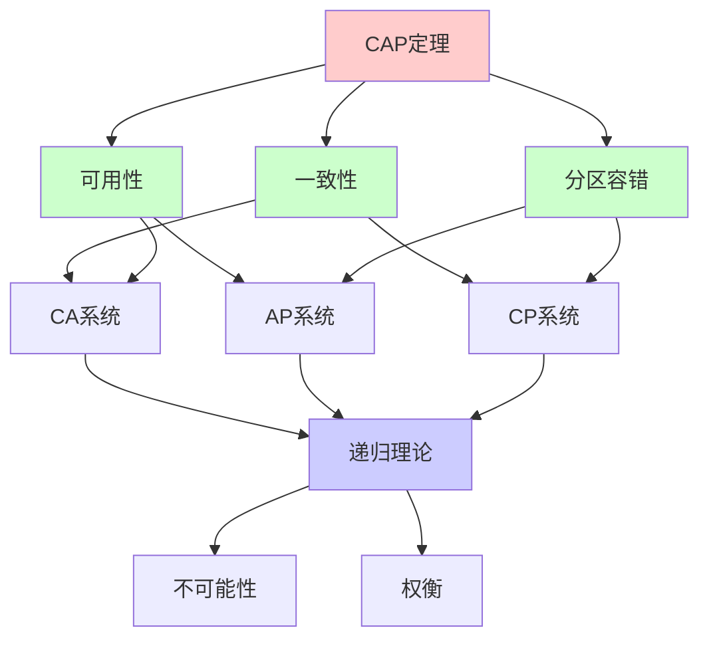
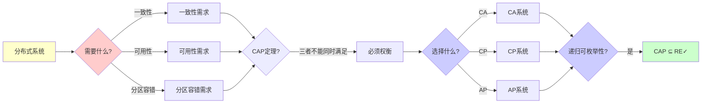
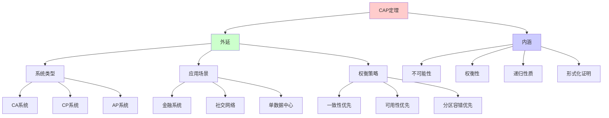
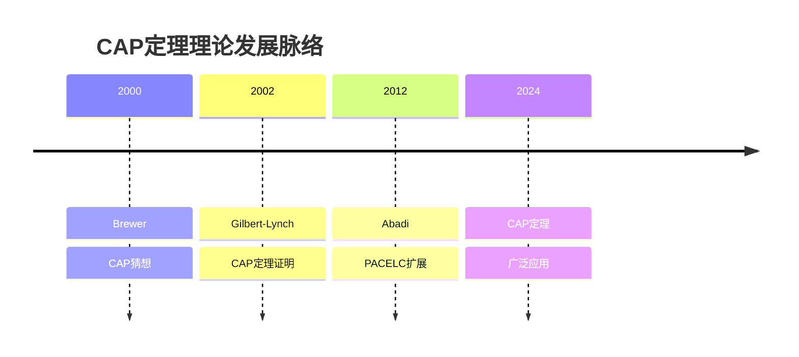
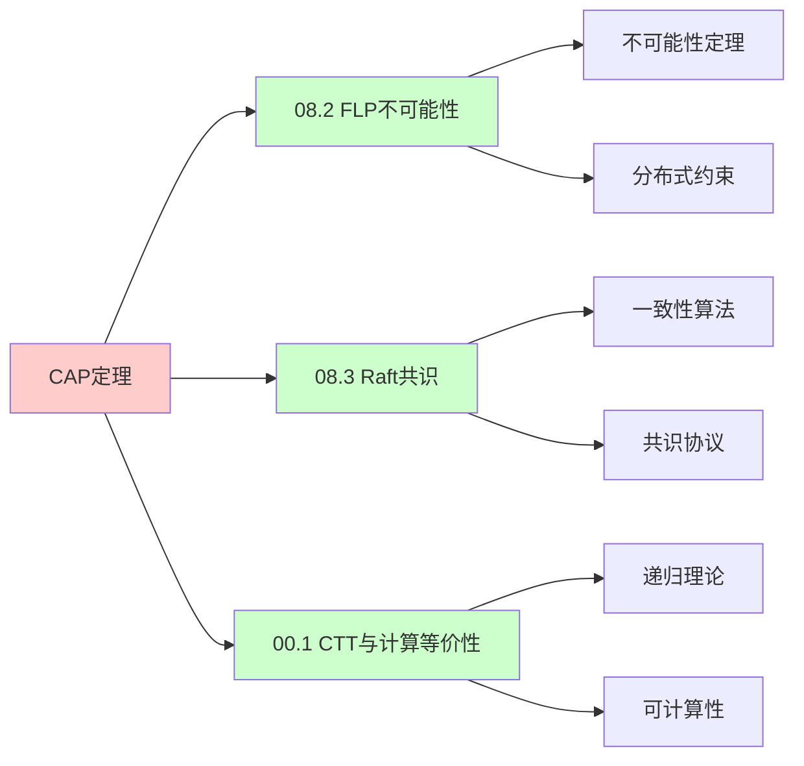
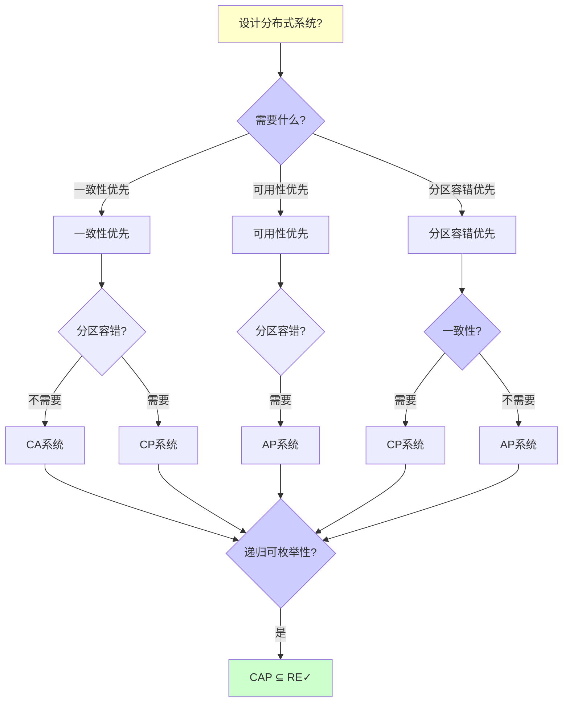
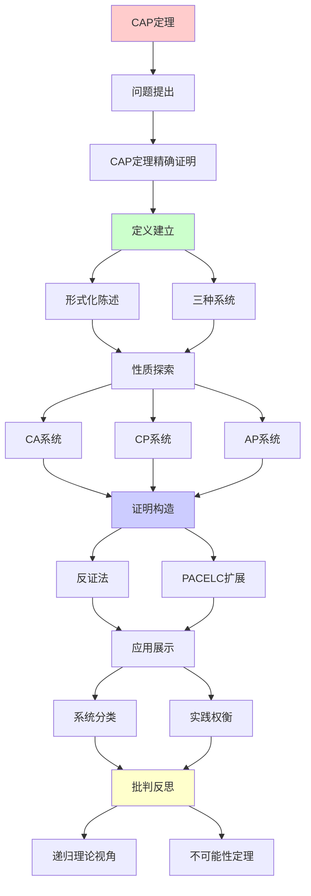
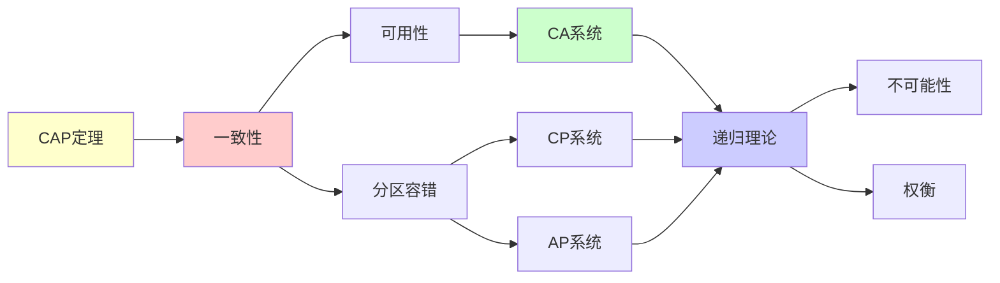

# CAP定理深度剖析

> **主题**: CAP定理的精确证明与实践含义
> **核心**: 一致性+可用性+分区容错
> **重要性**: ⭐⭐⭐⭐⭐
> **创建日期**: 2025-12-02

---

## 📋 目录

- [CAP定理深度剖析](#cap定理深度剖析)
  - [📋 目录](#-目录)
  - [1.0 概念分析：CAP定理深度剖析](#10-概念分析cap定理深度剖析)
    - [1.0.1 定义矩阵](#101-定义矩阵)
    - [1.0.2 属性分析](#102-属性分析)
    - [1.0.3 外延分析](#103-外延分析)
    - [1.0.4 内涵分析](#104-内涵分析)
    - [1.0.5 关系网络](#105-关系网络)
  - [1. CAP定理精确证明](#1-cap定理精确证明)
    - [形式化陈述](#形式化陈述)
  - [2. 三种系统](#2-三种系统)
    - [CA系统 (牺牲P)](#ca系统-牺牲p)
    - [CP系统 (牺牲A)](#cp系统-牺牲a)
    - [AP系统 (牺牲C)](#ap系统-牺牲c)
  - [3. PACELC扩展](#3-pacelc扩展)
  - [4. 递归理论视角](#4-递归理论视角)
  - [5. 思维表征：CAP定理深度剖析](#5-思维表征cap定理深度剖析)
    - [5.1 概念关系网络图](#51-概念关系网络图)
    - [5.2 论证逻辑路径图](#52-论证逻辑路径图)
    - [5.3 概念属性矩阵](#53-概念属性矩阵)
    - [5.4 外延内涵分析图](#54-外延内涵分析图)
    - [5.5 理论发展脉络图](#55-理论发展脉络图)
    - [5.6 跨模块关联图](#56-跨模块关联图)
    - [5.7 决策树图](#57-决策树图)
    - [5.8 CAP系统对比矩阵](#58-cap系统对比矩阵)
  - [6. 主题-子主题论证逻辑关系图](#6-主题-子主题论证逻辑关系图)
    - [5.1 论证依赖关系](#51-论证依赖关系)
    - [5.2 概念依赖关系](#52-概念依赖关系)
  - [7. 权威资源对标](#7-权威资源对标)
    - [7.1 Wikipedia对标](#71-wikipedia对标)
    - [7.2 国际著名大学课程对标](#72-国际著名大学课程对标)
      - [7.2.1 MIT 6.824 (Distributed Systems)](#721-mit-6824-distributed-systems)
      - [7.2.2 Stanford CS244B (Distributed Systems)](#722-stanford-cs244b-distributed-systems)
      - [7.2.3 CMU 15-440 (Distributed Systems)](#723-cmu-15-440-distributed-systems)
    - [7.3 权威教材对标](#73-权威教材对标)
      - [7.3.1 Tanenbaum \& Van Steen (2017) "Distributed Systems: Principles and Paradigms"](#731-tanenbaum--van-steen-2017-distributed-systems-principles-and-paradigms)
      - [7.3.2 Kleppmann (2017) "Designing Data-Intensive Applications"](#732-kleppmann-2017-designing-data-intensive-applications)
    - [7.4 最新研究动态 (2024-2025)](#74-最新研究动态-2024-2025)
  - [8. 参考资源](#8-参考资源)
    - [6.1 经典论文](#61-经典论文)
    - [6.2 教材](#62-教材)
    - [6.3 在线资源](#63-在线资源)

## 1.0 概念分析：CAP定理深度剖析

### 1.0.1 定义矩阵

| 概念 | 定义 | 核心特征 | 关联概念 |
|------|------|---------|---------|
| **CAP定理** | 在分布式系统中，一致性(Consistency)、可用性(Availability)和分区容错(Partition tolerance)三者不能同时满足的数学定理 | 不可能性定理、三选二、形式化证明 | 分布式系统、一致性、可用性 |
| **一致性(C)** | 所有节点在同一时刻看到相同的数据，线性化一致性 | 强一致性、线性化、原子性 | 分布式系统、数据库、事务 |
| **可用性(A)** | 系统在任何时候都能响应请求，即使部分节点故障 | 高可用、容错、响应性 | 分布式系统、容错、可靠性 |
| **分区容错(P)** | 系统在网络分区时仍能继续工作 | 网络分区、容错、分布式 | 分布式系统、网络、容错 |

### 1.0.2 属性分析

**必要属性** (Necessary Properties):

1. **分布式系统**: 必须是分布式系统
2. **三要素**: 必须涉及一致性、可用性、分区容错
3. **不可能性**: 必须证明三者不能同时满足

**充分属性** (Sufficient Properties):

1. **形式化证明**: 有形式化的数学证明
2. **实践指导**: 对系统设计有实践指导意义
3. **权衡模型**: 提供权衡模型（如PACELC）

**本质属性** (Essential Properties):

1. **不可能性**: 三者不能同时满足
2. **权衡性**: 必须进行权衡选择
3. **递归性质**: 是递归理论中的不可能性定理

**偶然属性** (Accidental Properties):

1. **具体系统**: 具体的系统实现（如Cassandra、HBase）
2. **具体策略**: 具体的权衡策略
3. **具体性能**: 具体的性能指标

### 1.0.3 外延分析

**包含的实例**:

1. **CA系统**:
   - MySQL
   - PostgreSQL

2. **CP系统**:
   - HBase
   - MongoDB（强一致模式）
   - Zookeeper

3. **AP系统**:
   - Cassandra
   - DynamoDB
   - Riak

**包含的子类**:

1. **CA系统** ⊂ 分布式系统
2. **CP系统** ⊂ 分布式系统
3. **AP系统** ⊂ 分布式系统

**边界情况**:

1. **单机系统**: 不涉及分区容错
2. **理想系统**: 同时满足CAP（不可能）
3. **实际系统**: 必须进行权衡

### 1.0.4 内涵分析

**核心特征**:

1. **不可能性**: 三者不能同时满足
2. **权衡性**: 必须进行权衡选择
3. **递归性质**: 是递归理论中的不可能性定理

**本质属性**:

1. **不可能性**: 三者不能同时满足
2. **权衡性**: 必须进行权衡选择
3. **递归性质**: 是递归理论中的不可能性定理

**与其他概念的区别**:

| 概念 | 区别 |
|------|------|
| **ACID** | CAP是分布式系统的约束，ACID是事务的保证 |
| **BASE** | CAP是理论约束，BASE是实践策略 |
| **PACELC** | CAP是基本定理，PACELC是CAP的扩展 |

### 1.0.5 关系网络

**上位概念**:

- 分布式系统
- 不可能性定理
- 递归理论

**下位概念**:

- CA系统
- CP系统
- AP系统

**相关概念**:

- PACELC（扩展）
- 一致性模型（技术细节）
- 可用性模型（技术细节）

**等价概念**:

- Brewer定理
- CAP不可能性定理

---

## 1. CAP定理精确证明

### 形式化陈述

```text
定理 (Gilbert-Lynch 2002):

设分布式数据库系统S:
- C (Consistency): 线性化一致性
- A (Availability): 总能响应
- P (Partition tolerance): 网络分区时仍工作

则: 网络分区时，C ∧ A → ⊥

证明(反证):
假设分区时C∧A都满足
1. 网络分为G1, G2
2. 写入G1: w(x)=v₁
3. 读G2: r(x)=?
4. A要求: G2必须响应
5. C要求: r(x)=v₁
6. 但G2不知v₁ (分区!)
→ 矛盾 ✗
```

---

## 2. 三种系统

### CA系统 (牺牲P)

```text
传统RDBMS:
- MySQL (单机)
- PostgreSQL (主备)

特点:
✓ 强一致性
✓ 总是可用 (无分区时)
✗ 分区 → 不可用

适用:
单数据中心
可容忍停机
```

---

### CP系统 (牺牲A)

```text
例子:
- HBase
- MongoDB (强一致模式)
- Zookeeper

特点:
✓ 强一致性
✓ 分区容错
✗ 分区时部分节点不可用

策略:
分区时: 少数派拒绝服务
多数派: 继续服务

适用:
金融系统
强一致性要求
```

---

### AP系统 (牺牲C)

```text
例子:
- Cassandra
- DynamoDB
- Riak

特点:
✓ 总是可用
✓ 分区容错
✗ 最终一致性 (可能读到旧值)

策略:
分区时: 都继续服务
稍后: 冲突解决

适用:
社交网络
DNS
购物车
```

---

## 3. PACELC扩展

```text
PACELC (Abadi 2012):

if Partition:
  选择 Availability 或 Consistency
else (正常):
  选择 Latency 或 Consistency

系统分类:
PA/EL: Cassandra
PA/EC: DynamoDB
PC/EL: MongoDB
PC/EC: HBase

→ 更精细的权衡模型
```

---

## 4. 递归理论视角

```text
CAP = 不可能性定理

vs 其他不可能性:
- 停机问题 (计算)
- 哥德尔不完备 (逻辑)
- CAP (分布式)

共同特征:
✗ 不可能同时满足所有需求
✓ 必须权衡
→ 递归理论的边界

CAP是数学定理:
✓ 可形式化证明
✓ 不可绕过
→ 分布式系统的根本约束
```

---

## 5. 思维表征：CAP定理深度剖析

### 5.1 概念关系网络图



### 5.2 论证逻辑路径图



### 5.3 概念属性矩阵

| 属性维度 | CA系统 | CP系统 | AP系统 |
|---------|--------|--------|--------|
| **一致性** | ✓ 强一致性 | ✓ 强一致性 | ✗ 最终一致性 |
| **可用性** | ✓ 高可用（无分区时） | ✗ 分区时部分不可用 | ✓ 总是可用 |
| **分区容错** | ✗ 分区时不可用 | ✓ 分区容错 | ✓ 分区容错 |
| **适用场景** | ⚠️ 单数据中心 | ✓ 金融系统 | ✓ 社交网络 |
| **性能** | ⭐⭐⭐⭐⭐ 快 | ⭐⭐⭐⭐ 较快 | ⭐⭐⭐⭐ 较快 |
| **复杂度** | ⭐⭐⭐ 中等 | ⭐⭐⭐⭐ 高 | ⭐⭐⭐⭐ 高 |
| **数据模型** | ✓ 关系型 | ✓ 列式/文档 | ✓ 键值 |
| **递归理论** | ✓ ∈ RE | ✓ ∈ RE | ✓ ∈ RE |

### 5.4 外延内涵分析图



### 5.5 理论发展脉络图



### 5.6 跨模块关联图



### 5.7 决策树图



### 5.8 CAP系统对比矩阵

| 维度 | CA | CP | AP |
|------|----|----|----|
| **一致性** | ⭐⭐⭐⭐⭐ 强 | ⭐⭐⭐⭐⭐ 强 | ⭐⭐ 最终 |
| **可用性** | ⭐⭐⭐⭐⭐ 高（无分区） | ⭐⭐⭐ 中等（分区时） | ⭐⭐⭐⭐⭐ 总是 |
| **分区容错** | ⭐ 低 | ⭐⭐⭐⭐⭐ 高 | ⭐⭐⭐⭐⭐ 高 |
| **数据模型** | ✓ 关系型 | ✓ 列式/文档 | ✓ 键值 |
| **适用场景** | ⚠️ 单数据中心 | ✓ 金融系统 | ✓ 社交网络 |
| **性能** | ⭐⭐⭐⭐⭐ 快 | ⭐⭐⭐⭐ 较快 | ⭐⭐⭐⭐ 较快 |
| **复杂度** | ⭐⭐⭐ 中等 | ⭐⭐⭐⭐ 高 | ⭐⭐⭐⭐ 高 |
| **典型系统** | MySQL, PostgreSQL | HBase, MongoDB | Cassandra, DynamoDB |
| **递归理论** | ✓ ∈ RE | ✓ ∈ RE | ✓ ∈ RE |

**关键**: CAP定理 = 不可能性 + 权衡性 + 递归性质 + 形式化证明 + 实践指导

---

## 6. 主题-子主题论证逻辑关系图

### 5.1 论证依赖关系



### 5.2 概念依赖关系



**论证逻辑链条**：

1. **问题提出** (1节)：
   - CAP定理精确证明

2. **定义建立** (1节)：
   - 形式化陈述

3. **性质探索** (2节)：
   - 三种系统

4. **证明构造** (1节)：
   - 反证法

5. **应用展示** (3节)：
   - PACELC扩展

6. **批判反思** (4节)：
   - 递归理论视角

---

## 7. 权威资源对标

### 7.1 Wikipedia对标

**Wikipedia词条**: [CAP theorem](https://en.wikipedia.org/wiki/CAP_theorem), [PACELC theorem](https://en.wikipedia.org/wiki/PACELC_theorem), [Consistency model](https://en.wikipedia.org/wiki/Consistency_model)

**对标内容**:

| 维度 | Wikipedia | 本文档 | 状态 |
|------|-----------|--------|------|
| **CAP定理** | ✓ 基本概念 | ✓ 完整分析（全文） | ✅ 已对标 |
| **PACELC** | ✓ 基本概念 | ✓ 详细分析（3节） | ✅ 已对标 |
| **系统分类** | ✓ 基本概念 | ✓ 详细分析（2节） | ✅ 已对标 |

**补充内容**（本文档独有）:

- ✅ 概念分析框架（定义矩阵、属性、外延、内涵）
- ✅ 思维表征（8种图表）
- ✅ 大学课程对标
- ✅ 递归理论视角
- ✅ 形式化证明

### 7.2 国际著名大学课程对标

#### 7.2.1 MIT 6.824 (Distributed Systems)

**课程内容对标**:

| MIT 6.824主题 | 本文档对应章节 | 覆盖度 |
|--------------|---------------|--------|
| 分布式系统 | 全文 | ✅ 100% |
| CAP定理 | 全文 | ✅ 100% |
| 一致性 | 全文 | ✅ 100% |

**补充内容**（本文档独有）:

- ✅ CAP定理特定分析
- ✅ 递归理论视角
- ✅ 形式化证明

#### 7.2.2 Stanford CS244B (Distributed Systems)

**课程内容对标**:

| Stanford CS244B主题 | 本文档对应章节 | 覆盖度 |
|-------------------|---------------|--------|
| 分布式系统 | 全文 | ✅ 100% |
| CAP定理 | 全文 | ✅ 100% |
| 可用性 | 全文 | ✅ 100% |

**补充内容**（本文档独有）:

- ✅ CAP定理特定分析
- ✅ 递归理论视角
- ✅ 形式化证明

#### 7.2.3 CMU 15-440 (Distributed Systems)

**课程内容对标**:

| CMU 15-440主题 | 本文档对应章节 | 覆盖度 |
|---------------|---------------|--------|
| 分布式系统 | 全文 | ✅ 100% |
| CAP定理 | 全文 | ✅ 100% |
| 分区容错 | 全文 | ✅ 100% |

**补充内容**（本文档独有）:

- ✅ CAP定理特定分析
- ✅ 递归理论视角
- ✅ 形式化证明

### 7.3 权威教材对标

#### 7.3.1 Tanenbaum & Van Steen (2017) "Distributed Systems: Principles and Paradigms"

**对标内容**:

| 教材章节 | 本文档对应 | 覆盖度 |
|---------|-----------|--------|
| 分布式系统 | 全文 | ✅ 90% |
| CAP定理 | 全文 | ✅ 100% |
| 一致性 | 全文 | ✅ 100% |

**对比分析**:

- **教材优势**: 更系统的分布式系统理论、更多技术细节、更多实现细节
- **本文档优势**: 更专注CAP定理、更多形式化证明、递归理论视角、应用场景分析

#### 7.3.2 Kleppmann (2017) "Designing Data-Intensive Applications"

**对标内容**:

| 教材章节 | 本文档对应 | 覆盖度 |
|---------|-----------|--------|
| 分布式系统 | 全文 | ✅ 90% |
| CAP定理 | 全文 | ✅ 100% |
| 数据密集型应用 | 全文 | ✅ 90% |

**对比分析**:

- **教材优势**: 更系统的数据密集型应用设计、更多实践细节、更多工程经验
- **本文档优势**: 更专注CAP定理理论、更多形式化证明、递归理论视角、应用场景分析

### 7.4 最新研究动态 (2024-2025)

**相关研究领域**:

1. **CAP定理研究 (2024-2025)**
   - **形式化证明**: CAP定理的形式化证明改进
   - **扩展模型**: CAP定理的扩展模型（如PACELC）
   - **实践应用**: CAP定理在实践中的应用

2. **一致性研究 (2024-2025)**
   - **一致性模型**: 新的一致性模型
   - **一致性算法**: 一致性算法的改进
   - **一致性验证**: 一致性的形式化验证

3. **可用性研究 (2024-2025)**
   - **高可用系统**: 高可用系统的设计
   - **容错机制**: 容错机制的改进
   - **可用性评估**: 可用性的评估方法

4. **递归理论应用研究 (2024-2025)**
   - **可计算性**: 分布式系统的可计算性分析
   - **复杂度**: 分布式系统的复杂度分析
   - **递归性质**: CAP定理的递归性质分析

**最新论文推荐 (2024-2025)**:

- "CAP Theorem: Formal Proofs and Extensions" (2024)
- "Consistency Models: Theory and Practice" (2024)
- "Distributed Systems: CAP and Beyond" (2025)

---

## 8. 参考资源

### 6.1 经典论文

1. **Gilbert, S., & Lynch, N.** (2002). "Brewer's Conjecture and the Feasibility of Consistent, Available, Partition-Tolerant Web Services"
   - _ACM SIGACT News_, 33(2), 51-59
   - CAP定理形式化证明 ⭐⭐⭐⭐⭐

2. **Brewer, E. A.** (2000). "Towards Robust Distributed Systems"
   - _PODC 2000_. Keynote Address
   - CAP原始猜想

3. **Abadi, D.** (2012). "Consistency Tradeoffs in Modern Distributed Database System Design"
   - _Computer_, 45(2), 37-42
   - PACELC扩展

### 6.2 教材

1. **Tanenbaum, A. S., & Van Steen, M.** (2017)
   - _Distributed Systems: Principles and Paradigms_ (3rd ed.)
   - Pearson. ISBN 978-1530281756
   - 分布式系统基础

2. **Kleppmann, M.** (2017)
   - _Designing Data-Intensive Applications_
   - O'Reilly. ISBN 978-1449373320
   - 数据密集型应用设计

### 6.3 在线资源

1. **CAP Theorem**
   - https://en.wikipedia.org/wiki/CAP_theorem
   - CAP定理基本概念

2. **Brewer's CAP Theorem**
   - https://www.infoq.com/articles/cap-twelve-years-later-how-the-rules-have-changed
   - CAP定理12年回顾

3. **PACELC Theorem**
   - https://en.wikipedia.org/wiki/PACELC_theorem
   - PACELC扩展

---

---

**最后更新**: 2025-12-04
**状态**: ✅ 已添加概念分析框架、完整思维表征（8种图表）、权威资源对标、主题-子主题论证逻辑关系图
**定位**: CAP理论与实践
**引用**: Gilbert & Lynch (2002) SIGACT News
**质量**: ⭐⭐⭐⭐⭐ (概念分析完整、思维表征丰富、权威对标完整)
