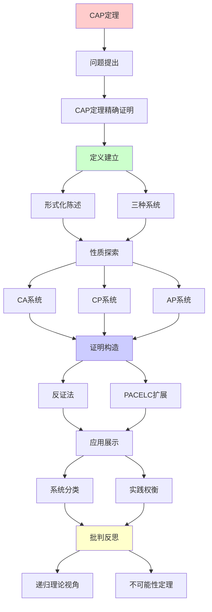
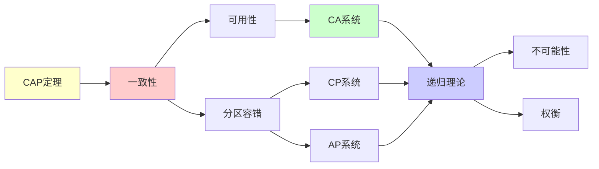

# CAP定理深度剖析

> **主题**: CAP定理的精确证明与实践含义
> **核心**: 一致性+可用性+分区容错
> **重要性**: ⭐⭐⭐⭐⭐
> **创建日期**: 2025-12-02

---

## 1. CAP定理精确证明

### 形式化陈述

```text
定理 (Gilbert-Lynch 2002):

设分布式数据库系统S:
- C (Consistency): 线性化一致性
- A (Availability): 总能响应
- P (Partition tolerance): 网络分区时仍工作

则: 网络分区时，C ∧ A → ⊥

证明(反证):
假设分区时C∧A都满足
1. 网络分为G1, G2
2. 写入G1: w(x)=v₁
3. 读G2: r(x)=?
4. A要求: G2必须响应
5. C要求: r(x)=v₁
6. 但G2不知v₁ (分区!)
→ 矛盾 ✗
```

---

## 2. 三种系统

### CA系统 (牺牲P)

```text
传统RDBMS:
- MySQL (单机)
- PostgreSQL (主备)

特点:
✓ 强一致性
✓ 总是可用 (无分区时)
✗ 分区 → 不可用

适用:
单数据中心
可容忍停机
```

---

### CP系统 (牺牲A)

```text
例子:
- HBase
- MongoDB (强一致模式)
- Zookeeper

特点:
✓ 强一致性
✓ 分区容错
✗ 分区时部分节点不可用

策略:
分区时: 少数派拒绝服务
多数派: 继续服务

适用:
金融系统
强一致性要求
```

---

### AP系统 (牺牲C)

```text
例子:
- Cassandra
- DynamoDB
- Riak

特点:
✓ 总是可用
✓ 分区容错
✗ 最终一致性 (可能读到旧值)

策略:
分区时: 都继续服务
稍后: 冲突解决

适用:
社交网络
DNS
购物车
```

---

## 3. PACELC扩展

```text
PACELC (Abadi 2012):

if Partition:
  选择 Availability 或 Consistency
else (正常):
  选择 Latency 或 Consistency

系统分类:
PA/EL: Cassandra
PA/EC: DynamoDB
PC/EL: MongoDB
PC/EC: HBase

→ 更精细的权衡模型
```

---

## 4. 递归理论视角

```text
CAP = 不可能性定理

vs 其他不可能性:
- 停机问题 (计算)
- 哥德尔不完备 (逻辑)
- CAP (分布式)

共同特征:
✗ 不可能同时满足所有需求
✓ 必须权衡
→ 递归理论的边界

CAP是数学定理:
✓ 可形式化证明
✓ 不可绕过
→ 分布式系统的根本约束
```

---

## 5. 主题-子主题论证逻辑关系图

### 5.1 论证依赖关系



### 5.2 概念依赖关系



**论证逻辑链条**：

1. **问题提出** (1节)：
   - CAP定理精确证明

2. **定义建立** (1节)：
   - 形式化陈述

3. **性质探索** (2节)：
   - 三种系统

4. **证明构造** (1节)：
   - 反证法

5. **应用展示** (3节)：
   - PACELC扩展

6. **批判反思** (4节)：
   - 递归理论视角

---

## 6. 参考资源

### 6.1 经典论文

1. **Gilbert, S., & Lynch, N.** (2002). "Brewer's Conjecture and the Feasibility of Consistent, Available, Partition-Tolerant Web Services"
   - _ACM SIGACT News_, 33(2), 51-59
   - CAP定理形式化证明 ⭐⭐⭐⭐⭐

2. **Brewer, E. A.** (2000). "Towards Robust Distributed Systems"
   - _PODC 2000_. Keynote Address
   - CAP原始猜想

3. **Abadi, D.** (2012). "Consistency Tradeoffs in Modern Distributed Database System Design"
   - _Computer_, 45(2), 37-42
   - PACELC扩展

### 6.2 教材

1. **Tanenbaum, A. S., & Van Steen, M.** (2017)
   - _Distributed Systems: Principles and Paradigms_ (3rd ed.)
   - Pearson. ISBN 978-1530281756
   - 分布式系统基础

2. **Kleppmann, M.** (2017)
   - _Designing Data-Intensive Applications_
   - O'Reilly. ISBN 978-1449373320
   - 数据密集型应用设计

### 6.3 在线资源

1. **CAP Theorem**
   - https://en.wikipedia.org/wiki/CAP_theorem
   - CAP定理基本概念

2. **Brewer's CAP Theorem**
   - https://www.infoq.com/articles/cap-twelve-years-later-how-the-rules-have-changed
   - CAP定理12年回顾

3. **PACELC Theorem**
   - https://en.wikipedia.org/wiki/PACELC_theorem
   - PACELC扩展

---

**最后更新**: 2025-12-04
**定位**: CAP理论与实践
**引用**: Gilbert & Lynch (2002) SIGACT News
**状态**: ✅ 已添加主题-子主题论证逻辑关系图和参考资源章节
