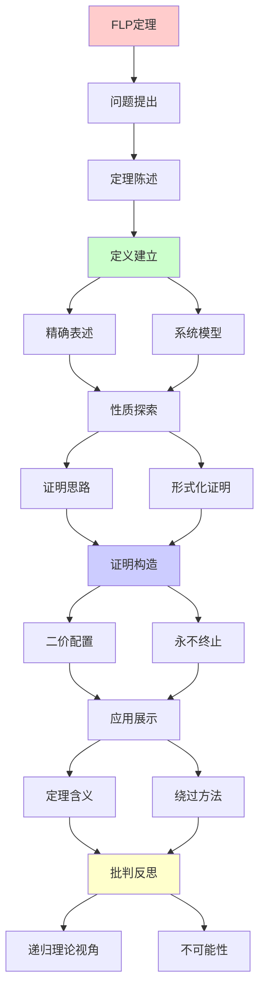
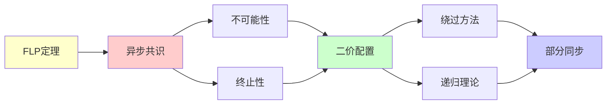

# FLP不可能性定理证明

> **主题**: Fischer-Lynch-Paterson异步共识不可能性
> **创建日期**: 2025-12-02
> **难度**: ⭐⭐⭐⭐⭐
> **前置知识**: 分布式系统、共识算法

---

## 📋 目录

- [FLP不可能性定理证明](#flp不可能性定理证明)
  - [📋 目录](#-目录)
  - [1. 定理陈述](#1-定理陈述)
    - [1.1 精确表述](#11-精确表述)
    - [1.2 系统模型](#12-系统模型)
  - [2. 证明思路](#2-证明思路)
    - [2.1 核心引理: 二价配置](#21-核心引理-二价配置)
    - [2.2 永不终止的执行](#22-永不终止的执行)
  - [3. 形式化证明](#3-形式化证明)
    - [3.1 配置与转移](#31-配置与转移)
    - [3.2 关键引理](#32-关键引理)
  - [4. 定理的含义](#4-定理的含义)
    - [4.1 理论意义](#41-理论意义)
    - [4.2 实践影响](#42-实践影响)
  - [5. 绕过FLP的方法](#5-绕过flp的方法)
  - [6. 递归理论视角](#6-递归理论视角)
  - [7. 主题-子主题论证逻辑关系图](#7-主题-子主题论证逻辑关系图)
    - [7.1 论证依赖关系](#71-论证依赖关系)
    - [7.2 概念依赖关系](#72-概念依赖关系)
  - [8. 参考资源](#8-参考资源)
    - [8.1 经典论文](#81-经典论文)
    - [8.2 教材](#82-教材)
    - [8.3 在线资源](#83-在线资源)

---

## 1. 定理陈述

### 1.1 精确表述

**FLP定理 (1985)**:

> 在异步分布式系统中，即使只有一个进程可能crash，
> 不存在确定性共识协议。

**形式化**:

```text
系统: n个进程，异步消息传递
容错: 最多1个进程crash
目标: 达成共识 (所有正确进程同意一个值)

结论: 不存在满足以下的确定性协议:
1. 终止性 (Termination): 最终决定
2. 一致性 (Agreement): 所有进程同意
3. 有效性 (Validity): 决定值来自输入
```

---

### 1.2 系统模型

```text
异步系统:
- 无时钟同步
- 消息延迟任意 (有限但无界)
- 进程速度任意

crash故障:
- 进程可能停止
- 但不会发送错误消息
- (vs 拜占庭: 可恶意)

关键: 无法区分
- 进程crash
- 进程慢
- 消息延迟
→ FLP的根源 ⚠️
```

---

## 2. 证明思路

### 2.1 核心引理: 二价配置

**二价配置 (Bivalent)**:

```text
配置C是二价的 ⟺
从C出发，可能达成决定0或决定1

关键引理:
存在初始二价配置
∧
∀二价配置C, ∃进程p和消息m:
  C --m→ C' 仍二价

→ 可构造永不终止的执行 ✗
```

---

### 2.2 永不终止的执行

**构造**:

```text
从初始二价配置开始:
C₀ (二价)
  ↓ 延迟某个消息m₁
C₁ (仍二价)
  ↓ 延迟某个消息m₂
C₂ (仍二价)
  ↓ ...
C_n (永远二价)

关键:
✓ 每步都符合协议
✓ 但永不决定
→ 违反终止性 ✗

递归构造:
C_{n+1} = delay_message(C_n, m_n)
→ 递归定义不终止执行
```

---

## 3. 形式化证明

### 3.1 配置与转移

```text
配置:
C = (进程状态, 消息缓冲)

转移:
C --e(p,m)→ C'
其中e(p,m) = 进程p接收消息m

可达性:
C₀ →* C₁ (存在执行序列)

决定配置:
C是0-决定 ⟺ 从C只能决定0
C是1-决定 ⟺ 从C只能决定1
C是二价 ⟺ 两者都可能
```

---

### 3.2 关键引理

**引理1**: 存在初始二价配置

```text
证明:
假设所有初始配置都单价
→ 相邻初始配置(differ by 1 input)
→ 一个0-决定，一个1-决定
→ 但进程不知道其他输入
→ 矛盾 ✗
```

**引理2**: 二价配置永远存在

```text
对∀二价C, ∀事件e:
或者 C→C' 仍二价
或者 ∃另一事件e'使得二价

→ 总能找到保持二价的路径
→ 永不终止执行存在 ✗
```

---

## 4. 定理的含义

### 4.1 理论意义

```text
FLP = 分布式系统的哥德尔定理

含义:
✗ 异步+容错→无确定共识
✓ 根本性不可能 (非技术问题)

vs其他不可能性:
- 停机问题 (计算)
- 哥德尔 (逻辑)
- CAP (分布式)
- FLP (共识)

→ 所有领域都有边界 ⚠️
```

---

### 4.2 实践影响

**如何绕过FLP**:

```text
方法1: 放松异步假设
  → 部分同步 (Paxos, Raft)
  → 超时机制

方法2: 放松确定性
  → 随机化 (Ben-Or)
  → 概率终止 ✓

方法3: 放松终止性
  → 最终终止
  → 活锁可能

实践:
✓ Paxos/Raft: 部分同步
✓ Bitcoin PoW: 概率
✓ PBFT: 部分同步+拜占庭
✗ 纯异步确定: 不可能
```

---

## 5. 绕过FLP的方法

```text
常用策略:

1. 失败检测器
   - Ω失败检测器
   - 最终准确

2. 随机化
   - 概率共识
   - 期望终止

3. 同步假设
   - 超时
   - 网络假设

递归理论:
✗ FLP: 异步共识∉可判定
✓ 但实践可用各种技巧
→ 理论边界 vs 实践可行
```

---

## 6. 递归理论视角

```text
FLP定理 = 不可判定性结果

核心:
异步共识 = 停机问题变体？

联系:
- 无法判定进程是否crash
- 无法判定消息何时到达
→ 本质: 无法判定 ✗

递归理论:
✓ 协议可递归定义
✗ 终止性不可判定
→ 分布式 = 递归+不可判定

历史地位:
1985: FLP发表
影响: 分布式理论基础
→ 所有共识算法必须面对 ⚠️
```

---

## 7. 主题-子主题论证逻辑关系图

### 7.1 论证依赖关系



### 7.2 概念依赖关系



**论证逻辑链条**：

1. **问题提出** (1节)：
   - 定理陈述

2. **定义建立** (1.1-1.2节)：
   - 精确表述和系统模型

3. **性质探索** (2-3节)：
   - 证明思路（2节）
   - 形式化证明（3节）

4. **证明构造** (2.1-2.2, 3.1-3.2节)：
   - 二价配置和永不终止的执行

5. **应用展示** (4-5节)：
   - 定理的含义（4节）
   - 绕过FLP的方法（5节）

6. **批判反思** (6节)：
   - 递归理论视角

---

## 8. 参考资源

### 8.1 经典论文

1. **Fischer, M. J., Lynch, N. A., & Paterson, M. S.** (1985). "Impossibility of Distributed Consensus with One Faulty Process"
   - _Journal of the ACM_, 32(2), 374-382
   - FLP不可能性定理（Dijkstra奖） ⭐⭐⭐⭐⭐

2. **Dwork, C., Lynch, N., & Stockmeyer, L.** (1988). "Consensus in the Presence of Partial Synchrony"
   - _Journal of the ACM_, 35(2), 288-323
   - 部分同步共识

### 8.2 教材

1. **Lynch, N. A.** (1996)
   - _Distributed Algorithms_
   - Morgan Kaufmann. ISBN 978-1558603486
   - 分布式算法教材

2. **Attiya, H., & Welch, J.** (2004)
   - _Distributed Computing: Fundamentals, Simulations, and Advanced Topics_ (2nd ed.)
   - Wiley. ISBN 978-0471453246
   - 分布式计算教材

### 8.3 在线资源

1. **FLP Impossibility**
   - https://en.wikipedia.org/wiki/Consensus_(computer_science)#Impossibility_result
   - FLP不可能性基本概念

2. **Distributed Systems Theory**
   - https://groups.csail.mit.edu/tds/
   - MIT分布式系统理论组

3. **Consensus Algorithms**
   - https://raft.github.io/
   - Raft共识算法

---

**最后更新**: 2025-12-04
**Tier**: 1 (理论)
**重要性**: 分布式系统基础 ⭐⭐⭐⭐⭐
**地位**: 三大不可能性之一
**状态**: ✅ 已添加主题-子主题论证逻辑关系图和参考资源章节
