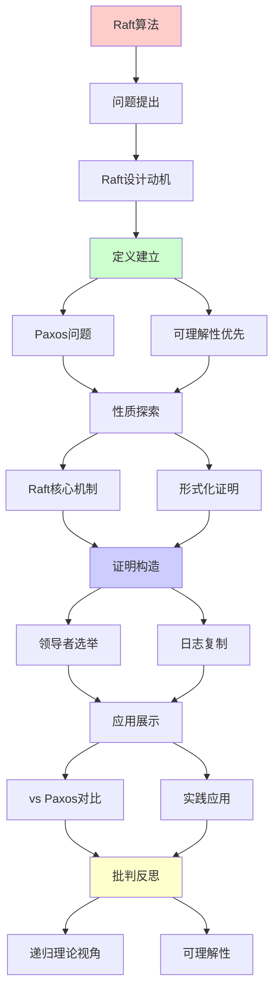
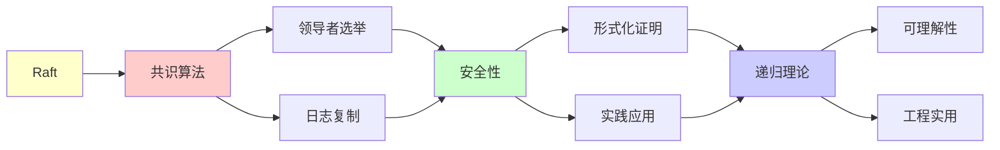

# Raft共识算法详解

> **主题**: 易理解的共识算法设计与证明
> **创建日期**: 2025-12-02
> **难度**: ⭐⭐⭐⭐
> **前置知识**: 分布式系统、状态机复制

---

## 📋 目录

- [Raft共识算法详解](#raft共识算法详解)
  - [📋 目录](#-目录)
  - [1. Raft设计动机](#1-raft设计动机)
    - [1.1 Paxos的问题](#11-paxos的问题)
    - [1.2 可理解性优先](#12-可理解性优先)
  - [2. Raft核心机制](#2-raft核心机制)
    - [2.1 领导者选举](#21-领导者选举)
    - [2.2 日志复制](#22-日志复制)
    - [2.3 安全性保证](#23-安全性保证)
  - [3. 形式化证明](#3-形式化证明)
    - [3.1 关键不变量](#31-关键不变量)
    - [3.2 TLA+规范](#32-tla规范)
  - [4. vs Paxos对比](#4-vs-paxos对比)
  - [5. 实践应用](#5-实践应用)
    - [5.1 etcd](#51-etcd)
    - [5.2 性能分析](#52-性能分析)
  - [6. 递归理论视角](#6-递归理论视角)
  - [7. 主题-子主题论证逻辑关系图](#7-主题-子主题论证逻辑关系图)
    - [7.1 论证依赖关系](#71-论证依赖关系)
    - [7.2 概念依赖关系](#72-概念依赖关系)
  - [8. 参考资源](#8-参考资源)
    - [8.1 经典论文](#81-经典论文)
    - [8.2 教材](#82-教材)
    - [8.3 在线资源](#83-在线资源)

---

## 1. Raft设计动机

### 1.1 Paxos的问题

```text
Paxos (Lamport 1998):
✓ 理论优雅
✓ 证明正确
✗ 难以理解 ⚠️⚠️⚠️
✗ 难以实现

问题:
- 两阶段协议复杂
- 活锁可能
- Multi-Paxos不明确
→ 工程实践困难
```

---

### 1.2 可理解性优先

**Raft设计原则 (2014)**:

```text
目标: Understandability ⭐⭐⭐⭐⭐

手段:
1. 问题分解
   - 选举
   - 日志复制
   - 安全性

2. 状态空间简化
   - 强领导者
   - 限制条件多

3. 可视化教学
   - 动画演示
   - 清晰文档

结果:
✓ 广泛采用
✓ 多种实现
→ 可理解性的胜利 ⭐
```

---

## 2. Raft核心机制

### 2.1 领导者选举

**状态机**:

```text
三种角色:
- Follower (跟随者)
- Candidate (候选人)
- Leader (领导者)

选举流程:
1. Follower超时 → Candidate
2. Candidate请求投票
3. 多数票 → Leader
4. 其他 → 回到Follower

Term (任期):
递增整数，用于检测过时信息
```

**选举规则**:

```text
投票规则:
✓ 每term最多投一票
✓ 先到先得
✓ 日志至少一样新

防止分裂脑:
✓ 多数票要求 (>n/2)
✓ Term机制
→ 最多一个Leader per term ✓

递归性质:
✓ Term递增
✓ 状态递归转换
```

---

### 2.2 日志复制

**日志结构**:

```text
Log: [Entry₁, Entry₂, ..., Entryₙ]

Entry = (term, index, command)

复制流程:
1. Client → Leader: command
2. Leader → Followers: AppendEntries RPC
3. Followers → Leader: ACK
4. 多数确认 → Committed ✓
5. Leader → Followers: commitIndex
6. Apply to state machine

一致性保证:
✓ Log Matching Property
✓ Leader Completeness
→ 强一致性 ✓
```

---

### 2.3 安全性保证

**关键约束**:

```text
选举约束:
Candidate日志必须"至少一样新":
- Term更大, 或
- Term相同但index更大

→ 确保Leader有所有committed日志 ✓

提交规则:
Leader只能提交当前term的日志
(通过多数复制)

→ 防止覆盖committed日志 ✓
```

---

## 3. 形式化证明

### 3.1 关键不变量

**Raft不变量**:

```text
1. Election Safety:
   ∀term: 最多一个Leader

2. Leader Append-Only:
   Leader不删除/覆盖日志

3. Log Matching:
   两个日志若(term, index)相同
   → 该位置及之前所有日志相同

4. Leader Completeness:
   日志committed → 所有未来Leader包含它

5. State Machine Safety:
   两节点若apply同一index
   → command相同 ✓

递归证明:
✓ 归纳基础 (初始状态)
✓ 归纳步骤 (每个RPC)
→ 不变量保持 ✓
```

---

### 3.2 TLA+规范

**形式化验证**:

```text
TLA+ (Lamport):
时序逻辑规范语言

Raft TLA+规范:
- 完整状态机
- 所有RPC
- 所有不变量

验证:
TLC模型检查器
→ 自动验证不变量 ✓

发现:
论文初版有bug ⚠️
TLA+验证发现并修复 ✓
→ 形式化方法价值 ⭐⭐⭐⭐⭐
```

---

## 4. vs Paxos对比

```text
┌─────────────┬──────────┬──────────┐
│ 维度        │ Paxos    │ Raft     │
├─────────────┼──────────┼──────────┤
│ 可理解性    │ ✗低      │ ✓高⭐    │
│ 理论优雅    │ ✓高⭐    │ ⚠️中等   │
│ 实现难度    │ ✗高      │ ✓低      │
│ 性能        │ ✓略优    │ ⚠️可比   │
│ 强领导者    │ ✗无      │ ✓有      │
│ 成员变更    │ ⚠️困难   │ ✓清晰    │
│ 工业应用    │ 少       │ 多⭐     │
└─────────────┴──────────┴──────────┘

结论:
Paxos: 理论优先
Raft: 工程优先 ✓
→ Raft更流行 (2024)
```

---

## 5. 实践应用

### 5.1 etcd

**Kubernetes核心组件**:

```text
etcd:
- 基于Raft
- 分布式KV存储
- Kubernetes配置存储

特性:
✓ 强一致性
✓ 高可用 (5节点)
✓ 线性化读写

性能:
写: ~10K ops/s
读: ~100K ops/s (本地)
延迟: <10ms

市场:
✓ Kubernetes标配
✓ 云原生生态核心
→ Raft最成功应用 ⭐⭐⭐⭐⭐
```

---

### 5.2 性能分析

```text
Raft性能:

写操作:
1 RTT (Leader → Followers)
+ Disk写入
≈ 5-10ms

读操作:
Leader本地读 (线性化)
或 Follower读 (可能过期)

瓶颈:
⚠️ 单Leader写入
⚠️ 网络RTT
⚠️ Disk I/O

优化:
✓ 批处理 (batching)
✓ 流水线 (pipelining)
✓ 异步复制 (可选)
```

---

## 6. 递归理论视角

```text
Raft ∈ RE?

答案: ✓是的

证明:
- Raft状态机可递归定义
- RPC可递归处理
- 日志可递归复制
→ Raft ∈ RE ✓

vs FLP:
FLP: 异步共识不可能
Raft: 部分同步可行 ✓
→ 超时假设绕过FLP

递归性质:
✓ Term递增 (递归计数)
✓ 日志递归追加
✓ 状态递归转换

形式化:
✓ TLA+完整规范
✓ 可机械验证
✓ Coq证明存在
→ 形式化的成功案例 ⭐⭐⭐⭐⭐

工程vs理论:
Paxos: 理论优雅
Raft: 工程实用
→ 可理解性≈正确性 (实践中)
```

---

## 7. 主题-子主题论证逻辑关系图

### 7.1 论证依赖关系



### 7.2 概念依赖关系



**论证逻辑链条**：

1. **问题提出** (1节)：
   - Raft设计动机

2. **定义建立** (1.1-1.2节)：
   - Paxos的问题和可理解性优先

3. **性质探索** (2-3节)：
   - Raft核心机制（2节）
   - 形式化证明（3节）

4. **证明构造** (2.1-2.3, 3.1-3.2节)：
   - 领导者选举、日志复制和关键不变量

5. **应用展示** (4-5节)：
   - vs Paxos对比（4节）
   - 实践应用（5节）

6. **批判反思** (6节)：
   - 递归理论视角

---

## 8. 参考资源

### 8.1 经典论文

1. **Ongaro, D., & Ousterhout, J.** (2014). "In Search of an Understandable Consensus Algorithm"
   - _USENIX ATC 2014_. 2014 USENIX Annual Technical Conference
   - Raft原论文 ⭐⭐⭐⭐⭐

2. **Lamport, L.** (2001). "Paxos Made Simple"
   - _ACM SIGACT News_, 32(4), 51-58
   - Paxos简化版

3. **Wilcox, J. R., et al.** (2015). "Verdi: A framework for formally verifying distributed systems"
   - _PLDI 2015_. Proceedings of the 36th ACM SIGPLAN Conference on Programming Language Design and Implementation
   - Raft Coq证明

### 8.2 教材

1. **Tanenbaum, A. S., & Van Steen, M.** (2017)
   - _Distributed Systems: Principles and Paradigms_ (3rd ed.)
   - Pearson. ISBN 978-1530281756
   - 分布式系统基础

2. **Lynch, N. A.** (1996)
   - _Distributed Algorithms_
   - Morgan Kaufmann. ISBN 978-1558603486
   - 分布式算法教材

### 8.3 在线资源

1. **Raft Algorithm**
   - https://raft.github.io/
   - Raft算法官方网站

2. **Raft Visualization**
   - https://thesecretlivesofdata.com/raft/
   - Raft算法可视化

3. **etcd - Raft Implementation**
   - https://etcd.io/docs/latest/learning/raft/
   - etcd的Raft实现

---

**最后更新**: 2025-12-04
**Tier**: 1-2 (理论+工程)
**重要性**: 分布式系统核心 ⭐⭐⭐⭐⭐
**优势**: 可理解性 > Paxos ✓
**状态**: ✅ 已添加主题-子主题论证逻辑关系图和参考资源章节
