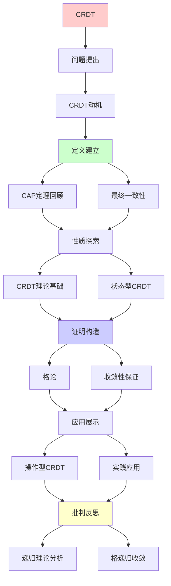
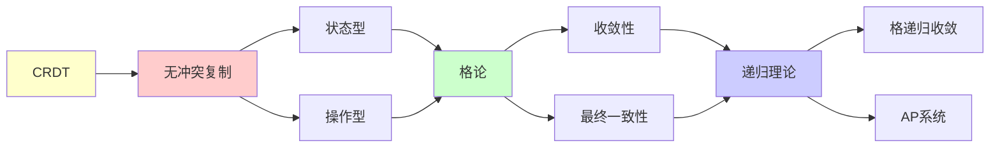

# CRDT无冲突复制数据类型

> **主题**: 最终一致性的数学基础
> **创建日期**: 2025-12-02
> **难度**: ⭐⭐⭐⭐
> **前置知识**: 分布式系统、格论、并发理论

---

## 📋 目录

- [CRDT无冲突复制数据类型](#crdt无冲突复制数据类型)
  - [📋 目录](#-目录)
  - [1. CRDT动机](#1-crdt动机)
    - [1.1 CAP定理回顾](#11-cap定理回顾)
    - [1.2 最终一致性](#12-最终一致性)
  - [2. CRDT理论基础](#2-crdt理论基础)
    - [2.1 格论](#21-格论)
    - [2.2 收敛性保证](#22-收敛性保证)
  - [3. 状态型CRDT](#3-状态型crdt)
    - [3.1 G-Counter](#31-g-counter)
    - [3.2 PN-Counter](#32-pn-counter)
    - [3.3 OR-Set](#33-or-set)
  - [4. 操作型CRDT](#4-操作型crdt)
    - [4.1 操作转换](#41-操作转换)
    - [4.2 因果历史](#42-因果历史)
  - [5. 实践应用](#5-实践应用)
    - [5.1 协同编辑](#51-协同编辑)
    - [5.2 分布式数据库](#52-分布式数据库)
  - [6. 递归理论分析](#6-递归理论分析)
  - [7. 主题-子主题论证逻辑关系图](#7-主题-子主题论证逻辑关系图)
    - [7.1 论证依赖关系](#71-论证依赖关系)
    - [7.2 概念依赖关系](#72-概念依赖关系)
  - [8. 参考资源](#8-参考资源)
    - [8.1 经典论文](#81-经典论文)
    - [8.2 教材](#82-教材)
    - [8.3 在线资源](#83-在线资源)

---

## 1. CRDT动机

### 1.1 CAP定理回顾

```text
CAP不可能三角:
- C (Consistency): 强一致性
- A (Availability): 高可用
- P (Partition tolerance): 分区容错

定理: 最多选2个

选择:
CP: 传统数据库 (牺牲A)
AP: NoSQL/CRDT (牺牲C) ✓
→ CRDT选择AP
```

---

### 1.2 最终一致性

**Eventual Consistency**:

```text
定义:
如果停止更新 ∧ 消息最终到达
→ 所有副本最终收敛 ✓

vs 强一致性:
强一致: 立即一致
最终: 稍后一致 ⚠️

问题:
? 如何保证收敛？
? 收敛到什么值？

CRDT答案:
✓ 数学保证收敛
✓ 确定性结果
→ 最终一致性可用 ⭐
```

---

## 2. CRDT理论基础

### 2.1 格论

**格 (Lattice)**:

```text
定义:
偏序集(L, ≤) + 两个操作
- join (∨): 最小上界
- meet (∧): 最大下界

例子:
自然数 (ℕ, ≤)
join = max
meet = min

格公理:
交换律: a∨b = b∨a
结合律: (a∨b)∨c = a∨(b∨c)
幂等律: a∨a = a
吸收律: a∨(a∧b) = a
```

---

### 2.2 收敛性保证

**CRDT定理**:

```text
定理 (Shapiro 2011):
状态型CRDT收敛 ⟺
合并操作是:
1. 交换律: merge(a,b) = merge(b,a)
2. 结合律: merge(merge(a,b),c) = merge(a,merge(b,c))
3. 幂等律: merge(a,a) = a

证明:
格join操作 = 满足上述 ✓
→ 收敛保证 ✓

递归性质:
✓ 合并递归应用
✓ 状态递归收敛
✓ 必达不动点 ⭐
```

---

## 3. 状态型CRDT

### 3.1 G-Counter

**Grow-only Counter**:

```text
结构:
Map[ReplicaID, Int]

操作:
increment(i):
  counter[myID] += i

query():
  return Σ counter

merge(other):
  ∀id: counter[id] = max(counter[id], other[id])

性质:
✓ 只增不减
✓ merge = max (格join)
✓ 自动收敛 ✓

例子:
副本1: {A:5, B:2}
副本2: {A:3, B:4}
merge: {A:5, B:4} ✓
```

---

### 3.2 PN-Counter

**Positive-Negative Counter**:

```text
结构:
增量G-Counter + 减量G-Counter

操作:
increment(i):
  P.increment(i)

decrement(i):
  N.increment(i)

query():
  return P.value() - N.value()

merge(other):
  P.merge(other.P)
  N.merge(other.N)

性质:
✓ 可增可减
✓ 基于G-Counter组合
✓ 收敛保证 ✓
```

---

### 3.3 OR-Set

**Observed-Remove Set**:

```text
问题:
并发add(x) vs remove(x)
→ 谁胜？

策略:
Add-wins: add胜出 ✓ (OR-Set)
Remove-wins: remove胜出

OR-Set实现:
元素 = (value, unique_id)

add(x):
  set.add((x, unique_id()))

remove(x):
  tombstone所有观察到的(x, id)

merge:
  union + 移除tombstone

性质:
✓ add-wins语义
✓ 因果一致
✓ 收敛 ✓
```

---

## 4. 操作型CRDT

### 4.1 操作转换

**操作传播**:

```text
vs 状态型:
状态型: 传播完整状态
操作型: 传播操作 ✓
→ 带宽优势

要求:
操作交换律:
op1(op2(s)) = op2(op1(s))

例子: 协同编辑
insert(pos, char)
需要调整pos ⚠️

OT (Operational Transformation):
转换冲突操作
→ 保持收敛 ✓
```

---

### 4.2 因果历史

**Version Vector**:

```text
向量时钟:
VV[A] = [A:5, B:3, C:2]
= A看到: A的5个, B的3个, C的2个

因果关系:
VV1 < VV2 ⟺ VV1在VV2因果历史中

并发:
VV1 || VV2 ⟺ 既非VV1<VV2也非VV2<VV1
→ 需要合并 ✓

递归性质:
✓ 时钟递归更新
✓ 因果递归传播
```

---

## 5. 实践应用

### 5.1 协同编辑

**Google Docs类应用**:

```text
挑战:
多用户同时编辑
低延迟要求
离线支持 ✓

CRDT方案:
RGA (Replicated Growable Array)
- 每字符唯一ID
- 因果顺序插入
- Tombstone删除

性能:
✓ 本地即时响应
✓ 无冲突合并
✓ 最终一致 ✓

vs OT:
OT: 复杂转换函数
CRDT: 数学保证 ✓
→ CRDT更简单
```

---

### 5.2 分布式数据库

**Riak/Redis Enterprise**:

```text
Riak:
基于OR-Set
支持CRDT数据类型:
- Counter
- Set
- Map
- Flag

Redis Enterprise:
CRDB (Conflict-free Replicated Database)
跨地域复制
最终一致性 ✓

性能:
✓ 低延迟读写
✓ 高可用 (AP)
⚠️ 非强一致 (trade-off)

应用:
✓ 购物车
✓ 会话管理
✓ 实时协作
```

---

## 6. 递归理论分析

```text
CRDT ∈ RE?

答案: ✓是的

证明:
- 状态可递归表示
- 合并可递归计算
- 收敛可递归验证
→ CRDT ∈ RE ✓

复杂度:
G-Counter: O(n) (n=副本数)
OR-Set: O(m) (m=元素数)
→ 线性可接受 ✓

收敛性:
格join = 不动点收敛
→ Tarski定理应用 ⭐

递归性质:
✓ 状态递归合并
✓ 操作递归应用
✓ 收敛递归保证

理论基础:
格论 (1930s)
→ CRDT (2011)
→ 80年理论到实践

vs 共识:
共识: 强一致 (CP)
CRDT: 最终一致 (AP)
→ 不同权衡

适用场景:
✓ 协同编辑
✓ 离线应用
✓ 地理分布
✗ 金融交易 (需强一致)
→ 场景决定选择

未来:
Delta-CRDT: 更高效 ✓
Pure CRDT: 更简洁
→ 持续演化

递归范式:
✓ CRDT = 格递归收敛
✓ 最终一致 = 递归不动点
✓ 分布式 = 递归合并
→ 递归理论的AP实现 ⭐⭐⭐⭐⭐
```

---

## 7. 主题-子主题论证逻辑关系图

### 7.1 论证依赖关系



### 7.2 概念依赖关系



**论证逻辑链条**：

1. **问题提出** (1节)：
   - CRDT动机

2. **定义建立** (1.1-1.2节)：
   - CAP定理回顾和最终一致性

3. **性质探索** (2-4节)：
   - CRDT理论基础（2节）
   - 状态型CRDT（3节）
   - 操作型CRDT（4节）

4. **证明构造** (2.1-2.2节)：
   - 格论和收敛性保证

5. **应用展示** (5节)：
   - 实践应用

6. **批判反思** (6节)：
   - 递归理论分析

---

## 8. 参考资源

### 8.1 经典论文

1. **Shapiro, M., et al.** (2011). "Conflict-free Replicated Data Types"
   - _SSS 2011_. 13th International Symposium on Stabilization, Safety, and Security of Distributed Systems
   - CRDT奠基性论文 ⭐⭐⭐⭐⭐

2. **Shapiro, M., et al.** (2011). "A Comprehensive Study of Convergent and Commutative Replicated Data Types"
   - Technical Report RR-7506, INRIA
   - CRDT综述

3. **Preguiça, N., Baquero, C., & Shapiro, M.** (2018). "Conflict-free Replicated Data Types"
   - _ACM Computing Surveys_, 51(4), 1-40
   - CRDT最新综述

### 8.2 教材

1. **Tanenbaum, A. S., & Van Steen, M.** (2017)
   - _Distributed Systems: Principles and Paradigms_ (3rd ed.)
   - Pearson. ISBN 978-1530281756
   - 分布式系统基础

2. **Kleppmann, M.** (2017)
   - _Designing Data-Intensive Applications_
   - O'Reilly. ISBN 978-1449373320
   - 数据密集型应用设计

### 8.3 在线资源

1. **CRDT Research**
   - https://crdt.tech/
   - CRDT技术资源

2. **CRDTs Explained**
   - https://en.wikipedia.org/wiki/Conflict-free_replicated_data_type
   - CRDT基本概念

3. **Riak CRDTs**
   - https://docs.riak.com/riak/kv/latest/developing/data-types/
   - Riak CRDT实现

---

**最后更新**: 2025-12-04
**Tier**: 1-2 (理论+工程)
**重要性**: AP系统核心 ⭐⭐⭐⭐⭐
**数学基础**: 格论 ✓
**状态**: ✅ 已添加主题-子主题论证逻辑关系图和参考资源章节
