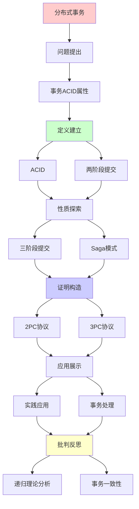
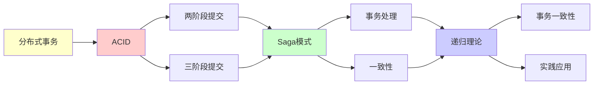

# 分布式事务与两阶段提交

> **主题**: 分布式事务的ACID保证与协议
> **创建日期**: 2025-12-02
> **难度**: ⭐⭐⭐⭐
> **前置知识**: 数据库系统、分布式系统、形式化方法

---

## 📋 目录

- [分布式事务与两阶段提交](#分布式事务与两阶段提交)
  - [📋 目录](#-目录)
  - [1. 事务ACID属性](#1-事务acid属性)
    - [1.1 ACID定义](#11-acid定义)
    - [1.2 分布式挑战](#12-分布式挑战)
  - [2. 两阶段提交](#2-两阶段提交)
    - [2.1 2PC协议](#21-2pc协议)
    - [2.2 阻塞问题](#22-阻塞问题)
  - [3. 三阶段提交](#3-三阶段提交)
    - [3.1 3PC改进](#31-3pc改进)
    - [3.2 网络分区问题](#32-网络分区问题)
  - [4. Saga模式](#4-saga模式)
    - [4.1 长事务处理](#41-长事务处理)
    - [4.2 补偿机制](#42-补偿机制)
  - [5. 实践应用](#5-实践应用)
    - [5.1 XA规范](#51-xa规范)
    - [5.2 微服务事务](#52-微服务事务)
  - [6. 递归理论分析](#6-递归理论分析)
  - [7. 主题-子主题论证逻辑关系图](#7-主题-子主题论证逻辑关系图)
    - [7.1 论证依赖关系](#71-论证依赖关系)
    - [7.2 概念依赖关系](#72-概念依赖关系)
  - [8. 参考资源](#8-参考资源)
    - [8.1 经典论文](#81-经典论文)
    - [8.2 教材](#82-教材)
    - [8.3 在线资源](#83-在线资源)

---

## 1. 事务ACID属性

### 1.1 ACID定义

```text
原子性 (Atomicity):
全部成功 或 全部失败
无中间状态 ✓

一致性 (Consistency):
事务保持数据库约束
不变量维持 ✓

隔离性 (Isolation):
并发事务互不干扰
如同串行执行 ✓

持久性 (Durability):
提交后永久保存
即使崩溃 ✓

递归性质:
✓ 约束递归维护
✓ 日志递归写入
```

---

### 1.2 分布式挑战

**单机vs分布式**:

```text
单机:
✓ ACID易保证
✓ 单点控制
✓ 本地日志

分布式:
✗ 跨节点协调困难
✗ 网络故障
✗ 部分失败
→ 根本性困难 ⚠️⚠️⚠️

CAP影响:
分区 (P) 存在 →
一致 (C) vs 可用 (A)
ACID事务 → 选C
→ 牺牲A ⚠️

vs NoSQL:
NoSQL: BASE (基本可用)
ACID: 强一致 ✓
→ 权衡不同
```

---

## 2. 两阶段提交

### 2.1 2PC协议

**Gray (1978)**:

```text
角色:
- 协调者 (Coordinator)
- 参与者 (Participants)

Phase 1: 准备阶段
Coordinator → All: PREPARE
Participants:
  - 写redo/undo日志
  - 锁定资源
  - 返回: YES/NO

Phase 2: 提交阶段
if All YES:
  Coordinator → All: COMMIT
  Participants: 提交 ✓
else:
  Coordinator → All: ABORT
  Participants: 回滚 ✗

原子性保证:
✓ 全部提交 或 全部回滚
→ 2PC核心 ⭐
```

---

### 2.2 阻塞问题

**协调者故障**:

```text
场景:
Phase 1完成 (All YES)
Coordinator发送COMMIT后crash
部分参与者收到，部分未收到
→ 参与者阻塞 ⚠️⚠️⚠️

参与者困境:
? 提交还是回滚
? 无法判断其他参与者状态
→ 必须等待Coordinator恢复 ✗

阻塞成本:
锁定资源
阻塞其他事务
可能数分钟 ⚠️
→ 可用性下降

vs 非阻塞:
3PC尝试解决
但引入新问题 ⚠️
```

---

## 3. 三阶段提交

### 3.1 3PC改进

**Skeen (1981)**:

```text
Phase 1: Can-Commit
Coordinator → All: CAN_COMMIT
Participants → YES/NO

Phase 2: Pre-Commit
Coordinator → All: PRE_COMMIT
Participants: 准备提交，但未提交

Phase 3: Do-Commit
Coordinator → All: DO_COMMIT
Participants: 提交 ✓

超时规则:
Phase 2后超时 → 可提交 ✓
(因为知道其他方都PRE_COMMIT)

优势:
✓ 非阻塞 (理论上)
✓ 超时可决策
```

---

### 3.2 网络分区问题

**3PC的致命缺陷**:

```text
场景:
网络分区
Coordinator + 部分参与者 (P1)
其他参与者 (P2)

P1收到PRE_COMMIT
P2未收到

超时后:
P1: 提交 ✓
P2: 回滚 ✗
→ 不一致 ⚠️⚠️⚠️

根本原因:
FLP定理:
异步系统 + 故障 → 无确定共识 ✗
→ 3PC也不能完全解决 ⚠️

实践:
3PC很少用
2PC + 超时/重试 ✓
→ 简单实用 ⭐
```

---

## 4. Saga模式

### 4.1 长事务处理

**Garcia-Molina & Salem (1987)**:

```text
问题:
长事务 (小时级)
2PC锁定太久 ⚠️

Saga思想:
T = T₁, T₂, ..., Tₙ (子事务序列)
每个Tᵢ独立提交 ✓

失败处理:
Tᵢ失败 → 执行补偿:
C_{i-1}, C_{i-2}, ..., C₁
→ 回滚效果 ⚠️

递归性质:
✓ 事务递归执行
✓ 补偿递归回滚
✓ Saga递归嵌套
```

---

### 4.2 补偿机制

**补偿事务**:

```text
例子:
订单流程:
1. 预订机票 → 取消机票
2. 预订酒店 → 取消酒店
3. 扣款     → 退款

失败:
步骤3失败
→ 执行C₂, C₁ (倒序补偿)
→ 最终一致 ✓

限制:
⚠️ 补偿可见 (已提交)
⚠️ 非ACID (中间状态可见)
⚠️ 补偿可能失败

权衡:
2PC: ACID ✓, 阻塞 ⚠️
Saga: 非阻塞 ✓, 非ACID ⚠️
→ 长事务选择Saga ⭐

递归:
✓ 前向递归执行
✓ 后向递归补偿
```

---

## 5. 实践应用

### 5.1 XA规范

**X/Open XA**:

```text
标准接口:
TM (Transaction Manager)
RM (Resource Manager)

接口:
xa_start()
xa_prepare()  // Phase 1
xa_commit()   // Phase 2
xa_rollback()

实现:
- MySQL
- PostgreSQL
- Oracle
→ 数据库标配 ✓

性能:
准备: 同步写日志
提交: 同步刷盘
→ 2次磁盘I/O ⚠️
→ 性能瓶颈

递归:
✓ 资源递归注册
✓ 提交递归协调
```

---

### 5.2 微服务事务

**现代挑战**:

```text
微服务:
服务A → 服务B → 服务C
跨服务事务？⚠️

方案1: 2PC
✗ 性能差
✗ 耦合强
→ 微服务反模式 ⚠️

方案2: Saga
✓ 异步编排
✓ 最终一致
✓ 松耦合 ⭐
→ 微服务首选

方案3: 事件溯源
✓ 事件日志
✓ 幂等处理
✓ 可重放
→ CQRS模式 ⭐

实践:
Netflix: Saga
Uber: 事件溯源
→ 放弃强一致 ✓
```

---

## 6. 递归理论分析

```text
分布式事务 ∈ RE?

答案: ✓是的

证明:
- 2PC协议可递归执行
- 日志可递归写入
- 状态可递归转换
→ 分布式事务 ∈ RE ✓

但:
✗ 在FLP限制下
✗ 异步 + 故障 → 无确定共识
⚠️ 需要同步假设或概率

复杂度:
2PC: 2轮 (准备+提交)
消息: O(n) (n=参与者)
延迟: 2×RTT + 2×Disk
→ 多项式但昂贵 ⚠️

vs 单机:
单机事务: O(1)轮
分布式: O(1)轮但网络延迟
→ 100-1000×慢 ⚠️

递归性质:
✓ 事务递归嵌套
✓ 提交递归协调
✓ 回滚递归传播
✓ 日志递归维护
→ 多层递归 ⭐

理论vs实践:
理论: 2PC/3PC保证ACID
实践:
- 阻塞问题 ⚠️
- 性能开销 ⚠️
- 工程复杂 ⚠️
→ 现代趋势: 放弃强一致

BASE替代:
Basically Available
Soft state
Eventually consistent
→ NoSQL/微服务选择 ✓

递归范式贡献:
✓ 明确协议边界 (FLP)
✓ 形式化正确性证明
✓ 递归协调机制
→ 理论指导实践 ⭐

哲学:
ACID = 理想
BASE = 现实
→ CAP权衡
→ 一致性 vs 可用性 ⚠️

未来:
共识算法 (Raft/PBFT)
→ 替代2PC
→ 非阻塞 + 容错 ✓

区块链启发:
最终一致 + 密码学
→ 新范式 ⭐
```

---

## 7. 主题-子主题论证逻辑关系图

### 7.1 论证依赖关系



### 7.2 概念依赖关系



**论证逻辑链条**：

1. **问题提出** (1节)：
   - 事务ACID属性

2. **定义建立** (1节)：
   - ACID属性

3. **性质探索** (2-4节)：
   - 两阶段提交（2节）
   - 三阶段提交（3节）
   - Saga模式（4节）

4. **证明构造** (贯穿全文)：
   - 2PC和3PC协议

5. **应用展示** (5节)：
   - 实践应用

6. **批判反思** (6节)：
   - 递归理论分析

---

## 8. 参考资源

### 8.1 经典论文

1. **Gray, J.** (1978). "Notes on Data Base Operating Systems"
   - In Bayer, R., et al. (eds.), _Operating Systems: An Advanced Course_
   - Springer. 两阶段提交

2. **Skeen, D.** (1981). "Nonblocking Commit Protocols"
   - _SIGMOD 1981_. Proceedings of the 1981 ACM SIGMOD International Conference on Management of Data
   - 三阶段提交

3. **Garcia-Molina, H., & Salem, K.** (1987). "Sagas"
   - _SIGMOD 1987_. Proceedings of the 1987 ACM SIGMOD International Conference on Management of Data
   - Saga模式 ⭐⭐⭐⭐⭐

### 8.2 教材

1. **Bernstein, P. A., & Newcomer, E.** (2009)
   - _Principles of Transaction Processing_ (2nd ed.)
   - Morgan Kaufmann. ISBN 978-1558606234
   - 事务处理教材

2. **Tanenbaum, A. S., & Van Steen, M.** (2017)
   - _Distributed Systems: Principles and Paradigms_ (3rd ed.)
   - Pearson. ISBN 978-1530281756
   - 分布式系统基础

### 8.3 在线资源

1. **Two-Phase Commit**
   - https://en.wikipedia.org/wiki/Two-phase_commit_protocol
   - 两阶段提交基本概念

2. **Saga Pattern**
   - https://microservices.io/patterns/data/saga.html
   - Saga模式

3. **Distributed Transactions**
   - https://www.cockroachlabs.com/blog/acid-rain/
   - 分布式事务实践

---

**最后更新**: 2025-12-04
**Tier**: 2 (工程)
**重要性**: 数据库核心 ⭐⭐⭐⭐⭐
**现状**: 2PC经典，Saga现代 ✓
**状态**: ✅ 已添加主题-子主题论证逻辑关系图和参考资源章节
