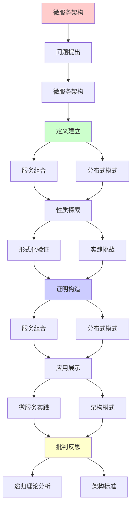
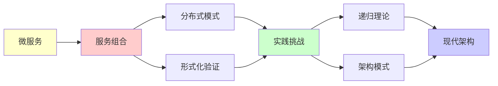

# 微服务架构的形式化分析

> **主题**: 微服务的递归组合与验证
> **创建日期**: 2025-12-02
> **难度**: ⭐⭐⭐⭐
> **前置知识**: 分布式系统、软件架构、形式化方法

---

## 📋 目录

- [微服务架构的形式化分析](#微服务架构的形式化分析)
  - [📋 目录](#-目录)
  - [1. 微服务架构](#1-微服务架构)
    - [1.1 单体vs微服务](#11-单体vs微服务)
    - [1.2 核心特征](#12-核心特征)
  - [2. 服务组合](#2-服务组合)
    - [2.1 同步通信](#21-同步通信)
    - [2.2 异步消息](#22-异步消息)
  - [3. 分布式模式](#3-分布式模式)
    - [3.1 Saga模式](#31-saga模式)
    - [3.2 CQRS/事件溯源](#32-cqrs事件溯源)
  - [4. 形式化验证](#4-形式化验证)
    - [4.1 服务契约](#41-服务契约)
    - [4.2 会话类型](#42-会话类型)
  - [5. 实践挑战](#5-实践挑战)
    - [5.1 分布式追踪](#51-分布式追踪)
    - [5.2 故障处理](#52-故障处理)
  - [6. 递归理论分析](#6-递归理论分析)
  - [7. 主题-子主题论证逻辑关系图](#7-主题-子主题论证逻辑关系图)
    - [7.1 论证依赖关系](#71-论证依赖关系)
    - [7.2 概念依赖关系](#72-概念依赖关系)
  - [8. 参考资源](#8-参考资源)
    - [8.1 经典论文](#81-经典论文)
    - [8.2 教材](#82-教材)
    - [8.3 在线资源](#83-在线资源)

---

## 1. 微服务架构

### 1.1 单体vs微服务

```text
单体应用:
所有功能单一进程
优势: 简单
劣势: 扩展困难 ⚠️

微服务:
功能分解为独立服务
API通信 ✓

演化:
单体 (2000s)
  ↓
SOA (2005)
  ↓
微服务 (2014+) ⭐
  ↓
Serverless (2020+)

递归分解:
✓ 功能递归拆分
✓ 服务递归组合
```

---

### 1.2 核心特征

**微服务原则**:

```text
1. 单一职责:
   每服务一个业务能力 ✓

2. 独立部署:
   服务独立发布 ✓

3. 去中心化:
   无中心协调
   → 各自决策 ✓

4. 技术异构:
   不同语言/数据库 ✓

5. 故障隔离:
   服务失败不级联 ✓

vs CAP:
微服务 → 选AP
最终一致性 ✓
→ 放弃强一致 ⚠️

递归性质:
✓ 服务递归调用
✓ 架构递归分层
```

---

## 2. 服务组合

### 2.1 同步通信

**REST/gRPC**:

```text
REST:
HTTP + JSON
请求-响应模式

优势:
✓ 简单
✓ 广泛支持
⚠️ 延迟高

gRPC:
HTTP/2 + Protobuf
双向流 ✓

优势:
✓ 高性能
✓ 类型安全
✓ 代码生成

同步问题:
级联超时 ⚠️
服务A → B → C
A等待B, B等待C
→ 延迟累积 ⚠️

递归调用:
✓ 服务递归组合
⚠️ 但深度限制 (避免环)
```

---

### 2.2 异步消息

**事件驱动**:

```text
消息队列:
Kafka, RabbitMQ

发布-订阅:
服务A: 发布事件
服务B,C: 订阅处理
→ 解耦 ⭐

优势:
✓ 异步非阻塞
✓ 峰值缓冲
✓ 重试容错
✓ 扩展性强

vs 同步:
同步: 简单, 强耦合 ⚠️
异步: 复杂, 松耦合 ✓
→ 大规模选异步 ⭐

递归:
✓ 事件递归传播
✓ 处理递归触发
```

---

## 3. 分布式模式

### 3.1 Saga模式

**长事务处理**:

```text
订单流程Saga:
1. 创建订单 (Order Service)
2. 扣减库存 (Inventory)
3. 处理支付 (Payment)
4. 发货通知 (Shipping)

编排 vs 编舞:
编排 (Orchestration):
  中心协调器
  → 简单但耦合 ⚠️

编舞 (Choreography):
  事件驱动
  → 复杂但解耦 ✓

补偿:
失败 → 逆序补偿
C4, C3, C2, C1
→ 最终一致 ✓

递归:
✓ 步骤递归执行
✓ 补偿递归回滚
→ 双向递归 ⭐
```

---

### 3.2 CQRS/事件溯源

**命令查询分离**:

```text
CQRS:
Command (写): 改变状态
Query (读): 读取状态
→ 分离优化 ✓

事件溯源 (Event Sourcing):
不存储状态
存储事件序列 ⭐

重构状态:
State = fold(Events)
State_n = apply(State_{n-1}, Event_n)
→ 递归重构 ⭐⭐⭐⭐⭐

优势:
✓ 完整历史
✓ 审计追踪
✓ 时间旅行 (回溯)
✓ 事件重放

挑战:
⚠️ 存储增长
⚠️ 快照需要
⚠️ 模式演化
→ 工程复杂 ⚠️

递归性质:
✓ 状态递归重构
✓ 事件递归应用
✓ 历史递归追溯
→ 递归本质 ⭐
```

---

## 4. 形式化验证

### 4.1 服务契约

**契约驱动设计**:

```text
OpenAPI规范:
定义RESTful API
自动生成:
- 客户端
- 服务端骨架
- 文档
→ 契约即规范 ⭐

Pact (契约测试):
消费者定义期望
提供者验证满足
→ 契约一致性 ✓

形式化:
前置条件: Pre(request)
后置条件: Post(response)
不变量: Inv(state)

验证:
✓ 契约可机械检查
✓ 类型可静态验证
⚠️ 语义难验证
→ 部分形式化 ⚠️

递归:
✓ 契约递归组合
✓ 验证递归传播
```

---

### 4.2 会话类型

**通信协议类型化**:

```text
服务A ↔ 服务B:
Session Type描述协议

例子:
OrderService:
  !CreateOrder;
  ?PaymentResult;
  !ShippingNotice;
  end

PaymentService:
  ?CreateOrder;
  !PaymentResult;
  ?ShippingNotice;
  end

对偶 (Dual):
! ↔ ?
→ 协议匹配 ✓

保证:
✓ 协议遵循
✓ 无死锁
✓ 通信安全
→ 类型级验证 ⭐

递归理论:
✓ Session Types可递归检查
✓ 协议可递归组合
→ 微服务形式化基础 ⭐
```

---

## 5. 实践挑战

### 5.1 分布式追踪

**OpenTelemetry**:

```text
问题:
请求跨多服务
→ 调试困难 ⚠️

解决:
Trace ID传播
Span记录每服务
→ 完整追踪 ✓

实现:
请求 → TraceID
服务A: Span_A
服务B: Span_B (parent=A)
→ 树状Trace ✓

递归追踪:
✓ Span递归嵌套
✓ TraceID递归传播
✓ 调用链递归重构

工具:
Jaeger, Zipkin
→ 可视化调用链 ⭐
```

---

### 5.2 故障处理

**弹性模式**:

```text
断路器 (Circuit Breaker):
错误累积 → 熔断
避免级联失败 ✓

重试:
指数退避
jitter (抖动)
→ 避免雷鸣群 ✓

超时:
每调用设超时
防止阻塞 ✓

限流:
令牌桶/漏桶
保护服务 ✓

Bulkhead:
资源隔离
故障隔离 ✓

递归容错:
✓ 重试递归执行
✓ 熔断递归检测
✓ 隔离递归保护
→ 多层防御 ⭐
```

---

## 6. 递归理论分析

```text
微服务 ∈ RE?

答案: ✓是的

证明:
- 服务调用可递归
- 消息传递可递归
- 事件处理可递归
→ 微服务 ∈ RE ✓

复杂度:
同步调用: O(depth) 延迟
异步消息: O(1) 响应
事件溯源: O(|Events|) 重构
→ 多项式可行 ✓

递归组合:
服务A调用B
B调用C
→ A→B→C链 ✓

递归限制:
⚠️ 避免循环调用
⚠️ 深度限制 (<10层)
→ 防止无限递归 ⚠️

形式化:
✓ 契约可递归验证
✓ Session Types可递归检查
⚠️ 全局性质难验证 (组合爆炸)
→ 局部验证为主 ✓

理论vs实践:
理论: 服务可任意组合
实践:
- 循环依赖 ⚠️
- 分布式事务 ⚠️
- 数据一致性 ⚠️
→ 工程复杂度高 ⚠️⚠️

递归本质:
✓ 微服务 = 递归分解
✓ API = 递归接口
✓ 事件 = 递归传播
✓ Saga = 递归编排
→ 递归架构 ⭐⭐⭐⭐⭐

vs 单体:
单体: 一个递归系统
微服务: 递归的递归系统 ⭐
→ 元递归 ⭐

2024最佳实践:
✓ Kubernetes编排
✓ Service Mesh (Istio)
✓ 事件驱动架构
✓ CQRS/事件溯源
→ 模式成熟 ⭐

未来:
Serverless微服务
FaaS组合
→ 更细粒度递归分解 ⭐

递归范式:
✓ 微服务 = 分布式递归
✓ 架构 = 递归自相似
✓ 演化 = 递归重构
→ 软件工程的递归化 ⭐⭐⭐⭐⭐
```

---

## 7. 主题-子主题论证逻辑关系图

### 7.1 论证依赖关系



### 7.2 概念依赖关系



**论证逻辑链条**：

1. **问题提出** (1节)：
   - 微服务架构

2. **定义建立** (1节)：
   - 微服务架构概念

3. **性质探索** (2-5节)：
   - 服务组合（2节）
   - 分布式模式（3节）
   - 形式化验证（4节）
   - 实践挑战（5节）

4. **证明构造** (贯穿全文)：
   - 服务组合和分布式模式

5. **应用展示** (贯穿全文)：
   - 微服务实践和架构模式

6. **批判反思** (6节)：
   - 递归理论分析

---

## 8. 参考资源

### 8.1 经典论文

1. **Newman, S.** (2021). _Building Microservices: Designing Fine-Grained Systems_ (2nd ed.)
   - O'Reilly Media. ISBN 978-1492034025
   - 微服务权威指南 ⭐⭐⭐⭐⭐

2. **Fowler, M.** (2014). "Microservices"
   - https://martinfowler.com/articles/microservices.html
   - 微服务概念普及

3. **Richardson, C.** (2018). _Microservices Patterns: With Examples in Java_
   - Manning Publications. ISBN 978-1617294549
   - 微服务模式全集

### 8.2 教材

1. **Newman, S.** (2021)
   - _Building Microservices: Designing Fine-Grained Systems_ (2nd ed.)
   - O'Reilly Media. ISBN 978-1492034025
   - 微服务构建指南

2. **Indrasiri, K., & Siriwardena, P.** (2021)
   - _Microservices Security in Action_
   - Manning Publications. ISBN 978-1617295959
   - 微服务安全实践

### 8.3 在线资源

1. **Microservices.io**
   - https://microservices.io/
   - 微服务模式与最佳实践

2. **Martin Fowler - Microservices**
   - https://martinfowler.com/articles/microservices.html
   - 微服务概念

3. **Wikipedia - Microservices**
   - https://en.wikipedia.org/wiki/Microservices
   - 微服务基本概念

---

**最后更新**: 2025-12-04
**Tier**: 2 (工程)
**重要性**: 现代架构标准 ⭐⭐⭐⭐⭐
**递归性**: 核心特征 ⭐⭐⭐⭐⭐
**状态**: ✅ 已添加主题-子主题论证逻辑关系图和参考资源章节
