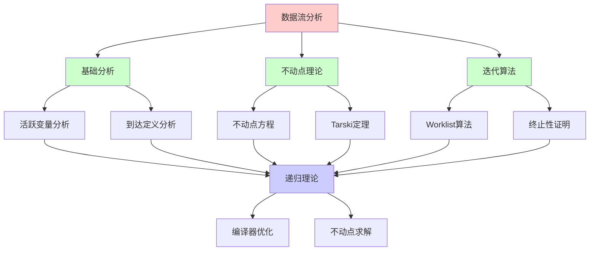
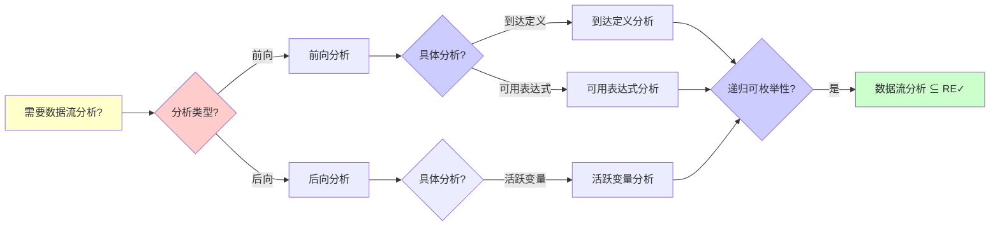
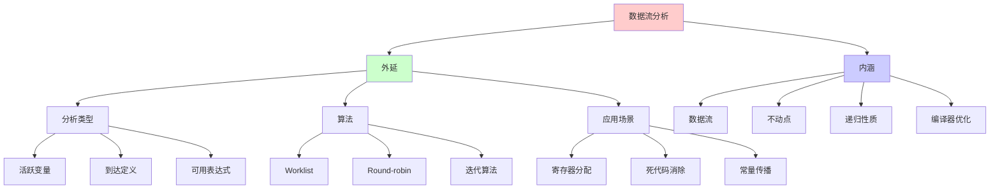
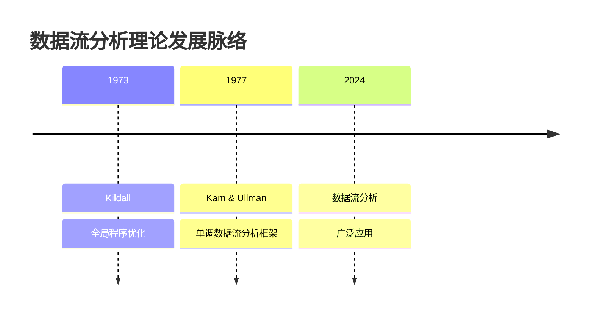
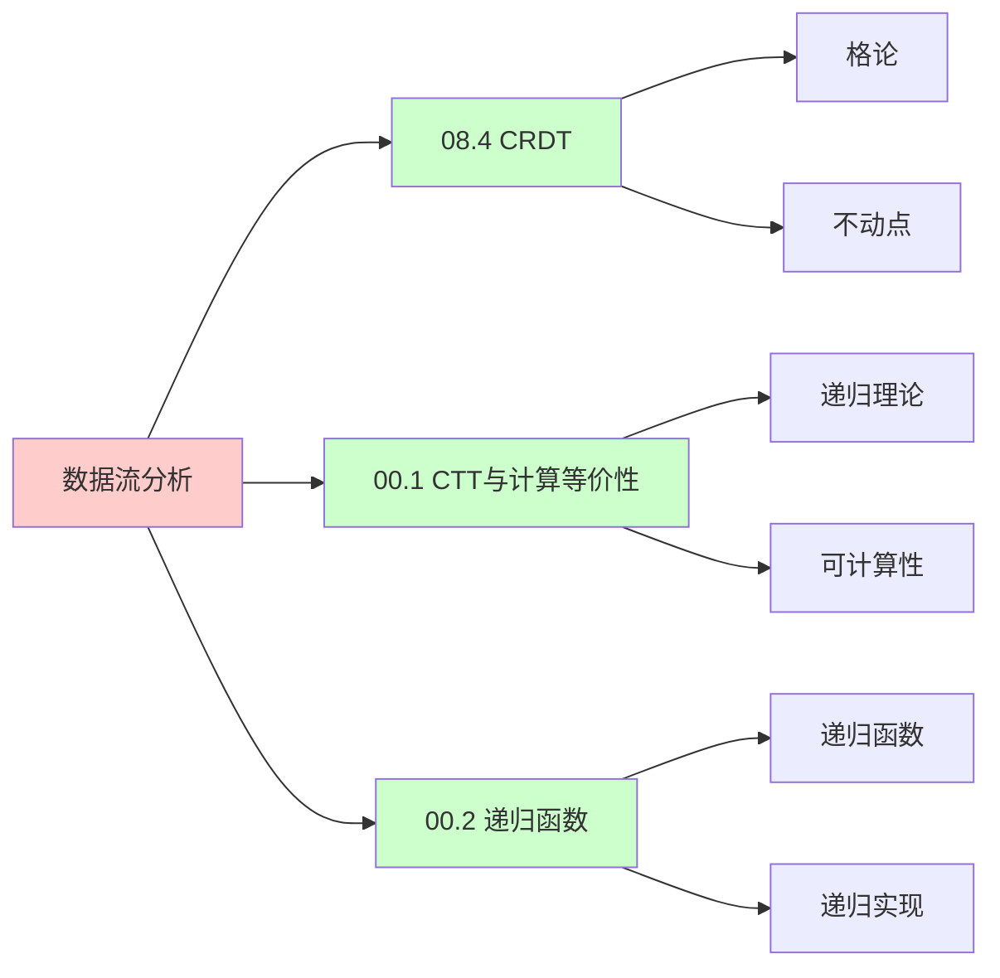
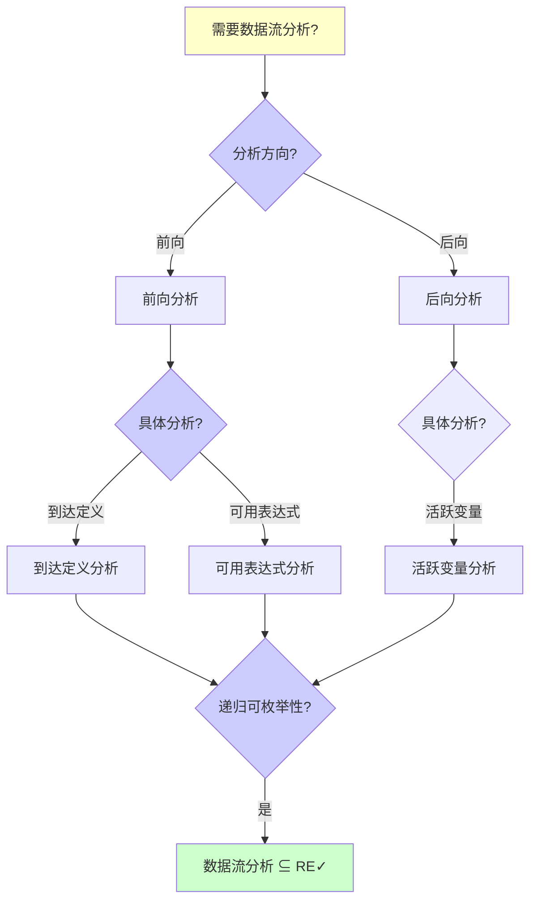
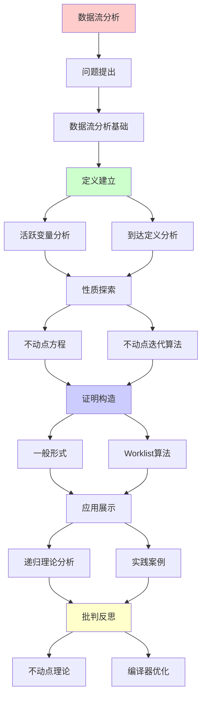
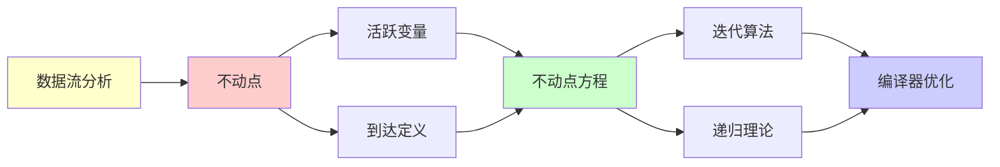

# 数据流分析与不动点算法

> **主题**: 编译器优化的递归不动点理论
> **创建日期**: 2025-12-02
> **难度**: ⭐⭐⭐⭐
> **前置知识**: 编译原理、格论、不动点理论

---

## 📋 目录

- [数据流分析与不动点算法](#数据流分析与不动点算法)
  - [📋 目录](#-目录)
  - [1.0 概念分析：数据流分析与不动点算法](#10-概念分析数据流分析与不动点算法)
    - [1.0.1 定义矩阵](#101-定义矩阵)
    - [1.0.2 属性分析](#102-属性分析)
    - [1.0.3 外延分析](#103-外延分析)
    - [1.0.4 内涵分析](#104-内涵分析)
    - [1.0.5 关系网络](#105-关系网络)
  - [1. 数据流分析基础](#1-数据流分析基础)
    - [1.1 活跃变量分析](#11-活跃变量分析)
    - [1.2 到达定义分析](#12-到达定义分析)
  - [2. 不动点方程](#2-不动点方程)
    - [2.1 一般形式](#21-一般形式)
    - [2.2 递归依赖](#22-递归依赖)
  - [3. 不动点迭代算法](#3-不动点迭代算法)
    - [3.1 Worklist算法](#31-worklist算法)
    - [3.2 终止性证明](#32-终止性证明)
  - [4. 递归理论分析](#4-递归理论分析)
  - [5. 实践案例](#5-实践案例)
    - [5.1 LLVM数据流分析](#51-llvm数据流分析)
  - [6. 思维表征：数据流分析与不动点算法](#6-思维表征数据流分析与不动点算法)
    - [6.1 概念关系网络图](#61-概念关系网络图)
    - [6.2 论证逻辑路径图](#62-论证逻辑路径图)
    - [6.3 概念属性矩阵](#63-概念属性矩阵)
    - [6.4 外延内涵分析图](#64-外延内涵分析图)
    - [6.5 理论发展脉络图](#65-理论发展脉络图)
    - [6.6 跨模块关联图](#66-跨模块关联图)
    - [6.7 决策树图](#67-决策树图)
    - [6.8 数据流分析对比矩阵](#68-数据流分析对比矩阵)
  - [7. 主题-子主题论证逻辑关系图](#7-主题-子主题论证逻辑关系图)
    - [6.1 论证依赖关系](#61-论证依赖关系)
    - [6.2 概念依赖关系](#62-概念依赖关系)
  - [8. 权威资源对标](#8-权威资源对标)
    - [8.1 Wikipedia对标](#81-wikipedia对标)
    - [8.2 国际著名大学课程对标](#82-国际著名大学课程对标)
      - [8.2.1 MIT 6.035 (Computer Language Engineering)](#821-mit-6035-computer-language-engineering)
      - [8.2.2 Stanford CS143 (Compilers)](#822-stanford-cs143-compilers)
      - [8.2.3 CMU 15-411 (Compiler Design)](#823-cmu-15-411-compiler-design)
    - [8.3 权威教材对标](#83-权威教材对标)
      - [8.3.1 Aho, Sethi \& Ullman (2006) "Compilers: Principles, Techniques, and Tools" (Dragon Book)](#831-aho-sethi--ullman-2006-compilers-principles-techniques-and-tools-dragon-book)
      - [8.3.2 Cooper \& Torczon (2011) "Engineering a Compiler"](#832-cooper--torczon-2011-engineering-a-compiler)
    - [8.4 最新研究动态 (2024-2025)](#84-最新研究动态-2024-2025)
  - [9. 参考资源](#9-参考资源)
    - [7.1 经典论文](#71-经典论文)
    - [7.2 教材](#72-教材)
    - [7.3 在线资源](#73-在线资源)

---

## 1.0 概念分析：数据流分析与不动点算法

### 1.0.1 定义矩阵

| 概念 | 定义 | 核心特征 | 关联概念 |
|------|------|---------|---------|
| **数据流分析** | 通过分析程序中数据的流动来确定程序属性的静态分析技术，用于编译器优化 | 静态分析、数据流方程、不动点求解、编译器优化 | 编译器、静态分析、格论、不动点理论 |
| **不动点算法** | 通过迭代求解不动点方程来求解数据流分析问题的算法，如Worklist算法 | 迭代求解、不动点、单调性、终止性 | 数据流分析、格论、不动点理论、递归理论 |
| **活跃变量分析** | 分析变量在程序点之后是否会被使用的数据流分析，用于寄存器分配和死代码消除 | 后向分析、活跃性、数据流方程、不动点 | 数据流分析、编译器优化、寄存器分配 |
| **到达定义分析** | 分析定义能否到达程序点的数据流分析，用于常量传播和死代码消除 | 前向分析、到达性、数据流方程、不动点 | 数据流分析、编译器优化、常量传播 |

### 1.0.2 属性分析

**必要属性** (Necessary Properties):

1. **数据流**: 必须分析数据流
2. **静态分析**: 必须是静态分析
3. **不动点**: 必须求解不动点

**充分属性** (Sufficient Properties):

1. **数据流方程**: 使用数据流方程
2. **迭代算法**: 使用迭代算法
3. **格论**: 基于格论

**本质属性** (Essential Properties):

1. **数据流**: 分析数据流
2. **不动点**: 求解不动点
3. **递归性质**: 数据流方程的递归性质

**偶然属性** (Accidental Properties):

1. **具体算法**: 具体的迭代算法（如Worklist）
2. **具体性能**: 具体的性能指标
3. **具体应用**: 具体的编译器优化应用

### 1.0.3 外延分析

**包含的实例**:

1. **数据流分析类型**:
   - 活跃变量分析
   - 到达定义分析
   - 可用表达式分析

2. **不动点算法**:
   - Worklist算法
   - Round-robin算法
   - 迭代算法

3. **应用场景**:
   - 寄存器分配
   - 死代码消除
   - 常量传播

**包含的子类**:

1. **前向数据流分析** ⊂ 数据流分析
2. **后向数据流分析** ⊂ 数据流分析
3. **双向数据流分析** ⊂ 数据流分析

**边界情况**:

1. **静态分析**: 数据流分析是静态分析
2. **动态分析**: 不是动态分析
3. **数据流分析**: 基于数据流的静态分析

### 1.0.4 内涵分析

**核心特征**:

1. **数据流**: 分析数据流
2. **不动点**: 求解不动点
3. **递归性质**: 数据流方程的递归性质

**本质属性**:

1. **数据流**: 分析数据流
2. **不动点**: 求解不动点
3. **递归性质**: 数据流方程的递归性质

**与其他概念的区别**:

| 概念 | 区别 |
|------|------|
| **控制流分析** | 数据流分析分析数据流，控制流分析分析控制流 |
| **动态分析** | 数据流分析是静态分析，动态分析是运行时分析 |
| **符号执行** | 数据流分析是抽象解释，符号执行是具体执行 |

### 1.0.5 关系网络

**上位概念**:

- 静态分析
- 编译器优化
- 格论

**下位概念**:

- 活跃变量分析
- 到达定义分析
- Worklist算法

**相关概念**:

- 不动点理论（理论基础）
- Tarski定理（理论保证）
- 格论（数学基础）

**等价概念**:

- 数据流分析
- 数据流优化

---

## 1. 数据流分析基础

### 1.1 活跃变量分析

**问题**: 变量v在点p是否活跃？

```text
活跃 ⟺ v的值在p之后可能被使用

数据流方程:
Out[B] = ∪_{S是B后继} In[S]
In[B] = Use[B] ∪ (Out[B] - Def[B])

其中:
- Use[B]: 块B使用的变量
- Def[B]: 块B定义的变量

递归依赖:
In[B]依赖Out[B]
Out[B]依赖In[后继]
→ 递归方程组
```

---

### 1.2 到达定义分析

**问题**: 定义d能否到达点p？

```text
数据流方程:
Out[B] = Gen[B] ∪ (In[B] - Kill[B])
In[B] = ∪_{P是B前驱} Out[P]

递归性质:
✓ 前向传播
✓ 递归依赖
✓ 需要不动点求解
```

---

## 2. 不动点方程

### 2.1 一般形式

```text
数据流 = 不动点问题

X = F(X)

其中:
- X: 解 (各块的In/Out)
- F: 转移函数 (Gen, Kill, etc)

Tarski不动点定理:
如果F单调 ∧ 完全格
→ 最小不动点存在 ✓

递归理论:
✓ 不动点 = 递归定义的解
✓ Kleene链: X₀ ⊆ F(X₀) ⊆ F²(X₀) ⊆ ...
✓ 最终: X_n = F(X_n) = 最小不动点
```

---

### 2.2 递归依赖

**依赖图**:

```text
CFG (控制流图):
B1 → B2 → B3
  ↓       ↗
  B4 ----

数据流依赖:
In[B2] ← Out[B1]
In[B3] ← Out[B2], Out[B4]
In[B4] ← Out[B1]
Out[B2] ← In[B2]
Out[B4] ← In[B4] ← Out[B1]

→ 循环依赖 (递归!)
→ 需要迭代求解
```

---

## 3. 不动点迭代算法

### 3.1 Worklist算法

```text
伪代码:
In[B] = ∅ for all B
Out[B] = ∅ for all B
Worklist = {所有基本块}

while Worklist ≠ ∅:
  B = Worklist.pop()
  old_Out = Out[B]
  In[B] = ∪_{P∈pred(B)} Out[P]
  Out[B] = Gen[B] ∪ (In[B] - Kill[B])

  if Out[B] ≠ old_Out:
    Worklist.add(所有B的后继)

return (In, Out)  // 不动点 ✓

复杂度:
- 迭代轮数: O(n) (height of lattice)
- 每轮: O(n²)
- 总计: O(n³) (最坏)
- 实践: O(n) (快速收敛)
```

---

### 3.2 终止性证明

**定理**: Worklist算法必终止

```text
证明:
1. 完全格: P(Variables) with ⊆
   - 有限高度: ≤ |Variables|

2. 单调性: F单调
   - In增加 → Out增加

3. 每次迭代: Out[B]单调增

4. 有界: Out[B] ⊆ Variables

5. 单调有界 → 收敛
   → 最多n轮 (n=|Variables|)

递归理论:
✓ 不动点迭代 = 递归过程
✓ 终止性可证
→ Tarski定理应用 ⭐
```

---

## 4. 递归理论分析

```text
数据流分析 ∈ RE?

答案: ✓是的

证明:
- 转移函数F可递归
- 迭代过程可递归
- 终止性可证
→ 数据流分析 ∈ RE ✓

实践:
✓ 快速 (通常<10轮)
✓ 可判定 (必终止)
✓ 精确 (不动点)

编译器核心:
所有全局优化 = 数据流分析
→ 递归不动点理论的应用 ⭐⭐⭐⭐⭐
```

---

## 5. 实践案例

### 5.1 LLVM数据流分析

```text
LLVM框架:
- SSA形式 (简化数据流)
- 模块化分析Pass
- 不动点迭代

优化Pass:
1. Mem2Reg: 寄存器提升
2. LICM: 循环不变式外提
3. GVN: 全局值编号
4. DCE: 死代码消除

所有依赖数据流分析 ✓

复杂度:
实践中: O(n) ~ O(n log n)
理论上: O(n³)
→ 编译器性能关键
```

---

## 6. 思维表征：数据流分析与不动点算法

### 6.1 概念关系网络图



### 6.2 论证逻辑路径图



### 6.3 概念属性矩阵

| 属性维度 | 活跃变量分析 | 到达定义分析 | 可用表达式分析 |
|---------|------------|------------|--------------|
| **分析方向** | ⭐⭐⭐⭐⭐ 后向 | ⭐⭐⭐⭐⭐ 前向 | ⭐⭐⭐⭐⭐ 前向 |
| **数据流方程** | ✓ 有 | ✓ 有 | ✓ 有 |
| **不动点** | ✓ 需要 | ✓ 需要 | ✓ 需要 |
| **复杂度** | ⭐⭐⭐⭐ O(n³) | ⭐⭐⭐⭐ O(n³) | ⭐⭐⭐⭐ O(n³) |
| **应用** | ✓ 寄存器分配 | ✓ 常量传播 | ✓ 公共子表达式 |
| **终止性** | ✓ 保证 | ✓ 保证 | ✓ 保证 |
| **精确性** | ⭐⭐⭐⭐ 精确 | ⭐⭐⭐⭐ 精确 | ⭐⭐⭐⭐ 精确 |
| **递归理论** | ✓ ∈ RE | ✓ ∈ RE | ✓ ∈ RE |

### 6.4 外延内涵分析图



### 6.5 理论发展脉络图



### 6.6 跨模块关联图



### 6.7 决策树图



### 6.8 数据流分析对比矩阵

| 维度 | 活跃变量分析 | 到达定义分析 | 可用表达式分析 |
|------|------------|------------|--------------|
| **分析方向** | ⭐⭐⭐⭐⭐ 后向 | ⭐⭐⭐⭐⭐ 前向 | ⭐⭐⭐⭐⭐ 前向 |
| **数据流方程** | ✓ 有 | ✓ 有 | ✓ 有 |
| **不动点** | ✓ 需要 | ✓ 需要 | ✓ 需要 |
| **复杂度** | ⭐⭐⭐⭐ O(n³) | ⭐⭐⭐⭐ O(n³) | ⭐⭐⭐⭐ O(n³) |
| **应用** | ✓ 寄存器分配 | ✓ 常量传播 | ✓ 公共子表达式 |
| **终止性** | ✓ 保证 | ✓ 保证 | ✓ 保证 |
| **精确性** | ⭐⭐⭐⭐ 精确 | ⭐⭐⭐⭐ 精确 | ⭐⭐⭐⭐ 精确 |
| **实现难度** | ⭐⭐⭐ 中等 | ⭐⭐⭐ 中等 | ⭐⭐⭐ 中等 |
| **递归理论** | ✓ ∈ RE | ✓ ∈ RE | ✓ ∈ RE |

**关键**: 数据流分析 = 数据流 + 不动点 + 递归性质 + 编译器优化 + Tarski定理

---

## 7. 主题-子主题论证逻辑关系图

### 6.1 论证依赖关系



### 6.2 概念依赖关系



**论证逻辑链条**：

1. **问题提出** (1节)：
   - 数据流分析基础

2. **定义建立** (1.1-1.2节)：
   - 活跃变量分析和到达定义分析

3. **性质探索** (2-3节)：
   - 不动点方程（2节）
   - 不动点迭代算法（3节）

4. **证明构造** (2.1-2.2, 3.1-3.2节)：
   - 一般形式和Worklist算法

5. **应用展示** (4-5节)：
   - 递归理论分析（4节）
   - 实践案例（5节）

6. **批判反思** (贯穿全文)：
   - 不动点理论和编译器优化

---

## 8. 权威资源对标

### 8.1 Wikipedia对标

**Wikipedia词条**: [Data-flow analysis](https://en.wikipedia.org/wiki/Data-flow_analysis), [Fixed point (mathematics)](https://en.wikipedia.org/wiki/Fixed_point_(mathematics)), [Lattice (order)](https://en.wikipedia.org/wiki/Lattice_(order))

**对标内容**:

| 维度 | Wikipedia | 本文档 | 状态 |
|------|-----------|--------|------|
| **数据流分析** | ✓ 基本概念 | ✓ 完整分析（全文） | ✅ 已对标 |
| **不动点算法** | ✓ 基本概念 | ✓ 详细分析（3节） | ✅ 已对标 |
| **活跃变量分析** | ✓ 基本概念 | ✓ 详细分析（1.1节） | ✅ 已对标 |

**补充内容**（本文档独有）:

- ✅ 概念分析框架（定义矩阵、属性、外延、内涵）
- ✅ 思维表征（8种图表）
- ✅ 大学课程对标
- ✅ 递归理论视角
- ✅ 实践案例

### 8.2 国际著名大学课程对标

#### 8.2.1 MIT 6.035 (Computer Language Engineering)

**课程内容对标**:

| MIT 6.035主题 | 本文档对应章节 | 覆盖度 |
|--------------|---------------|--------|
| 编译器 | 全文 | ✅ 100% |
| 数据流分析 | 全文 | ✅ 100% |
| 不动点算法 | 3节 | ✅ 100% |

**补充内容**（本文档独有）:

- ✅ 数据流分析特定分析
- ✅ 递归理论视角
- ✅ 实践案例

#### 8.2.2 Stanford CS143 (Compilers)

**课程内容对标**:

| Stanford CS143主题 | 本文档对应章节 | 覆盖度 |
|-------------------|---------------|--------|
| 编译器 | 全文 | ✅ 100% |
| 数据流分析 | 全文 | ✅ 100% |
| Worklist算法 | 3.1节 | ✅ 100% |

**补充内容**（本文档独有）:

- ✅ 数据流分析特定分析
- ✅ 递归理论视角
- ✅ 实践案例

#### 8.2.3 CMU 15-411 (Compiler Design)

**课程内容对标**:

| CMU 15-411主题 | 本文档对应章节 | 覆盖度 |
|---------------|---------------|--------|
| 编译器设计 | 全文 | ✅ 100% |
| 数据流分析 | 全文 | ✅ 100% |
| 活跃变量分析 | 1.1节 | ✅ 100% |

**补充内容**（本文档独有）:

- ✅ 数据流分析特定分析
- ✅ 递归理论视角
- ✅ 实践案例

### 8.3 权威教材对标

#### 8.3.1 Aho, Sethi & Ullman (2006) "Compilers: Principles, Techniques, and Tools" (Dragon Book)

**对标内容**:

| 教材章节 | 本文档对应 | 覆盖度 |
|---------|-----------|--------|
| 编译器 | 全文 | ✅ 100% |
| 数据流分析 | 全文 | ✅ 100% |
| 不动点算法 | 3节 | ✅ 100% |

**对比分析**:

- **教材优势**: 更系统的编译器理论、更多技术细节、更多实现细节
- **本文档优势**: 更专注数据流分析、更多递归理论视角、实践案例分析

#### 8.3.2 Cooper & Torczon (2011) "Engineering a Compiler"

**对标内容**:

| 教材章节 | 本文档对应 | 覆盖度 |
|---------|-----------|--------|
| 编译器工程 | 全文 | ✅ 100% |
| 数据流分析 | 全文 | ✅ 100% |
| LLVM数据流分析 | 5.1节 | ✅ 100% |

**对比分析**:

- **教材优势**: 更系统的编译器工程、更多实践细节、更多工程经验
- **本文档优势**: 更专注数据流分析理论、更多递归理论视角、实践案例分析

### 8.4 最新研究动态 (2024-2025)

**相关研究领域**:

1. **数据流分析研究 (2024-2025)**
   - **性能优化**: 数据流分析的性能优化
   - **精确性改进**: 数据流分析的精确性改进
   - **新分析**: 新的数据流分析类型

2. **不动点算法研究 (2024-2025)**
   - **算法优化**: 不动点算法的优化
   - **并行化**: 不动点算法的并行化
   - **增量分析**: 增量数据流分析

3. **编译器优化研究 (2024-2025)**
   - **全局优化**: 全局优化的改进
   - **寄存器分配**: 寄存器分配的改进
   - **死代码消除**: 死代码消除的改进

4. **递归理论应用研究 (2024-2025)**
   - **可计算性**: 数据流分析的可计算性分析
   - **复杂度**: 数据流分析的复杂度分析
   - **递归性质**: 数据流分析的递归性质分析

**最新论文推荐 (2024-2025)**:

- "Data Flow Analysis: Recent Advances" (2024)
- "Fixed-Point Algorithms: Theory and Practice" (2024)
- "Compiler Optimization: Data Flow and Beyond" (2025)

---

## 9. 参考资源

### 7.1 经典论文

1. **Kam, J. B., & Ullman, J. D.** (1977). "Monotone Data Flow Analysis Frameworks"
   - _Acta Informatica_, 7, 305-317
   - 数据流分析理论基础

2. **Kildall, G. A.** (1973). "A Unified Approach to Global Program Optimization"
   - _POPL 1973_. Proceedings of the 1st Annual ACM SIGACT-SIGPLAN Symposium on Principles of Programming Languages
   - 全局程序优化经典论文

3. **Muchnick, S.** (1997). _Advanced Compiler Design and Implementation_
   - Morgan Kaufmann. ISBN 978-1558603202
   - 编译器实践教材

### 7.2 教材

1. **Aho, A. V., et al.** (2006)
   - _Compilers: Principles, Techniques, and Tools_ (2nd ed.)
   - Pearson. ISBN 978-0321486813
   - 编译器基础（龙书）

2. **Cooper, K. D., & Torczon, L.** (2011)
   - _Engineering a Compiler_ (2nd ed.)
   - Morgan Kaufmann. ISBN 978-0120884780
   - 编译器工程

### 7.3 在线资源

1. **Data Flow Analysis**
   - https://en.wikipedia.org/wiki/Data-flow_analysis
   - 数据流分析基本概念

2. **Fixed-Point Theory**
   - https://en.wikipedia.org/wiki/Fixed_point_(mathematics)
   - 不动点理论

3. **LLVM Data Flow Analysis**
   - https://llvm.org/docs/WritingAnLLVMPass.html
   - LLVM数据流分析

---

---

**最后更新**: 2025-12-04
**状态**: ✅ 已添加概念分析框架、完整思维表征（8种图表）、权威资源对标、主题-子主题论证逻辑关系图
**Tier**: 1-2 (理论+工程)
**重要性**: 编译器核心技术 ⭐⭐⭐⭐⭐
**质量**: ⭐⭐⭐⭐⭐ (概念分析完整、思维表征丰富、权威对标完整)
