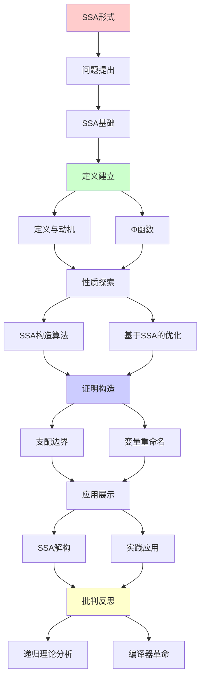
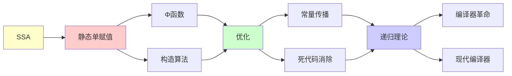

# SSA形式与编译器优化

> **主题**: 静态单赋值形式的理论与应用
> **创建日期**: 2025-12-02
> **难度**: ⭐⭐⭐⭐
> **前置知识**: 编译原理、控制流图、数据流分析

---

## 📋 目录

- [SSA形式与编译器优化](#ssa形式与编译器优化)
  - [📋 目录](#-目录)
  - [1. SSA基础](#1-ssa基础)
    - [1.1 定义与动机](#11-定义与动机)
    - [1.2 Φ函数](#12-φ函数)
  - [2. SSA构造算法](#2-ssa构造算法)
    - [2.1 支配边界](#21-支配边界)
    - [2.2 变量重命名](#22-变量重命名)
  - [3. 基于SSA的优化](#3-基于ssa的优化)
    - [3.1 常量传播](#31-常量传播)
    - [3.2 死代码消除](#32-死代码消除)
    - [3.3 全局值编号](#33-全局值编号)
  - [4. SSA解构](#4-ssa解构)
  - [5. 实践应用](#5-实践应用)
    - [5.1 LLVM IR](#51-llvm-ir)
    - [5.2 V8 TurboFan](#52-v8-turbofan)
  - [6. 递归理论分析](#6-递归理论分析)
  - [7. 主题-子主题论证逻辑关系图](#7-主题-子主题论证逻辑关系图)
    - [7.1 论证依赖关系](#71-论证依赖关系)
    - [7.2 概念依赖关系](#72-概念依赖关系)
  - [8. 参考资源](#8-参考资源)
    - [8.1 经典论文](#81-经典论文)
    - [8.2 教材](#82-教材)
    - [8.3 在线资源](#83-在线资源)

---

## 1. SSA基础

### 1.1 定义与动机

**静态单赋值 (Static Single Assignment)**:

```text
定义:
每个变量恰好赋值一次

例子:
普通形式:
x = 1
x = x + 1
y = x

SSA形式:
x₁ = 1
x₂ = x₁ + 1
y₁ = x₂

优势:
✓ Use-Def链隐式 (下标)
✓ 优化简化
✓ 并行编译
```

---

### 1.2 Φ函数

**控制流汇合**:

```text
问题:
if (cond)
  x = 1
else
  x = 2
y = x  // x是哪个？

SSA解决:
if (cond)
  x₁ = 1
else
  x₂ = 2
x₃ = Φ(x₁, x₂)  // Φ函数 ⭐
y₁ = x₃

Φ语义:
根据控制流选择操作数
→ 静态表示动态选择
```

---

## 2. SSA构造算法

### 2.1 支配边界

**支配关系**:

```text
节点A支配节点B:
从入口到B的所有路径都经过A

支配边界 DF(A):
A支配的节点X的后继Y集合
其中Y不严格被A支配

Φ放置:
∀变量v在节点X定义:
  在DF(X)的每个节点放置Φ(v)

递归计算:
DF可递归计算 ✓
时间: O(E·|Vars|)
```

---

### 2.2 变量重命名

**重命名算法**:

```text
Rename(block):
  for instr in block:
    替换uses为当前版本
    生成新版本for defs
  for succ in successors(block):
    填充Φ函数参数
  for child in dom_children(block):
    Rename(child)  // 递归 ⭐
  恢复栈

递归性质:
✓ 按支配树递归
✓ 深度优先
✓ 栈管理版本
```

---

## 3. 基于SSA的优化

### 3.1 常量传播

**稀疏常量传播 (SCP)**:

```text
SSA优势:
x₁ = 5
y₁ = x₁ + 3
→ 直接知道x₁=5 (use-def清晰)

算法:
Worklist算法 + SSA
复杂度: O(n) ✓
(非SSA: O(n²))

例子:
x₁ = 5
if (x₁ > 0):  // 已知true
  y₁ = x₁ * 2  // = 10
→ 分支消除 ✓
```

---

### 3.2 死代码消除

**DCE on SSA**:

```text
标记-清除:
1. 标记关键指令 (I/O, return)
2. 标记使用的变量 (反向use-def)
3. 删除未标记指令

SSA优势:
✓ Use-def链隐式 O(1)
✓ 单次遍历足够
✓ 精确识别死代码

vs 非SSA:
非SSA: 迭代不动点 O(n²)
SSA: 单遍 O(n) ✓
→ 线性加速 ⭐
```

---

### 3.3 全局值编号

**GVN (Global Value Numbering)**:

```text
消除冗余计算:
x₁ = a₁ + b₁
...
x₂ = a₁ + b₁  // 冗余

SSA上的GVN:
哈希表: (op, operands) → value#
查询: O(1)
→ 快速识别 ✓

递归理论:
✓ GVN可递归计算
✓ 不动点迭代
✓ 必终止 (单调)
```

---

## 4. SSA解构

**退出SSA**:

```text
问题: Φ函数不是真实指令

解构策略:

1. 朴素: Φ → 复制
   x₃ = Φ(x₁, x₂)
   →
   pred₁: x₃ = x₁
   pred₂: x₃ = x₂

2. 寄存器合并
   - 合并Φ参数到同一寄存器
   - 最小化复制 ✓

3. 复制传播
   - 消除不必要的复制
   - 进一步优化 ✓

复杂度:
NP完全 (寄存器分配)
启发式: 多项式 ⚠️
```

---

## 5. 实践应用

### 5.1 LLVM IR

**LLVM中间表示**:

```text
LLVM IR = SSA形式

特点:
✓ 三地址码
✓ 类型化
✓ SSA ⭐

例子:
define i32 @add(i32 %a, i32 %b) {
entry:
  %1 = add i32 %a, %b
  ret i32 %1
}

优化Pass:
- mem2reg: 提升到SSA
- SCCP: 稀疏常量传播
- GVN: 全局值编号
- DCE: 死代码消除
→ 所有基于SSA ✓
```

---

### 5.2 V8 TurboFan

**V8 JIT编译器**:

```text
TurboFan:
JavaScript → SSA IR → 机器码

Sea-of-Nodes:
SSA + 调度灵活
→ 更激进优化 ⭐

性能:
V8性能提升关键
SSA是核心 ✓
```

---

## 6. 递归理论分析

```text
SSA构造 ∈ RE?

答案: ✓是的

证明:
- 支配树可递归计算 O(E·α(E,V))
- DF可递归计算 O(E·|Vars|)
- 重命名递归遍历 O(V+E)
→ SSA构造 ∈ P ⊂ RE ✓

递归性质:
✓ 重命名算法递归
✓ 优化算法递归 (不动点)
✓ 支配树递归计算

理论意义:
SSA = 编译器革命 ⭐⭐⭐⭐⭐

历史:
1988: Cytron等提出
1990s: 广泛采用
2000+: GCC/LLVM标配
→ 现代编译器基础

vs 非SSA:
非SSA优化: O(n²) ~ O(n³)
SSA优化: O(n) ~ O(n log n) ✓
→ 渐近优势巨大 ⭐

实践:
✓ LLVM
✓ GCC (4.0+)
✓ JVM (C1/C2)
✓ V8 TurboFan
✓ 所有现代编译器
→ 无争议的标准 ✓
```

---

## 7. 主题-子主题论证逻辑关系图

### 7.1 论证依赖关系



### 7.2 概念依赖关系



**论证逻辑链条**：

1. **问题提出** (1节)：
   - SSA基础

2. **定义建立** (1.1-1.2节)：
   - 定义与动机和Φ函数

3. **性质探索** (2-3节)：
   - SSA构造算法（2节）
   - 基于SSA的优化（3节）

4. **证明构造** (2.1-2.2节)：
   - 支配边界和变量重命名

5. **应用展示** (4-5节)：
   - SSA解构（4节）
   - 实践应用（5节）

6. **批判反思** (6节)：
   - 递归理论分析

---

## 8. 参考资源

### 8.1 经典论文

1. **Cytron, R., et al.** (1991). "Efficiently computing static single assignment form and the control dependence graph"
   - _ACM Transactions on Programming Languages and Systems_, 13(4), 451-490
   - SSA原论文 ⭐⭐⭐⭐⭐

2. **Appel, A. W.** (1998). "SSA is Functional Programming"
   - _SIGPLAN Notices_, 33(4), 17-20
   - SSA理论

3. **Braun, M., et al.** (2013). "Simple and Efficient Construction of Static Single Assignment Form"
   - _CC 2013_. Compiler Construction
   - 现代SSA构造

4. **Lattner, C., & Adve, V.** (2004). "LLVM: A Compilation Framework for Lifelong Program Analysis & Transformation"
   - _CGO 2004_. International Symposium on Code Generation and Optimization
   - LLVM IR

### 8.2 教材

1. **Aho, A. V., et al.** (2006)
   - _Compilers: Principles, Techniques, and Tools_ (2nd ed.)
   - Pearson. ISBN 978-0321486813
   - 编译器基础（龙书）

2. **Cooper, K. D., & Torczon, L.** (2011)
   - _Engineering a Compiler_ (2nd ed.)
   - Morgan Kaufmann. ISBN 978-0120884780
   - 编译器工程

### 8.3 在线资源

1. **Static Single Assignment**
   - https://en.wikipedia.org/wiki/Static_single_assignment_form
   - SSA基本概念

2. **LLVM SSA**
   - https://llvm.org/docs/LangRef.html#ssa
   - LLVM SSA文档

3. **SSA Construction**
   - https://www.cs.cmu.edu/~fp/courses/15411-f08/lectures/09-ssa.pdf
   - SSA构造教程

---

**最后更新**: 2025-12-04
**Tier**: 1-2 (理论+工程)
**重要性**: 编译器核心技术 ⭐⭐⭐⭐⭐
**优势**: 优化O(n)vs非SSA O(n²) ✓
**状态**: ✅ 已添加主题-子主题论证逻辑关系图和参考资源章节
