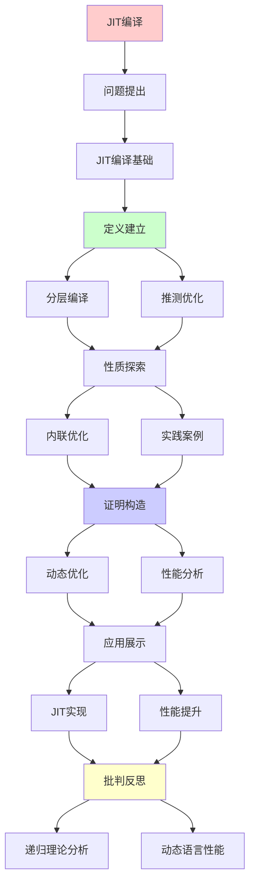
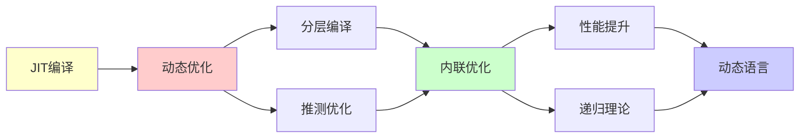

# JIT编译与动态优化

> **主题**: 即时编译的递归优化机制
> **创建日期**: 2025-12-02
> **难度**: ⭐⭐⭐⭐
> **前置知识**: 编译原理、虚拟机、运行时系统

---

## 📋 目录

- [JIT编译与动态优化](#jit编译与动态优化)
  - [📋 目录](#-目录)
  - [1. JIT编译基础](#1-jit编译基础)
    - [1.1 解释vs编译vs JIT](#11-解释vs编译vs-jit)
    - [1.2 热点检测](#12-热点检测)
  - [2. 分层编译](#2-分层编译)
    - [2.1 HotSpot架构](#21-hotspot架构)
    - [2.2 递归优化](#22-递归优化)
  - [3. 推测优化](#3-推测优化)
    - [3.1 类型推测](#31-类型推测)
    - [3.2 去优化机制](#32-去优化机制)
  - [4. 内联优化](#4-内联优化)
    - [4.1 递归内联](#41-递归内联)
    - [4.2 虚调用去虚化](#42-虚调用去虚化)
  - [5. 实践案例](#5-实践案例)
    - [5.1 V8 TurboFan](#51-v8-turbofan)
    - [5.2 LLVM JIT](#52-llvm-jit)
  - [6. 递归理论分析](#6-递归理论分析)
  - [7. 主题-子主题论证逻辑关系图](#7-主题-子主题论证逻辑关系图)
    - [7.1 论证依赖关系](#71-论证依赖关系)
    - [7.2 概念依赖关系](#72-概念依赖关系)
  - [8. 参考资源](#8-参考资源)
    - [8.1 经典论文](#81-经典论文)
    - [8.2 教材](#82-教材)
    - [8.3 在线资源](#83-在线资源)

---

## 1. JIT编译基础

### 1.1 解释vs编译vs JIT

**三种执行模式**:

```text
解释执行:
源码 → AST → 解释器逐句执行
优势: 启动快 ✓
劣势: 执行慢 ✗ (~100×)

静态编译:
源码 → 机器码 → 执行
优势: 执行快 ✓
劣势: 启动慢, 无运行时信息 ⚠️

JIT (Just-In-Time):
源码 → 字节码 → 解释 → 热点JIT → 机器码
优势: 启动快 + 执行快 ✓✓
劣势: 编译开销 ⚠️

递归性质:
✓ 解释→编译递归切换
✓ 优化递归提升
```

---

### 1.2 热点检测

**方法计数器**:

```text
热点判定:
调用次数 > 阈值 → JIT编译

HotSpot策略:
方法调用计数器: 10,000次
回边计数器: 10,000次 (循环)

采样vs计数:
采样: 定期中断采样 (低开销)
计数: 精确计数 (高开销)
→ 权衡 ⚠️

递归函数:
递归深度累积
→ 快速触发JIT ✓

复杂度:
热点检测: O(1) per call
→ 低开销 ✓
```

---

## 2. 分层编译

### 2.1 HotSpot架构

**四层编译**:

```text
Tier 0: 解释器
  - 收集profiling信息
  - 零编译开销 ✓

Tier 1: C1 (Client Compiler)
  - 快速编译 (~1ms)
  - 简单优化

Tier 2: C1 + Profile
  - 收集详细profile

Tier 3: C2 (Server Compiler)
  - 深度优化
  - 编译慢 (~100ms)
  - 性能最优 ⭐

递归提升:
0 → 1 → 2 → 3
根据热度递归提升 ✓
```

---

### 2.2 递归优化

**迭代优化**:

```text
优化流程:
初始版本 (Tier 1)
  ↓ 收集profile
重编译 (Tier 2)
  ↓ 更多profile
最终优化 (Tier 3)
  ↓ 推测优化失败?
去优化 → 回到Tier 1
  ↓ 递归循环 ⭐

递归性质:
✓ 优化递归提升
✓ 去优化递归降级
✓ 动态递归适应

复杂度:
单次编译: O(n log n) (SSA)
递归优化: k次 (k<10通常)
→ 摊销可接受 ✓
```

---

## 3. 推测优化

### 3.1 类型推测

**单态化 (Monomorphization)**:

```text
JavaScript例子:
function add(a, b) {
  return a + b;
}

多态:
add(1, 2)      // Int
add("a", "b")  // String
add(1.5, 2.5)  // Double
→ 类型不确定 ⚠️

JIT推测:
Profile: 99% Int调用
→ 生成Int专用代码 ✓

伪代码:
if (typeof a == Int && typeof b == Int):
  return fast_int_add(a, b)  // 快速路径
else:
  deoptimize()  // 慢速路径

递归优化:
✓ 类型稳定→递归专用化
✓ 类型变化→去优化→重编译
```

---

### 3.2 去优化机制

**Deoptimization**:

```text
触发条件:
- 类型假设违反
- 对象结构变化
- 方法重定义

去优化流程:
优化代码 → 检查失败
  ↓ 保存状态
解释器 (安全点)
  ↓ 收集新profile
重新JIT编译

OSR (On-Stack Replacement):
栈上替换
循环中切换编译版本
→ 无需等待函数返回 ✓

递归理论:
✓ 优化↔去优化递归循环
✓ 必终止 (最差回到解释器)
✓ 动态适应递归收敛
```

---

## 4. 内联优化

### 4.1 递归内联

**内联展开**:

```text
内联前:
function caller() {
  return callee(x);
}

内联后:
function caller() {
  // callee代码直接嵌入
  return x * 2;
}

优势:
✓ 消除调用开销
✓ 暴露更多优化机会
✓ 常量传播

递归函数问题:
function fib(n) {
  if (n <= 1) return n;
  return fib(n-1) + fib(n-2);
}

部分展开:
function fib(n) {
  if (n <= 1) return n;
  // 展开1层
  if (n-1 <= 1) ...
  else return fib(n-2) + fib(n-3) + ...
}

递归深度限制:
通常<3层
→ 避免代码膨胀 ⚠️
```

---

### 4.2 虚调用去虚化

**单态分发**:

```text
虚方法调用:
obj.method()
→ 需要虚表查找 (慢)

Profile发现:
99% obj是ClassA实例

去虚化:
if (obj.class == ClassA):
  ClassA.method(obj)  // 直接调用 ✓
else:
  virtual_call(obj, method)  // 慢速路径

内联:
直接调用 → 可内联 ✓
→ 性能提升10× ⭐

递归优化:
✓ 去虚化→内联→常量传播
✓ 递归暴露优化机会
```

---

## 5. 实践案例

### 5.1 V8 TurboFan

**JavaScript引擎**:

```text
V8管道:
解释器 (Ignition)
  ↓ 字节码
  ↓ 热点检测
JIT (TurboFan)
  ↓ 优化IR (SSA)
  ↓ 机器码

TurboFan优化:
- 类型推测
- 内联 (激进)
- 逃逸分析
- 常量折叠
- 死代码消除

性能:
Node.js: ~50% C++速度
→ JIT成功 ⭐

递归:
✓ 字节码→IR递归编译
✓ 优化递归应用
✓ 去优化递归恢复
```

---

### 5.2 LLVM JIT

**ORC JIT**:

```text
LLVM JIT v2 (ORC):
Lazy编译
增量编译 ✓
并发编译 ✓

模块化:
每个函数独立编译
按需加载
→ 启动快 ✓

应用:
- Julia语言
- MLIR
- 数据库查询编译 (DuckDB)

优化:
LLVM完整优化pass
→ 接近静态编译性能 ⭐

递归理论:
✓ 模块递归编译
✓ 优化递归应用
✓ Lazy递归加载
```

---

## 6. 递归理论分析

```text
JIT编译 ∈ RE?

答案: ✓是的

证明:
- 热点检测可递归
- 编译可递归
- 优化可递归
→ JIT ∈ RE ✓

复杂度:
单次编译: O(n log n) (SSA优化)
递归优化: k轮 (k<10)
摊销: O(n log n) ✓

vs 静态编译:
静态: 一次编译，最优化
JIT: 多次编译，适应性 ✓
→ 权衡不同

递归优化循环:
解释 → C1 → C2 → 去优化 → 重编译
→ 递归适应运行时行为 ⭐⭐⭐⭐⭐

理论vs实践:
理论: 所有程序可JIT
实践: 需要profile指导
→ 动态信息是关键 ✓

性能提升:
解释器: 1×
JIT: 10-50× ⭐⭐⭐⭐⭐
静态编译: 100×
→ JIT平衡启动与性能

递归本质:
JIT = 运行时递归优化
Profile → 编译 → 执行 → Profile
→ 反馈循环 ⭐

哲学:
静态编译 = 预测未来
JIT = 观察现在优化 ✓
→ 适应性胜利

未来:
机器学习指导JIT
→ 递归学习最优策略
→ AutoJIT ⭐
```

---

## 7. 主题-子主题论证逻辑关系图

### 7.1 论证依赖关系



### 7.2 概念依赖关系



**论证逻辑链条**：

1. **问题提出** (1节)：
   - JIT编译基础

2. **定义建立** (2-3节)：
   - 分层编译（2节）
   - 推测优化（3节）

3. **性质探索** (4-5节)：
   - 内联优化（4节）
   - 实践案例（5节）

4. **证明构造** (贯穿全文)：
   - 动态优化和性能分析

5. **应用展示** (贯穿全文)：
   - JIT实现和性能提升

6. **批判反思** (6节)：
   - 递归理论分析

---

## 8. 参考资源

### 8.1 经典论文

1. **Paleczny, M., Vick, C., & Click, C.** (2001). "The Java HotSpot™ Server Compiler"
   - _JVM 2001_. Java Virtual Machine Research and Technology Symposium
   - HotSpot JIT设计

2. **Suganuma, T., et al.** (2006). "Evolution of a Java Just-in-Time Compiler Design"
   - _IBM Journal of Research and Development_, 50(2/3), 333-350
   - JIT演化

3. **Würthinger, T., et al.** (2013). "One VM to Rule Them All"
   - _Onward! 2013_. ACM SIGPLAN Conference on Systems, Programming, and Applications
   - GraalVM

### 8.2 教材

1. **Lopes, B. C., & Auler, R.** (2014)
   - _Getting Started with LLVM Core Libraries_
   - Packt Publishing. ISBN 978-1782166924
   - LLVM JIT实践

2. **Aho, A. V., et al.** (2006)
   - _Compilers: Principles, Techniques, and Tools_ (2nd ed.)
   - Pearson. ISBN 978-0321486813
   - 编译器基础

### 8.3 在线资源

1. **Just-In-Time Compilation**
   - https://en.wikipedia.org/wiki/Just-in-time_compilation
   - JIT编译基本概念

2. **HotSpot JVM**
   - https://openjdk.org/groups/hotspot/
   - HotSpot JVM文档

3. **GraalVM**
   - https://www.graalvm.org/
   - GraalVM项目

---

**最后更新**: 2025-12-04
**Tier**: 2 (工程)
**重要性**: 动态语言性能核心 ⭐⭐⭐⭐⭐
**性能提升**: 10-50× vs 解释器 ✓
**状态**: ✅ 已添加主题-子主题论证逻辑关系图和参考资源章节
