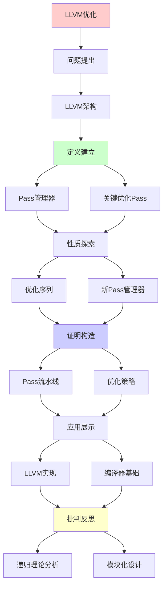
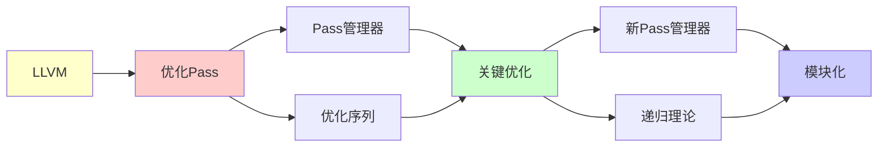

# LLVM优化Pass流水线

> **主题**: LLVM优化架构的递归组合
> **创建日期**: 2025-12-02
> **难度**: ⭐⭐⭐⭐
> **前置知识**: LLVM架构、编译优化、SSA

---

## 📋 目录

- [LLVM优化Pass流水线](#llvm优化pass流水线)
  - [📋 目录](#-目录)
  - [1. LLVM架构](#1-llvm架构)
    - [1.1 三段式设计](#11-三段式设计)
    - [1.2 IR设计](#12-ir设计)
  - [2. Pass管理器](#2-pass管理器)
    - [2.1 Pass类型](#21-pass类型)
    - [2.2 Pass依赖](#22-pass依赖)
  - [3. 关键优化Pass](#3-关键优化pass)
    - [3.1 mem2reg](#31-mem2reg)
    - [3.2 LICM](#32-licm)
    - [3.3 GVN](#33-gvn)
  - [4. 优化序列](#4-优化序列)
    - [4.1 标准流水线](#41-标准流水线)
    - [4.2 不动点迭代](#42-不动点迭代)
  - [5. 新Pass管理器](#5-新pass管理器)
    - [5.1 NPM改进](#51-npm改进)
  - [6. 递归理论分析](#6-递归理论分析)
  - [7. 主题-子主题论证逻辑关系图](#7-主题-子主题论证逻辑关系图)
    - [7.1 论证依赖关系](#71-论证依赖关系)
    - [7.2 概念依赖关系](#72-概念依赖关系)
  - [8. 参考资源](#8-参考资源)
    - [8.1 经典论文](#81-经典论文)
    - [8.2 教材](#82-教材)
    - [8.3 在线资源](#83-在线资源)

---

## 1. LLVM架构

### 1.1 三段式设计

**经典编译器架构**:

```text
前端 (Frontend):
C/C++/Swift → LLVM IR
- 词法/语法分析
- 语义分析
- IR生成

中端 (Middle-end):
LLVM IR → 优化 → LLVM IR
- 优化Pass
- 语言无关 ⭐

后端 (Backend):
LLVM IR → 机器码
- 指令选择
- 寄存器分配
- 目标相关优化

优势:
✓ 前端解耦
✓ 中端共享 ⭐⭐⭐⭐⭐
✓ 后端模块化
→ N×M → N+M
```

---

### 1.2 IR设计

**LLVM IR特性**:

```text
三种形式:
1. 内存 (in-memory): C++对象
2. 文本 (.ll): 人类可读
3. 字节码 (.bc): 紧凑

SSA形式:
✓ 静态单赋值
✓ 无限虚拟寄存器
✓ 强类型

例子:
define i32 @factorial(i32 %n) {
entry:
  %cmp = icmp eq i32 %n, 0
  br i1 %cmp, label %return, label %recurse

recurse:
  %n1 = sub i32 %n, 1
  %fact = call i32 @factorial(i32 %n1)
  %result = mul i32 %n, %fact
  ret i32 %result

return:
  ret i32 1
}

递归性质:
✓ 函数可递归
✓ IR递归转换
```

---

## 2. Pass管理器

### 2.1 Pass类型

**Pass层次**:

```text
ModulePass:
整个模块 (所有函数)
例: 内联, 全局优化

FunctionPass:
单个函数
例: LICM, GVN ⭐
→ 最常用

LoopPass:
单个循环
例: 循环展开

BasicBlockPass:
单个基本块
例: 本地优化

递归性质:
✓ Pass递归应用
✓ 层次递归嵌套
```

---

### 2.2 Pass依赖

**依赖管理**:

```text
Pass依赖声明:
class LICM : public LoopPass {
  void getAnalysisUsage(AnalysisUsage &AU) {
    AU.addRequired<DominatorTreePass>();
    AU.addRequired<LoopInfoPass>();
    AU.addPreserved<LoopInfoPass>();
  }
};

管理器:
自动调度依赖Pass
拓扑排序 ✓
→ 正确顺序执行

递归计算:
✓ 依赖递归解析
✓ Pass递归调度
✓ 不动点递归求解
```

---

## 3. 关键优化Pass

### 3.1 mem2reg

**提升到寄存器**:

```text
转换:
alloca (栈分配)
  ↓
SSA虚拟寄存器 ✓

前:
%ptr = alloca i32
store i32 1, i32* %ptr
%val = load i32, i32* %ptr

后:
%val = i32 1

效果:
✓ 消除内存访问
✓ 暴露优化机会
→ 关键启动Pass ⭐

算法:
插入Φ函数 (SSA构造)
复杂度: O(E·|Vars|)
```

---

### 3.2 LICM

**循环不变式外提**:

```text
Loop-Invariant Code Motion:

for i in 0..n:
  x = a + b  // 循环不变
  arr[i] = x * i

优化:
x = a + b  // 外提 ✓
for i in 0..n:
  arr[i] = x * i

条件:
✓ 不依赖循环变量
✓ 支配循环
✓ 无副作用

效果:
n次计算 → 1次
→ O(n)加速 ⭐

递归:
✓ 嵌套循环递归处理
✓ 不变式递归识别
```

---

### 3.3 GVN

**全局值编号**:

```text
消除冗余:
y = a + b
...
z = a + b  // 冗余

→ z = y ✓

算法:
Value numbering
Hash (op, operands) ✓
O(n)查找

SSA优势:
use-def链隐式
→ GVN更强大 ⭐

递归:
✓ 值编号递归传播
✓ 等价类递归合并
```

---

## 4. 优化序列

### 4.1 标准流水线

**-O2流水线**:

```text
opt -O2:
1. mem2reg
2. InstCombine (局部简化)
3. CFG简化
4. SCCP (稀疏常量传播)
5. DCE (死代码消除)
6. LICM
7. GVN
8. InstCombine (再次)
9. ...循环
→ 50+ Passes ⭐

顺序重要:
mem2reg必须最先
GVN在LICM后
→ 精心设计 ✓

递归:
✓ Pass递归应用
✓ 某些Pass重复
✓ 直到不动点
```

---

### 4.2 不动点迭代

**迭代优化**:

```text
问题:
Pass A暴露Pass B机会
Pass B暴露Pass A机会
→ 相互促进 ⭐

解决:
重复Pass序列
直到无变化

while (changed):
  changed = false
  for pass in passes:
    if pass.run():
      changed = true

终止性:
✓ 单调改进 (代码简化)
✓ 有界 (最简形式)
→ 必终止 ✓

实践:
通常2-3轮收敛
→ 快速 ✓

递归理论:
✓ 不动点迭代 = 递归求解
✓ Tarski定理应用
✓ 编译器 = 递归优化系统 ⭐
```

---

## 5. 新Pass管理器

### 5.1 NPM改进

**New Pass Manager (LLVM 14+)**:

```text
vs 旧PM:
旧: 层次化 (Module→Function→Loop)
新: IR单元通用 ⭐

优势:
✓ 更灵活
✓ 更好缓存
✓ 更快编译 (10-20%)
✓ 更少内存

设计:
Pass → Analysis → Invalidation
→ 细粒度依赖 ✓

递归:
✓ Pass递归组合
✓ Analysis递归缓存
✓ Invalidation递归传播
```

---

## 6. 递归理论分析

```text
LLVM优化 ∈ RE?

答案: ✓是的

证明:
- 每个Pass可递归
- Pass序列可递归组合
- 不动点可递归求解
→ LLVM优化 ∈ RE ✓

复杂度:
单Pass: O(n) ~ O(n²)
Pass序列: k个Pass
不动点: m轮迭代 (m<5通常)
总计: O(k·m·n²)
→ 实践可接受 ✓

终止性:
✓ 优化单调 (代码简化)
✓ 有界 (最简形式)
✓ 必终止
→ Tarski不动点定理 ⭐

递归本质:
编译器 = 递归变换系统
源码 → IR₁ → IR₂ → ... → IRₙ
直到不动点 ✓
→ 编译 = 递归优化 ⭐⭐⭐⭐⭐

vs 解释器:
解释器: 递归执行程序
编译器: 递归优化程序
→ 都是递归 ⭐

历史:
2003: LLVM 1.0
2024: LLVM 18
20年发展
→ 现代编译器标准 ⭐⭐⭐⭐⭐

影响:
✓ Clang (C/C++)
✓ Swift
✓ Rust
✓ Julia
→ 多语言共享基础设施

递归范式:
✓ Pass = 递归变换
✓ 流水线 = 递归组合
✓ 不动点 = 递归收敛
✓ 编译 = 递归优化
→ 递归理论的工程杰作 ⭐⭐⭐⭐⭐
```

---

## 7. 主题-子主题论证逻辑关系图

### 7.1 论证依赖关系



### 7.2 概念依赖关系



**论证逻辑链条**：

1. **问题提出** (1节)：
   - LLVM架构

2. **定义建立** (2节)：
   - Pass管理器

3. **性质探索** (3-5节)：
   - 关键优化Pass（3节）
   - 优化序列（4节）
   - 新Pass管理器（5节）

4. **证明构造** (贯穿全文)：
   - Pass流水线和优化策略

5. **应用展示** (贯穿全文)：
   - LLVM实现和编译器基础

6. **批判反思** (6节)：
   - 递归理论分析

---

## 8. 参考资源

### 8.1 经典论文

1. **Lattner, C., & Adve, V.** (2004). "LLVM: A Compilation Framework for Lifelong Program Analysis & Transformation"
   - _CGO 2004_. International Symposium on Code Generation and Optimization
   - LLVM原论文 ⭐⭐⭐⭐⭐

2. **Lattner, C.** (2008). "LLVM and Clang: Next Generation Compiler Technology"
   - BSD Conference 2008
   - LLVM架构演讲

### 8.2 教材

1. **Lopes, B. C., & Auler, R.** (2014)
   - _Getting Started with LLVM Core Libraries_
   - Packt Publishing. ISBN 978-1782166924
   - LLVM实践

2. **Aho, A. V., et al.** (2006)
   - _Compilers: Principles, Techniques, and Tools_ (2nd ed.)
   - Pearson. ISBN 978-0321486813
   - 编译器基础

### 8.3 在线资源

1. **LLVM Documentation**
   - https://llvm.org/docs/
   - LLVM官方文档

2. **LLVM Language Reference**
   - https://llvm.org/docs/LangRef.html
   - LLVM IR参考

3. **Writing an LLVM Pass**
   - https://llvm.org/docs/WritingAnLLVMPass.html
   - LLVM Pass编写指南

---

**最后更新**: 2025-12-04
**Tier**: 2 (工程)
**重要性**: 现代编译器基础 ⭐⭐⭐⭐⭐
**优势**: 模块化+可扩展 ✓
**状态**: ✅ 已添加主题-子主题论证逻辑关系图和参考资源章节
